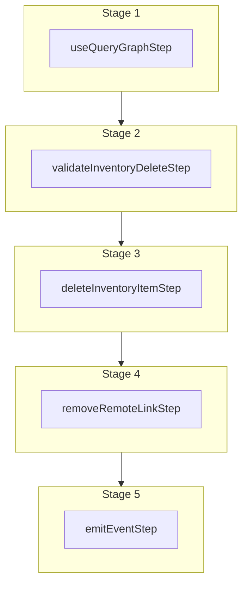

This documentation provides a reference to the `deleteInventoryItemWorkflow`. It belongs to the `@medusajs/medusa/core-flows` package.

This workflow deletes one or more inventory items. It's used by the
[Delete Inventory Item Admin API Route](/api/admin/inventory-items/delete-inventory-item).

You can use this workflow within your own customizations or custom workflows, allowing you
to delete inventory items in your custom flows.

[View source code](https://github.com/medusajs/medusa/blob/0ed927bdb7a396a8fd5f6447ed69b7b354b150d3/packages/core/core-flows/src/inventory/workflows/delete-inventory-items.ts#L41)

## Examples

**API Route**

```ts title="src/api/workflow/route.ts"
import type {
  MedusaRequest,
  MedusaResponse,
} from "@medusajs/framework/http"
import { deleteInventoryItemWorkflow } from "@medusajs/medusa/core-flows"

export async function POST(
  req: MedusaRequest,
  res: MedusaResponse
) {
  const { result } = await deleteInventoryItemWorkflow(req.scope)
    .run({
      input: ["iitem_123"]
    })

  res.send(result)
}
```

**Subscriber**

```ts title="src/subscribers/order-placed.ts"
import {
  type SubscriberConfig,
  type SubscriberArgs,
} from "@medusajs/framework"
import { deleteInventoryItemWorkflow } from "@medusajs/medusa/core-flows"

export default async function handleOrderPlaced({
  event: { data },
  container,
}: SubscriberArgs < { id: string } > ) {
  const { result } = await deleteInventoryItemWorkflow(container)
    .run({
      input: ["iitem_123"]
    })

  console.log(result)
}

export const config: SubscriberConfig = {
  event: "order.placed",
}
```

**Scheduled Job**

```ts title="src/jobs/message-daily.ts"
import { MedusaContainer } from "@medusajs/framework/types"
import { deleteInventoryItemWorkflow } from "@medusajs/medusa/core-flows"

export default async function myCustomJob(
  container: MedusaContainer
) {
  const { result } = await deleteInventoryItemWorkflow(container)
    .run({
      input: ["iitem_123"]
    })

  console.log(result)
}

export const config = {
  name: "run-once-a-day",
  schedule: "0 0 * * *",
}
```

**Another Workflow**

```ts title="src/workflows/my-workflow.ts"
import { createWorkflow } from "@medusajs/framework/workflows-sdk"
import { deleteInventoryItemWorkflow } from "@medusajs/medusa/core-flows"

const myWorkflow = createWorkflow(
  "my-workflow",
  () => {
    const result = deleteInventoryItemWorkflow
      .runAsStep({
        input: ["iitem_123"]
      })
  }
)
```

<a id="deleteinventoryitemworkflow-steps" />

## Steps



Stages follow the order in the workflow definition. Conditional steps run only when their condition is met. The step descriptions below include the conditions and reference links.

- [useQueryGraphStep](/resources/references/medusa-workflows/steps/useQueryGraphStep): This step fetches data across modules using the Query. Learn more in the [Query documentation](/learn/fundamentals/module-links/query).
  - [validateInventoryDeleteStep](/resources/references/medusa-workflows/steps/validateInventoryDeleteStep)
    - [deleteInventoryItemStep](/resources/references/medusa-workflows/steps/deleteInventoryItemStep): This step deletes one or more inventory items.
      - [removeRemoteLinkStep](/resources/references/medusa-workflows/steps/removeRemoteLinkStep): This step deletes linked records of a record if cascade deletion is enabled. Learn more in the [Link documentation](/learn/fundamentals/module-links/link#cascade-delete-linked-records)
        - [emitEventStep](/resources/references/medusa-workflows/steps/emitEventStep): This step emits an event, which you can listen to in a [subscriber](/learn/fundamentals/events-and-subscribers). You can pass data to the subscriber by including it in the `data` property. The event is only emitted after the workflow has finished successfully. So, even if it's executed in the middle of the workflow, it won't actually emit the event until the workflow has completed successfully. If the workflow fails, it won't emit the event at all.

<a id="deleteinventoryitemworkflow-input" />

## Input

**deleteInventoryItemWorkflow**

- `DeleteInventoryItemWorkflowInput`: [DeleteInventoryItemWorkflowInput](/resources/references/core_flows/core_core_flows_src/types/core_flowscore_core_flows_srcDeleteInventoryItemWorkflowInput)
  - `DeleteInventoryItemWorkflowInput`: `string`\[] — The IDs of the inventory items to delete.

<a id="deleteinventoryitemworkflow-output" />

## Output

**deleteInventoryItemWorkflow**

- `DeleteInventoryItemWorkflowOutput`: [DeleteInventoryItemWorkflowOutput](/resources/references/core_flows/core_core_flows_src/types/core_flowscore_core_flows_srcDeleteInventoryItemWorkflowOutput)
  - `DeleteInventoryItemWorkflowOutput`: `string`\[] — The IDs of deleted inventory items.

<a id="deleteinventoryitemworkflow-emitted-events" />

## Emitted Events

- `inventory-item.deleted` (since v2.18.0): Emitted when inventory items are deleted.

  ```ts
  {
    id, // The ID of the inventory item
  }
  ```
