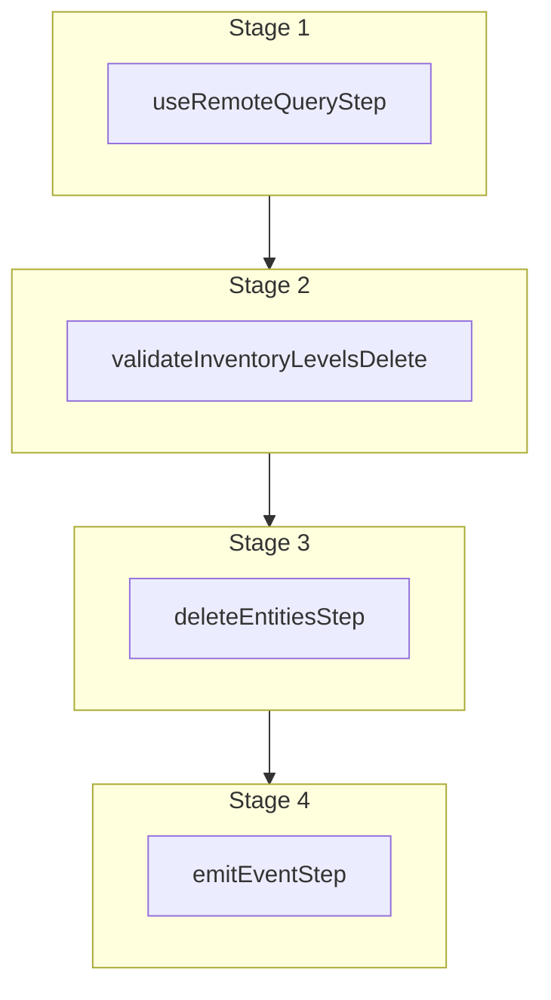

This documentation provides a reference to the `deleteInventoryLevelsWorkflow`. It belongs to the `@medusajs/medusa/core-flows` package.

This workflow deletes one or more inventory levels. It's used by the
[Delete Inventory Levels Admin API Route](/api/admin/inventory-items/remove-inventory-level).

You can use this workflow within your own customizations or custom workflows, allowing you
to delete inventory levels in your custom flows.

[View source code](https://github.com/medusajs/medusa/blob/0ed927bdb7a396a8fd5f6447ed69b7b354b150d3/packages/core/core-flows/src/inventory/workflows/delete-inventory-levels.ts#L132)

## Examples

**API Route**

```ts title="src/api/workflow/route.ts"
import type {
  MedusaRequest,
  MedusaResponse,
} from "@medusajs/framework/http"
import { deleteInventoryLevelsWorkflow } from "@medusajs/medusa/core-flows"

export async function POST(
  req: MedusaRequest,
  res: MedusaResponse
) {
  const { result } = await deleteInventoryLevelsWorkflow(req.scope)
    .run({
      input: {
        id: ["iilev_123", "iilev_321"],
      }
    })

  res.send(result)
}
```

**Subscriber**

```ts title="src/subscribers/order-placed.ts"
import {
  type SubscriberConfig,
  type SubscriberArgs,
} from "@medusajs/framework"
import { deleteInventoryLevelsWorkflow } from "@medusajs/medusa/core-flows"

export default async function handleOrderPlaced({
  event: { data },
  container,
}: SubscriberArgs < { id: string } > ) {
  const { result } = await deleteInventoryLevelsWorkflow(container)
    .run({
      input: {
        id: ["iilev_123", "iilev_321"],
      }
    })

  console.log(result)
}

export const config: SubscriberConfig = {
  event: "order.placed",
}
```

**Scheduled Job**

```ts title="src/jobs/message-daily.ts"
import { MedusaContainer } from "@medusajs/framework/types"
import { deleteInventoryLevelsWorkflow } from "@medusajs/medusa/core-flows"

export default async function myCustomJob(
  container: MedusaContainer
) {
  const { result } = await deleteInventoryLevelsWorkflow(container)
    .run({
      input: {
        id: ["iilev_123", "iilev_321"],
      }
    })

  console.log(result)
}

export const config = {
  name: "run-once-a-day",
  schedule: "0 0 * * *",
}
```

**Another Workflow**

```ts title="src/workflows/my-workflow.ts"
import { createWorkflow } from "@medusajs/framework/workflows-sdk"
import { deleteInventoryLevelsWorkflow } from "@medusajs/medusa/core-flows"

const myWorkflow = createWorkflow(
  "my-workflow",
  () => {
    const result = deleteInventoryLevelsWorkflow
      .runAsStep({
        input: {
          id: ["iilev_123", "iilev_321"],
        }
      })
  }
)
```

<a id="deleteinventorylevelsworkflow-steps" />

## Steps



Stages follow the order in the workflow definition. Conditional steps run only when their condition is met. The step descriptions below include the conditions and reference links.

- [useRemoteQueryStep](/resources/references/medusa-workflows/steps/useRemoteQueryStep): This step fetches data across modules using the remote query. Learn more in the [Remote Query documentation](/learn/fundamentals/module-links/query). :::note This step is deprecated. Use [useQueryGraphStep](/resources/references/medusa-workflows/steps/useQueryGraphStep) instead. :::
  - [validateInventoryLevelsDelete](/resources/references/medusa-workflows/validateInventoryLevelsDelete): This step validates that inventory levels are deletable. If the inventory levels have reserved or incoming items, or the force flag is not set and the inventory levels have stocked items, the step will throw an error. :::note You can retrieve an inventory level's details using [Query](/learn/fundamentals/module-links/query), or [useQueryGraphStep](/resources/references/medusa-workflows/steps/useQueryGraphStep). :::
    - [deleteEntitiesStep](/resources/references/medusa-workflows/steps/deleteEntitiesStep): This step deletes one or more entities using methods in a module's service.
      - [emitEventStep](/resources/references/medusa-workflows/steps/emitEventStep): This step emits an event, which you can listen to in a [subscriber](/learn/fundamentals/events-and-subscribers). You can pass data to the subscriber by including it in the `data` property. The event is only emitted after the workflow has finished successfully. So, even if it's executed in the middle of the workflow, it won't actually emit the event until the workflow has completed successfully. If the workflow fails, it won't emit the event at all.

<a id="deleteinventorylevelsworkflow-input" />

## Input

**deleteInventoryLevelsWorkflow**

- `DeleteInventoryLevelsWorkflowInput`: [DeleteInventoryLevelsWorkflowInput](/resources/references/core_flows/core_core_flows_src/interfaces/core_flowscore_core_flows_srcDeleteInventoryLevelsWorkflowInput)
  - `force`: `boolean` (optional) — If true, the inventory levels will be deleted even if they have stocked items.
  - `$and`: ([FilterableInventoryLevelProps](/resources/references/types/InventoryTypes/interfaces/typesInventoryTypesFilterableInventoryLevelProps) | [BaseFilterable](/resources/references/types/DAL/interfaces/typesDALBaseFilterable)\<[FilterableInventoryLevelProps](/resources/references/types/InventoryTypes/interfaces/typesInventoryTypesFilterableInventoryLevelProps)>)\[] (optional) — An array of filters to apply on the entity, where each item in the array is joined with an "and" condition.
    - `$and`: ([FilterableInventoryLevelProps](/resources/references/types/InventoryTypes/interfaces/typesInventoryTypesFilterableInventoryLevelProps) | [BaseFilterable](/resources/references/types/DAL/interfaces/typesDALBaseFilterable)\<[FilterableInventoryLevelProps](/resources/references/types/InventoryTypes/interfaces/typesInventoryTypesFilterableInventoryLevelProps)>)\[] (optional) — An array of filters to apply on the entity, where each item in the array is joined with an "and" condition.
      - `$and`: ([FilterableInventoryLevelProps](/resources/references/types/InventoryTypes/interfaces/typesInventoryTypesFilterableInventoryLevelProps) | [BaseFilterable](/resources/references/types/DAL/interfaces/typesDALBaseFilterable)\<[FilterableInventoryLevelProps](/resources/references/types/InventoryTypes/interfaces/typesInventoryTypesFilterableInventoryLevelProps)>)\[] (optional) — An array of filters to apply on the entity, where each item in the array is joined with an "and" condition.
      - `$or`: ([FilterableInventoryLevelProps](/resources/references/types/InventoryTypes/interfaces/typesInventoryTypesFilterableInventoryLevelProps) | [BaseFilterable](/resources/references/types/DAL/interfaces/typesDALBaseFilterable)\<[FilterableInventoryLevelProps](/resources/references/types/InventoryTypes/interfaces/typesInventoryTypesFilterableInventoryLevelProps)>)\[] (optional) — An array of filters to apply on the entity, where each item in the array is joined with an "or" condition.
      - `id`: `string` | `string`\[] (optional) — Filter inventory levels by the ID
      - `inventory_item_id`: `string` | `string`\[] (optional) — Filter inventory levels by the ID of their associated inventory item.
      - `location_id`: `string` | `string`\[] (optional) — Filter inventory levels by the ID of their associated inventory location.
      - `stocked_quantity`: `number` | [OperatorMap](/resources/references/types/DAL/types/typesDALOperatorMap)\<Number> (optional) — Filters to apply on inventory levels' `stocked_quantity` attribute.
      - `reserved_quantity`: `number` | [OperatorMap](/resources/references/types/DAL/types/typesDALOperatorMap)\<Number> (optional) — Filters to apply on inventory levels' `reserved_quantity` attribute.
      - `incoming_quantity`: `number` | [OperatorMap](/resources/references/types/DAL/types/typesDALOperatorMap)\<Number> (optional) — Filters to apply on inventory levels' `incoming_quantity` attribute.
    - `$or`: ([FilterableInventoryLevelProps](/resources/references/types/InventoryTypes/interfaces/typesInventoryTypesFilterableInventoryLevelProps) | [BaseFilterable](/resources/references/types/DAL/interfaces/typesDALBaseFilterable)\<[FilterableInventoryLevelProps](/resources/references/types/InventoryTypes/interfaces/typesInventoryTypesFilterableInventoryLevelProps)>)\[] (optional) — An array of filters to apply on the entity, where each item in the array is joined with an "or" condition.
      - `$and`: ([FilterableInventoryLevelProps](/resources/references/types/InventoryTypes/interfaces/typesInventoryTypesFilterableInventoryLevelProps) | [BaseFilterable](/resources/references/types/DAL/interfaces/typesDALBaseFilterable)\<[FilterableInventoryLevelProps](/resources/references/types/InventoryTypes/interfaces/typesInventoryTypesFilterableInventoryLevelProps)>)\[] (optional) — An array of filters to apply on the entity, where each item in the array is joined with an "and" condition.
      - `$or`: ([FilterableInventoryLevelProps](/resources/references/types/InventoryTypes/interfaces/typesInventoryTypesFilterableInventoryLevelProps) | [BaseFilterable](/resources/references/types/DAL/interfaces/typesDALBaseFilterable)\<[FilterableInventoryLevelProps](/resources/references/types/InventoryTypes/interfaces/typesInventoryTypesFilterableInventoryLevelProps)>)\[] (optional) — An array of filters to apply on the entity, where each item in the array is joined with an "or" condition.
      - `id`: `string` | `string`\[] (optional) — Filter inventory levels by the ID
      - `inventory_item_id`: `string` | `string`\[] (optional) — Filter inventory levels by the ID of their associated inventory item.
      - `location_id`: `string` | `string`\[] (optional) — Filter inventory levels by the ID of their associated inventory location.
      - `stocked_quantity`: `number` | [OperatorMap](/resources/references/types/DAL/types/typesDALOperatorMap)\<Number> (optional) — Filters to apply on inventory levels' `stocked_quantity` attribute.
      - `reserved_quantity`: `number` | [OperatorMap](/resources/references/types/DAL/types/typesDALOperatorMap)\<Number> (optional) — Filters to apply on inventory levels' `reserved_quantity` attribute.
      - `incoming_quantity`: `number` | [OperatorMap](/resources/references/types/DAL/types/typesDALOperatorMap)\<Number> (optional) — Filters to apply on inventory levels' `incoming_quantity` attribute.
    - `id`: `string` | `string`\[] (optional) — Filter inventory levels by the ID
    - `inventory_item_id`: `string` | `string`\[] (optional) — Filter inventory levels by the ID of their associated inventory item.
    - `location_id`: `string` | `string`\[] (optional) — Filter inventory levels by the ID of their associated inventory location.
    - `stocked_quantity`: `number` | [OperatorMap](/resources/references/types/DAL/types/typesDALOperatorMap)\<Number> (optional) — Filters to apply on inventory levels' `stocked_quantity` attribute.
      - `$and`: [Query](/resources/references/types/types/typesQuery)\<T>\[] (optional)
      - `$or`: [Query](/resources/references/types/types/typesQuery)\<T>\[] (optional)
      - `$eq`: [ExpandScalar](/resources/references/types/types/typesExpandScalar)\<T> | [ExpandScalar](/resources/references/types/types/typesExpandScalar)\<T>\[] (optional)
      - `$ne`: [ExpandScalar](/resources/references/types/types/typesExpandScalar)\<T> (optional)
      - `$in`: [ExpandScalar](/resources/references/types/types/typesExpandScalar)\<T>\[] (optional)
      - `$nin`: [ExpandScalar](/resources/references/types/types/typesExpandScalar)\<T>\[] (optional)
      - `$not`: [Query](/resources/references/types/types/typesQuery)\<T> (optional)
      - `$gt`: [ExpandScalar](/resources/references/types/types/typesExpandScalar)\<T> (optional)
      - `$gte`: [ExpandScalar](/resources/references/types/types/typesExpandScalar)\<T> (optional)
      - `$lt`: [ExpandScalar](/resources/references/types/types/typesExpandScalar)\<T> (optional)
      - `$lte`: [ExpandScalar](/resources/references/types/types/typesExpandScalar)\<T> (optional)
      - `$like`: `string` (optional)
      - `$re`: `string` (optional)
      - `$ilike`: `string` (optional)
      - `$fulltext`: `string` (optional)
      - `$overlap`: `string`\[] (optional)
      - `$contains`: `string`\[] (optional)
      - `$contained`: `string`\[] (optional)
      - `$exists`: `boolean` (optional)
    - `reserved_quantity`: `number` | [OperatorMap](/resources/references/types/DAL/types/typesDALOperatorMap)\<Number> (optional) — Filters to apply on inventory levels' `reserved_quantity` attribute.
      - `$and`: [Query](/resources/references/types/types/typesQuery)\<T>\[] (optional)
      - `$or`: [Query](/resources/references/types/types/typesQuery)\<T>\[] (optional)
      - `$eq`: [ExpandScalar](/resources/references/types/types/typesExpandScalar)\<T> | [ExpandScalar](/resources/references/types/types/typesExpandScalar)\<T>\[] (optional)
      - `$ne`: [ExpandScalar](/resources/references/types/types/typesExpandScalar)\<T> (optional)
      - `$in`: [ExpandScalar](/resources/references/types/types/typesExpandScalar)\<T>\[] (optional)
      - `$nin`: [ExpandScalar](/resources/references/types/types/typesExpandScalar)\<T>\[] (optional)
      - `$not`: [Query](/resources/references/types/types/typesQuery)\<T> (optional)
      - `$gt`: [ExpandScalar](/resources/references/types/types/typesExpandScalar)\<T> (optional)
      - `$gte`: [ExpandScalar](/resources/references/types/types/typesExpandScalar)\<T> (optional)
      - `$lt`: [ExpandScalar](/resources/references/types/types/typesExpandScalar)\<T> (optional)
      - `$lte`: [ExpandScalar](/resources/references/types/types/typesExpandScalar)\<T> (optional)
      - `$like`: `string` (optional)
      - `$re`: `string` (optional)
      - `$ilike`: `string` (optional)
      - `$fulltext`: `string` (optional)
      - `$overlap`: `string`\[] (optional)
      - `$contains`: `string`\[] (optional)
      - `$contained`: `string`\[] (optional)
      - `$exists`: `boolean` (optional)
    - `incoming_quantity`: `number` | [OperatorMap](/resources/references/types/DAL/types/typesDALOperatorMap)\<Number> (optional) — Filters to apply on inventory levels' `incoming_quantity` attribute.
      - `$and`: [Query](/resources/references/types/types/typesQuery)\<T>\[] (optional)
      - `$or`: [Query](/resources/references/types/types/typesQuery)\<T>\[] (optional)
      - `$eq`: [ExpandScalar](/resources/references/types/types/typesExpandScalar)\<T> | [ExpandScalar](/resources/references/types/types/typesExpandScalar)\<T>\[] (optional)
      - `$ne`: [ExpandScalar](/resources/references/types/types/typesExpandScalar)\<T> (optional)
      - `$in`: [ExpandScalar](/resources/references/types/types/typesExpandScalar)\<T>\[] (optional)
      - `$nin`: [ExpandScalar](/resources/references/types/types/typesExpandScalar)\<T>\[] (optional)
      - `$not`: [Query](/resources/references/types/types/typesQuery)\<T> (optional)
      - `$gt`: [ExpandScalar](/resources/references/types/types/typesExpandScalar)\<T> (optional)
      - `$gte`: [ExpandScalar](/resources/references/types/types/typesExpandScalar)\<T> (optional)
      - `$lt`: [ExpandScalar](/resources/references/types/types/typesExpandScalar)\<T> (optional)
      - `$lte`: [ExpandScalar](/resources/references/types/types/typesExpandScalar)\<T> (optional)
      - `$like`: `string` (optional)
      - `$re`: `string` (optional)
      - `$ilike`: `string` (optional)
      - `$fulltext`: `string` (optional)
      - `$overlap`: `string`\[] (optional)
      - `$contains`: `string`\[] (optional)
      - `$contained`: `string`\[] (optional)
      - `$exists`: `boolean` (optional)
  - `$or`: ([FilterableInventoryLevelProps](/resources/references/types/InventoryTypes/interfaces/typesInventoryTypesFilterableInventoryLevelProps) | [BaseFilterable](/resources/references/types/DAL/interfaces/typesDALBaseFilterable)\<[FilterableInventoryLevelProps](/resources/references/types/InventoryTypes/interfaces/typesInventoryTypesFilterableInventoryLevelProps)>)\[] (optional) — An array of filters to apply on the entity, where each item in the array is joined with an "or" condition.
    - `$and`: ([FilterableInventoryLevelProps](/resources/references/types/InventoryTypes/interfaces/typesInventoryTypesFilterableInventoryLevelProps) | [BaseFilterable](/resources/references/types/DAL/interfaces/typesDALBaseFilterable)\<[FilterableInventoryLevelProps](/resources/references/types/InventoryTypes/interfaces/typesInventoryTypesFilterableInventoryLevelProps)>)\[] (optional) — An array of filters to apply on the entity, where each item in the array is joined with an "and" condition.
      - `$and`: ([FilterableInventoryLevelProps](/resources/references/types/InventoryTypes/interfaces/typesInventoryTypesFilterableInventoryLevelProps) | [BaseFilterable](/resources/references/types/DAL/interfaces/typesDALBaseFilterable)\<[FilterableInventoryLevelProps](/resources/references/types/InventoryTypes/interfaces/typesInventoryTypesFilterableInventoryLevelProps)>)\[] (optional) — An array of filters to apply on the entity, where each item in the array is joined with an "and" condition.
      - `$or`: ([FilterableInventoryLevelProps](/resources/references/types/InventoryTypes/interfaces/typesInventoryTypesFilterableInventoryLevelProps) | [BaseFilterable](/resources/references/types/DAL/interfaces/typesDALBaseFilterable)\<[FilterableInventoryLevelProps](/resources/references/types/InventoryTypes/interfaces/typesInventoryTypesFilterableInventoryLevelProps)>)\[] (optional) — An array of filters to apply on the entity, where each item in the array is joined with an "or" condition.
      - `id`: `string` | `string`\[] (optional) — Filter inventory levels by the ID
      - `inventory_item_id`: `string` | `string`\[] (optional) — Filter inventory levels by the ID of their associated inventory item.
      - `location_id`: `string` | `string`\[] (optional) — Filter inventory levels by the ID of their associated inventory location.
      - `stocked_quantity`: `number` | [OperatorMap](/resources/references/types/DAL/types/typesDALOperatorMap)\<Number> (optional) — Filters to apply on inventory levels' `stocked_quantity` attribute.
      - `reserved_quantity`: `number` | [OperatorMap](/resources/references/types/DAL/types/typesDALOperatorMap)\<Number> (optional) — Filters to apply on inventory levels' `reserved_quantity` attribute.
      - `incoming_quantity`: `number` | [OperatorMap](/resources/references/types/DAL/types/typesDALOperatorMap)\<Number> (optional) — Filters to apply on inventory levels' `incoming_quantity` attribute.
    - `$or`: ([FilterableInventoryLevelProps](/resources/references/types/InventoryTypes/interfaces/typesInventoryTypesFilterableInventoryLevelProps) | [BaseFilterable](/resources/references/types/DAL/interfaces/typesDALBaseFilterable)\<[FilterableInventoryLevelProps](/resources/references/types/InventoryTypes/interfaces/typesInventoryTypesFilterableInventoryLevelProps)>)\[] (optional) — An array of filters to apply on the entity, where each item in the array is joined with an "or" condition.
      - `$and`: ([FilterableInventoryLevelProps](/resources/references/types/InventoryTypes/interfaces/typesInventoryTypesFilterableInventoryLevelProps) | [BaseFilterable](/resources/references/types/DAL/interfaces/typesDALBaseFilterable)\<[FilterableInventoryLevelProps](/resources/references/types/InventoryTypes/interfaces/typesInventoryTypesFilterableInventoryLevelProps)>)\[] (optional) — An array of filters to apply on the entity, where each item in the array is joined with an "and" condition.
      - `$or`: ([FilterableInventoryLevelProps](/resources/references/types/InventoryTypes/interfaces/typesInventoryTypesFilterableInventoryLevelProps) | [BaseFilterable](/resources/references/types/DAL/interfaces/typesDALBaseFilterable)\<[FilterableInventoryLevelProps](/resources/references/types/InventoryTypes/interfaces/typesInventoryTypesFilterableInventoryLevelProps)>)\[] (optional) — An array of filters to apply on the entity, where each item in the array is joined with an "or" condition.
      - `id`: `string` | `string`\[] (optional) — Filter inventory levels by the ID
      - `inventory_item_id`: `string` | `string`\[] (optional) — Filter inventory levels by the ID of their associated inventory item.
      - `location_id`: `string` | `string`\[] (optional) — Filter inventory levels by the ID of their associated inventory location.
      - `stocked_quantity`: `number` | [OperatorMap](/resources/references/types/DAL/types/typesDALOperatorMap)\<Number> (optional) — Filters to apply on inventory levels' `stocked_quantity` attribute.
      - `reserved_quantity`: `number` | [OperatorMap](/resources/references/types/DAL/types/typesDALOperatorMap)\<Number> (optional) — Filters to apply on inventory levels' `reserved_quantity` attribute.
      - `incoming_quantity`: `number` | [OperatorMap](/resources/references/types/DAL/types/typesDALOperatorMap)\<Number> (optional) — Filters to apply on inventory levels' `incoming_quantity` attribute.
    - `id`: `string` | `string`\[] (optional) — Filter inventory levels by the ID
    - `inventory_item_id`: `string` | `string`\[] (optional) — Filter inventory levels by the ID of their associated inventory item.
    - `location_id`: `string` | `string`\[] (optional) — Filter inventory levels by the ID of their associated inventory location.
    - `stocked_quantity`: `number` | [OperatorMap](/resources/references/types/DAL/types/typesDALOperatorMap)\<Number> (optional) — Filters to apply on inventory levels' `stocked_quantity` attribute.
      - `$and`: [Query](/resources/references/types/types/typesQuery)\<T>\[] (optional)
      - `$or`: [Query](/resources/references/types/types/typesQuery)\<T>\[] (optional)
      - `$eq`: [ExpandScalar](/resources/references/types/types/typesExpandScalar)\<T> | [ExpandScalar](/resources/references/types/types/typesExpandScalar)\<T>\[] (optional)
      - `$ne`: [ExpandScalar](/resources/references/types/types/typesExpandScalar)\<T> (optional)
      - `$in`: [ExpandScalar](/resources/references/types/types/typesExpandScalar)\<T>\[] (optional)
      - `$nin`: [ExpandScalar](/resources/references/types/types/typesExpandScalar)\<T>\[] (optional)
      - `$not`: [Query](/resources/references/types/types/typesQuery)\<T> (optional)
      - `$gt`: [ExpandScalar](/resources/references/types/types/typesExpandScalar)\<T> (optional)
      - `$gte`: [ExpandScalar](/resources/references/types/types/typesExpandScalar)\<T> (optional)
      - `$lt`: [ExpandScalar](/resources/references/types/types/typesExpandScalar)\<T> (optional)
      - `$lte`: [ExpandScalar](/resources/references/types/types/typesExpandScalar)\<T> (optional)
      - `$like`: `string` (optional)
      - `$re`: `string` (optional)
      - `$ilike`: `string` (optional)
      - `$fulltext`: `string` (optional)
      - `$overlap`: `string`\[] (optional)
      - `$contains`: `string`\[] (optional)
      - `$contained`: `string`\[] (optional)
      - `$exists`: `boolean` (optional)
    - `reserved_quantity`: `number` | [OperatorMap](/resources/references/types/DAL/types/typesDALOperatorMap)\<Number> (optional) — Filters to apply on inventory levels' `reserved_quantity` attribute.
      - `$and`: [Query](/resources/references/types/types/typesQuery)\<T>\[] (optional)
      - `$or`: [Query](/resources/references/types/types/typesQuery)\<T>\[] (optional)
      - `$eq`: [ExpandScalar](/resources/references/types/types/typesExpandScalar)\<T> | [ExpandScalar](/resources/references/types/types/typesExpandScalar)\<T>\[] (optional)
      - `$ne`: [ExpandScalar](/resources/references/types/types/typesExpandScalar)\<T> (optional)
      - `$in`: [ExpandScalar](/resources/references/types/types/typesExpandScalar)\<T>\[] (optional)
      - `$nin`: [ExpandScalar](/resources/references/types/types/typesExpandScalar)\<T>\[] (optional)
      - `$not`: [Query](/resources/references/types/types/typesQuery)\<T> (optional)
      - `$gt`: [ExpandScalar](/resources/references/types/types/typesExpandScalar)\<T> (optional)
      - `$gte`: [ExpandScalar](/resources/references/types/types/typesExpandScalar)\<T> (optional)
      - `$lt`: [ExpandScalar](/resources/references/types/types/typesExpandScalar)\<T> (optional)
      - `$lte`: [ExpandScalar](/resources/references/types/types/typesExpandScalar)\<T> (optional)
      - `$like`: `string` (optional)
      - `$re`: `string` (optional)
      - `$ilike`: `string` (optional)
      - `$fulltext`: `string` (optional)
      - `$overlap`: `string`\[] (optional)
      - `$contains`: `string`\[] (optional)
      - `$contained`: `string`\[] (optional)
      - `$exists`: `boolean` (optional)
    - `incoming_quantity`: `number` | [OperatorMap](/resources/references/types/DAL/types/typesDALOperatorMap)\<Number> (optional) — Filters to apply on inventory levels' `incoming_quantity` attribute.
      - `$and`: [Query](/resources/references/types/types/typesQuery)\<T>\[] (optional)
      - `$or`: [Query](/resources/references/types/types/typesQuery)\<T>\[] (optional)
      - `$eq`: [ExpandScalar](/resources/references/types/types/typesExpandScalar)\<T> | [ExpandScalar](/resources/references/types/types/typesExpandScalar)\<T>\[] (optional)
      - `$ne`: [ExpandScalar](/resources/references/types/types/typesExpandScalar)\<T> (optional)
      - `$in`: [ExpandScalar](/resources/references/types/types/typesExpandScalar)\<T>\[] (optional)
      - `$nin`: [ExpandScalar](/resources/references/types/types/typesExpandScalar)\<T>\[] (optional)
      - `$not`: [Query](/resources/references/types/types/typesQuery)\<T> (optional)
      - `$gt`: [ExpandScalar](/resources/references/types/types/typesExpandScalar)\<T> (optional)
      - `$gte`: [ExpandScalar](/resources/references/types/types/typesExpandScalar)\<T> (optional)
      - `$lt`: [ExpandScalar](/resources/references/types/types/typesExpandScalar)\<T> (optional)
      - `$lte`: [ExpandScalar](/resources/references/types/types/typesExpandScalar)\<T> (optional)
      - `$like`: `string` (optional)
      - `$re`: `string` (optional)
      - `$ilike`: `string` (optional)
      - `$fulltext`: `string` (optional)
      - `$overlap`: `string`\[] (optional)
      - `$contains`: `string`\[] (optional)
      - `$contained`: `string`\[] (optional)
      - `$exists`: `boolean` (optional)
  - `id`: `string` | `string`\[] (optional) — Filter inventory levels by the ID
  - `inventory_item_id`: `string` | `string`\[] (optional) — Filter inventory levels by the ID of their associated inventory item.
  - `location_id`: `string` | `string`\[] (optional) — Filter inventory levels by the ID of their associated inventory location.
  - `stocked_quantity`: `number` | [OperatorMap](/resources/references/medusa/types/medusaOperatorMap)\<Number> (optional) — Filters to apply on inventory levels' `stocked_quantity` attribute.
    - `$and`: [Query](/resources/references/medusa/types/medusaQuery)\<T>\[] (optional)
    - `$or`: [Query](/resources/references/medusa/types/medusaQuery)\<T>\[] (optional)
    - `$eq`: [ExpandScalar](/resources/references/medusa/types/medusaExpandScalar)\<T> | [ExpandScalar](/resources/references/medusa/types/medusaExpandScalar)\<T>\[] (optional)
    - `$ne`: [ExpandScalar](/resources/references/medusa/types/medusaExpandScalar)\<T> (optional)
    - `$in`: [ExpandScalar](/resources/references/medusa/types/medusaExpandScalar)\<T>\[] (optional)
    - `$nin`: [ExpandScalar](/resources/references/medusa/types/medusaExpandScalar)\<T>\[] (optional)
    - `$not`: [Query](/resources/references/medusa/types/medusaQuery)\<T> (optional)
    - `$gt`: [ExpandScalar](/resources/references/medusa/types/medusaExpandScalar)\<T> (optional)
    - `$gte`: [ExpandScalar](/resources/references/medusa/types/medusaExpandScalar)\<T> (optional)
    - `$lt`: [ExpandScalar](/resources/references/medusa/types/medusaExpandScalar)\<T> (optional)
    - `$lte`: [ExpandScalar](/resources/references/medusa/types/medusaExpandScalar)\<T> (optional)
    - `$like`: `string` (optional)
    - `$re`: `string` (optional)
    - `$ilike`: `string` (optional)
    - `$fulltext`: `string` (optional)
    - `$overlap`: `string`\[] (optional)
    - `$contains`: `string`\[] (optional)
    - `$contained`: `string`\[] (optional)
    - `$exists`: `boolean` (optional)
  - `reserved_quantity`: `number` | [OperatorMap](/resources/references/medusa/types/medusaOperatorMap)\<Number> (optional) — Filters to apply on inventory levels' `reserved_quantity` attribute.
    - `$and`: [Query](/resources/references/medusa/types/medusaQuery)\<T>\[] (optional)
    - `$or`: [Query](/resources/references/medusa/types/medusaQuery)\<T>\[] (optional)
    - `$eq`: [ExpandScalar](/resources/references/medusa/types/medusaExpandScalar)\<T> | [ExpandScalar](/resources/references/medusa/types/medusaExpandScalar)\<T>\[] (optional)
    - `$ne`: [ExpandScalar](/resources/references/medusa/types/medusaExpandScalar)\<T> (optional)
    - `$in`: [ExpandScalar](/resources/references/medusa/types/medusaExpandScalar)\<T>\[] (optional)
    - `$nin`: [ExpandScalar](/resources/references/medusa/types/medusaExpandScalar)\<T>\[] (optional)
    - `$not`: [Query](/resources/references/medusa/types/medusaQuery)\<T> (optional)
    - `$gt`: [ExpandScalar](/resources/references/medusa/types/medusaExpandScalar)\<T> (optional)
    - `$gte`: [ExpandScalar](/resources/references/medusa/types/medusaExpandScalar)\<T> (optional)
    - `$lt`: [ExpandScalar](/resources/references/medusa/types/medusaExpandScalar)\<T> (optional)
    - `$lte`: [ExpandScalar](/resources/references/medusa/types/medusaExpandScalar)\<T> (optional)
    - `$like`: `string` (optional)
    - `$re`: `string` (optional)
    - `$ilike`: `string` (optional)
    - `$fulltext`: `string` (optional)
    - `$overlap`: `string`\[] (optional)
    - `$contains`: `string`\[] (optional)
    - `$contained`: `string`\[] (optional)
    - `$exists`: `boolean` (optional)
  - `incoming_quantity`: `number` | [OperatorMap](/resources/references/medusa/types/medusaOperatorMap)\<Number> (optional) — Filters to apply on inventory levels' `incoming_quantity` attribute.
    - `$and`: [Query](/resources/references/medusa/types/medusaQuery)\<T>\[] (optional)
    - `$or`: [Query](/resources/references/medusa/types/medusaQuery)\<T>\[] (optional)
    - `$eq`: [ExpandScalar](/resources/references/medusa/types/medusaExpandScalar)\<T> | [ExpandScalar](/resources/references/medusa/types/medusaExpandScalar)\<T>\[] (optional)
    - `$ne`: [ExpandScalar](/resources/references/medusa/types/medusaExpandScalar)\<T> (optional)
    - `$in`: [ExpandScalar](/resources/references/medusa/types/medusaExpandScalar)\<T>\[] (optional)
    - `$nin`: [ExpandScalar](/resources/references/medusa/types/medusaExpandScalar)\<T>\[] (optional)
    - `$not`: [Query](/resources/references/medusa/types/medusaQuery)\<T> (optional)
    - `$gt`: [ExpandScalar](/resources/references/medusa/types/medusaExpandScalar)\<T> (optional)
    - `$gte`: [ExpandScalar](/resources/references/medusa/types/medusaExpandScalar)\<T> (optional)
    - `$lt`: [ExpandScalar](/resources/references/medusa/types/medusaExpandScalar)\<T> (optional)
    - `$lte`: [ExpandScalar](/resources/references/medusa/types/medusaExpandScalar)\<T> (optional)
    - `$like`: `string` (optional)
    - `$re`: `string` (optional)
    - `$ilike`: `string` (optional)
    - `$fulltext`: `string` (optional)
    - `$overlap`: `string`\[] (optional)
    - `$contains`: `string`\[] (optional)
    - `$contained`: `string`\[] (optional)
    - `$exists`: `boolean` (optional)

<a id="deleteinventorylevelsworkflow-emitted-events" />

## Emitted Events

- `inventory-level.deleted` (since v2.18.0): Emitted when inventory levels are deleted.

  ```ts
  {
    id, // The ID of the inventory level
  }
  ```
