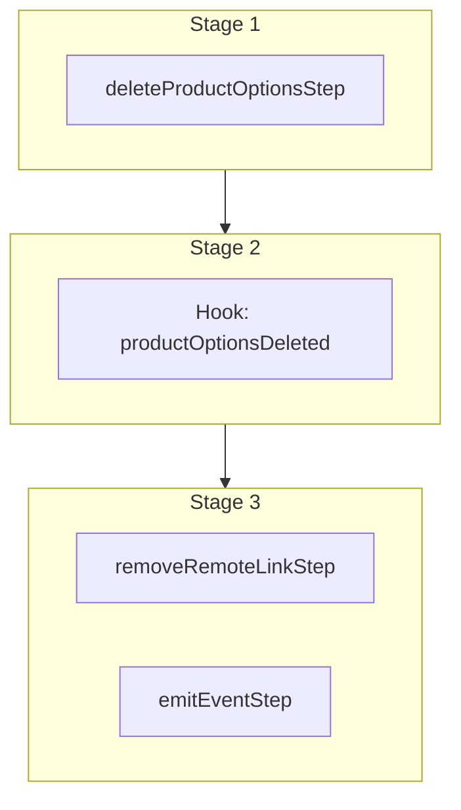

This documentation provides a reference to the `deleteProductOptionsWorkflow`. It belongs to the `@medusajs/medusa/core-flows` package.

This workflow deletes one or more product options. It's used by the
[Delete Product Option Admin API Route](/api/admin/product-options/delete-a-product-option).

This workflow has a hook that allows you to perform custom actions after the product options are deleted. For example,
you can delete custom records linked to the product colleciton.

You can also use this workflow within your own custom workflows, allowing you to wrap custom logic around product-option deletion.

[View source code](https://github.com/medusajs/medusa/blob/0ed927bdb7a396a8fd5f6447ed69b7b354b150d3/packages/core/core-flows/src/product/workflows/delete-product-options.ts#L49)

## Examples

**API Route**

```ts title="src/api/workflow/route.ts"
import type {
  MedusaRequest,
  MedusaResponse,
} from "@medusajs/framework/http"
import { deleteProductOptionsWorkflow } from "@medusajs/medusa/core-flows"

export async function POST(
  req: MedusaRequest,
  res: MedusaResponse
) {
  const { result } = await deleteProductOptionsWorkflow(req.scope)
    .run({
      input: {
        ids: ["poption_123"],
      }
    })

  res.send(result)
}
```

**Subscriber**

```ts title="src/subscribers/order-placed.ts"
import {
  type SubscriberConfig,
  type SubscriberArgs,
} from "@medusajs/framework"
import { deleteProductOptionsWorkflow } from "@medusajs/medusa/core-flows"

export default async function handleOrderPlaced({
  event: { data },
  container,
}: SubscriberArgs < { id: string } > ) {
  const { result } = await deleteProductOptionsWorkflow(container)
    .run({
      input: {
        ids: ["poption_123"],
      }
    })

  console.log(result)
}

export const config: SubscriberConfig = {
  event: "order.placed",
}
```

**Scheduled Job**

```ts title="src/jobs/message-daily.ts"
import { MedusaContainer } from "@medusajs/framework/types"
import { deleteProductOptionsWorkflow } from "@medusajs/medusa/core-flows"

export default async function myCustomJob(
  container: MedusaContainer
) {
  const { result } = await deleteProductOptionsWorkflow(container)
    .run({
      input: {
        ids: ["poption_123"],
      }
    })

  console.log(result)
}

export const config = {
  name: "run-once-a-day",
  schedule: "0 0 * * *",
}
```

**Another Workflow**

```ts title="src/workflows/my-workflow.ts"
import { createWorkflow } from "@medusajs/framework/workflows-sdk"
import { deleteProductOptionsWorkflow } from "@medusajs/medusa/core-flows"

const myWorkflow = createWorkflow(
  "my-workflow",
  () => {
    const result = deleteProductOptionsWorkflow
      .runAsStep({
        input: {
          ids: ["poption_123"],
        }
      })
  }
)
```

<a id="deleteproductoptionsworkflow-steps" />

## Steps



Stages follow the order in the workflow definition. Conditional steps run only when their condition is met. The step descriptions below include the conditions and reference links.

- [deleteProductOptionsStep](/resources/references/medusa-workflows/steps/deleteProductOptionsStep): This step deletes one or more product options.
  - [productOptionsDeleted](/resources/references/medusa-workflows/deleteProductOptionsWorkflow#productoptionsdeleted): This hook is executed after the options are deleted. You can consume this hook to perform custom actions on the deleted options.
    - [removeRemoteLinkStep](/resources/references/medusa-workflows/steps/removeRemoteLinkStep): This step deletes linked records of a record if cascade deletion is enabled. Learn more in the [Link documentation](/learn/fundamentals/module-links/link#cascade-delete-linked-records)
    - [emitEventStep](/resources/references/medusa-workflows/steps/emitEventStep): This step emits an event, which you can listen to in a [subscriber](/learn/fundamentals/events-and-subscribers). You can pass data to the subscriber by including it in the `data` property. The event is only emitted after the workflow has finished successfully. So, even if it's executed in the middle of the workflow, it won't actually emit the event until the workflow has completed successfully. If the workflow fails, it won't emit the event at all.

<a id="deleteproductoptionsworkflow-input" />

## Input

**deleteProductOptionsWorkflow**

- `DeleteProductOptionsWorkflowInput`: [DeleteProductOptionsWorkflowInput](/resources/references/core_flows/core_core_flows_src/types/core_flowscore_core_flows_srcDeleteProductOptionsWorkflowInput)
  - `ids`: `string`\[] — The IDs of the options to delete.

## Hooks

Hooks allow you to inject custom functionalities into the workflow. You'll receive data from the workflow, as well as additional data sent through an HTTP request.

Learn more about [Hooks](/learn/fundamentals/workflows/workflow-hooks) and [Additional Data](/learn/fundamentals/api-routes/additional-data).

### productOptionsDeleted

This hook is executed after the options are deleted. You can consume this hook to perform custom actions on the deleted options.

#### Example

```ts
import { deleteProductOptionsWorkflow } from "@medusajs/medusa/core-flows"

deleteProductOptionsWorkflow.hooks.productOptionsDeleted(
  (async ({ ids }, { container }) => {
    //TODO
  })
)
```

<a id="input" />

#### Input

Handlers consuming this hook accept the following input.

**productOptionsDeleted**

- `input`: object — The input data for the hook.
  - `ids`: `string`\[]

<a id="deleteproductoptionsworkflow-emitted-events" />

## Emitted Events

- `product-option.deleted`: Emitted when product options are deleted.

  ```ts
  {
    id, // The ID of the product option
  }
  ```
