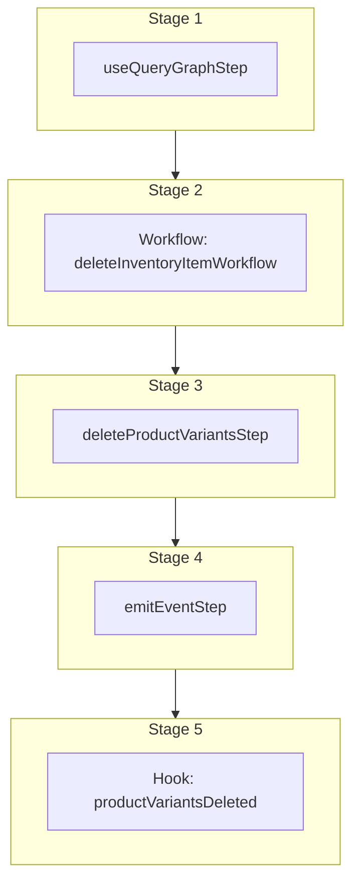

This documentation provides a reference to the `deleteProductVariantsWorkflow`. It belongs to the `@medusajs/medusa/core-flows` package.

This workflow deletes one or more product variants. It's used by the
[Delete Product Variants Admin API Route](/api/admin/products/delete-variant).

This workflow has a hook that allows you to perform custom actions after the product variants are deleted. For example,
you can delete custom records linked to the product variants.

You can also use this workflow within your own custom workflows, allowing you to wrap custom logic around product-variant deletion.

[View source code](https://github.com/medusajs/medusa/blob/0ed927bdb7a396a8fd5f6447ed69b7b354b150d3/packages/core/core-flows/src/product/workflows/delete-product-variants.ts#L54)

## Examples

**API Route**

```ts title="src/api/workflow/route.ts"
import type {
  MedusaRequest,
  MedusaResponse,
} from "@medusajs/framework/http"
import { deleteProductVariantsWorkflow } from "@medusajs/medusa/core-flows"

export async function POST(
  req: MedusaRequest,
  res: MedusaResponse
) {
  const { result } = await deleteProductVariantsWorkflow(req.scope)
    .run({
      input: {
        ids: ["variant_123"],
      }
    })

  res.send(result)
}
```

**Subscriber**

```ts title="src/subscribers/order-placed.ts"
import {
  type SubscriberConfig,
  type SubscriberArgs,
} from "@medusajs/framework"
import { deleteProductVariantsWorkflow } from "@medusajs/medusa/core-flows"

export default async function handleOrderPlaced({
  event: { data },
  container,
}: SubscriberArgs < { id: string } > ) {
  const { result } = await deleteProductVariantsWorkflow(container)
    .run({
      input: {
        ids: ["variant_123"],
      }
    })

  console.log(result)
}

export const config: SubscriberConfig = {
  event: "order.placed",
}
```

**Scheduled Job**

```ts title="src/jobs/message-daily.ts"
import { MedusaContainer } from "@medusajs/framework/types"
import { deleteProductVariantsWorkflow } from "@medusajs/medusa/core-flows"

export default async function myCustomJob(
  container: MedusaContainer
) {
  const { result } = await deleteProductVariantsWorkflow(container)
    .run({
      input: {
        ids: ["variant_123"],
      }
    })

  console.log(result)
}

export const config = {
  name: "run-once-a-day",
  schedule: "0 0 * * *",
}
```

**Another Workflow**

```ts title="src/workflows/my-workflow.ts"
import { createWorkflow } from "@medusajs/framework/workflows-sdk"
import { deleteProductVariantsWorkflow } from "@medusajs/medusa/core-flows"

const myWorkflow = createWorkflow(
  "my-workflow",
  () => {
    const result = deleteProductVariantsWorkflow
      .runAsStep({
        input: {
          ids: ["variant_123"],
        }
      })
  }
)
```

<a id="deleteproductvariantsworkflow-steps" />

## Steps



Stages follow the order in the workflow definition. Conditional steps run only when their condition is met. The step descriptions below include the conditions and reference links.

- [useQueryGraphStep](/resources/references/medusa-workflows/steps/useQueryGraphStep): This step fetches data across modules using the Query. Learn more in the [Query documentation](/learn/fundamentals/module-links/query).
  - [deleteInventoryItemWorkflow](/resources/references/medusa-workflows/deleteInventoryItemWorkflow): Delete one or more inventory items.
    - [deleteProductVariantsStep](/resources/references/medusa-workflows/steps/deleteProductVariantsStep): This step deletes one or more product variants.
      - [emitEventStep](/resources/references/medusa-workflows/steps/emitEventStep): This step emits an event, which you can listen to in a [subscriber](/learn/fundamentals/events-and-subscribers). You can pass data to the subscriber by including it in the `data` property. The event is only emitted after the workflow has finished successfully. So, even if it's executed in the middle of the workflow, it won't actually emit the event until the workflow has completed successfully. If the workflow fails, it won't emit the event at all.
        - [productVariantsDeleted](/resources/references/medusa-workflows/deleteProductVariantsWorkflow#productvariantsdeleted): This hook is executed after the variants are deleted. You can consume this hook to perform custom actions on the deleted variants.

<a id="deleteproductvariantsworkflow-input" />

## Input

**deleteProductVariantsWorkflow**

- `DeleteProductVariantsWorkflowInput`: [DeleteProductVariantsWorkflowInput](/resources/references/core_flows/core_core_flows_src/types/core_flowscore_core_flows_srcDeleteProductVariantsWorkflowInput)
  - `ids`: `string`\[] — The IDs of the variants to delete.

## Hooks

Hooks allow you to inject custom functionalities into the workflow. You'll receive data from the workflow, as well as additional data sent through an HTTP request.

Learn more about [Hooks](/learn/fundamentals/workflows/workflow-hooks) and [Additional Data](/learn/fundamentals/api-routes/additional-data).

### productVariantsDeleted

This hook is executed after the variants are deleted. You can consume this hook to perform custom actions on the deleted variants.

#### Example

```ts
import { deleteProductVariantsWorkflow } from "@medusajs/medusa/core-flows"

deleteProductVariantsWorkflow.hooks.productVariantsDeleted(
  (async ({ ids }, { container }) => {
    //TODO
  })
)
```

<a id="input" />

#### Input

Handlers consuming this hook accept the following input.

**productVariantsDeleted**

- `input`: object — The input data for the hook.
  - `ids`: `string`\[]

<a id="deleteproductvariantsworkflow-emitted-events" />

## Emitted Events

- `product-variant.deleted`: Emitted when product variants are deleted.

  ```ts
  {
    id, // The ID of the product variant
  }
  ```
- `inventory-item.deleted` (since v2.18.0): Emitted when inventory items are deleted.

  ```ts
  {
    id, // The ID of the inventory item
  }
  ```
