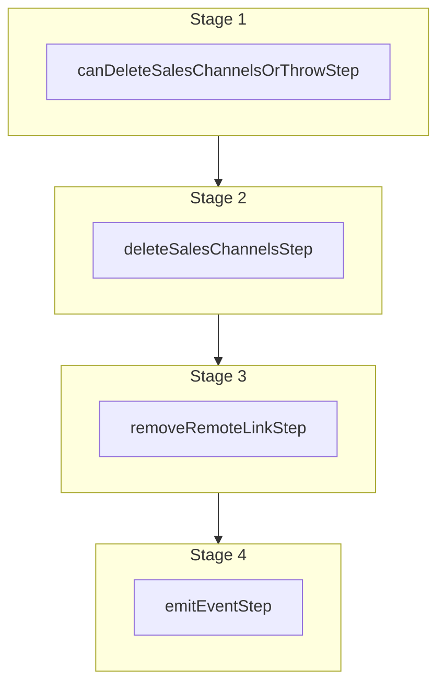

This documentation provides a reference to the `deleteSalesChannelsWorkflow`. It belongs to the `@medusajs/medusa/core-flows` package.

This workflow deletes one or more sales channels. It's used by the
[Delete Sales Channel Admin API Route](/api/admin/sales-channels/delete-a-sales-channel).

You can use this workflow within your customizations or your own custom workflows, allowing you to
delete sales channels within your custom flows.

[View source code](https://github.com/medusajs/medusa/blob/0ed927bdb7a396a8fd5f6447ed69b7b354b150d3/packages/core/core-flows/src/sales-channel/workflows/delete-sales-channels.ts#L42)

## Examples

**API Route**

```ts title="src/api/workflow/route.ts"
import type {
  MedusaRequest,
  MedusaResponse,
} from "@medusajs/framework/http"
import { deleteSalesChannelsWorkflow } from "@medusajs/medusa/core-flows"

export async function POST(
  req: MedusaRequest,
  res: MedusaResponse
) {
  const { result } = await deleteSalesChannelsWorkflow(req.scope)
    .run({
      input: {
        ids: ["sc_123"],
      }
    })

  res.send(result)
}
```

**Subscriber**

```ts title="src/subscribers/order-placed.ts"
import {
  type SubscriberConfig,
  type SubscriberArgs,
} from "@medusajs/framework"
import { deleteSalesChannelsWorkflow } from "@medusajs/medusa/core-flows"

export default async function handleOrderPlaced({
  event: { data },
  container,
}: SubscriberArgs < { id: string } > ) {
  const { result } = await deleteSalesChannelsWorkflow(container)
    .run({
      input: {
        ids: ["sc_123"],
      }
    })

  console.log(result)
}

export const config: SubscriberConfig = {
  event: "order.placed",
}
```

**Scheduled Job**

```ts title="src/jobs/message-daily.ts"
import { MedusaContainer } from "@medusajs/framework/types"
import { deleteSalesChannelsWorkflow } from "@medusajs/medusa/core-flows"

export default async function myCustomJob(
  container: MedusaContainer
) {
  const { result } = await deleteSalesChannelsWorkflow(container)
    .run({
      input: {
        ids: ["sc_123"],
      }
    })

  console.log(result)
}

export const config = {
  name: "run-once-a-day",
  schedule: "0 0 * * *",
}
```

**Another Workflow**

```ts title="src/workflows/my-workflow.ts"
import { createWorkflow } from "@medusajs/framework/workflows-sdk"
import { deleteSalesChannelsWorkflow } from "@medusajs/medusa/core-flows"

const myWorkflow = createWorkflow(
  "my-workflow",
  () => {
    const result = deleteSalesChannelsWorkflow
      .runAsStep({
        input: {
          ids: ["sc_123"],
        }
      })
  }
)
```

<a id="deletesaleschannelsworkflow-steps" />

## Steps



Stages follow the order in the workflow definition. Conditional steps run only when their condition is met. The step descriptions below include the conditions and reference links.

- [canDeleteSalesChannelsOrThrowStep](/resources/references/medusa-workflows/steps/canDeleteSalesChannelsOrThrowStep): This step validates that the specified sales channels can be deleted. If any of the sales channels are default sales channels for a store, the step will throw an error.
  - [deleteSalesChannelsStep](/resources/references/medusa-workflows/steps/deleteSalesChannelsStep): This step deletes one or more sales channels.
    - [removeRemoteLinkStep](/resources/references/medusa-workflows/steps/removeRemoteLinkStep): This step deletes linked records of a record if cascade deletion is enabled. Learn more in the [Link documentation](/learn/fundamentals/module-links/link#cascade-delete-linked-records)
      - [emitEventStep](/resources/references/medusa-workflows/steps/emitEventStep): This step emits an event, which you can listen to in a [subscriber](/learn/fundamentals/events-and-subscribers). You can pass data to the subscriber by including it in the `data` property. The event is only emitted after the workflow has finished successfully. So, even if it's executed in the middle of the workflow, it won't actually emit the event until the workflow has completed successfully. If the workflow fails, it won't emit the event at all.

<a id="deletesaleschannelsworkflow-input" />

## Input

**deleteSalesChannelsWorkflow**

- `DeleteSalesChannelsWorkflowInput`: [DeleteSalesChannelsWorkflowInput](/resources/references/core_flows/core_core_flows_src/types/core_flowscore_core_flows_srcDeleteSalesChannelsWorkflowInput)
  - `ids`: `string`\[] — The IDs of the sales channels to delete.

<a id="deletesaleschannelsworkflow-emitted-events" />

## Emitted Events

- `sales-channel.deleted`: Emitted when sales channels are deleted.

  ```ts
  {
    id, // The ID of the sales channel
  }
  ```
