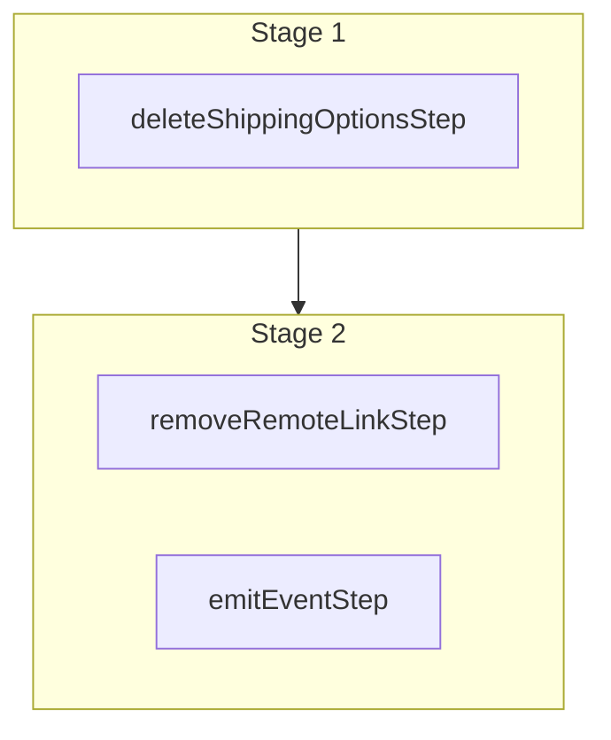

This documentation provides a reference to the `deleteShippingOptionsWorkflow`. It belongs to the `@medusajs/medusa/core-flows` package.

This workflow deletes one or more shipping options. It's used by the
[Delete Shipping Options Admin API Route](/api/admin/shipping-options/delete-a-shipping-option).

You can use this workflow within your own customizations or custom workflows, allowing you to
delete shipping options within your custom flows.

[View source code](https://github.com/medusajs/medusa/blob/0ed927bdb7a396a8fd5f6447ed69b7b354b150d3/packages/core/core-flows/src/fulfillment/workflows/delete-shipping-options.ts#L32)

## Examples

**API Route**

```ts title="src/api/workflow/route.ts"
import type {
  MedusaRequest,
  MedusaResponse,
} from "@medusajs/framework/http"
import { deleteShippingOptionsWorkflow } from "@medusajs/medusa/core-flows"

export async function POST(
  req: MedusaRequest,
  res: MedusaResponse
) {
  const { result } = await deleteShippingOptionsWorkflow(req.scope)
    .run({
      input: {
        ids: ["so_123"]
      }
    })

  res.send(result)
}
```

**Subscriber**

```ts title="src/subscribers/order-placed.ts"
import {
  type SubscriberConfig,
  type SubscriberArgs,
} from "@medusajs/framework"
import { deleteShippingOptionsWorkflow } from "@medusajs/medusa/core-flows"

export default async function handleOrderPlaced({
  event: { data },
  container,
}: SubscriberArgs < { id: string } > ) {
  const { result } = await deleteShippingOptionsWorkflow(container)
    .run({
      input: {
        ids: ["so_123"]
      }
    })

  console.log(result)
}

export const config: SubscriberConfig = {
  event: "order.placed",
}
```

**Scheduled Job**

```ts title="src/jobs/message-daily.ts"
import { MedusaContainer } from "@medusajs/framework/types"
import { deleteShippingOptionsWorkflow } from "@medusajs/medusa/core-flows"

export default async function myCustomJob(
  container: MedusaContainer
) {
  const { result } = await deleteShippingOptionsWorkflow(container)
    .run({
      input: {
        ids: ["so_123"]
      }
    })

  console.log(result)
}

export const config = {
  name: "run-once-a-day",
  schedule: "0 0 * * *",
}
```

**Another Workflow**

```ts title="src/workflows/my-workflow.ts"
import { createWorkflow } from "@medusajs/framework/workflows-sdk"
import { deleteShippingOptionsWorkflow } from "@medusajs/medusa/core-flows"

const myWorkflow = createWorkflow(
  "my-workflow",
  () => {
    const result = deleteShippingOptionsWorkflow
      .runAsStep({
        input: {
          ids: ["so_123"]
        }
      })
  }
)
```

<a id="deleteshippingoptionsworkflow-steps" />

## Steps



Stages follow the order in the workflow definition. Conditional steps run only when their condition is met. The step descriptions below include the conditions and reference links.

- [deleteShippingOptionsStep](/resources/references/medusa-workflows/steps/deleteShippingOptionsStep): This step deletes one or more shipping options.
  - [removeRemoteLinkStep](/resources/references/medusa-workflows/steps/removeRemoteLinkStep): This step deletes linked records of a record if cascade deletion is enabled. Learn more in the [Link documentation](/learn/fundamentals/module-links/link#cascade-delete-linked-records)
  - [emitEventStep](/resources/references/medusa-workflows/steps/emitEventStep): This step emits an event, which you can listen to in a [subscriber](/learn/fundamentals/events-and-subscribers). You can pass data to the subscriber by including it in the `data` property. The event is only emitted after the workflow has finished successfully. So, even if it's executed in the middle of the workflow, it won't actually emit the event until the workflow has completed successfully. If the workflow fails, it won't emit the event at all.

<a id="deleteshippingoptionsworkflow-input" />

## Input

**deleteShippingOptionsWorkflow**

- `DeleteShippingOptionsWorkflowInput`: [DeleteShippingOptionsWorkflowInput](/resources/references/types/WorkflowTypes/FulfillmentWorkflow/interfaces/typesWorkflowTypesFulfillmentWorkflowDeleteShippingOptionsWorkflowInput)
  - `ids`: `string`\[] — The IDs of the shipping options to delete.

<a id="deleteshippingoptionsworkflow-emitted-events" />

## Emitted Events

- `shipping-option.deleted` (since v2.12.4): Emitted when shipping options are deleted.

  ```ts
  {
    id, // The ID of the shipping option
  }
  ```
