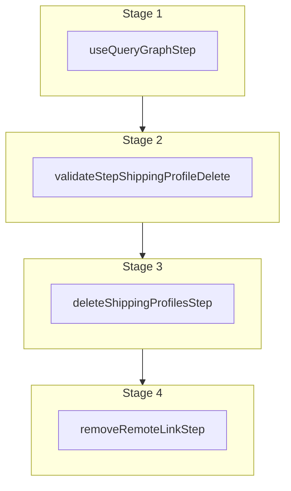

This documentation provides a reference to the `deleteShippingProfileWorkflow`. It belongs to the `@medusajs/medusa/core-flows` package.

This workflow deletes one or more shipping profiles. It's used by the
[Delete Shipping Profile Admin API Route](/api/admin/shipping-profiles/delete-a-shipping-profile).
Shipping profiles that are linked to products cannot be deleted.

You can use this workflow within your customizations or your own custom workflows, allowing you to
delete shipping profiles within your custom flows.

[View source code](https://github.com/medusajs/medusa/blob/0ed927bdb7a396a8fd5f6447ed69b7b354b150d3/packages/core/core-flows/src/shipping-profile/workflows/delete-shipping-profile.ts#L92)

## Examples

**API Route**

```ts title="src/api/workflow/route.ts"
import type {
  MedusaRequest,
  MedusaResponse,
} from "@medusajs/framework/http"
import { deleteShippingProfileWorkflow } from "@medusajs/medusa/core-flows"

export async function POST(
  req: MedusaRequest,
  res: MedusaResponse
) {
  const { result } = await deleteShippingProfileWorkflow(req.scope)
    .run({
      input: {
        ids: ["sp_123"]
      }
    })

  res.send(result)
}
```

**Subscriber**

```ts title="src/subscribers/order-placed.ts"
import {
  type SubscriberConfig,
  type SubscriberArgs,
} from "@medusajs/framework"
import { deleteShippingProfileWorkflow } from "@medusajs/medusa/core-flows"

export default async function handleOrderPlaced({
  event: { data },
  container,
}: SubscriberArgs < { id: string } > ) {
  const { result } = await deleteShippingProfileWorkflow(container)
    .run({
      input: {
        ids: ["sp_123"]
      }
    })

  console.log(result)
}

export const config: SubscriberConfig = {
  event: "order.placed",
}
```

**Scheduled Job**

```ts title="src/jobs/message-daily.ts"
import { MedusaContainer } from "@medusajs/framework/types"
import { deleteShippingProfileWorkflow } from "@medusajs/medusa/core-flows"

export default async function myCustomJob(
  container: MedusaContainer
) {
  const { result } = await deleteShippingProfileWorkflow(container)
    .run({
      input: {
        ids: ["sp_123"]
      }
    })

  console.log(result)
}

export const config = {
  name: "run-once-a-day",
  schedule: "0 0 * * *",
}
```

**Another Workflow**

```ts title="src/workflows/my-workflow.ts"
import { createWorkflow } from "@medusajs/framework/workflows-sdk"
import { deleteShippingProfileWorkflow } from "@medusajs/medusa/core-flows"

const myWorkflow = createWorkflow(
  "my-workflow",
  () => {
    const result = deleteShippingProfileWorkflow
      .runAsStep({
        input: {
          ids: ["sp_123"]
        }
      })
  }
)
```

<a id="deleteshippingprofileworkflow-steps" />

## Steps



Stages follow the order in the workflow definition. Conditional steps run only when their condition is met. The step descriptions below include the conditions and reference links.

- [useQueryGraphStep](/resources/references/medusa-workflows/steps/useQueryGraphStep): This step fetches data across modules using the Query. Learn more in the [Query documentation](/learn/fundamentals/module-links/query).
  - [validateStepShippingProfileDelete](/resources/references/medusa-workflows/validateStepShippingProfileDelete): This step validates that the shipping profiles to delete are not linked to any products. Otherwise, an error is thrown.
    - [deleteShippingProfilesStep](/resources/references/medusa-workflows/steps/deleteShippingProfilesStep): This step deletes one or more shipping profiles.
      - [removeRemoteLinkStep](/resources/references/medusa-workflows/steps/removeRemoteLinkStep): This step deletes linked records of a record if cascade deletion is enabled. Learn more in the [Link documentation](/learn/fundamentals/module-links/link#cascade-delete-linked-records)

<a id="deleteshippingprofileworkflow-input" />

## Input

**deleteShippingProfileWorkflow**

- `DeleteShippingProfilesWorkflowInput`: [DeleteShippingProfilesWorkflowInput](/resources/references/core_flows/core_core_flows_src/types/core_flowscore_core_flows_srcDeleteShippingProfilesWorkflowInput)
  - `ids`: `string`\[] — The IDs of the shipping profiles to delete.
