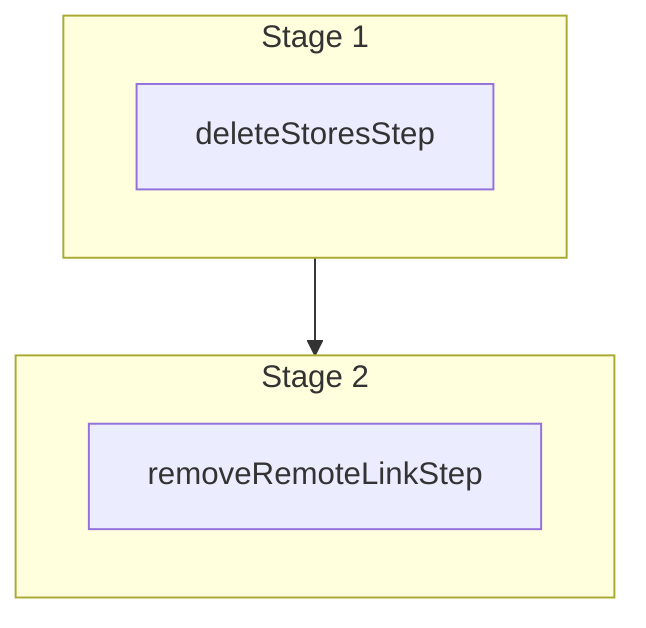

This documentation provides a reference to the `deleteStoresWorkflow`. It belongs to the `@medusajs/medusa/core-flows` package.

This workflow deletes one or more stores.

> **Note**
>
> By default, Medusa uses a single store. This is useful
> if you're building a multi-tenant application or a marketplace where each tenant has its own store.
> If you delete the only store in your application, the Medusa application will re-create it on application start-up.

You can use this workflow within your customizations or your own custom workflows, allowing you to
delete stores within your custom flows.

[View source code](https://github.com/medusajs/medusa/blob/0ed927bdb7a396a8fd5f6447ed69b7b354b150d3/packages/core/core-flows/src/store/workflows/delete-stores.ts#L43)

## Examples

**API Route**

```ts title="src/api/workflow/route.ts"
import type {
  MedusaRequest,
  MedusaResponse,
} from "@medusajs/framework/http"
import { deleteStoresWorkflow } from "@medusajs/medusa/core-flows"

export async function POST(
  req: MedusaRequest,
  res: MedusaResponse
) {
  const { result } = await deleteStoresWorkflow(req.scope)
    .run({
      input: {
        ids: ["store_123"]
      }
    })

  res.send(result)
}
```

**Subscriber**

```ts title="src/subscribers/order-placed.ts"
import {
  type SubscriberConfig,
  type SubscriberArgs,
} from "@medusajs/framework"
import { deleteStoresWorkflow } from "@medusajs/medusa/core-flows"

export default async function handleOrderPlaced({
  event: { data },
  container,
}: SubscriberArgs < { id: string } > ) {
  const { result } = await deleteStoresWorkflow(container)
    .run({
      input: {
        ids: ["store_123"]
      }
    })

  console.log(result)
}

export const config: SubscriberConfig = {
  event: "order.placed",
}
```

**Scheduled Job**

```ts title="src/jobs/message-daily.ts"
import { MedusaContainer } from "@medusajs/framework/types"
import { deleteStoresWorkflow } from "@medusajs/medusa/core-flows"

export default async function myCustomJob(
  container: MedusaContainer
) {
  const { result } = await deleteStoresWorkflow(container)
    .run({
      input: {
        ids: ["store_123"]
      }
    })

  console.log(result)
}

export const config = {
  name: "run-once-a-day",
  schedule: "0 0 * * *",
}
```

**Another Workflow**

```ts title="src/workflows/my-workflow.ts"
import { createWorkflow } from "@medusajs/framework/workflows-sdk"
import { deleteStoresWorkflow } from "@medusajs/medusa/core-flows"

const myWorkflow = createWorkflow(
  "my-workflow",
  () => {
    const result = deleteStoresWorkflow
      .runAsStep({
        input: {
          ids: ["store_123"]
        }
      })
  }
)
```

<a id="deletestoresworkflow-steps" />

## Steps



Stages follow the order in the workflow definition. Conditional steps run only when their condition is met. The step descriptions below include the conditions and reference links.

- [deleteStoresStep](/resources/references/medusa-workflows/steps/deleteStoresStep): This step deletes one or more stores.
  - [removeRemoteLinkStep](/resources/references/medusa-workflows/steps/removeRemoteLinkStep): This step deletes linked records of a record if cascade deletion is enabled. Learn more in the [Link documentation](/learn/fundamentals/module-links/link#cascade-delete-linked-records)

<a id="deletestoresworkflow-input" />

## Input

**deleteStoresWorkflow**

- `DeleteStoresWorkflowInput`: [DeleteStoresWorkflowInput](/resources/references/core_flows/core_core_flows_src/types/core_flowscore_core_flows_srcDeleteStoresWorkflowInput)
  - `ids`: `string`\[] — The IDs of the stores to delete.
