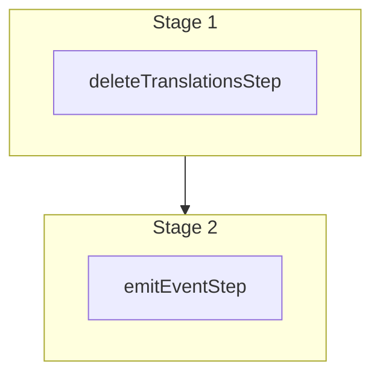

This documentation provides a reference to the `deleteTranslationsWorkflow`. It belongs to the `@medusajs/medusa/core-flows` package.

This workflow deletes one or more translations. It's used by other
workflows like the [batchTranslationsWorkflow](/resources/references/medusa-workflows/batchTranslationsWorkflow) workflow.

You can use this workflow within your own customizations or custom workflows, allowing you
to delete translations in your custom flows.

> **Note**
>
> This is available starting from [Medusa v2.12.3](https://github.com/medusajs/medusa/releases/tag/v2.12.3).

[View source code](https://github.com/medusajs/medusa/blob/0ed927bdb7a396a8fd5f6447ed69b7b354b150d3/packages/core/core-flows/src/translation/workflows/delete-translations.ts#L43)

## Examples

**API Route**

```ts title="src/api/workflow/route.ts"
import type {
  MedusaRequest,
  MedusaResponse,
} from "@medusajs/framework/http"
import { deleteTranslationsWorkflow } from "@medusajs/medusa/core-flows"

export async function POST(
  req: MedusaRequest,
  res: MedusaResponse
) {
  const { result } = await deleteTranslationsWorkflow(req.scope)
    .run({
      input: {
        ids: ["trans_123"]
      }
    })

  res.send(result)
}
```

**Subscriber**

```ts title="src/subscribers/order-placed.ts"
import {
  type SubscriberConfig,
  type SubscriberArgs,
} from "@medusajs/framework"
import { deleteTranslationsWorkflow } from "@medusajs/medusa/core-flows"

export default async function handleOrderPlaced({
  event: { data },
  container,
}: SubscriberArgs < { id: string } > ) {
  const { result } = await deleteTranslationsWorkflow(container)
    .run({
      input: {
        ids: ["trans_123"]
      }
    })

  console.log(result)
}

export const config: SubscriberConfig = {
  event: "order.placed",
}
```

**Scheduled Job**

```ts title="src/jobs/message-daily.ts"
import { MedusaContainer } from "@medusajs/framework/types"
import { deleteTranslationsWorkflow } from "@medusajs/medusa/core-flows"

export default async function myCustomJob(
  container: MedusaContainer
) {
  const { result } = await deleteTranslationsWorkflow(container)
    .run({
      input: {
        ids: ["trans_123"]
      }
    })

  console.log(result)
}

export const config = {
  name: "run-once-a-day",
  schedule: "0 0 * * *",
}
```

**Another Workflow**

```ts title="src/workflows/my-workflow.ts"
import { createWorkflow } from "@medusajs/framework/workflows-sdk"
import { deleteTranslationsWorkflow } from "@medusajs/medusa/core-flows"

const myWorkflow = createWorkflow(
  "my-workflow",
  () => {
    const result = deleteTranslationsWorkflow
      .runAsStep({
        input: {
          ids: ["trans_123"]
        }
      })
  }
)
```

<a id="deletetranslationsworkflow-steps" />

## Steps



Stages follow the order in the workflow definition. Conditional steps run only when their condition is met. The step descriptions below include the conditions and reference links.

- [deleteTranslationsStep](/resources/references/medusa-workflows/steps/deleteTranslationsStep): This step deletes one or more translations.
  - [emitEventStep](/resources/references/medusa-workflows/steps/emitEventStep): This step emits an event, which you can listen to in a [subscriber](/learn/fundamentals/events-and-subscribers). You can pass data to the subscriber by including it in the `data` property. The event is only emitted after the workflow has finished successfully. So, even if it's executed in the middle of the workflow, it won't actually emit the event until the workflow has completed successfully. If the workflow fails, it won't emit the event at all.

<a id="deletetranslationsworkflow-input" />

## Input

**deleteTranslationsWorkflow**

- `DeleteTranslationsWorkflowInput`: [DeleteTranslationsWorkflowInput](/resources/references/core_flows/core_core_flows_src/types/core_flowscore_core_flows_srcDeleteTranslationsWorkflowInput)
  - `ids`: `string`\[] — The IDs of the translations to delete.

<a id="deletetranslationsworkflow-emitted-events" />

## Emitted Events

- `translation.deleted` (since v2.12.3): Emitted when translations are deleted.

  ```ts
  {
    id, // The ID of the translation
  }
  ```
