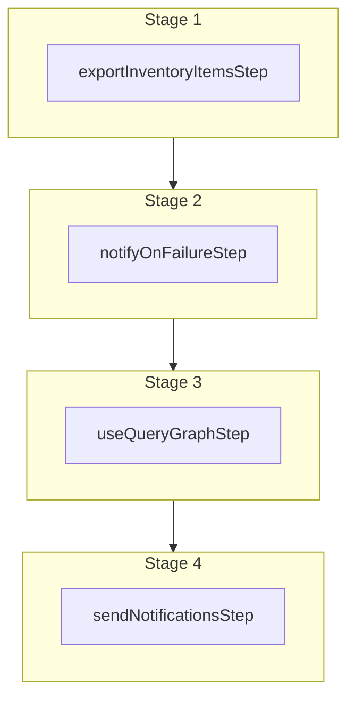

This documentation provides a reference to the `exportInventoryItemsWorkflow`. It belongs to the `@medusajs/medusa/core-flows` package.

This workflow exports inventory items matching the specified filters. The exported
CSV file includes the inventory levels of each item per stock location. It's used by the
[Export Inventory Items Admin API Route](/api/admin/inventory-items/export-inventory-items).

> **Note**
>
> This workflow doesn't return the exported inventory items. Instead, it sends a notification to the admin
> users that they can download the exported inventory items. Learn more in the [API Reference](/api/admin/inventory-items/export-inventory-items).

[View source code](https://github.com/medusajs/medusa/blob/0ed927bdb7a396a8fd5f6447ed69b7b354b150d3/packages/core/core-flows/src/inventory/workflows/export-inventory-items.ts#L54)

## Examples

To export all inventory items:

**API Route**

```ts title="src/api/workflow/route.ts"
import type {
  MedusaRequest,
  MedusaResponse,
} from "@medusajs/framework/http"
import { exportInventoryItemsWorkflow } from "@medusajs/medusa/core-flows"

export async function POST(
  req: MedusaRequest,
  res: MedusaResponse
) {
  const { result } = await exportInventoryItemsWorkflow(req.scope)
    .run({
      input: {
        select: ["*"],
      }
    })

  res.send(result)
}
```

**Subscriber**

```ts title="src/subscribers/order-placed.ts"
import {
  type SubscriberConfig,
  type SubscriberArgs,
} from "@medusajs/framework"
import { exportInventoryItemsWorkflow } from "@medusajs/medusa/core-flows"

export default async function handleOrderPlaced({
  event: { data },
  container,
}: SubscriberArgs < { id: string } > ) {
  const { result } = await exportInventoryItemsWorkflow(container)
    .run({
      input: {
        select: ["*"],
      }
    })

  console.log(result)
}

export const config: SubscriberConfig = {
  event: "order.placed",
}
```

**Scheduled Job**

```ts title="src/jobs/message-daily.ts"
import { MedusaContainer } from "@medusajs/framework/types"
import { exportInventoryItemsWorkflow } from "@medusajs/medusa/core-flows"

export default async function myCustomJob(
  container: MedusaContainer
) {
  const { result } = await exportInventoryItemsWorkflow(container)
    .run({
      input: {
        select: ["*"],
      }
    })

  console.log(result)
}

export const config = {
  name: "run-once-a-day",
  schedule: "0 0 * * *",
}
```

**Another Workflow**

```ts title="src/workflows/my-workflow.ts"
import { createWorkflow } from "@medusajs/framework/workflows-sdk"
import { exportInventoryItemsWorkflow } from "@medusajs/medusa/core-flows"

const myWorkflow = createWorkflow(
  "my-workflow",
  () => {
    const result = exportInventoryItemsWorkflow
      .runAsStep({
        input: {
          select: ["*"],
        }
      })
  }
)
```

To export inventory items matching a criteria:

**API Route**

```ts title="src/api/workflow/route.ts"
import type {
  MedusaRequest,
  MedusaResponse,
} from "@medusajs/framework/http"
import { exportInventoryItemsWorkflow } from "@medusajs/medusa/core-flows"

export async function POST(
  req: MedusaRequest,
  res: MedusaResponse
) {
  const { result } = await exportInventoryItemsWorkflow(req.scope)
    .run({
      input: {
        select: ["*"],
        filter: {
          sku: "SHIRT"
        }
      }
    })

  res.send(result)
}
```

**Subscriber**

```ts title="src/subscribers/order-placed.ts"
import {
  type SubscriberConfig,
  type SubscriberArgs,
} from "@medusajs/framework"
import { exportInventoryItemsWorkflow } from "@medusajs/medusa/core-flows"

export default async function handleOrderPlaced({
  event: { data },
  container,
}: SubscriberArgs < { id: string } > ) {
  const { result } = await exportInventoryItemsWorkflow(container)
    .run({
      input: {
        select: ["*"],
        filter: {
          sku: "SHIRT"
        }
      }
    })

  console.log(result)
}

export const config: SubscriberConfig = {
  event: "order.placed",
}
```

**Scheduled Job**

```ts title="src/jobs/message-daily.ts"
import { MedusaContainer } from "@medusajs/framework/types"
import { exportInventoryItemsWorkflow } from "@medusajs/medusa/core-flows"

export default async function myCustomJob(
  container: MedusaContainer
) {
  const { result } = await exportInventoryItemsWorkflow(container)
    .run({
      input: {
        select: ["*"],
        filter: {
          sku: "SHIRT"
        }
      }
    })

  console.log(result)
}

export const config = {
  name: "run-once-a-day",
  schedule: "0 0 * * *",
}
```

**Another Workflow**

```ts title="src/workflows/my-workflow.ts"
import { createWorkflow } from "@medusajs/framework/workflows-sdk"
import { exportInventoryItemsWorkflow } from "@medusajs/medusa/core-flows"

const myWorkflow = createWorkflow(
  "my-workflow",
  () => {
    const result = exportInventoryItemsWorkflow
      .runAsStep({
        input: {
          select: ["*"],
          filter: {
            sku: "SHIRT"
          }
        }
      })
  }
)
```

<a id="exportinventoryitemsworkflow-steps" />

## Steps



Stages follow the order in the workflow definition. Conditional steps run only when their condition is met. The step descriptions below include the conditions and reference links.

- [exportInventoryItemsStep](/resources/references/medusa-workflows/steps/exportInventoryItemsStep): This step exports inventory items to a CSV file based on the provided filters. The exported file includes the inventory levels of each item per stock location.
  - [notifyOnFailureStep](/resources/references/medusa-workflows/steps/notifyOnFailureStep): This step sends one or more notification when a workflow fails. This step can be used in the beginning of a workflow so that, when the workflow fails, the step's compensation function is triggered to send the notification.
    - [useQueryGraphStep](/resources/references/medusa-workflows/steps/useQueryGraphStep): This step fetches data across modules using the Query. Learn more in the [Query documentation](/learn/fundamentals/module-links/query).
      - [sendNotificationsStep](/resources/references/medusa-workflows/steps/sendNotificationsStep): This step sends one or more notifications.

<a id="exportinventoryitemsworkflow-input" />

## Input

**exportInventoryItemsWorkflow**

- `ExportInventoryItemsDTO`: [ExportInventoryItemsDTO](/resources/references/types/WorkflowTypes/InventoryWorkflow/interfaces/typesWorkflowTypesInventoryWorkflowExportInventoryItemsDTO)
  - `select`: `string`\[] — The fields to select. These fields will be passed to [Query](/learn/fundamentals/module-links/query), so you can pass inventory item properties or any relation names, including custom links.
  - `filter`: [FilterableInventoryItemProps](/resources/references/types/InventoryTypes/interfaces/typesInventoryTypesFilterableInventoryItemProps) & `object` (optional) — The filters to select which inventory items to export.
    - `q`: `string` (optional) — Search term to search inventory items' attributes.
    - `id`: `string` | `string`\[] (optional) — The IDs to filter inventory items by.
    - `location_id`: `string` | `string`\[] (optional) — Filter inventory items by the ID of their associated location.
    - `sku`: `string` | `string`\[] | [StringComparisonOperator](/resources/references/types/CommonTypes/interfaces/typesCommonTypesStringComparisonOperator) (optional) — The SKUs to filter inventory items by.
      - `lt`: `string` (optional) — The filtered string must be less than this value.
      - `gt`: `string` (optional) — The filtered string must be greater than this value.
      - `gte`: `string` (optional) — The filtered string must be greater than or equal to this value.
      - `lte`: `string` (optional) — The filtered string must be less than or equal to this value.
      - `contains`: `string` (optional) — The filtered string must contain this value.
      - `starts_with`: `string` (optional) — The filtered string must start with this value.
      - `ends_with`: `string` (optional) — The filtered string must end with this value.
    - `origin_country`: `string` | `string`\[] (optional) — The origin country to filter inventory items by.
    - `hs_code`: `string` | `string`\[] | [StringComparisonOperator](/resources/references/types/CommonTypes/interfaces/typesCommonTypesStringComparisonOperator) (optional) — The HS Codes to filter inventory items by.
      - `lt`: `string` (optional) — The filtered string must be less than this value.
      - `gt`: `string` (optional) — The filtered string must be greater than this value.
      - `gte`: `string` (optional) — The filtered string must be greater than or equal to this value.
      - `lte`: `string` (optional) — The filtered string must be less than or equal to this value.
      - `contains`: `string` (optional) — The filtered string must contain this value.
      - `starts_with`: `string` (optional) — The filtered string must start with this value.
      - `ends_with`: `string` (optional) — The filtered string must end with this value.
    - `requires_shipping`: `boolean` (optional) — Filter inventory items by whether they require shipping.
    - `location_levels`: `object` (optional)
      - `location_id`: `string` | `string`\[] (optional)
  - `batch_size`: `string` | `number` (optional) — The batch size to use for querying inventory items.
