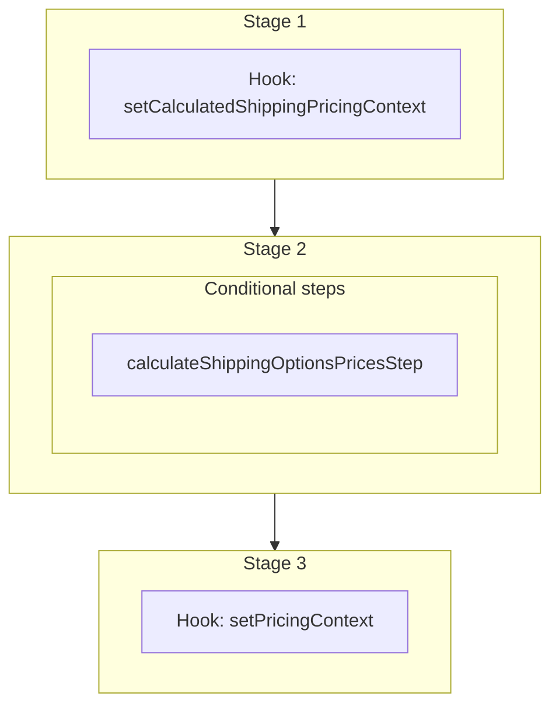

This documentation provides a reference to the `fetchShippingOptionForOrderWorkflow`. It belongs to the `@medusajs/medusa/core-flows` package.

This workflow fetches a shipping option for an order. It's used in Return Merchandise Authorization (RMA) flows. It's used
by other workflows, such as [createClaimShippingMethodWorkflow](/resources/references/medusa-workflows/createClaimShippingMethodWorkflow).

You can use this workflow within your customizations or your own custom workflows, allowing you to wrap custom logic around fetching
shipping options for an order.

[View source code](https://github.com/medusajs/medusa/blob/0ed927bdb7a396a8fd5f6447ed69b7b354b150d3/packages/core/core-flows/src/order/workflows/fetch-shipping-option.ts#L189)

## Examples

**API Route**

```ts title="src/api/workflow/route.ts"
import type {
  MedusaRequest,
  MedusaResponse,
} from "@medusajs/framework/http"
import { fetchShippingOptionForOrderWorkflow } from "@medusajs/medusa/core-flows"

export async function POST(
  req: MedusaRequest,
  res: MedusaResponse
) {
  const { result } = await fetchShippingOptionForOrderWorkflow(req.scope)
    .run({
      input: {
        shipping_option_id: "so_123",
        currency_code: "usd",
        order_id: "order_123",
        context: {
          return_id: "ret_123",
          return_items: [{
            id: "orli_123",
            quantity: 1,
          }]
        }
      }
    })

  res.send(result)
}
```

**Subscriber**

```ts title="src/subscribers/order-placed.ts"
import {
  type SubscriberConfig,
  type SubscriberArgs,
} from "@medusajs/framework"
import { fetchShippingOptionForOrderWorkflow } from "@medusajs/medusa/core-flows"

export default async function handleOrderPlaced({
  event: { data },
  container,
}: SubscriberArgs < { id: string } > ) {
  const { result } = await fetchShippingOptionForOrderWorkflow(container)
    .run({
      input: {
        shipping_option_id: "so_123",
        currency_code: "usd",
        order_id: "order_123",
        context: {
          return_id: "ret_123",
          return_items: [{
            id: "orli_123",
            quantity: 1,
          }]
        }
      }
    })

  console.log(result)
}

export const config: SubscriberConfig = {
  event: "order.placed",
}
```

**Scheduled Job**

```ts title="src/jobs/message-daily.ts"
import { MedusaContainer } from "@medusajs/framework/types"
import { fetchShippingOptionForOrderWorkflow } from "@medusajs/medusa/core-flows"

export default async function myCustomJob(
  container: MedusaContainer
) {
  const { result } = await fetchShippingOptionForOrderWorkflow(container)
    .run({
      input: {
        shipping_option_id: "so_123",
        currency_code: "usd",
        order_id: "order_123",
        context: {
          return_id: "ret_123",
          return_items: [{
            id: "orli_123",
            quantity: 1,
          }]
        }
      }
    })

  console.log(result)
}

export const config = {
  name: "run-once-a-day",
  schedule: "0 0 * * *",
}
```

**Another Workflow**

```ts title="src/workflows/my-workflow.ts"
import { createWorkflow } from "@medusajs/framework/workflows-sdk"
import { fetchShippingOptionForOrderWorkflow } from "@medusajs/medusa/core-flows"

const myWorkflow = createWorkflow(
  "my-workflow",
  () => {
    const result = fetchShippingOptionForOrderWorkflow
      .runAsStep({
        input: {
          shipping_option_id: "so_123",
          currency_code: "usd",
          order_id: "order_123",
          context: {
            return_id: "ret_123",
            return_items: [{
              id: "orli_123",
              quantity: 1,
            }]
          }
        }
      })
  }
)
```

<a id="fetchshippingoptionfororderworkflow-steps" />

## Steps



Stages follow the order in the workflow definition. Conditional steps run only when their condition is met. The step descriptions below include the conditions and reference links.

- [setCalculatedShippingPricingContext](/resources/references/medusa-workflows/fetchShippingOptionForOrderWorkflow#setcalculatedshippingpricingcontext): This hook is executed before the calculated shipping methods' prices are refreshed. You can consume it to return any custom context that is merged into the `context` parameter of the fulfillment provider's `calculatePrice` method (framework-provided properties take precedence on a naming conflict).
  - **when** (when: isCalculatedPriceShippingOption)
  - [calculateShippingOptionsPricesStep](/resources/references/medusa-workflows/steps/calculateShippingOptionsPricesStep): This step calculates the prices for one or more shipping options.
    - [setPricingContext](/resources/references/medusa-workflows/fetchShippingOptionForOrderWorkflow#setpricingcontext): This hook is executed after the order is retrieved and before the line items are created. You can consume this hook to return any custom context useful for the prices retrieval of the variants to be added to the order. For example, assuming you have the following custom pricing rule: `json { "attribute": "location_id", "operator": "eq", "value": "sloc_123", } ` You can consume the `setPricingContext` hook to add the `location_id` context to the prices calculation: `ts import { addOrderLineItemsWorkflow } from "@medusajs/medusa/core-flows"; import { StepResponse } from "@medusajs/workflows-sdk"; addOrderLineItemsWorkflow.hooks.setPricingContext(( { order, variantIds, region, customerData, additional_data }, { container } ) => { return new StepResponse({ location_id: "sloc_123", // Special price for in-store purchases }); }); ` The variants' prices will now be retrieved using the context you return. :::note Learn more about prices calculation context in the [Prices Calculation](/resources/commerce-modules/pricing/price-calculation) documentation. :::

<a id="fetchshippingoptionfororderworkflow-input" />

## Input

**fetchShippingOptionForOrderWorkflow**

- `AdditionalData & object`: [AdditionalData](/resources/references/types/HttpTypes/types/typesHttpTypesAdditionalData) & `object`
  - `AdditionalData`: `object` — Additional data, passed through the `additional_data` property accepted in HTTP requests, that allows passing custom data and handle them in hooks. Learn more in [this documentation](/learn/fundamentals/api-routes/additional-data).
  - `shipping_option_id`: `string` — The ID of the shipping option to fetch.
  - `custom_amount`: `null` | [BigNumberInput](/resources/references/types/types/typesBigNumberInput) (optional) — The custom amount of the shipping option. If not provided, the shipping option's amount is used.
  - `currency_code`: `string` — The currency code of the order.
  - `order_id`: `string` — The ID of the order.
  - `context`: `CalculatedRMAShippingContext` (optional) — The context of the RMA flow, which can be useful for retrieving the shipping option's price. Optional for non-RMA flows such as draft orders.

<a id="fetchshippingoptionfororderworkflow-output" />

## Output

**fetchShippingOptionForOrderWorkflow**

- `ShippingOptionDTO & object`: [ShippingOptionDTO](/resources/references/fulfillment/interfaces/fulfillmentShippingOptionDTO) & `object`
  - `ShippingOptionDTO`: `object` — The shipping option details.
  - `calculated_price`: `object` — The shipping option's price.

## Hooks

Hooks allow you to inject custom functionalities into the workflow. You'll receive data from the workflow, as well as additional data sent through an HTTP request.

Learn more about [Hooks](/learn/fundamentals/workflows/workflow-hooks) and [Additional Data](/learn/fundamentals/api-routes/additional-data).

### setCalculatedShippingPricingContext

This hook is executed before a calculated shipping option's price is calculated.
You can consume this hook to return any custom context that is forwarded as-is to the fulfillment provider's `calculatePrice` method.

```ts
import { fetchShippingOptionForOrderWorkflow } from "@medusajs/medusa/core-flows"
import { StepResponse } from "@medusajs/workflows-sdk"

fetchShippingOptionForOrderWorkflow.hooks.setCalculatedShippingPricingContext(
  async ({ input }, { container }) => {
    return new StepResponse({
      account_number: "acc_123",
    })
  }
)
```

The returned object is merged into the `context` parameter of the fulfillment provider's `calculatePrice` method, with framework-provided properties taking precedence on a naming conflict.

#### Example

```ts
import { fetchShippingOptionForOrderWorkflow } from "@medusajs/medusa/core-flows"

fetchShippingOptionForOrderWorkflow.hooks.setCalculatedShippingPricingContext(
  (async ({ input }, { container }) => {
    //TODO
  })
)
```

<a id="input" />

#### Input

Handlers consuming this hook accept the following input.

**setCalculatedShippingPricingContext**

- `input`: object — The input data for the hook.
  - `input`: [FetchShippingOptionForOrderWorkflowInput](/resources/references/core_flows/core_core_flows_src/types/core_flowscore_core_flows_srcFetchShippingOptionForOrderWorkflowInput)

### setPricingContext

This hook is executed before the shipping option is fetched. You can consume this hook to set the pricing context for the shipping option. This is useful when you have custom pricing rules that depend on the context of the order.

For example, assuming you have the following custom pricing rule:

```json
{
  "attribute": "location_id",
  "operator": "eq",
  "value": "sloc_123",
}
```

You can consume the `setPricingContext` hook to add the `location_id` context to the prices calculation:

```ts
import { fetchShippingOptionForOrderWorkflow } from "@medusajs/medusa/core-flows";
import { StepResponse } from "@medusajs/workflows-sdk";

fetchShippingOptionForOrderWorkflow.hooks.setPricingContext((
  { shipping_option_id, currency_code, order_id, context, additional_data }, { container }
) => {
  return new StepResponse({
    location_id: "sloc_123", // Special price for in-store purchases
  });
});
```

The shipping option's price will now be retrieved using the context you return.

> **Note**
>
> Learn more about prices calculation context in the [Prices Calculation](/resources/commerce-modules/pricing/price-calculation) documentation.

#### Example

```ts
import { fetchShippingOptionForOrderWorkflow } from "@medusajs/medusa/core-flows"

fetchShippingOptionForOrderWorkflow.hooks.setPricingContext(
  (async ({}, { container }) => {
    //TODO
  })
)
```

<a id="input-1" />

#### Input

Handlers consuming this hook accept the following input.

**setPricingContext**

- `input`: [AdditionalData](/resources/references/types/HttpTypes/types/typesHttpTypesAdditionalData) & `object`
  - `shipping_option_id`: `string` — The ID of the shipping option to fetch.
  - `currency_code`: `string` — The currency code of the order.
  - `order_id`: `string` — The ID of the order.
  - `additional_data`: `Record<string, unknown>` (optional) — Additional data that can be passed through the `additional_data` property in HTTP requests. Learn more in [this documentation](/learn/fundamentals/api-routes/additional-data).
  - `custom_amount`: `null` | [BigNumberInput](/resources/references/types/types/typesBigNumberInput) (optional) — The custom amount of the shipping option. If not provided, the shipping option's amount is used.
  - `context`: `CalculatedRMAShippingContext` (optional) — The context of the RMA flow, which can be useful for retrieving the shipping option's price. Optional for non-RMA flows such as draft orders.
