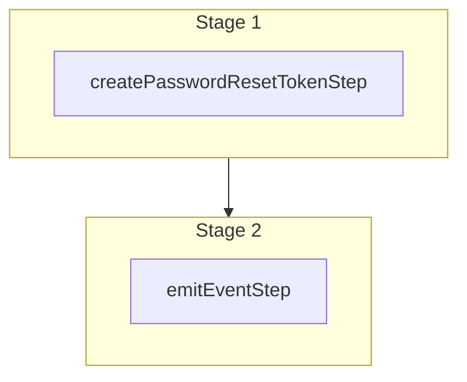

This documentation provides a reference to the `generateResetPasswordTokenWorkflow`. It belongs to the `@medusajs/medusa/core-flows` package.

This workflow generates a reset password token for a user. It's used by the
[Generate Reset Password Token for Admin](/api/admin/auth/generate-reset-password-token)
and [Generate Reset Password Token for Customer](/api/store/auth/generate-reset-password-token)
API Routes.

The workflow emits the `auth.password_reset` event, which you can listen to in
a [subscriber](/learn/fundamentals/events-and-subscribers). Follow
[this guide](/resources/commerce-modules/auth/reset-password) to learn
how to handle this event.

You can use this workflow within your customizations or your own custom workflows, allowing you to
generate reset password tokens within your custom flows.

> **Note**
>
> This is available starting from [Medusa v2.16.0](https://github.com/medusajs/medusa/releases/tag/v2.16.0).

[View source code](https://github.com/medusajs/medusa/blob/0ed927bdb7a396a8fd5f6447ed69b7b354b150d3/packages/core/core-flows/src/auth/workflows/generate-reset-password-token.ts#L47)

## Examples

**API Route**

```ts title="src/api/workflow/route.ts"
import type {
  MedusaRequest,
  MedusaResponse,
} from "@medusajs/framework/http"
import { generateResetPasswordTokenWorkflow } from "@medusajs/medusa/core-flows"

export async function POST(
  req: MedusaRequest,
  res: MedusaResponse
) {
  const { result } = await generateResetPasswordTokenWorkflow(req.scope)
    .run({
      input: {
        entityId: "example@gmail.com",
        actorType: "customer",
        provider: "emailpass",
        secret: "jwt_123" // jwt secret
      }
    })

  res.send(result)
}
```

**Subscriber**

```ts title="src/subscribers/order-placed.ts"
import {
  type SubscriberConfig,
  type SubscriberArgs,
} from "@medusajs/framework"
import { generateResetPasswordTokenWorkflow } from "@medusajs/medusa/core-flows"

export default async function handleOrderPlaced({
  event: { data },
  container,
}: SubscriberArgs < { id: string } > ) {
  const { result } = await generateResetPasswordTokenWorkflow(container)
    .run({
      input: {
        entityId: "example@gmail.com",
        actorType: "customer",
        provider: "emailpass",
        secret: "jwt_123" // jwt secret
      }
    })

  console.log(result)
}

export const config: SubscriberConfig = {
  event: "order.placed",
}
```

**Scheduled Job**

```ts title="src/jobs/message-daily.ts"
import { MedusaContainer } from "@medusajs/framework/types"
import { generateResetPasswordTokenWorkflow } from "@medusajs/medusa/core-flows"

export default async function myCustomJob(
  container: MedusaContainer
) {
  const { result } = await generateResetPasswordTokenWorkflow(container)
    .run({
      input: {
        entityId: "example@gmail.com",
        actorType: "customer",
        provider: "emailpass",
        secret: "jwt_123" // jwt secret
      }
    })

  console.log(result)
}

export const config = {
  name: "run-once-a-day",
  schedule: "0 0 * * *",
}
```

**Another Workflow**

```ts title="src/workflows/my-workflow.ts"
import { createWorkflow } from "@medusajs/framework/workflows-sdk"
import { generateResetPasswordTokenWorkflow } from "@medusajs/medusa/core-flows"

const myWorkflow = createWorkflow(
  "my-workflow",
  () => {
    const result = generateResetPasswordTokenWorkflow
      .runAsStep({
        input: {
          entityId: "example@gmail.com",
          actorType: "customer",
          provider: "emailpass",
          secret: "jwt_123" // jwt secret
        }
      })
  }
)
```

<a id="generateresetpasswordtokenworkflow-steps" />

## Steps



Stages follow the order in the workflow definition. Conditional steps run only when their condition is met. The step descriptions below include the conditions and reference links.

- [createPasswordResetTokenStep](/resources/references/medusa-workflows/steps/createPasswordResetTokenStep): Issues a single-use password reset token via the auth module. The token's `jti` is meant to be embedded in the JWT delivered to the user; the auth module stores its hash in a dedicated table so the consume side can verify and atomically delete it on first use. Issuing a new token automatically invalidates any prior password-reset tokens for the same provider identity. Compensation consumes the token (best-effort) if the workflow rolls back.
  - [emitEventStep](/resources/references/medusa-workflows/steps/emitEventStep): This step emits an event, which you can listen to in a [subscriber](/learn/fundamentals/events-and-subscribers). You can pass data to the subscriber by including it in the `data` property. The event is only emitted after the workflow has finished successfully. So, even if it's executed in the middle of the workflow, it won't actually emit the event until the workflow has completed successfully. If the workflow fails, it won't emit the event at all.

<a id="generateresetpasswordtokenworkflow-input" />

## Input

**generateResetPasswordTokenWorkflow**

- `entityId`: `string`
- `actorType`: `string`
- `provider`: `string`
- `secret`: `undefined` | `Secret`
- `jwtOptions`: `SignOptions` (optional)
- `metadata`: `Record<string, unknown>` (optional)

<a id="generateresetpasswordtokenworkflow-output" />

## Output

**generateResetPasswordTokenWorkflow**

- `string`: `string`
  - `string`: `string`

<a id="generateresetpasswordtokenworkflow-emitted-events" />

## Emitted Events

- `auth.password_reset`: Emitted when a reset password token is generated. You can listen to this event to send a reset password email to the user or customer, for example.

  ```ts
  {
    entity_id, // The identifier of the user or customer. For example, an email address.
    actor_type, // The type of actor. For example, "customer", "user", or custom.
    token, // The generated token.
    metadata, // Optional custom metadata passed from the request.
  }
  ```
