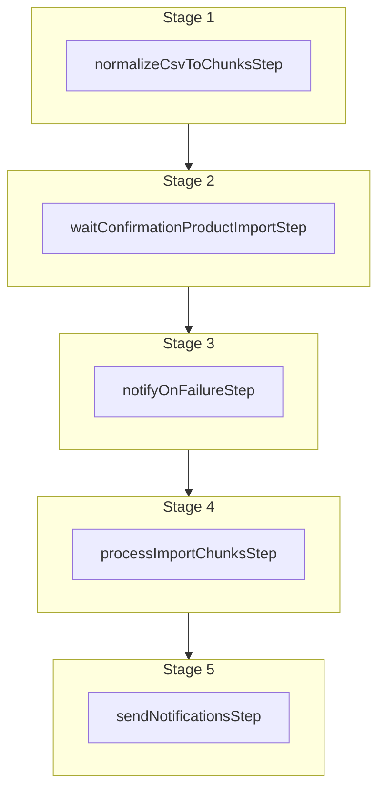

This documentation provides a reference to the `importProductsAsChunksWorkflow`. It belongs to the `@medusajs/medusa/core-flows` package.

This workflow starts a product import from a CSV file in the background. It's used by the
[Import Products Admin API Route](/api/admin/products/create-product-import).

You can use this workflow within your custom workflows, allowing you to wrap custom logic around product import.
For example, you can import products from another system.

The workflow only starts the import, but you'll have to confirm it using the [Workflow Engine](/resources/infrastructure-modules/workflow-engine).
The below example shows how to confirm the import.

[View source code](https://github.com/medusajs/medusa/blob/0ed927bdb7a396a8fd5f6447ed69b7b354b150d3/packages/core/core-flows/src/product/workflows/import-products-as-chunks.ts#L91)

## Examples

To start the import of a CSV file:

**API Route**

```ts title="src/api/workflow/route.ts"
import type {
  MedusaRequest,
  MedusaResponse,
} from "@medusajs/framework/http"
import { importProductsAsChunksWorkflow } from "@medusajs/medusa/core-flows"

export async function POST(
  req: MedusaRequest,
  res: MedusaResponse
) {
  const { result, transaction } = await importProductsAsChunksWorkflow(req
      .scope)
    .run({
      input: {
        filename: "products.csv",
        fileKey: "products.csv",
      }
    })

  res.send(result)
}
```

**Subscriber**

```ts title="src/subscribers/order-placed.ts"
import {
  type SubscriberConfig,
  type SubscriberArgs,
} from "@medusajs/framework"
import { importProductsAsChunksWorkflow } from "@medusajs/medusa/core-flows"

export default async function handleOrderPlaced({
  event: { data },
  container,
}: SubscriberArgs < { id: string } > ) {
  const { result, transaction } = await importProductsAsChunksWorkflow(
      container)
    .run({
      input: {
        filename: "products.csv",
        fileKey: "products.csv",
      }
    })

  console.log(result)
}

export const config: SubscriberConfig = {
  event: "order.placed",
}
```

**Scheduled Job**

```ts title="src/jobs/message-daily.ts"
import { MedusaContainer } from "@medusajs/framework/types"
import { importProductsAsChunksWorkflow } from "@medusajs/medusa/core-flows"

export default async function myCustomJob(
  container: MedusaContainer
) {
  const { result, transaction } = await importProductsAsChunksWorkflow(
      container)
    .run({
      input: {
        filename: "products.csv",
        fileKey: "products.csv",
      }
    })

  console.log(result)
}

export const config = {
  name: "run-once-a-day",
  schedule: "0 0 * * *",
}
```

**Another Workflow**

```ts title="src/workflows/my-workflow.ts"
import { createWorkflow } from "@medusajs/framework/workflows-sdk"
import { importProductsAsChunksWorkflow } from "@medusajs/medusa/core-flows"

const myWorkflow = createWorkflow(
  "my-workflow",
  () => {
    const { result, transaction } = importProductsAsChunksWorkflow
      .runAsStep({
        input: {
          filename: "products.csv",
          fileKey: "products.csv",
        }
      })
  }
)
```

Notice that the workflow returns a `transaction.transactionId`. You'll use this ID to confirm the import afterwards.

You confirm the import using the [Workflow Engine](/resources/infrastructure-modules/workflow-engine).
For example, in an API route:

```ts workflow={false}
import {
  AuthenticatedMedusaRequest,
  MedusaResponse,
} from "@medusajs/framework/http"
import {
  importProductsAsChunksWorkflowId,
  waitConfirmationProductImportStepId,
} from "@medusajs/core-flows"
import type { IWorkflowEngineService } from "@medusajs/framework/types"
import { Modules, TransactionHandlerType } from "@medusajs/framework/utils"
import { StepResponse } from "@medusajs/framework/workflows-sdk"

export const POST = async (
  req: AuthenticatedMedusaRequest,
  res: MedusaResponse
) => {
  const workflowEngineService: IWorkflowEngineService = req.scope.resolve(
    Modules.WORKFLOW_ENGINE
  )
  const transactionId = req.params.transaction_id

  await workflowEngineService.setStepSuccess({
    idempotencyKey: {
      action: TransactionHandlerType.INVOKE,
      transactionId,
      stepId: waitConfirmationProductImportStepId,
      workflowId: importProductsAsChunksWorkflowId,
    },
    stepResponse: new StepResponse(true),
  })

  res.status(202).json({})
}
```

> **Tip**
>
> This example API route uses the same implementation as the [Confirm Product Import Admin API Route](/api/admin/products/confirm-product-import-2).

<a id="importproductsaschunksworkflow-steps" />

## Steps



Stages follow the order in the workflow definition. Conditional steps run only when their condition is met. The step descriptions below include the conditions and reference links.

- [normalizeCsvToChunksStep](/resources/references/medusa-workflows/steps/normalizeCsvToChunksStep): This step parses a CSV file holding products to import, returning the chunks to be processed. Each chunk is written to a file using the file provider.
  - [waitConfirmationProductImportStep](/resources/references/medusa-workflows/steps/waitConfirmationProductImportStep): This step waits until a product import is confirmed. It's useful before executing the [batchProductsWorkflow](/resources/references/medusa-workflows/batchProductsWorkflow). This step is asynchronous and will make the workflow using it a [Long-Running Workflow](/learn/fundamentals/workflows/long-running-workflow).
    - [notifyOnFailureStep](/resources/references/medusa-workflows/steps/notifyOnFailureStep): This step sends one or more notification when a workflow fails. This step can be used in the beginning of a workflow so that, when the workflow fails, the step's compensation function is triggered to send the notification.
      - [processImportChunksStep](/resources/references/medusa-workflows/steps/processImportChunksStep): This step parses a CSV file holding products to import, returning the products as objects that can be imported.
        - [sendNotificationsStep](/resources/references/medusa-workflows/steps/sendNotificationsStep): This step sends one or more notifications.

<a id="importproductsaschunksworkflow-input" />

## Input

**importProductsAsChunksWorkflow**

- `fileKey`: `string`
- `filename`: `string`

<a id="importproductsaschunksworkflow-output" />

## Output

**importProductsAsChunksWorkflow**

- `ImportProductsSummary`: [ImportProductsSummary](/resources/references/types/WorkflowTypes/ProductWorkflow/interfaces/typesWorkflowTypesProductWorkflowImportProductsSummary)
  - `toCreate`: `number`
  - `toUpdate`: `number`
