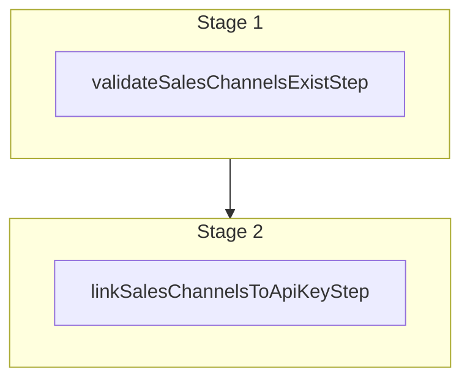

This documentation provides a reference to the `linkSalesChannelsToApiKeyWorkflow`. It belongs to the `@medusajs/medusa/core-flows` package.

This workflow manages the sales channels of a publishable API key. It's used by the
[Manage Sales Channels API Route](/api/admin/api-keys/manage-sales-channels).

You can use this workflow within your customizations or your own custom workflows, allowing you to
manage the sales channels of a publishable API key within your custom flows.

[View source code](https://github.com/medusajs/medusa/blob/0ed927bdb7a396a8fd5f6447ed69b7b354b150d3/packages/core/core-flows/src/api-key/workflows/link-sales-channels-to-publishable-key.ts#L39)

## Examples

**API Route**

```ts title="src/api/workflow/route.ts"
import type {
  MedusaRequest,
  MedusaResponse,
} from "@medusajs/framework/http"
import { linkSalesChannelsToApiKeyWorkflow } from "@medusajs/medusa/core-flows"

export async function POST(
  req: MedusaRequest,
  res: MedusaResponse
) {
  const { result } = await linkSalesChannelsToApiKeyWorkflow(req.scope)
    .run({
      input: {
        id: "apk_132",
        add: ["sc_123"],
        remove: ["sc_321"]
      }
    })

  res.send(result)
}
```

**Subscriber**

```ts title="src/subscribers/order-placed.ts"
import {
  type SubscriberConfig,
  type SubscriberArgs,
} from "@medusajs/framework"
import { linkSalesChannelsToApiKeyWorkflow } from "@medusajs/medusa/core-flows"

export default async function handleOrderPlaced({
  event: { data },
  container,
}: SubscriberArgs < { id: string } > ) {
  const { result } = await linkSalesChannelsToApiKeyWorkflow(container)
    .run({
      input: {
        id: "apk_132",
        add: ["sc_123"],
        remove: ["sc_321"]
      }
    })

  console.log(result)
}

export const config: SubscriberConfig = {
  event: "order.placed",
}
```

**Scheduled Job**

```ts title="src/jobs/message-daily.ts"
import { MedusaContainer } from "@medusajs/framework/types"
import { linkSalesChannelsToApiKeyWorkflow } from "@medusajs/medusa/core-flows"

export default async function myCustomJob(
  container: MedusaContainer
) {
  const { result } = await linkSalesChannelsToApiKeyWorkflow(container)
    .run({
      input: {
        id: "apk_132",
        add: ["sc_123"],
        remove: ["sc_321"]
      }
    })

  console.log(result)
}

export const config = {
  name: "run-once-a-day",
  schedule: "0 0 * * *",
}
```

**Another Workflow**

```ts title="src/workflows/my-workflow.ts"
import { createWorkflow } from "@medusajs/framework/workflows-sdk"
import { linkSalesChannelsToApiKeyWorkflow } from "@medusajs/medusa/core-flows"

const myWorkflow = createWorkflow(
  "my-workflow",
  () => {
    const result = linkSalesChannelsToApiKeyWorkflow
      .runAsStep({
        input: {
          id: "apk_132",
          add: ["sc_123"],
          remove: ["sc_321"]
        }
      })
  }
)
```

<a id="linksaleschannelstoapikeyworkflow-steps" />

## Steps



Stages follow the order in the workflow definition. Conditional steps run only when their condition is met. The step descriptions below include the conditions and reference links.

- [validateSalesChannelsExistStep](/resources/references/medusa-workflows/steps/validateSalesChannelsExistStep): This step validates that a sales channel exists before linking it to an API key. If the sales channel does not exist, the step throws an error.
  - [linkSalesChannelsToApiKeyStep](/resources/references/medusa-workflows/steps/linkSalesChannelsToApiKeyStep): This step manages the sales channels of a publishable API key.

<a id="linksaleschannelstoapikeyworkflow-input" />

## Input

**linkSalesChannelsToApiKeyWorkflow**

- `LinkWorkflowInput`: [LinkWorkflowInput](/resources/references/types/CommonTypes/types/typesCommonTypesLinkWorkflowInput)
  - `id`: `string` — The ID of the data model to create links to or remove links from.
  - `add`: `string`\[] (optional) — The IDs of the other data models to create links to the record specified in `id`.
  - `remove`: `string`\[] (optional) — The IDs of the other data models to remove links from the record specified in `id`.
