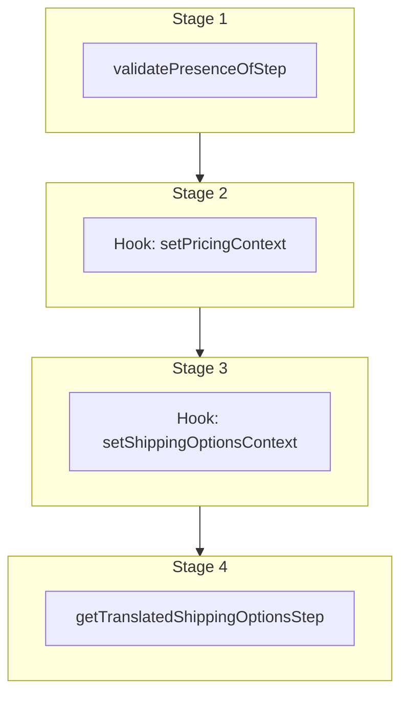

This documentation provides a reference to the `listShippingOptionsForCartWorkflow`. It belongs to the `@medusajs/medusa/core-flows` package.

This workflow lists the shipping options of a cart. It's executed by the
[List Shipping Options Store API Route](/api/store/shipping-options/list-shipping-options-for-cart).

> **Note**
>
> This workflow doesn't retrieve the calculated prices of the shipping options. If you need to retrieve the prices of the shipping options,
> use the [listShippingOptionsForCartWithPricingWorkflow](/resources/references/medusa-workflows/listShippingOptionsForCartWithPricingWorkflow) workflow.

You can use this workflow within your own customizations or custom workflows, allowing you to wrap custom logic around to retrieve the shipping options of a cart
in your custom flows.

[View source code](https://github.com/medusajs/medusa/blob/0ed927bdb7a396a8fd5f6447ed69b7b354b150d3/packages/core/core-flows/src/cart/workflows/list-shipping-options-for-cart.ts#L146)

## Examples

**API Route**

```ts title="src/api/workflow/route.ts"
import type {
  MedusaRequest,
  MedusaResponse,
} from "@medusajs/framework/http"
import { listShippingOptionsForCartWorkflow } from "@medusajs/medusa/core-flows"

export async function POST(
  req: MedusaRequest,
  res: MedusaResponse
) {
  const { result } = await listShippingOptionsForCartWorkflow(req.scope)
    .run({
      input: {
        cart_id: "cart_123",
        option_ids: ["so_123"]
      }
    })

  res.send(result)
}
```

**Subscriber**

```ts title="src/subscribers/order-placed.ts"
import {
  type SubscriberConfig,
  type SubscriberArgs,
} from "@medusajs/framework"
import { listShippingOptionsForCartWorkflow } from "@medusajs/medusa/core-flows"

export default async function handleOrderPlaced({
  event: { data },
  container,
}: SubscriberArgs < { id: string } > ) {
  const { result } = await listShippingOptionsForCartWorkflow(container)
    .run({
      input: {
        cart_id: "cart_123",
        option_ids: ["so_123"]
      }
    })

  console.log(result)
}

export const config: SubscriberConfig = {
  event: "order.placed",
}
```

**Scheduled Job**

```ts title="src/jobs/message-daily.ts"
import { MedusaContainer } from "@medusajs/framework/types"
import { listShippingOptionsForCartWorkflow } from "@medusajs/medusa/core-flows"

export default async function myCustomJob(
  container: MedusaContainer
) {
  const { result } = await listShippingOptionsForCartWorkflow(container)
    .run({
      input: {
        cart_id: "cart_123",
        option_ids: ["so_123"]
      }
    })

  console.log(result)
}

export const config = {
  name: "run-once-a-day",
  schedule: "0 0 * * *",
}
```

**Another Workflow**

```ts title="src/workflows/my-workflow.ts"
import { createWorkflow } from "@medusajs/framework/workflows-sdk"
import { listShippingOptionsForCartWorkflow } from "@medusajs/medusa/core-flows"

const myWorkflow = createWorkflow(
  "my-workflow",
  () => {
    const result = listShippingOptionsForCartWorkflow
      .runAsStep({
        input: {
          cart_id: "cart_123",
          option_ids: ["so_123"]
        }
      })
  }
)
```

<a id="listshippingoptionsforcartworkflow-steps" />

## Steps



Stages follow the order in the workflow definition. Conditional steps run only when their condition is met. The step descriptions below include the conditions and reference links.

- [validatePresenceOfStep](/resources/references/medusa-workflows/steps/validatePresenceOfStep): This step validates the presence of attributes on an object
  - [setPricingContext](/resources/references/medusa-workflows/listShippingOptionsForCartWorkflow#setpricingcontext): This hook is executed after the order is retrieved and before the line items are created. You can consume this hook to return any custom context useful for the prices retrieval of the variants to be added to the order. For example, assuming you have the following custom pricing rule: `json { "attribute": "location_id", "operator": "eq", "value": "sloc_123", } ` You can consume the `setPricingContext` hook to add the `location_id` context to the prices calculation: `ts import { addOrderLineItemsWorkflow } from "@medusajs/medusa/core-flows"; import { StepResponse } from "@medusajs/workflows-sdk"; addOrderLineItemsWorkflow.hooks.setPricingContext(( { order, variantIds, region, customerData, additional_data }, { container } ) => { return new StepResponse({ location_id: "sloc_123", // Special price for in-store purchases }); }); ` The variants' prices will now be retrieved using the context you return. :::note Learn more about prices calculation context in the [Prices Calculation](/resources/commerce-modules/pricing/price-calculation) documentation. :::
    - [setShippingOptionsContext](/resources/references/medusa-workflows/listShippingOptionsForCartWorkflow#setshippingoptionscontext)
      - [getTranslatedShippingOptionsStep](/resources/references/medusa-workflows/steps/getTranslatedShippingOptionsStep): This step applies translations to a list of shipping options based on the provided locale. It modifies the shipping options in place and returns them.

<a id="listshippingoptionsforcartworkflow-input" />

## Input

**listShippingOptionsForCartWorkflow**

- `ListShippingOptionsForCartWorkflowInput & AdditionalData`: [ListShippingOptionsForCartWorkflowInput](/resources/references/types/types/typesListShippingOptionsForCartWorkflowInput) & [AdditionalData](/resources/references/types/HttpTypes/types/typesHttpTypesAdditionalData)
  - `ListShippingOptionsForCartWorkflowInput`: [ListShippingOptionsForCartWorkflowInput](/resources/references/types/types/typesListShippingOptionsForCartWorkflowInput) — The context for retrieving the shipping options.
    - `cart_id`: `string` — The cart's ID.
    - `option_ids`: `string`\[] (optional) — Specify the shipping options to retrieve their details. If not specified, all applicable shipping options are retrieved.
    - `fields`: `string`\[] (optional) — The fields and relations to retrieve in the shipping option. These fields are passed to [Query](/learn/fundamentals/module-links/query), so you can pass names of custom models linked to the shipping option.
    - `is_return`: `boolean` (optional, default: false) — Whether to retrieve return shipping options. By default, non-return shipping options are retrieved.
    - `enabled_in_store`: `boolean` (optional, default: true) — Whether to retrieve the shipping option's enabled in the store, which is the default.
  - `AdditionalData`: [AdditionalData](/resources/references/types/HttpTypes/types/typesHttpTypesAdditionalData)
    - `additional_data`: `Record<string, unknown>` (optional) — Additional data that can be passed through the `additional_data` property in HTTP requests. Learn more in [this documentation](/learn/fundamentals/api-routes/additional-data).

<a id="listshippingoptionsforcartworkflow-output" />

## Output

**listShippingOptionsForCartWorkflow**

- `any[]`: `any`\[]
  - `any`: `any`

## Hooks

Hooks allow you to inject custom functionalities into the workflow. You'll receive data from the workflow, as well as additional data sent through an HTTP request.

Learn more about [Hooks](/learn/fundamentals/workflows/workflow-hooks) and [Additional Data](/learn/fundamentals/api-routes/additional-data).

### setPricingContext

This hook is executed before the shipping options are retrieved. You can consume this hook to return any custom context useful for the prices retrieval of shipping options.

For example, assuming you have the following custom pricing rule:

```json
{
  "attribute": "location_id",
  "operator": "eq",
  "value": "sloc_123",
}
```

You can consume the `setPricingContext` hook to add the `location_id` context to the prices calculation:

```ts
import { listShippingOptionsForCartWorkflow } from "@medusajs/medusa/core-flows";
import { StepResponse } from "@medusajs/workflows-sdk";

listShippingOptionsForCartWorkflow.hooks.setPricingContext((
  { cart, fulfillmentSetIds, additional_data }, { container }
) => {
  return new StepResponse({
    location_id: "sloc_123", // Special price for in-store purchases
  });
});
```

The shipping options' prices will now be retrieved using the context you return.

> **Note**
>
> Learn more about prices calculation context in the [Prices Calculation](/resources/commerce-modules/pricing/price-calculation) documentation.

#### Example

```ts
import { listShippingOptionsForCartWorkflow } from "@medusajs/medusa/core-flows"

listShippingOptionsForCartWorkflow.hooks.setPricingContext(
  (async ({ cart, fulfillmentSetIds, additional_data }, { container }) => {
    //TODO
  })
)
```

<a id="input" />

#### Input

Handlers consuming this hook accept the following input.

**setPricingContext**

- `input`: object — The input data for the hook.
  - `cart`: `any`
  - `fulfillmentSetIds`: `string`\[]
  - `additional_data`: `Record<string, unknown> | undefined` — Additional data that can be passed through the `additional_data` property in HTTP requests. Learn more in [this documentation](/learn/fundamentals/api-routes/additional-data).

### setShippingOptionsContext

This hook is executed after the cart is retrieved and before the shipping options are queried. You can consume this hook to return any custom context useful for the shipping options retrieval.

For example, you can consume the hook to add the customer Id to the context:

```ts
import { listShippingOptionsForCartWithPricingWorkflow } from "@medusajs/medusa/core-flows"
import { StepResponse } from "@medusajs/workflows-sdk"

listShippingOptionsForCartWithPricingWorkflow.hooks.setShippingOptionsContext(
  async ({ cart }, { container }) => {

    if (cart.customer_id) {
      return new StepResponse({
        customer_id: cart.customer_id,
      })
    }

    const query = container.resolve("query")

    const { data: carts } = await query.graph({
      entity: "cart",
      filters: {
        id: cart.id,
      },
      fields: ["customer_id"],
    })

    return new StepResponse({
      customer_id: carts[0].customer_id,
    })
  }
)
```

The `customer_id` property will be added to the context along with other properties such as `is_return` and `enabled_in_store`.

> **Note**
>
> You should also consume the `setShippingOptionsContext` hook in the [listShippingOptionsForCartWithPricingWorkflow](/resources/references/medusa-workflows/listShippingOptionsForCartWithPricingWorkflow) workflow to ensure that the context is consistent when listing shipping options across workflows.

#### Example

```ts
import { listShippingOptionsForCartWorkflow } from "@medusajs/medusa/core-flows"

listShippingOptionsForCartWorkflow.hooks.setShippingOptionsContext(
  (async ({ cart, fulfillmentSetIds, additional_data }, { container }) => {
    //TODO
  })
)
```

<a id="input-1" />

#### Input

Handlers consuming this hook accept the following input.

**setShippingOptionsContext**

- `input`: object — The input data for the hook.
  - `cart`: `any`
  - `fulfillmentSetIds`: `string`\[]
  - `additional_data`: `Record<string, unknown> | undefined` — Additional data that can be passed through the `additional_data` property in HTTP requests. Learn more in [this documentation](/learn/fundamentals/api-routes/additional-data).
