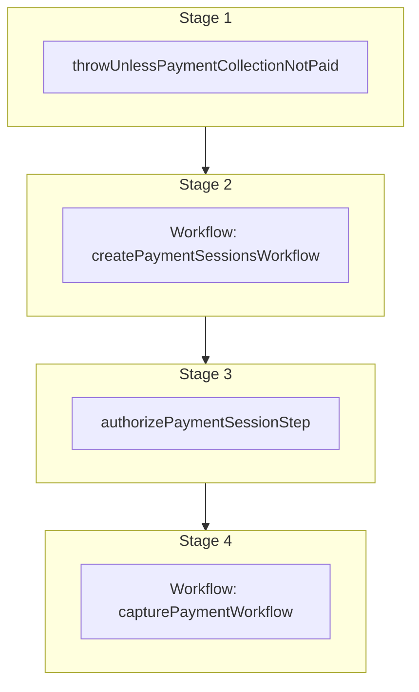

This documentation provides a reference to the `markPaymentCollectionAsPaid`. It belongs to the `@medusajs/medusa/core-flows` package.

This workflow marks a payment collection for an order as paid. It's used by the
[Mark Payment Collection as Paid Admin API Route](/api/admin/payment-collections/mark-as-paid).

You can use this workflow within your customizations or your own custom workflows, allowing you to wrap custom logic around
marking a payment collection for an order as paid.

[View source code](https://github.com/medusajs/medusa/blob/0ed927bdb7a396a8fd5f6447ed69b7b354b150d3/packages/core/core-flows/src/order/workflows/mark-payment-collection-as-paid.ts#L107)

## Examples

**API Route**

```ts title="src/api/workflow/route.ts"
import type {
  MedusaRequest,
  MedusaResponse,
} from "@medusajs/framework/http"
import { markPaymentCollectionAsPaid } from "@medusajs/medusa/core-flows"

export async function POST(
  req: MedusaRequest,
  res: MedusaResponse
) {
  const { result } = await markPaymentCollectionAsPaid(req.scope)
    .run({
      input: {
        order_id: "order_123",
        payment_collection_id: "paycol_123",
      }
    })

  res.send(result)
}
```

**Subscriber**

```ts title="src/subscribers/order-placed.ts"
import {
  type SubscriberConfig,
  type SubscriberArgs,
} from "@medusajs/framework"
import { markPaymentCollectionAsPaid } from "@medusajs/medusa/core-flows"

export default async function handleOrderPlaced({
  event: { data },
  container,
}: SubscriberArgs < { id: string } > ) {
  const { result } = await markPaymentCollectionAsPaid(container)
    .run({
      input: {
        order_id: "order_123",
        payment_collection_id: "paycol_123",
      }
    })

  console.log(result)
}

export const config: SubscriberConfig = {
  event: "order.placed",
}
```

**Scheduled Job**

```ts title="src/jobs/message-daily.ts"
import { MedusaContainer } from "@medusajs/framework/types"
import { markPaymentCollectionAsPaid } from "@medusajs/medusa/core-flows"

export default async function myCustomJob(
  container: MedusaContainer
) {
  const { result } = await markPaymentCollectionAsPaid(container)
    .run({
      input: {
        order_id: "order_123",
        payment_collection_id: "paycol_123",
      }
    })

  console.log(result)
}

export const config = {
  name: "run-once-a-day",
  schedule: "0 0 * * *",
}
```

**Another Workflow**

```ts title="src/workflows/my-workflow.ts"
import { createWorkflow } from "@medusajs/framework/workflows-sdk"
import { markPaymentCollectionAsPaid } from "@medusajs/medusa/core-flows"

const myWorkflow = createWorkflow(
  "my-workflow",
  () => {
    const result = markPaymentCollectionAsPaid
      .runAsStep({
        input: {
          order_id: "order_123",
          payment_collection_id: "paycol_123",
        }
      })
  }
)
```

<a id="markpaymentcollectionaspaid-steps" />

## Steps



Stages follow the order in the workflow definition. Conditional steps run only when their condition is met. The step descriptions below include the conditions and reference links.

- [throwUnlessPaymentCollectionNotPaid](/resources/references/medusa-workflows/throwUnlessPaymentCollectionNotPaid): This step validates that the payment collection is not paid. If not valid, the step will throw an error. :::note You can retrieve a payment collection's details using [Query](/learn/fundamentals/module-links/query), or [useQueryGraphStep](/resources/references/medusa-workflows/steps/useQueryGraphStep). :::
  - [createPaymentSessionsWorkflow](/resources/references/medusa-workflows/createPaymentSessionsWorkflow): Create payment sessions.
    - [authorizePaymentSessionStep](/resources/references/medusa-workflows/steps/authorizePaymentSessionStep): This step authorizes a payment session.
      - [capturePaymentWorkflow](/resources/references/medusa-workflows/capturePaymentWorkflow): Capture a payment.

<a id="markpaymentcollectionaspaid-input" />

## Input

**markPaymentCollectionAsPaid**

- `MarkPaymentCollectionAsPaidInput`: [MarkPaymentCollectionAsPaidInput](/resources/references/core_flows/core_core_flows_src/types/core_flowscore_core_flows_srcMarkPaymentCollectionAsPaidInput)
  - `payment_collection_id`: `string` — The ID of the payment collection to mark as paid.
  - `order_id`: `string` — The ID of the order that the payment collection belongs to.
  - `captured_by`: `string` (optional) — The ID of the user marking the payment collection as completed.
  - `provider_id`: `string` (optional) — The ID of the payment provider to record the captured payment under. Useful when the payment was collected through a specific provider (for example a POS or cash provider) rather than the system default. Defaults to the system (manual) payment provider when omitted, preserving the previous behavior.

<a id="markpaymentcollectionaspaid-output" />

## Output

**markPaymentCollectionAsPaid**

- `null \| PaymentDTO`: `null` | [PaymentDTO](/resources/references/payment/interfaces/paymentPaymentDTO)
  - `null \| PaymentDTO`: `null` | [PaymentDTO](/resources/references/payment/interfaces/paymentPaymentDTO)

<a id="markpaymentcollectionaspaid-emitted-events" />

## Emitted Events

- `payment.captured`: Emitted when a payment is captured.

  ```ts
  {
    id, // the ID of the payment
  }
  ```
