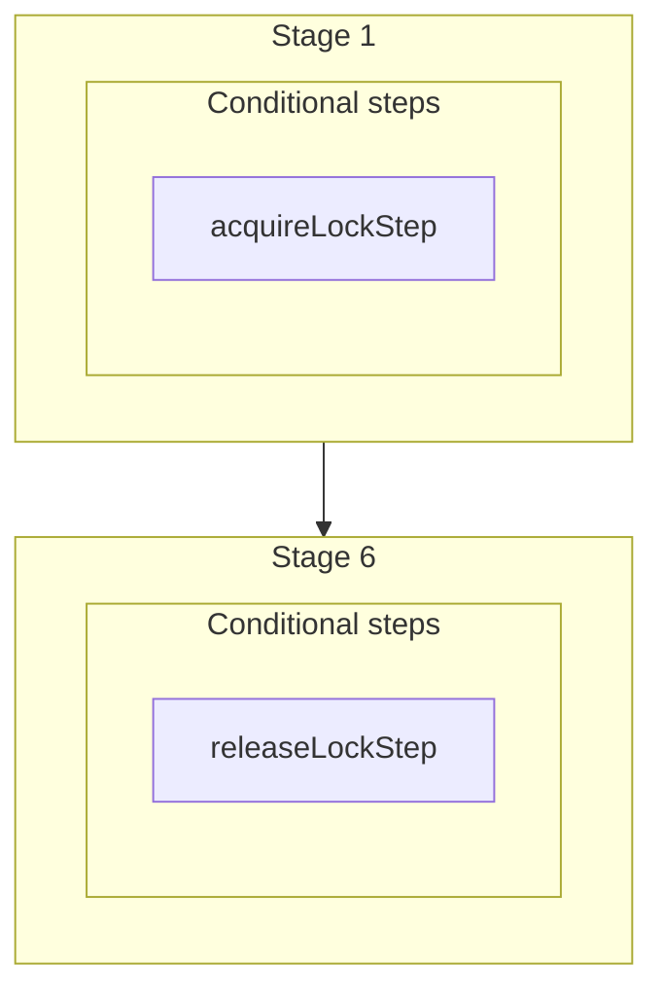

This documentation provides a reference to the `processPaymentWorkflow`. It belongs to the `@medusajs/medusa/core-flows` package.

This workflow processes a payment to either complete its associated cart,
capture the payment, or authorize the payment session. It's used when a
[Webhook Event is received](/resources/commerce-modules/payment/webhook-events).

You can use this workflow within your own customizations or custom workflows, allowing you
to process a payment in your custom flows based on a webhook action.

> **Note**
>
> If you use this workflow in another, you must acquire a lock before running it and release the lock after. Learn more in the [Locking Operations in Workflows](/learn/fundamentals/workflows/locks#locks-in-nested-workflows) guide.

[View source code](https://github.com/medusajs/medusa/blob/0ed927bdb7a396a8fd5f6447ed69b7b354b150d3/packages/core/core-flows/src/payment/workflows/process-payment.ts#L43)

## Examples

**API Route**

```ts title="src/api/workflow/route.ts"
import type {
  MedusaRequest,
  MedusaResponse,
} from "@medusajs/framework/http"
import { processPaymentWorkflow } from "@medusajs/medusa/core-flows"

export async function POST(
  req: MedusaRequest,
  res: MedusaResponse
) {
  const { result } = await processPaymentWorkflow(req.scope)
    .run({
      input: {
        action: "captured",
        data: {
          session_id: "payses_123",
          amount: 10
        }
      }
    })

  res.send(result)
}
```

**Subscriber**

```ts title="src/subscribers/order-placed.ts"
import {
  type SubscriberConfig,
  type SubscriberArgs,
} from "@medusajs/framework"
import { processPaymentWorkflow } from "@medusajs/medusa/core-flows"

export default async function handleOrderPlaced({
  event: { data },
  container,
}: SubscriberArgs < { id: string } > ) {
  const { result } = await processPaymentWorkflow(container)
    .run({
      input: {
        action: "captured",
        data: {
          session_id: "payses_123",
          amount: 10
        }
      }
    })

  console.log(result)
}

export const config: SubscriberConfig = {
  event: "order.placed",
}
```

**Scheduled Job**

```ts title="src/jobs/message-daily.ts"
import { MedusaContainer } from "@medusajs/framework/types"
import { processPaymentWorkflow } from "@medusajs/medusa/core-flows"

export default async function myCustomJob(
  container: MedusaContainer
) {
  const { result } = await processPaymentWorkflow(container)
    .run({
      input: {
        action: "captured",
        data: {
          session_id: "payses_123",
          amount: 10
        }
      }
    })

  console.log(result)
}

export const config = {
  name: "run-once-a-day",
  schedule: "0 0 * * *",
}
```

**Another Workflow**

```ts title="src/workflows/my-workflow.ts"
import { createWorkflow } from "@medusajs/framework/workflows-sdk"
import { processPaymentWorkflow } from "@medusajs/medusa/core-flows"

const myWorkflow = createWorkflow(
  "my-workflow",
  () => {
    // Acquire lock from nested workflow here
    // acquireLockStep({  key: cartId,  timeout: THIRTY_SECONDS,  ttl: TWO_MINUTES,  })
    const result = processPaymentWorkflow
      .runAsStep({
        input: {
          action: "captured",
          data: {
            session_id: "payses_123",
            amount: 10
          }
        }
      })
    // Release lock here
    // releaseLockStep({ key: cartId })
  }
)
```

<a id="processpaymentworkflow-steps" />

## Steps



Stages follow the order in the workflow definition. Conditional steps run only when their condition is met. The step descriptions below include the conditions and reference links.

- **when** (when: \{
  return !!cartId
  })
- [acquireLockStep](/resources/references/medusa-workflows/steps/acquireLockStep): This step acquires a lock for a given key. Learn more about locks in the [Locking Module](/resources/infrastructure-modules/locking) guide.
  \- **when** (when: \{
  return !!cartId
  })
  \- [releaseLockStep](/resources/references/medusa-workflows/steps/releaseLockStep): This step releases a lock for a given key. Learn more about locks in the [Locking Module](/resources/infrastructure-modules/locking) guide.

<a id="processpaymentworkflow-input" />

## Input

**processPaymentWorkflow**

- `ProcessPaymentWorkflowInput`: [ProcessPaymentWorkflowInput](/resources/references/core_flows/core_core_flows_src/interfaces/core_flowscore_core_flows_srcProcessPaymentWorkflowInput)
  - `action`: [PaymentActions](/resources/references/types/types/typesPaymentActions) — The action that was performed so that Medusa can handle it internally.
  - `data`: [WebhookActionData](/resources/references/types/interfaces/typesWebhookActionData) (optional) — The webhook action's details.
    - `session_id`: `string` — The ID of the payment session in Medusa. Make sure to store this ID in the third-party payment provider to be able to retrieve the payment session later.
    - `amount`: [BigNumberValue](/resources/references/types/types/typesBigNumberValue) — The amount to be captured or authorized (based on the action's type.)
      - `numeric`: `number`
      - `raw`: [BigNumberRawValue](/resources/references/types/types/typesBigNumberRawValue) (optional)
      - `bigNumber`: `BigNumber` (optional)

<a id="processpaymentworkflow-emitted-events" />

## Emitted Events

- `payment.captured`: Emitted when a payment is captured.

  ```ts
  {
    id, // the ID of the payment
  }
  ```
