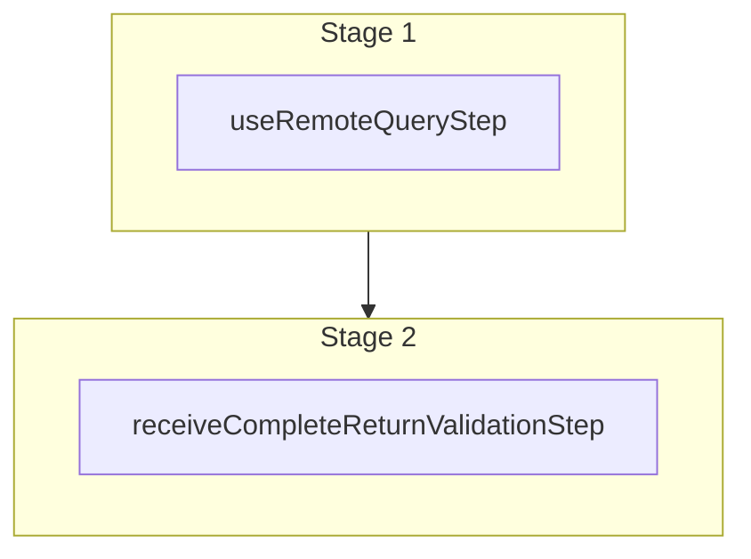

This documentation provides a reference to the `receiveAndCompleteReturnOrderWorkflow`. It belongs to the `@medusajs/medusa/core-flows` package.

This workflow marks a return as received and completes it.

You can use this workflow within your customizations or your own custom workflows, allowing you
to receive and complete a return.

[View source code](https://github.com/medusajs/medusa/blob/0ed927bdb7a396a8fd5f6447ed69b7b354b150d3/packages/core/core-flows/src/order/workflows/return/receive-complete-return.ts#L95)

## Examples

**API Route**

```ts title="src/api/workflow/route.ts"
import type {
  MedusaRequest,
  MedusaResponse,
} from "@medusajs/framework/http"
import { receiveAndCompleteReturnOrderWorkflow } from "@medusajs/medusa/core-flows"

export async function POST(
  req: MedusaRequest,
  res: MedusaResponse
) {
  const { result } = await receiveAndCompleteReturnOrderWorkflow(req.scope)
    .run({
      input: {
        return_id: "return_123",
        items: [{
          id: "orli_123",
          quantity: 1,
        }]
      }
    })

  res.send(result)
}
```

**Subscriber**

```ts title="src/subscribers/order-placed.ts"
import {
  type SubscriberConfig,
  type SubscriberArgs,
} from "@medusajs/framework"
import { receiveAndCompleteReturnOrderWorkflow } from "@medusajs/medusa/core-flows"

export default async function handleOrderPlaced({
  event: { data },
  container,
}: SubscriberArgs < { id: string } > ) {
  const { result } = await receiveAndCompleteReturnOrderWorkflow(container)
    .run({
      input: {
        return_id: "return_123",
        items: [{
          id: "orli_123",
          quantity: 1,
        }]
      }
    })

  console.log(result)
}

export const config: SubscriberConfig = {
  event: "order.placed",
}
```

**Scheduled Job**

```ts title="src/jobs/message-daily.ts"
import { MedusaContainer } from "@medusajs/framework/types"
import { receiveAndCompleteReturnOrderWorkflow } from "@medusajs/medusa/core-flows"

export default async function myCustomJob(
  container: MedusaContainer
) {
  const { result } = await receiveAndCompleteReturnOrderWorkflow(container)
    .run({
      input: {
        return_id: "return_123",
        items: [{
          id: "orli_123",
          quantity: 1,
        }]
      }
    })

  console.log(result)
}

export const config = {
  name: "run-once-a-day",
  schedule: "0 0 * * *",
}
```

**Another Workflow**

```ts title="src/workflows/my-workflow.ts"
import { createWorkflow } from "@medusajs/framework/workflows-sdk"
import { receiveAndCompleteReturnOrderWorkflow } from "@medusajs/medusa/core-flows"

const myWorkflow = createWorkflow(
  "my-workflow",
  () => {
    const result = receiveAndCompleteReturnOrderWorkflow
      .runAsStep({
        input: {
          return_id: "return_123",
          items: [{
            id: "orli_123",
            quantity: 1,
          }]
        }
      })
  }
)
```

<a id="receiveandcompletereturnorderworkflow-steps" />

## Steps



Stages follow the order in the workflow definition. Conditional steps run only when their condition is met. The step descriptions below include the conditions and reference links.

- [useRemoteQueryStep](/resources/references/medusa-workflows/steps/useRemoteQueryStep): This step fetches data across modules using the remote query. Learn more in the [Remote Query documentation](/learn/fundamentals/module-links/query). :::note This step is deprecated. Use [useQueryGraphStep](/resources/references/medusa-workflows/steps/useQueryGraphStep) instead. :::
  - [receiveCompleteReturnValidationStep](/resources/references/medusa-workflows/receiveCompleteReturnValidationStep): This step validates that a return can be received and completed. If the return is canceled or the items do not exist in the return, the step will throw an error. :::note You can retrieve a return details using [Query](/learn/fundamentals/module-links/query), or [useQueryGraphStep](/resources/references/medusa-workflows/steps/useQueryGraphStep). :::

<a id="receiveandcompletereturnorderworkflow-input" />

## Input

**receiveAndCompleteReturnOrderWorkflow**

- `ReceiveCompleteOrderReturnWorkflowInput`: [ReceiveCompleteOrderReturnWorkflowInput](/resources/references/types/WorkflowTypes/OrderWorkflow/interfaces/typesWorkflowTypesOrderWorkflowReceiveCompleteOrderReturnWorkflowInput)
  - `return_id`: `string` — The ID of the return to receive and complete.
  - `created_by`: `string` (optional) — The ID of the user that's receiving and completing the return.
  - `items`: [ReceiveReturnItem](/resources/references/types/interfaces/typesReceiveReturnItem)\[] — The received items.
    - `id`: `string` — The ID of the order item to receive.
    - `quantity`: [BigNumberInput](/resources/references/types/types/typesBigNumberInput) — The quantity of the item to receive.
    - `internal_note`: `string` (optional) — An internal note viewed only by admin users.
    - `metadata`: `null` | `Record<string, any>` (optional) — Custom key-value pairs of data to store in the return item.
  - `description`: `string` (optional) — Description of the return receival.
  - `internal_note`: `string` (optional) — A note viewed by admins only related to the return receival.
  - `metadata`: `null` | `Record<string, any>` (optional) — Custom key-value pairs of data to store in the return receival.

<a id="receiveandcompletereturnorderworkflow-output" />

## Output

**receiveAndCompleteReturnOrderWorkflow**

- `undefined \| ReturnDTO`: `undefined` | [ReturnDTO](/resources/references/fulfillment/interfaces/fulfillmentReturnDTO)
  - `undefined \| ReturnDTO`: `undefined` | [ReturnDTO](/resources/references/fulfillment/interfaces/fulfillmentReturnDTO)
