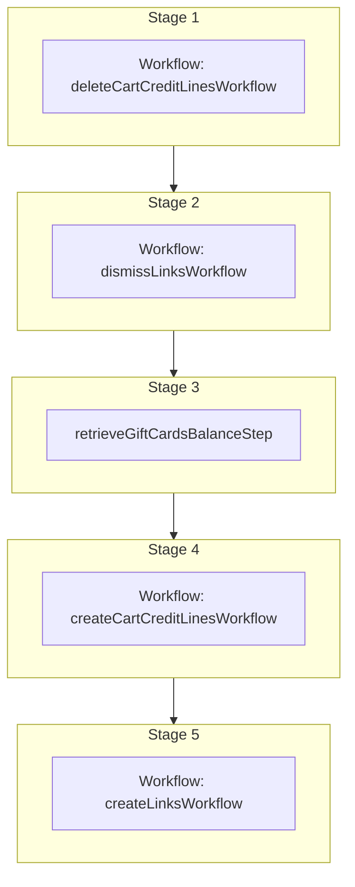

This documentation provides a reference to the `refreshCartGiftCardsWorkflow`. It belongs to the `@medusajs/medusa/core-flows` package.

This workflow refreshes the gift card credit lines on a cart. It removes existing
gift card credit lines and recreates them based on current gift card balances,
accounting for any changes to the cart total or gift card balances.

You can use this workflow within your own customizations or custom workflows,
allowing you to wrap custom logic around refreshing cart gift cards.

[View source code](https://github.com/medusajs/medusa/blob/0ed927bdb7a396a8fd5f6447ed69b7b354b150d3/packages/plugins/loyalty/src/workflows/carts/workflows/refresh-cart-gift-cards.ts#L50)

## Examples

**API Route**

```ts title="src/api/workflow/route.ts"
import type {
  MedusaRequest,
  MedusaResponse,
} from "@medusajs/framework/http"
import { refreshCartGiftCardsWorkflow } from "@medusajs/loyalty-plugin/workflows"

export async function POST(
  req: MedusaRequest,
  res: MedusaResponse
) {
  const { result } = await refreshCartGiftCardsWorkflow(req.scope)
    .run({
      input: {
        cart_id: "cart_123",
      },
    })

  res.send(result)
}
```

**Subscriber**

```ts title="src/subscribers/order-placed.ts"
import {
  type SubscriberConfig,
  type SubscriberArgs,
} from "@medusajs/framework"
import { refreshCartGiftCardsWorkflow } from "@medusajs/loyalty-plugin/workflows"

export default async function handleOrderPlaced({
  event: { data },
  container,
}: SubscriberArgs < { id: string } > ) {
  const { result } = await refreshCartGiftCardsWorkflow(container)
    .run({
      input: {
        cart_id: "cart_123",
      },
    })

  console.log(result)
}

export const config: SubscriberConfig = {
  event: "order.placed",
}
```

**Scheduled Job**

```ts title="src/jobs/message-daily.ts"
import { MedusaContainer } from "@medusajs/framework/types"
import { refreshCartGiftCardsWorkflow } from "@medusajs/loyalty-plugin/workflows"

export default async function myCustomJob(
  container: MedusaContainer
) {
  const { result } = await refreshCartGiftCardsWorkflow(container)
    .run({
      input: {
        cart_id: "cart_123",
      },
    })

  console.log(result)
}

export const config = {
  name: "run-once-a-day",
  schedule: "0 0 * * *",
}
```

**Another Workflow**

```ts title="src/workflows/my-workflow.ts"
import { createWorkflow } from "@medusajs/framework/workflows-sdk"
import { refreshCartGiftCardsWorkflow } from "@medusajs/loyalty-plugin/workflows"

const myWorkflow = createWorkflow(
  "my-workflow",
  () => {
    const result = refreshCartGiftCardsWorkflow
      .runAsStep({
        input: {
          cart_id: "cart_123",
        },
      })
  }
)
```

<a id="refreshcartgiftcardsworkflow-steps" />

## Steps



Stages follow the order in the workflow definition. Conditional steps run only when their condition is met. The step descriptions below include the conditions and reference links.

- [deleteCartCreditLinesWorkflow](/resources/references/medusa-workflows/deleteCartCreditLinesWorkflow): This workflow deletes one or more credit lines from a cart.
  - [dismissLinksWorkflow](/resources/references/medusa-workflows/dismissLinksWorkflow): Dismiss links between two records of linked data models.
    - [retrieveGiftCardsBalanceStep](/resources/references/medusa-workflows/steps/retrieveGiftCardsBalanceStep): This step retrieves the balance of gift cards from their associated store credit accounts. Returns a map of gift card codes to their account stats.
      - [createCartCreditLinesWorkflow](/resources/references/medusa-workflows/createCartCreditLinesWorkflow): This workflow creates one or more credit lines for a cart.
        - [createLinksWorkflow](/resources/references/medusa-workflows/createLinksWorkflow): Create links between two records of linked data models.

<a id="refreshcartgiftcardsworkflow-input" />

## Input

**refreshCartGiftCardsWorkflow**

- `RefreshCartGiftCardsWorkflowInput`: [RefreshCartGiftCardsWorkflowInput](/resources/references/core_flows/plugins_loyalty_src_workflows/types/core_flowsplugins_loyalty_src_workflowsRefreshCartGiftCardsWorkflowInput)
  - `cart_id`: `string` — The ID of the cart for which to refresh gift card credit lines.

<a id="refreshcartgiftcardsworkflow-output" />

## Output

**refreshCartGiftCardsWorkflow**

- `CartCreditLineDTO[]`: [CartCreditLineDTO](/resources/references/cart/interfaces/cartCartCreditLineDTO)\[]
  - `id`: `string` — The ID of the cart credit line.
  - `cart_id`: `string` — The ID of the cart that the credit line belongs to.
  - `amount`: [BigNumberValue](/resources/references/cart/types/cartBigNumberValue) — The amount of the credit line.
    - `numeric`: `number`
    - `raw`: [BigNumberRawValue](/resources/references/cart/types/cartBigNumberRawValue) (optional)
      - `value`: `string` | `number`
    - `bigNumber`: `BigNumber` (optional)
  - `raw_amount`: [BigNumberRawValue](/resources/references/cart/types/cartBigNumberRawValue) — The raw amount of the credit line.
    - `value`: `string` | `number`
  - `reference`: `null` | `string` — The reference model name that the credit line is generated from
  - `reference_id`: `null` | `string` — The reference model id that the credit line is generated from
  - `metadata`: `null` | `Record<string, unknown>` — The metadata of the cart detail
  - `created_at`: `Date` — The date when the cart credit line was created.
  - `updated_at`: `Date` — The date when the cart credit line was last updated.
