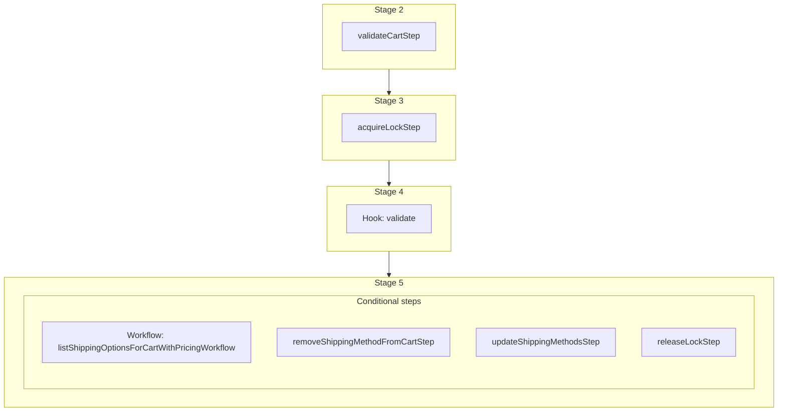

This documentation provides a reference to the `refreshCartShippingMethodsWorkflow`. It belongs to the `@medusajs/medusa/core-flows` package.

This workflow refreshes a cart's shipping methods, ensuring that their associated shipping options can still be used on the cart,
and retrieve their correct pricing after a cart update. This workflow is used by the [refreshCartItemsWorkflow](/resources/references/medusa-workflows/refreshCartItemsWorkflow).

You can use this workflow within your own customizations or custom workflows, allowing you to refresh the cart's shipping method after making updates to the cart.

> **Note**
>
> If you use this workflow in another, you must acquire a lock before running it and release the lock after. Learn more in the [Locking Operations in Workflows](/learn/fundamentals/workflows/locks#locks-in-nested-workflows) guide.

[View source code](https://github.com/medusajs/medusa/blob/0ed927bdb7a396a8fd5f6447ed69b7b354b150d3/packages/core/core-flows/src/cart/workflows/refresh-cart-shipping-methods.ts#L54)

## Examples

**API Route**

```ts title="src/api/workflow/route.ts"
import type {
  MedusaRequest,
  MedusaResponse,
} from "@medusajs/framework/http"
import { refreshCartShippingMethodsWorkflow } from "@medusajs/medusa/core-flows"

export async function POST(
  req: MedusaRequest,
  res: MedusaResponse
) {
  const { result } = await refreshCartShippingMethodsWorkflow(req.scope)
    .run({
      input: {
        cart_id: "cart_123",
      }
    })

  res.send(result)
}
```

**Subscriber**

```ts title="src/subscribers/order-placed.ts"
import {
  type SubscriberConfig,
  type SubscriberArgs,
} from "@medusajs/framework"
import { refreshCartShippingMethodsWorkflow } from "@medusajs/medusa/core-flows"

export default async function handleOrderPlaced({
  event: { data },
  container,
}: SubscriberArgs < { id: string } > ) {
  const { result } = await refreshCartShippingMethodsWorkflow(container)
    .run({
      input: {
        cart_id: "cart_123",
      }
    })

  console.log(result)
}

export const config: SubscriberConfig = {
  event: "order.placed",
}
```

**Scheduled Job**

```ts title="src/jobs/message-daily.ts"
import { MedusaContainer } from "@medusajs/framework/types"
import { refreshCartShippingMethodsWorkflow } from "@medusajs/medusa/core-flows"

export default async function myCustomJob(
  container: MedusaContainer
) {
  const { result } = await refreshCartShippingMethodsWorkflow(container)
    .run({
      input: {
        cart_id: "cart_123",
      }
    })

  console.log(result)
}

export const config = {
  name: "run-once-a-day",
  schedule: "0 0 * * *",
}
```

**Another Workflow**

```ts title="src/workflows/my-workflow.ts"
import { createWorkflow } from "@medusajs/framework/workflows-sdk"
import { refreshCartShippingMethodsWorkflow } from "@medusajs/medusa/core-flows"

const myWorkflow = createWorkflow(
  "my-workflow",
  () => {
    // Acquire lock from nested workflow here
    // acquireLockStep({  key: cart.id,  timeout: 2,  ttl: 10,  })
    const result = refreshCartShippingMethodsWorkflow
      .runAsStep({
        input: {
          cart_id: "cart_123",
        }
      })
    // Release lock here
    // releaseLockStep({ key: cart.id })
  }
)
```

<a id="refreshcartshippingmethodsworkflow-steps" />

## Steps



Stages follow the order in the workflow definition. Conditional steps run only when their condition is met. The step descriptions below include the conditions and reference links.

- [validateCartStep](/resources/references/medusa-workflows/steps/validateCartStep): This step validates a cart to ensure it exists and is not completed. If not valid, the step throws an error. :::tip You can use the [retrieveCartStep](/resources/references/medusa-workflows/steps/retrieveCartStep) to retrieve a cart's details. :::
  - [acquireLockStep](/resources/references/medusa-workflows/steps/acquireLockStep): This step acquires a lock for a given key. Learn more about locks in the [Locking Module](/resources/infrastructure-modules/locking) guide.
    - [validate](/resources/references/medusa-workflows/refreshCartShippingMethodsWorkflow#validate): This hook is executed before all operations. You can consume this hook to perform any custom validation. If validation fails, you can throw an error to stop the workflow execution.
      - **when** (when: \{
        return !!listShippingOptionsInput?.length
        })
      - [listShippingOptionsForCartWithPricingWorkflow](/resources/references/medusa-workflows/listShippingOptionsForCartWithPricingWorkflow): List a cart's shipping options with prices.
      - [removeShippingMethodFromCartStep](/resources/references/medusa-workflows/steps/removeShippingMethodFromCartStep): This step removes shipping methods from a cart.
      - [updateShippingMethodsStep](/resources/references/medusa-workflows/steps/updateShippingMethodsStep): This step updates a cart's shipping methods.
      - [releaseLockStep](/resources/references/medusa-workflows/steps/releaseLockStep): This step releases a lock for a given key. Learn more about locks in the [Locking Module](/resources/infrastructure-modules/locking) guide.

<a id="refreshcartshippingmethodsworkflow-input" />

## Input

**refreshCartShippingMethodsWorkflow**

- `RefreshCartShippingMethodsWorkflowInput & AdditionalData`: [RefreshCartShippingMethodsWorkflowInput](/resources/references/core_flows/core_core_flows_src/types/core_flowscore_core_flows_srcRefreshCartShippingMethodsWorkflowInput) & [AdditionalData](/resources/references/types/HttpTypes/types/typesHttpTypesAdditionalData)
  - `RefreshCartShippingMethodsWorkflowInput`: [RefreshCartShippingMethodsWorkflowInput](/resources/references/core_flows/core_core_flows_src/types/core_flowscore_core_flows_srcRefreshCartShippingMethodsWorkflowInput)
    - `cart_id`: `string` (optional) — The cart's ID.
    - `cart`: `any` (optional) — The Cart reference.
  - `AdditionalData`: [AdditionalData](/resources/references/types/HttpTypes/types/typesHttpTypesAdditionalData)
    - `additional_data`: `Record<string, unknown>` (optional) — Additional data that can be passed through the `additional_data` property in HTTP requests. Learn more in [this documentation](/learn/fundamentals/api-routes/additional-data).

## Hooks

Hooks allow you to inject custom functionalities into the workflow. You'll receive data from the workflow, as well as additional data sent through an HTTP request.

Learn more about [Hooks](/learn/fundamentals/workflows/workflow-hooks) and [Additional Data](/learn/fundamentals/api-routes/additional-data).

### validate

This hook is executed before all operations. You can consume this hook to perform any custom validation. If validation fails, you can throw an error to stop the workflow execution.

#### Example

```ts
import { refreshCartShippingMethodsWorkflow } from "@medusajs/medusa/core-flows"

refreshCartShippingMethodsWorkflow.hooks.validate(
  (async ({ input, cart }, { container }) => {
    //TODO
  })
)
```

<a id="input" />

#### Input

Handlers consuming this hook accept the following input.

**validate**

- `input`: object — The input data for the hook.
  - `input`: [RefreshCartShippingMethodsWorkflowInput](/resources/references/core_flows/core_core_flows_src/types/core_flowscore_core_flows_srcRefreshCartShippingMethodsWorkflowInput) & [AdditionalData](/resources/references/types/HttpTypes/types/typesHttpTypesAdditionalData)
    - `cart_id`: `string` (optional) — The cart's ID.
    - `cart`: `any` (optional) — The Cart reference.
    - `additional_data`: `Record<string, unknown>` (optional) — Additional data that can be passed through the `additional_data` property in HTTP requests. Learn more in [this documentation](/learn/fundamentals/api-routes/additional-data).
  - `cart`: `any`
