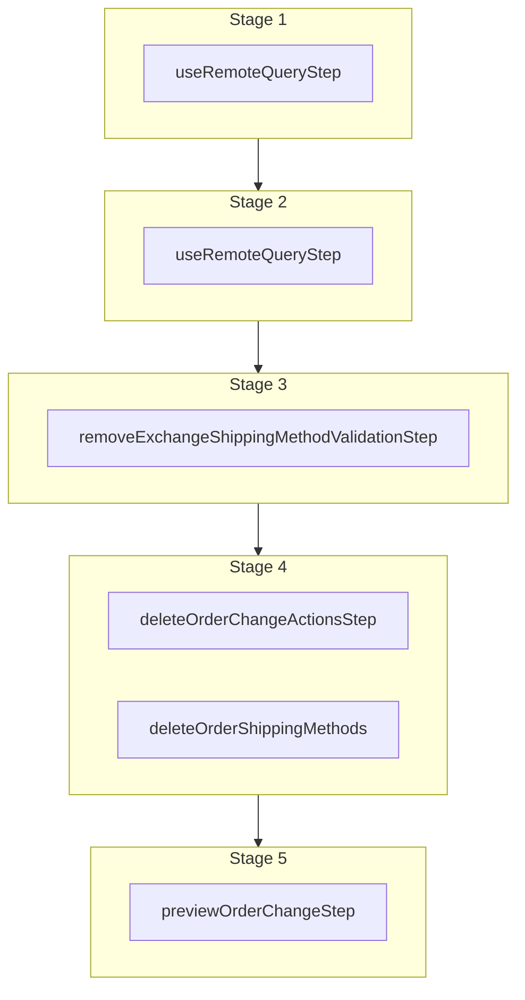

This documentation provides a reference to the `removeExchangeShippingMethodWorkflow`. It belongs to the `@medusajs/medusa/core-flows` package.

This workflow removes an inbound or outbound shipping method of an exchange. It's used by the
[Remove Inbound Shipping Admin API Route](/api/admin/exchanges/remove-inbound-shipping-method) or
the [Remove Outbound Shipping Admin API Route](/api/admin/exchanges/remove-outbound-shipping-method).

You can use this workflow within your customizations or your own custom workflows, allowing you to remove an inbound or outbound shipping method
from an exchange in your custom flow.

[View source code](https://github.com/medusajs/medusa/blob/0ed927bdb7a396a8fd5f6447ed69b7b354b150d3/packages/core/core-flows/src/order/workflows/exchange/remove-exchange-shipping-method.ts#L121)

## Examples

**API Route**

```ts title="src/api/workflow/route.ts"
import type {
  MedusaRequest,
  MedusaResponse,
} from "@medusajs/framework/http"
import { removeExchangeShippingMethodWorkflow } from "@medusajs/medusa/core-flows"

export async function POST(
  req: MedusaRequest,
  res: MedusaResponse
) {
  const { result } = await removeExchangeShippingMethodWorkflow(req.scope)
    .run({
      input: {
        exchange_id: "exchange_123",
        action_id: "orchact_123",
      }
    })

  res.send(result)
}
```

**Subscriber**

```ts title="src/subscribers/order-placed.ts"
import {
  type SubscriberConfig,
  type SubscriberArgs,
} from "@medusajs/framework"
import { removeExchangeShippingMethodWorkflow } from "@medusajs/medusa/core-flows"

export default async function handleOrderPlaced({
  event: { data },
  container,
}: SubscriberArgs < { id: string } > ) {
  const { result } = await removeExchangeShippingMethodWorkflow(container)
    .run({
      input: {
        exchange_id: "exchange_123",
        action_id: "orchact_123",
      }
    })

  console.log(result)
}

export const config: SubscriberConfig = {
  event: "order.placed",
}
```

**Scheduled Job**

```ts title="src/jobs/message-daily.ts"
import { MedusaContainer } from "@medusajs/framework/types"
import { removeExchangeShippingMethodWorkflow } from "@medusajs/medusa/core-flows"

export default async function myCustomJob(
  container: MedusaContainer
) {
  const { result } = await removeExchangeShippingMethodWorkflow(container)
    .run({
      input: {
        exchange_id: "exchange_123",
        action_id: "orchact_123",
      }
    })

  console.log(result)
}

export const config = {
  name: "run-once-a-day",
  schedule: "0 0 * * *",
}
```

**Another Workflow**

```ts title="src/workflows/my-workflow.ts"
import { createWorkflow } from "@medusajs/framework/workflows-sdk"
import { removeExchangeShippingMethodWorkflow } from "@medusajs/medusa/core-flows"

const myWorkflow = createWorkflow(
  "my-workflow",
  () => {
    const result = removeExchangeShippingMethodWorkflow
      .runAsStep({
        input: {
          exchange_id: "exchange_123",
          action_id: "orchact_123",
        }
      })
  }
)
```

<a id="removeexchangeshippingmethodworkflow-steps" />

## Steps



Stages follow the order in the workflow definition. Conditional steps run only when their condition is met. The step descriptions below include the conditions and reference links.

- [useRemoteQueryStep](/resources/references/medusa-workflows/steps/useRemoteQueryStep): This step fetches data across modules using the remote query. Learn more in the [Remote Query documentation](/learn/fundamentals/module-links/query). :::note This step is deprecated. Use [useQueryGraphStep](/resources/references/medusa-workflows/steps/useQueryGraphStep) instead. :::
  - [useRemoteQueryStep](/resources/references/medusa-workflows/steps/useRemoteQueryStep): This step fetches data across modules using the remote query. Learn more in the [Remote Query documentation](/learn/fundamentals/module-links/query). :::note This step is deprecated. Use [useQueryGraphStep](/resources/references/medusa-workflows/steps/useQueryGraphStep) instead. :::
    - [removeExchangeShippingMethodValidationStep](/resources/references/medusa-workflows/removeExchangeShippingMethodValidationStep): This step validates that a shipping method can be removed from an exchange. If the exchange is canceled, the order change is not active, the shipping method doesn't exist, or the action isn't adding a shipping method, the step will throw an error. :::note You can retrieve an order exchange and order change details using [Query](/learn/fundamentals/module-links/query), or [useQueryGraphStep](/resources/references/medusa-workflows/steps/useQueryGraphStep). :::
      - [deleteOrderChangeActionsStep](/resources/references/medusa-workflows/steps/deleteOrderChangeActionsStep): This step deletes order change actions.
      - [deleteOrderShippingMethods](/resources/references/medusa-workflows/steps/deleteOrderShippingMethods): This step deletes order shipping methods.
        - [previewOrderChangeStep](/resources/references/medusa-workflows/steps/previewOrderChangeStep): This step retrieves a preview of an order change.

<a id="removeexchangeshippingmethodworkflow-input" />

## Input

**removeExchangeShippingMethodWorkflow**

- `DeleteExchangeShippingMethodWorkflowInput`: [DeleteExchangeShippingMethodWorkflowInput](/resources/references/types/WorkflowTypes/OrderWorkflow/interfaces/typesWorkflowTypesOrderWorkflowDeleteExchangeShippingMethodWorkflowInput)
  - `exchange_id`: `string` — The ID of the exchange to delete the shipping method from.
  - `action_id`: `string` — The ID of the action associated with the shipping method to remove. Every shipping method has an `actions` property, whose value is an array of actions. You can find the action with the name `SHIPPING_ADD` using its `action` property, and use the value of its `id` property.

<a id="removeexchangeshippingmethodworkflow-output" />

## Output

**removeExchangeShippingMethodWorkflow**

- `OrderPreviewDTO`: [OrderPreviewDTO](/resources/references/order/interfaces/orderOrderPreviewDTO) — The details of an order after a change is applied on it.
  - `id`: `string` — The ID of the order.
  - `version`: `number` — The version of the order.
  - `display_id`: `number` — The order's display ID.
  - `custom_display_id`: `string` (optional) — The order's custom display ID.
  - `status`: [OrderStatus](/resources/references/order/types/orderOrderStatus) — The status of the order.
  - `region_id`: `string` (optional) — The ID of the region the order belongs to.
  - `customer_id`: `string` (optional) — The ID of the customer on the order.
  - `sales_channel_id`: `string` (optional) — The ID of the sales channel the order belongs to.
  - `email`: `string` (optional) — The email of the order.
  - `currency_code`: `string` — The currency of the order
  - `shipping_address`: [OrderAddressDTO](/resources/references/order/interfaces/orderOrderAddressDTO) (optional) — The associated shipping address.
    - `id`: `string` — The ID of the address.
    - `customer_id`: `string` (optional) — The customer ID of the address.
    - `first_name`: `string` (optional) — The first name of the address.
    - `last_name`: `string` (optional) — The last name of the address.
    - `phone`: `string` (optional) — The phone number of the address.
    - `company`: `string` (optional) — The company of the address.
    - `address_1`: `string` (optional) — The first address line of the address.
    - `address_2`: `string` (optional) — The second address line of the address.
    - `city`: `string` (optional) — The city of the address.
    - `country_code`: `string` (optional) — The country code of the address.
    - `province`: `string` (optional) — The lower-case [ISO 3166-2](https://en.wikipedia.org/wiki/ISO_3166-2) province/state of the address.
    - `postal_code`: `string` (optional) — The postal code of the address.
    - `metadata`: `null` | `Record<string, unknown>` (optional) — Holds custom data in key-value pairs.
    - `created_at`: `string` | `Date` — When the address was created.
    - `updated_at`: `string` | `Date` — When the address was updated.
  - `billing_address`: [OrderAddressDTO](/resources/references/order/interfaces/orderOrderAddressDTO) (optional) — The associated billing address.
    - `id`: `string` — The ID of the address.
    - `customer_id`: `string` (optional) — The customer ID of the address.
    - `first_name`: `string` (optional) — The first name of the address.
    - `last_name`: `string` (optional) — The last name of the address.
    - `phone`: `string` (optional) — The phone number of the address.
    - `company`: `string` (optional) — The company of the address.
    - `address_1`: `string` (optional) — The first address line of the address.
    - `address_2`: `string` (optional) — The second address line of the address.
    - `city`: `string` (optional) — The city of the address.
    - `country_code`: `string` (optional) — The country code of the address.
    - `province`: `string` (optional) — The lower-case [ISO 3166-2](https://en.wikipedia.org/wiki/ISO_3166-2) province/state of the address.
    - `postal_code`: `string` (optional) — The postal code of the address.
    - `metadata`: `null` | `Record<string, unknown>` (optional) — Holds custom data in key-value pairs.
    - `created_at`: `string` | `Date` — When the address was created.
    - `updated_at`: `string` | `Date` — When the address was updated.
  - `transactions`: [OrderTransactionDTO](/resources/references/order/interfaces/orderOrderTransactionDTO)\[] (optional) — The tramsactions associated with the order
    - `id`: `string` — The ID of the transaction
    - `order_id`: `string` — The ID of the associated order
    - `version`: `number` — The associated order version
    - `order`: [OrderDTO](/resources/references/order/interfaces/orderOrderDTO) — The associated order
    - `amount`: [BigNumberValue](/resources/references/order/types/orderBigNumberValue) — The amount of the transaction
    - `currency_code`: `string` — The currency code of the transaction
    - `reference`: `string` — The reference of the transaction
    - `reference_id`: `string` — The ID of the reference
    - `metadata`: `null` | `Record<string, unknown>` — The metadata of the transaction
    - `created_at`: `string` | `Date` — When the transaction was created
    - `updated_at`: `string` | `Date` — When the transaction was updated
  - `credit_lines`: [OrderCreditLineDTO](/resources/references/order/interfaces/orderOrderCreditLineDTO)\[] (optional) — The credit lines for an order
    - `id`: `string` — The ID of the order credit line.
    - `order_id`: `string` — The ID of the order that the credit line belongs to.
    - `order`: [OrderDTO](/resources/references/order/interfaces/orderOrderDTO) — The associated order
    - `amount`: [BigNumberValue](/resources/references/order/types/orderBigNumberValue) — The amount of the credit line.
    - `reference`: `null` | `string` — The reference model name that the credit line is generated from
    - `reference_id`: `null` | `string` — The reference model id that the credit line is generated from
    - `metadata`: `null` | `Record<string, unknown>` — The metadata of the order detail
    - `created_at`: `Date` — The date when the order credit line was created.
    - `updated_at`: `Date` — The date when the order credit line was last updated.
  - `summary`: [OrderSummaryDTO](/resources/references/order/interfaces/orderOrderSummaryDTO) (optional) — The summary of the order totals.
    - `pending_difference`: [BigNumberValue](/resources/references/order/types/orderBigNumberValue)
    - `current_order_total`: [BigNumberValue](/resources/references/order/types/orderBigNumberValue)
    - `original_order_total`: [BigNumberValue](/resources/references/order/types/orderBigNumberValue)
    - `transaction_total`: [BigNumberValue](/resources/references/order/types/orderBigNumberValue)
    - `paid_total`: [BigNumberValue](/resources/references/order/types/orderBigNumberValue)
    - `refunded_total`: [BigNumberValue](/resources/references/order/types/orderBigNumberValue)
    - `credit_line_total`: [BigNumberValue](/resources/references/order/types/orderBigNumberValue)
    - `accounting_total`: [BigNumberValue](/resources/references/order/types/orderBigNumberValue)
    - `raw_pending_difference`: [BigNumberRawValue](/resources/references/order/types/orderBigNumberRawValue)
    - `raw_current_order_total`: [BigNumberRawValue](/resources/references/order/types/orderBigNumberRawValue)
    - `raw_original_order_total`: [BigNumberRawValue](/resources/references/order/types/orderBigNumberRawValue)
    - `raw_transaction_total`: [BigNumberRawValue](/resources/references/order/types/orderBigNumberRawValue)
    - `raw_paid_total`: [BigNumberRawValue](/resources/references/order/types/orderBigNumberRawValue)
    - `raw_refunded_total`: [BigNumberRawValue](/resources/references/order/types/orderBigNumberRawValue)
    - `raw_credit_line_total`: [BigNumberRawValue](/resources/references/order/types/orderBigNumberRawValue)
    - `raw_accounting_total`: [BigNumberRawValue](/resources/references/order/types/orderBigNumberRawValue)
  - `is_draft_order`: `boolean` (optional) — Whether the order is a draft order.
  - `locale`: `string` (optional) — The locale of the order.
  - `metadata`: `null` | `Record<string, unknown>` (optional) — Holds custom data in key-value pairs.
  - `canceled_at`: `string` | `Date` (optional) — When the order was canceled.
  - `created_at`: `string` | `Date` — When the order was created.
  - `updated_at`: `string` | `Date` — When the order was updated.
  - `deleted_at`: `string` | `Date` (optional) — When the order was deleted.
  - `original_item_total`: [BigNumberValue](/resources/references/order/types/orderBigNumberValue) — The original item total of the order.
    - `numeric`: `number`
    - `raw`: [BigNumberRawValue](/resources/references/order/types/orderBigNumberRawValue) (optional)
    - `bigNumber`: `BigNumber` (optional)
  - `original_item_subtotal`: [BigNumberValue](/resources/references/order/types/orderBigNumberValue) — The original item subtotal of the order.
    - `numeric`: `number`
    - `raw`: [BigNumberRawValue](/resources/references/order/types/orderBigNumberRawValue) (optional)
    - `bigNumber`: `BigNumber` (optional)
  - `original_item_tax_total`: [BigNumberValue](/resources/references/order/types/orderBigNumberValue) — The original item tax total of the order.
    - `numeric`: `number`
    - `raw`: [BigNumberRawValue](/resources/references/order/types/orderBigNumberRawValue) (optional)
    - `bigNumber`: `BigNumber` (optional)
  - `item_total`: [BigNumberValue](/resources/references/order/types/orderBigNumberValue) — The item total of the order.
    - `numeric`: `number`
    - `raw`: [BigNumberRawValue](/resources/references/order/types/orderBigNumberRawValue) (optional)
    - `bigNumber`: `BigNumber` (optional)
  - `item_subtotal`: [BigNumberValue](/resources/references/order/types/orderBigNumberValue) — The item subtotal of the order.
    - `numeric`: `number`
    - `raw`: [BigNumberRawValue](/resources/references/order/types/orderBigNumberRawValue) (optional)
    - `bigNumber`: `BigNumber` (optional)
  - `item_tax_total`: [BigNumberValue](/resources/references/order/types/orderBigNumberValue) — The item tax total of the order.
    - `numeric`: `number`
    - `raw`: [BigNumberRawValue](/resources/references/order/types/orderBigNumberRawValue) (optional)
    - `bigNumber`: `BigNumber` (optional)
  - `item_discount_total`: [BigNumberValue](/resources/references/order/types/orderBigNumberValue) — The item discount total of the order.
    - `numeric`: `number`
    - `raw`: [BigNumberRawValue](/resources/references/order/types/orderBigNumberRawValue) (optional)
    - `bigNumber`: `BigNumber` (optional)
  - `original_total`: [BigNumberValue](/resources/references/order/types/orderBigNumberValue) — The original total of the order.
    - `numeric`: `number`
    - `raw`: [BigNumberRawValue](/resources/references/order/types/orderBigNumberRawValue) (optional)
    - `bigNumber`: `BigNumber` (optional)
  - `original_subtotal`: [BigNumberValue](/resources/references/order/types/orderBigNumberValue) — The original subtotal of the order.
    - `numeric`: `number`
    - `raw`: [BigNumberRawValue](/resources/references/order/types/orderBigNumberRawValue) (optional)
    - `bigNumber`: `BigNumber` (optional)
  - `original_tax_total`: [BigNumberValue](/resources/references/order/types/orderBigNumberValue) — The original tax total of the order.
    - `numeric`: `number`
    - `raw`: [BigNumberRawValue](/resources/references/order/types/orderBigNumberRawValue) (optional)
    - `bigNumber`: `BigNumber` (optional)
  - `total`: [BigNumberValue](/resources/references/order/types/orderBigNumberValue) — The total of the order.
    - `numeric`: `number`
    - `raw`: [BigNumberRawValue](/resources/references/order/types/orderBigNumberRawValue) (optional)
    - `bigNumber`: `BigNumber` (optional)
  - `subtotal`: [BigNumberValue](/resources/references/order/types/orderBigNumberValue) — The subtotal of the order. (Excluding taxes)
    - `numeric`: `number`
    - `raw`: [BigNumberRawValue](/resources/references/order/types/orderBigNumberRawValue) (optional)
    - `bigNumber`: `BigNumber` (optional)
  - `tax_total`: [BigNumberValue](/resources/references/order/types/orderBigNumberValue) — The tax total of the order.
    - `numeric`: `number`
    - `raw`: [BigNumberRawValue](/resources/references/order/types/orderBigNumberRawValue) (optional)
    - `bigNumber`: `BigNumber` (optional)
  - `discount_subtotal`: [BigNumberValue](/resources/references/order/types/orderBigNumberValue) — The discount subtotal of the order.
    - `numeric`: `number`
    - `raw`: [BigNumberRawValue](/resources/references/order/types/orderBigNumberRawValue) (optional)
    - `bigNumber`: `BigNumber` (optional)
  - `discount_total`: [BigNumberValue](/resources/references/order/types/orderBigNumberValue) — The discount total of the order.
    - `numeric`: `number`
    - `raw`: [BigNumberRawValue](/resources/references/order/types/orderBigNumberRawValue) (optional)
    - `bigNumber`: `BigNumber` (optional)
  - `discount_tax_total`: [BigNumberValue](/resources/references/order/types/orderBigNumberValue) — The discount tax total of the order.
    - `numeric`: `number`
    - `raw`: [BigNumberRawValue](/resources/references/order/types/orderBigNumberRawValue) (optional)
    - `bigNumber`: `BigNumber` (optional)
  - `credit_line_total`: [BigNumberValue](/resources/references/order/types/orderBigNumberValue) — The credit line total of the order.
    - `numeric`: `number`
    - `raw`: [BigNumberRawValue](/resources/references/order/types/orderBigNumberRawValue) (optional)
    - `bigNumber`: `BigNumber` (optional)
  - `gift_card_total`: [BigNumberValue](/resources/references/order/types/orderBigNumberValue) — The gift card total of the order.
    - `numeric`: `number`
    - `raw`: [BigNumberRawValue](/resources/references/order/types/orderBigNumberRawValue) (optional)
    - `bigNumber`: `BigNumber` (optional)
  - `gift_card_tax_total`: [BigNumberValue](/resources/references/order/types/orderBigNumberValue) — The gift card tax total of the order.
    - `numeric`: `number`
    - `raw`: [BigNumberRawValue](/resources/references/order/types/orderBigNumberRawValue) (optional)
    - `bigNumber`: `BigNumber` (optional)
  - `shipping_total`: [BigNumberValue](/resources/references/order/types/orderBigNumberValue) — The shipping total of the order.
    - `numeric`: `number`
    - `raw`: [BigNumberRawValue](/resources/references/order/types/orderBigNumberRawValue) (optional)
    - `bigNumber`: `BigNumber` (optional)
  - `shipping_subtotal`: [BigNumberValue](/resources/references/order/types/orderBigNumberValue) — The shipping subtotal of the order.
    - `numeric`: `number`
    - `raw`: [BigNumberRawValue](/resources/references/order/types/orderBigNumberRawValue) (optional)
    - `bigNumber`: `BigNumber` (optional)
  - `shipping_tax_total`: [BigNumberValue](/resources/references/order/types/orderBigNumberValue) — The shipping tax total of the order.
    - `numeric`: `number`
    - `raw`: [BigNumberRawValue](/resources/references/order/types/orderBigNumberRawValue) (optional)
    - `bigNumber`: `BigNumber` (optional)
  - `shipping_discount_total`: [BigNumberValue](/resources/references/order/types/orderBigNumberValue) — The shipping discount total of the order.
    - `numeric`: `number`
    - `raw`: [BigNumberRawValue](/resources/references/order/types/orderBigNumberRawValue) (optional)
    - `bigNumber`: `BigNumber` (optional)
  - `original_shipping_total`: [BigNumberValue](/resources/references/order/types/orderBigNumberValue) — The original shipping total of the order.
    - `numeric`: `number`
    - `raw`: [BigNumberRawValue](/resources/references/order/types/orderBigNumberRawValue) (optional)
    - `bigNumber`: `BigNumber` (optional)
  - `original_shipping_subtotal`: [BigNumberValue](/resources/references/order/types/orderBigNumberValue) — The original shipping subtotal of the order.
    - `numeric`: `number`
    - `raw`: [BigNumberRawValue](/resources/references/order/types/orderBigNumberRawValue) (optional)
    - `bigNumber`: `BigNumber` (optional)
  - `original_shipping_tax_total`: [BigNumberValue](/resources/references/order/types/orderBigNumberValue) — The original shipping tax total of the order.
    - `numeric`: `number`
    - `raw`: [BigNumberRawValue](/resources/references/order/types/orderBigNumberRawValue) (optional)
    - `bigNumber`: `BigNumber` (optional)
  - `raw_original_item_total`: [BigNumberRawValue](/resources/references/order/types/orderBigNumberRawValue) — The raw original item total of the order.
    - `value`: `string` | `number`
  - `raw_original_item_subtotal`: [BigNumberRawValue](/resources/references/order/types/orderBigNumberRawValue) — The raw original item subtotal of the order.
    - `value`: `string` | `number`
  - `raw_original_item_tax_total`: [BigNumberRawValue](/resources/references/order/types/orderBigNumberRawValue) — The raw original item tax total of the order.
    - `value`: `string` | `number`
  - `raw_item_total`: [BigNumberRawValue](/resources/references/order/types/orderBigNumberRawValue) — The raw item total of the order.
    - `value`: `string` | `number`
  - `raw_item_subtotal`: [BigNumberRawValue](/resources/references/order/types/orderBigNumberRawValue) — The raw item subtotal of the order.
    - `value`: `string` | `number`
  - `raw_item_tax_total`: [BigNumberRawValue](/resources/references/order/types/orderBigNumberRawValue) — The raw item tax total of the order.
    - `value`: `string` | `number`
  - `raw_original_total`: [BigNumberRawValue](/resources/references/order/types/orderBigNumberRawValue) — The raw original total of the order.
    - `value`: `string` | `number`
  - `raw_original_subtotal`: [BigNumberRawValue](/resources/references/order/types/orderBigNumberRawValue) — The raw original subtotal of the order.
    - `value`: `string` | `number`
  - `raw_original_tax_total`: [BigNumberRawValue](/resources/references/order/types/orderBigNumberRawValue) — The raw original tax total of the order.
    - `value`: `string` | `number`
  - `raw_total`: [BigNumberRawValue](/resources/references/order/types/orderBigNumberRawValue) — The raw total of the order.
    - `value`: `string` | `number`
  - `raw_subtotal`: [BigNumberRawValue](/resources/references/order/types/orderBigNumberRawValue) — The raw subtotal of the order. (Excluding taxes)
    - `value`: `string` | `number`
  - `raw_tax_total`: [BigNumberRawValue](/resources/references/order/types/orderBigNumberRawValue) — The raw tax total of the order.
    - `value`: `string` | `number`
  - `raw_discount_total`: [BigNumberRawValue](/resources/references/order/types/orderBigNumberRawValue) — The raw discount total of the order.
    - `value`: `string` | `number`
  - `raw_discount_tax_total`: [BigNumberRawValue](/resources/references/order/types/orderBigNumberRawValue) — The raw discount tax total of the order.
    - `value`: `string` | `number`
  - `raw_credit_line_total`: [BigNumberRawValue](/resources/references/order/types/orderBigNumberRawValue) — The raw credit line total of the order.
    - `value`: `string` | `number`
  - `raw_gift_card_total`: [BigNumberRawValue](/resources/references/order/types/orderBigNumberRawValue) — The raw gift card total of the order.
    - `value`: `string` | `number`
  - `raw_gift_card_tax_total`: [BigNumberRawValue](/resources/references/order/types/orderBigNumberRawValue) — The raw gift card tax total of the order.
    - `value`: `string` | `number`
  - `raw_shipping_total`: [BigNumberRawValue](/resources/references/order/types/orderBigNumberRawValue) — The raw shipping total of the order.
    - `value`: `string` | `number`
  - `raw_shipping_subtotal`: [BigNumberRawValue](/resources/references/order/types/orderBigNumberRawValue) — The raw shipping subtotal of the order.
    - `value`: `string` | `number`
  - `raw_shipping_tax_total`: [BigNumberRawValue](/resources/references/order/types/orderBigNumberRawValue) — The raw shipping tax total of the order.
    - `value`: `string` | `number`
  - `raw_original_shipping_total`: [BigNumberRawValue](/resources/references/order/types/orderBigNumberRawValue) — The raw original shipping total of the order.
    - `value`: `string` | `number`
  - `raw_original_shipping_subtotal`: [BigNumberRawValue](/resources/references/order/types/orderBigNumberRawValue) — The raw original shipping subtotal of the order.
    - `value`: `string` | `number`
  - `raw_original_shipping_tax_total`: [BigNumberRawValue](/resources/references/order/types/orderBigNumberRawValue) — The raw original shipping tax total of the order.
    - `value`: `string` | `number`
  - `order_change`: [OrderChangeDTO](/resources/references/order/interfaces/orderOrderChangeDTO) — The details of the changes made on the order.
    - `id`: `string` — The ID of the order change
    - `version`: `number` — The version of the order change
    - `change_type`: `"return"` | `"exchange"` | `"claim"` | `"edit"` | `"transfer"` (optional) — The type of the order change
    - `carry_over_promotions`: `null` | `boolean` (optional) — Whether to carry over promotions (apply promotions to outbound exchange items).
    - `no_notification`: `null` | `boolean` (optional) — Whether the customer shouldn't be notified of the order change.
    - `order_id`: `string` — The ID of the associated order
    - `return_id`: `string` — The ID of the associated return order
    - `exchange_id`: `string` — The ID of the associated exchange order
    - `claim_id`: `string` — The ID of the associated claim order
    - `order`: [OrderDTO](/resources/references/order/interfaces/orderOrderDTO) — The associated order
    - `return_order`: [ReturnDTO](/resources/references/order/interfaces/orderReturnDTO) — The associated return order
    - `exchange`: [OrderExchangeDTO](/resources/references/order/interfaces/orderOrderExchangeDTO) — The associated exchange order
    - `claim`: [OrderClaimDTO](/resources/references/order/interfaces/orderOrderClaimDTO) — The associated claim order
    - `actions`: [OrderChangeActionDTO](/resources/references/order/interfaces/orderOrderChangeActionDTO)\[] — The actions of the order change
    - `status`: [OrderChangeStatus](/resources/references/order/types/orderOrderChangeStatus) — The status of the order change
    - `requested_by`: `null` | `string` — The requested by of the order change
    - `requested_at`: `null` | `string` | `Date` — When the order change was requested
    - `confirmed_by`: `null` | `string` — The confirmed by of the order change
    - `confirmed_at`: `null` | `string` | `Date` — When the order change was confirmed
    - `declined_by`: `null` | `string` — The declined by of the order change
    - `declined_reason`: `null` | `string` — The declined reason of the order change
    - `metadata`: `null` | `Record<string, unknown>` — The metadata of the order change
    - `declined_at`: `null` | `string` | `Date` — When the order change was declined
    - `canceled_by`: `null` | `string` — The canceled by of the order change
    - `canceled_at`: `null` | `string` | `Date` — When the order change was canceled
    - `created_at`: `string` | `Date` — When the order change was created
    - `updated_at`: `string` | `Date` — When the order change was updated
  - `items`: [OrderLineItemDTO](/resources/references/order/interfaces/orderOrderLineItemDTO) & `object`\[] — The items of the order, along with changes on the items.
  - `shipping_methods`: [OrderShippingMethodDTO](/resources/references/order/interfaces/orderOrderShippingMethodDTO) & `object`\[] — The shipping methods of the order, along with changes on the shipping methods.
  - `return_requested_total`: `number` — The total amount for the requested return.
