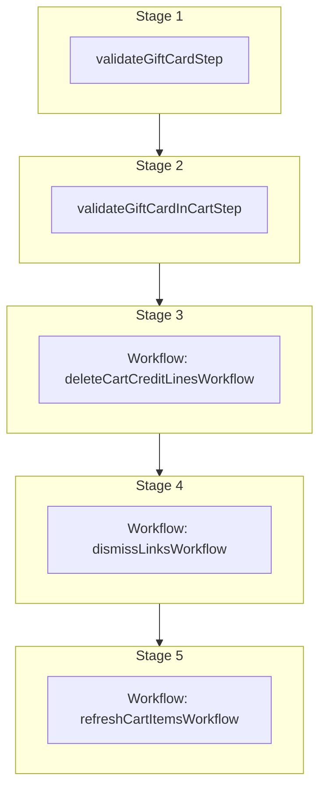

This documentation provides a reference to the `removeGiftCardFromCartWorkflow`. It belongs to the `@medusajs/medusa/core-flows` package.

This workflow removes a gift card from a cart by deleting its associated credit
lines, dismissing the links between the cart and the gift card, and refreshing
the cart items.

You can use this workflow within your own customizations or custom workflows,
allowing you to wrap custom logic around removing gift cards from carts.

[View source code](https://github.com/medusajs/medusa/blob/0ed927bdb7a396a8fd5f6447ed69b7b354b150d3/packages/plugins/loyalty/src/workflows/carts/workflows/remove-gift-cart-from-cart.ts#L156)

## Examples

**API Route**

```ts title="src/api/workflow/route.ts"
import type {
  MedusaRequest,
  MedusaResponse,
} from "@medusajs/framework/http"
import { removeGiftCardFromCartWorkflow } from "@medusajs/loyalty-plugin/workflows"

export async function POST(
  req: MedusaRequest,
  res: MedusaResponse
) {
  await removeGiftCardFromCartWorkflow(req.scope)
    .run({
      input: {
        code: "GC-XXXX-XXXX",
        cart_id: "cart_123",
      },
    })

  res.send(result)
}
```

**Subscriber**

```ts title="src/subscribers/order-placed.ts"
import {
  type SubscriberConfig,
  type SubscriberArgs,
} from "@medusajs/framework"
import { removeGiftCardFromCartWorkflow } from "@medusajs/loyalty-plugin/workflows"

export default async function handleOrderPlaced({
  event: { data },
  container,
}: SubscriberArgs < { id: string } > ) {
  await removeGiftCardFromCartWorkflow(container)
    .run({
      input: {
        code: "GC-XXXX-XXXX",
        cart_id: "cart_123",
      },
    })

  console.log(result)
}

export const config: SubscriberConfig = {
  event: "order.placed",
}
```

**Scheduled Job**

```ts title="src/jobs/message-daily.ts"
import { MedusaContainer } from "@medusajs/framework/types"
import { removeGiftCardFromCartWorkflow } from "@medusajs/loyalty-plugin/workflows"

export default async function myCustomJob(
  container: MedusaContainer
) {
  await removeGiftCardFromCartWorkflow(container)
    .run({
      input: {
        code: "GC-XXXX-XXXX",
        cart_id: "cart_123",
      },
    })

  console.log(result)
}

export const config = {
  name: "run-once-a-day",
  schedule: "0 0 * * *",
}
```

**Another Workflow**

```ts title="src/workflows/my-workflow.ts"
import { createWorkflow } from "@medusajs/framework/workflows-sdk"
import { removeGiftCardFromCartWorkflow } from "@medusajs/loyalty-plugin/workflows"

const myWorkflow = createWorkflow(
  "my-workflow",
  () => {
    removeGiftCardFromCartWorkflow
      .runAsStep({
        input: {
          code: "GC-XXXX-XXXX",
          cart_id: "cart_123",
        },
      })
  }
)
```

<a id="removegiftcardfromcartworkflow-steps" />

## Steps



Stages follow the order in the workflow definition. Conditional steps run only when their condition is met. The step descriptions below include the conditions and reference links.

- [validateGiftCardStep](/resources/references/medusa-workflows/validateGiftCardStep): This step validates that a gift card code exists in the cart and that the gift card itself exists. It throws an error if the gift card code is not in the cart or if the gift card record is not found.
  - [validateGiftCardInCartStep](/resources/references/medusa-workflows/validateGiftCardInCartStep): This step validates that a gift card is present in a cart. It throws an error if the gift card is not found in the cart's gift cards.
    - [deleteCartCreditLinesWorkflow](/resources/references/medusa-workflows/deleteCartCreditLinesWorkflow): This workflow deletes one or more credit lines from a cart.
      - [dismissLinksWorkflow](/resources/references/medusa-workflows/dismissLinksWorkflow): Dismiss links between two records of linked data models.
        - [refreshCartItemsWorkflow](/resources/references/medusa-workflows/refreshCartItemsWorkflow): Refresh a cart's details after an update.

<a id="removegiftcardfromcartworkflow-input" />

## Input

**removeGiftCardFromCartWorkflow**

- `RemoveGiftCardFromCartWorkflowInput`: [RemoveGiftCardFromCartWorkflowInput](/resources/references/core_flows/plugins_loyalty_src_workflows/interfaces/core_flowsplugins_loyalty_src_workflowsRemoveGiftCardFromCartWorkflowInput)
  - `code`: `string` — The code of the gift card to remove.
  - `cart_id`: `string` — The ID of the cart to remove the gift card from.
