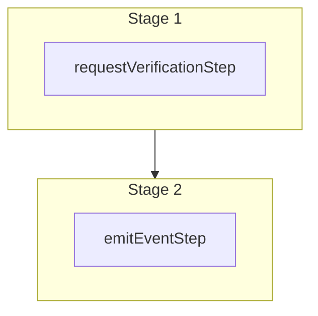

This documentation provides a reference to the `requestVerificationWorkflow`. It belongs to the `@medusajs/medusa/core-flows` package.

This workflow requests authentication verification.

> **Note**
>
> This is available starting from [Medusa v2.15.5](https://github.com/medusajs/medusa/releases/tag/v2.15.5).

[View source code](https://github.com/medusajs/medusa/blob/0ed927bdb7a396a8fd5f6447ed69b7b354b150d3/packages/core/core-flows/src/auth/workflows/request-verification.ts#L24)

## Examples

**API Route**

```ts title="src/api/workflow/route.ts"
import type {
  MedusaRequest,
  MedusaResponse,
} from "@medusajs/framework/http"
import { requestVerificationWorkflow } from "@medusajs/medusa/core-flows"

export async function POST(
  req: MedusaRequest,
  res: MedusaResponse
) {
  const { result } = await requestVerificationWorkflow(req.scope)
    .run({
      input: {
        "entity_id": "{value}",
        "auth_identity_id": "{value}",
        "entity_type": "{value}",
        "code_provider": "{value}"
      }
    })

  res.send(result)
}
```

**Subscriber**

```ts title="src/subscribers/order-placed.ts"
import {
  type SubscriberConfig,
  type SubscriberArgs,
} from "@medusajs/framework"
import { requestVerificationWorkflow } from "@medusajs/medusa/core-flows"

export default async function handleOrderPlaced({
  event: { data },
  container,
}: SubscriberArgs < { id: string } > ) {
  const { result } = await requestVerificationWorkflow(container)
    .run({
      input: {
        "entity_id": "{value}",
        "auth_identity_id": "{value}",
        "entity_type": "{value}",
        "code_provider": "{value}"
      }
    })

  console.log(result)
}

export const config: SubscriberConfig = {
  event: "order.placed",
}
```

**Scheduled Job**

```ts title="src/jobs/message-daily.ts"
import { MedusaContainer } from "@medusajs/framework/types"
import { requestVerificationWorkflow } from "@medusajs/medusa/core-flows"

export default async function myCustomJob(
  container: MedusaContainer
) {
  const { result } = await requestVerificationWorkflow(container)
    .run({
      input: {
        "entity_id": "{value}",
        "auth_identity_id": "{value}",
        "entity_type": "{value}",
        "code_provider": "{value}"
      }
    })

  console.log(result)
}

export const config = {
  name: "run-once-a-day",
  schedule: "0 0 * * *",
}
```

**Another Workflow**

```ts title="src/workflows/my-workflow.ts"
import { createWorkflow } from "@medusajs/framework/workflows-sdk"
import { requestVerificationWorkflow } from "@medusajs/medusa/core-flows"

const myWorkflow = createWorkflow(
  "my-workflow",
  () => {
    const result = requestVerificationWorkflow
      .runAsStep({
        input: {
          "entity_id": "{value}",
          "auth_identity_id": "{value}",
          "entity_type": "{value}",
          "code_provider": "{value}"
        }
      })
  }
)
```

<a id="requestverificationworkflow-steps" />

## Steps



Stages follow the order in the workflow definition. Conditional steps run only when their condition is met. The step descriptions below include the conditions and reference links.

- [requestVerificationStep](/resources/references/medusa-workflows/steps/requestVerificationStep): This step requests authentication verification.
  - [emitEventStep](/resources/references/medusa-workflows/steps/emitEventStep): This step emits an event, which you can listen to in a [subscriber](/learn/fundamentals/events-and-subscribers). You can pass data to the subscriber by including it in the `data` property. The event is only emitted after the workflow has finished successfully. So, even if it's executed in the middle of the workflow, it won't actually emit the event until the workflow has completed successfully. If the workflow fails, it won't emit the event at all.

<a id="requestverificationworkflow-input" />

## Input

**requestVerificationWorkflow**

- `RequestAuthVerificationDTO`: [RequestAuthVerificationDTO](/resources/references/auth/types/authRequestAuthVerificationDTO)
  - `entity_id`: `string`
  - `auth_identity_id`: `string`
  - `entity_type`: `string`
  - `code_provider`: `string`
  - `metadata`: `Record<string, unknown>` | `null` (optional)

<a id="requestverificationworkflow-output" />

## Output

**requestVerificationWorkflow**

- `AuthVerificationDTO`: [AuthVerificationDTO](/resources/references/auth/types/authAuthVerificationDTO)
  - `id`: `string` (optional)
  - `entity_id`: `string`
  - `auth_identity_id`: `string`
  - `entity_type`: `string`
  - `code_provider`: `string`
  - `provider_metadata`: `Record<string, unknown>` | `null` (optional)
  - `metadata`: `Record<string, unknown>` | `null` (optional)
  - `verified_at`: `Date` | `null` (optional)
  - `requested_at`: `Date`

<a id="requestverificationworkflow-emitted-events" />

## Emitted Events

- `auth.verification_requested` (since v2.15.5): Emitted when a verification code is generated. You can listen to this event and decide how to deliver the code to the user or customer. The payload changed in v2.17.0: `actor_type` and `provider_identity_id` were removed, `provider` was renamed to `code_provider`, and `entity_type` was added. Subscribers written before v2.17.0 must be updated to use the payload below.

  ```ts
  {
    entity_id, // The identifier of the entity being verified. For example, an email address.
    entity_type, // The kind of entity being verified. For example, "email".
    code_provider, // The verification provider that generated the code. For example, "token".
    auth_identity_id, // The ID of the auth identity being verified.
    code, // The generated verification code.
    expires_at, // (Date) The code expiry date.
    metadata, // (object) Optional custom metadata passed from the request.
  }
  ```
