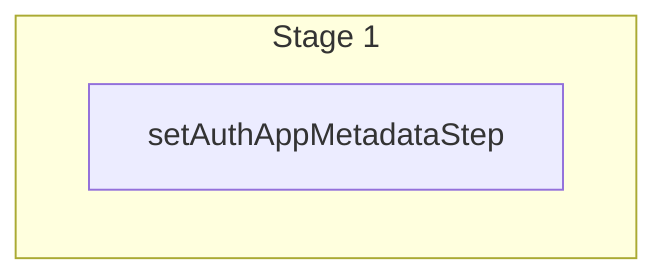

This documentation provides a reference to the `setAuthAppMetadataWorkflow`. It belongs to the `@medusajs/medusa/core-flows` package.

This workflow sets the `app_metadata` property of an auth identity. This is useful to
associate a user (whether it's an admin user or customer) with an auth identity
that allows them to authenticate into Medusa.

You can learn more about auth identites in
[this documentation](/resources/commerce-modules/auth/auth-identity-and-actor-types).

To use this for a custom actor type, check out [this guide](/resources/commerce-modules/auth/create-actor-type)
that explains how to create a custom `manager` actor type and manage its users.

[View source code](https://github.com/medusajs/medusa/blob/0ed927bdb7a396a8fd5f6447ed69b7b354b150d3/packages/core/core-flows/src/auth/workflows/set-auth-app-metadata.ts#L47)

## Examples

To associate an auth identity with an actor type (user, customer, or other actor types):

**API Route**

```ts title="src/api/workflow/route.ts"
import type {
  MedusaRequest,
  MedusaResponse,
} from "@medusajs/framework/http"
import { setAuthAppMetadataWorkflow } from "@medusajs/medusa/core-flows"

export async function POST(
  req: MedusaRequest,
  res: MedusaResponse
) {
  const { result } = await setAuthAppMetadataWorkflow(req.scope).run({
    input: {
      authIdentityId: "au_1234",
      actorType: "user", // or `customer`, or custom type
      value: "user_123"
    }
  })

  res.send(result)
}
```

**Subscriber**

```ts title="src/subscribers/order-placed.ts"
import {
  type SubscriberConfig,
  type SubscriberArgs,
} from "@medusajs/framework"
import { setAuthAppMetadataWorkflow } from "@medusajs/medusa/core-flows"

export default async function handleOrderPlaced({
  event: { data },
  container,
}: SubscriberArgs < { id: string } > ) {
  const { result } = await setAuthAppMetadataWorkflow(container).run({
    input: {
      authIdentityId: "au_1234",
      actorType: "user", // or `customer`, or custom type
      value: "user_123"
    }
  })

  console.log(result)
}

export const config: SubscriberConfig = {
  event: "order.placed",
}
```

**Scheduled Job**

```ts title="src/jobs/message-daily.ts"
import { MedusaContainer } from "@medusajs/framework/types"
import { setAuthAppMetadataWorkflow } from "@medusajs/medusa/core-flows"

export default async function myCustomJob(
  container: MedusaContainer
) {
  const { result } = await setAuthAppMetadataWorkflow(container).run({
    input: {
      authIdentityId: "au_1234",
      actorType: "user", // or `customer`, or custom type
      value: "user_123"
    }
  })

  console.log(result)
}

export const config = {
  name: "run-once-a-day",
  schedule: "0 0 * * *",
}
```

**Another Workflow**

```ts title="src/workflows/my-workflow.ts"
import { createWorkflow } from "@medusajs/framework/workflows-sdk"
import { setAuthAppMetadataWorkflow } from "@medusajs/medusa/core-flows"

const myWorkflow = createWorkflow(
  "my-workflow",
  () => {
    const result = setAuthAppMetadataWorkflow.runAsStep({
      input: {
        authIdentityId: "au_1234",
        actorType: "user", // or `customer`, or custom type
        value: "user_123"
      }
    })
  }
)
```

To remove the association with an actor type, such as when deleting the user:

**API Route**

```ts title="src/api/workflow/route.ts"
import type {
  MedusaRequest,
  MedusaResponse,
} from "@medusajs/framework/http"
import { setAuthAppMetadataWorkflow } from "@medusajs/medusa/core-flows"

export async function POST(
  req: MedusaRequest,
  res: MedusaResponse
) {
  const { result } = await setAuthAppMetadataWorkflow(req.scope).run({
    input: {
      authIdentityId: "au_1234",
      actorType: "user", // or `customer`, or custom type
      value: null
    }
  })

  res.send(result)
}
```

**Subscriber**

```ts title="src/subscribers/order-placed.ts"
import {
  type SubscriberConfig,
  type SubscriberArgs,
} from "@medusajs/framework"
import { setAuthAppMetadataWorkflow } from "@medusajs/medusa/core-flows"

export default async function handleOrderPlaced({
  event: { data },
  container,
}: SubscriberArgs < { id: string } > ) {
  const { result } = await setAuthAppMetadataWorkflow(container).run({
    input: {
      authIdentityId: "au_1234",
      actorType: "user", // or `customer`, or custom type
      value: null
    }
  })

  console.log(result)
}

export const config: SubscriberConfig = {
  event: "order.placed",
}
```

**Scheduled Job**

```ts title="src/jobs/message-daily.ts"
import { MedusaContainer } from "@medusajs/framework/types"
import { setAuthAppMetadataWorkflow } from "@medusajs/medusa/core-flows"

export default async function myCustomJob(
  container: MedusaContainer
) {
  const { result } = await setAuthAppMetadataWorkflow(container).run({
    input: {
      authIdentityId: "au_1234",
      actorType: "user", // or `customer`, or custom type
      value: null
    }
  })

  console.log(result)
}

export const config = {
  name: "run-once-a-day",
  schedule: "0 0 * * *",
}
```

**Another Workflow**

```ts title="src/workflows/my-workflow.ts"
import { createWorkflow } from "@medusajs/framework/workflows-sdk"
import { setAuthAppMetadataWorkflow } from "@medusajs/medusa/core-flows"

const myWorkflow = createWorkflow(
  "my-workflow",
  () => {
    const result = setAuthAppMetadataWorkflow.runAsStep({
      input: {
        authIdentityId: "au_1234",
        actorType: "user", // or `customer`, or custom type
        value: null
      }
    })
  }
)
```

<a id="setauthappmetadataworkflow-steps" />

## Steps



Stages follow the order in the workflow definition. Conditional steps run only when their condition is met. The step descriptions below include the conditions and reference links.

- [setAuthAppMetadataStep](/resources/references/medusa-workflows/steps/setAuthAppMetadataStep): This step sets the `app_metadata` property of an auth identity. This is useful to associate a user (whether it's an admin user or customer) with an auth identity that allows them to authenticate into Medusa. You can learn more about auth identites in [this documentation](/resources/commerce-modules/auth/auth-identity-and-actor-types). To use this for a custom actor type, check out [this guide](/resources/commerce-modules/auth/create-actor-type) that explains how to create a custom `manager` actor type and manage its users.

<a id="setauthappmetadataworkflow-input" />

## Input

**setAuthAppMetadataWorkflow**

- `SetAuthAppMetadataStepInput`: [SetAuthAppMetadataStepInput](/resources/references/core_flows/core_core_flows_src/types/core_flowscore_core_flows_srcSetAuthAppMetadataStepInput)
  - `authIdentityId`: `string`
  - `actorType`: `string`
  - `value`: `string` | `null`

<a id="setauthappmetadataworkflow-output" />

## Output

**setAuthAppMetadataWorkflow**

- `AuthIdentityDTO`: [AuthIdentityDTO](/resources/references/auth/interfaces/authAuthIdentityDTO) — The auth identity details.
  - `id`: `string` — The ID of the auth identity.
  - `provider_identities`: [ProviderIdentityDTO](/resources/references/auth/interfaces/authProviderIdentityDTO)\[] (optional) — The list of provider identities linked to the auth identity.
    - `id`: `string` — The ID of the provider identity.
    - `provider`: `string`
    - `entity_id`: `string` — The user's identifier. For example, when using the `emailpass` provider, the `entity_id` would be the user's email.
    - `auth_identity_id`: `string` (optional) — The ID of the auth identity linked to the provider identity.
    - `auth_identity`: [AuthIdentityDTO](/resources/references/auth/interfaces/authAuthIdentityDTO) (optional) — The auth identity linked to the provider identity.
      - `id`: `string` — The ID of the auth identity.
      - `provider_identities`: [ProviderIdentityDTO](/resources/references/auth/interfaces/authProviderIdentityDTO)\[] (optional) — The list of provider identities linked to the auth identity.
      - `app_metadata`: `Record<string, unknown>` (optional) — Holds information related to the actor IDs tied to the auth identity.
    - `provider_metadata`: `Record<string, unknown>` (optional) — Holds custom data related to the provider in key-value pairs.
    - `user_metadata`: `Record<string, unknown>` (optional) — Holds custom data related to the user in key-value pairs.
  - `app_metadata`: `Record<string, unknown>` (optional) — Holds information related to the actor IDs tied to the auth identity.
