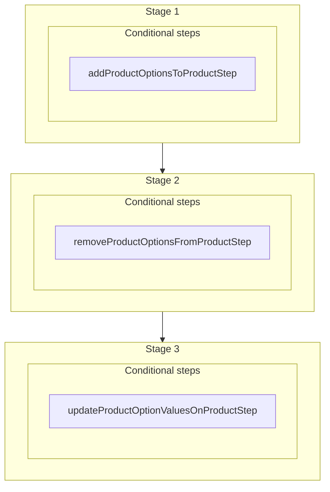

This documentation provides a reference to the `setProductProductOptionsWorkflow`. It belongs to the `@medusajs/medusa/core-flows` package.

This workflow manages one or more product options of a product.

[View source code](https://github.com/medusajs/medusa/blob/0ed927bdb7a396a8fd5f6447ed69b7b354b150d3/packages/core/core-flows/src/product/workflows/set-product-product-options.ts#L44)

## Examples

**API Route**

```ts title="src/api/workflow/route.ts"
import type {
  MedusaRequest,
  MedusaResponse,
} from "@medusajs/framework/http"
import { setProductProductOptionsWorkflow } from "@medusajs/medusa/core-flows"

export async function POST(
  req: MedusaRequest,
  res: MedusaResponse
) {
  const { result } = await setProductProductOptionsWorkflow(req.scope)
    .run({
      input: {
        "product_id": "prod_123"
      }
    })

  res.send(result)
}
```

**Subscriber**

```ts title="src/subscribers/order-placed.ts"
import {
  type SubscriberConfig,
  type SubscriberArgs,
} from "@medusajs/framework"
import { setProductProductOptionsWorkflow } from "@medusajs/medusa/core-flows"

export default async function handleOrderPlaced({
  event: { data },
  container,
}: SubscriberArgs < { id: string } > ) {
  const { result } = await setProductProductOptionsWorkflow(container)
    .run({
      input: {
        "product_id": "prod_123"
      }
    })

  console.log(result)
}

export const config: SubscriberConfig = {
  event: "order.placed",
}
```

**Scheduled Job**

```ts title="src/jobs/message-daily.ts"
import { MedusaContainer } from "@medusajs/framework/types"
import { setProductProductOptionsWorkflow } from "@medusajs/medusa/core-flows"

export default async function myCustomJob(
  container: MedusaContainer
) {
  const { result } = await setProductProductOptionsWorkflow(container)
    .run({
      input: {
        "product_id": "prod_123"
      }
    })

  console.log(result)
}

export const config = {
  name: "run-once-a-day",
  schedule: "0 0 * * *",
}
```

**Another Workflow**

```ts title="src/workflows/my-workflow.ts"
import { createWorkflow } from "@medusajs/framework/workflows-sdk"
import { setProductProductOptionsWorkflow } from "@medusajs/medusa/core-flows"

const myWorkflow = createWorkflow(
  "my-workflow",
  () => {
    const result = setProductProductOptionsWorkflow
      .runAsStep({
        input: {
          "product_id": "prod_123"
        }
      })
  }
)
```

<a id="setproductproductoptionsworkflow-steps" />

## Steps



Stages follow the order in the workflow definition. Conditional steps run only when their condition is met. The step descriptions below include the conditions and reference links.

- **when** (when: !!toAdd?.length)
- [addProductOptionsToProductStep](/resources/references/medusa-workflows/steps/addProductOptionsToProductStep): This step adds product options to products.
  - **when** (when: !!toRemove?.length)
  - [removeProductOptionsFromProductStep](/resources/references/medusa-workflows/steps/removeProductOptionsFromProductStep): This step removes product options from products.
    - **when** (when: !!toUpdate?.length)
    - [updateProductOptionValuesOnProductStep](/resources/references/medusa-workflows/steps/updateProductOptionValuesOnProductStep): This step updates product option values linked to products.

<a id="setproductproductoptionsworkflow-input" />

## Input

**setProductProductOptionsWorkflow**

- `SetProductProductOptionsWorkflowInput`: [SetProductProductOptionsWorkflowInput](/resources/references/core_flows/core_core_flows_src/types/core_flowscore_core_flows_srcSetProductProductOptionsWorkflowInput)
  - `product_id`: `string` — The ID of the product to manage its options.
  - `add`: (`string` | Omit\<[ProductOptionProductPair](/resources/references/product/interfaces/productProductOptionProductPair), "product\_id">)\[] (optional) — The product options to add to the product. You can pass an option ID or an object with option value IDs.
  - `remove`: `string`\[] (optional) — The product options to remove from the product.
  - `update`: Omit\<[ProductOptionProductValueUpdate](/resources/references/product/interfaces/productProductOptionProductValueUpdate), "product\_id">\[] (optional) — The product option values to update for existing product options.
    - `product_option_id`: `string` — The product option's ID.
    - `add`: (`string` | `object`)\[] (optional) — The IDs of specific option values to add to the product option, or value objects to create and link.
      - `value`: `string`
    - `remove`: `string`\[] (optional) — The IDs of specific option values to remove from the product option.
