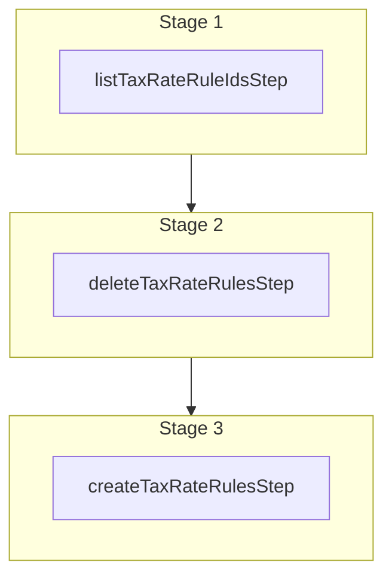

This documentation provides a reference to the `setTaxRateRulesWorkflow`. It belongs to the `@medusajs/medusa/core-flows` package.

This workflow sets the rules of tax rates.

You can use this workflow within your own customizations or custom workflows, allowing you
to set the rules of tax rates in your custom flows.

[View source code](https://github.com/medusajs/medusa/blob/0ed927bdb7a396a8fd5f6447ed69b7b354b150d3/packages/core/core-flows/src/tax/workflows/set-tax-rate-rules.ts#L56)

## Examples

**API Route**

```ts title="src/api/workflow/route.ts"
import type {
  MedusaRequest,
  MedusaResponse,
} from "@medusajs/framework/http"
import { setTaxRateRulesWorkflow } from "@medusajs/medusa/core-flows"

export async function POST(
  req: MedusaRequest,
  res: MedusaResponse
) {
  const { result } = await setTaxRateRulesWorkflow(req.scope)
    .run({
      input: {
        tax_rate_ids: ["txr_123"],
        rules: [{
          reference: "product_type",
          reference_id: "ptyp_123"
        }]
      }
    })

  res.send(result)
}
```

**Subscriber**

```ts title="src/subscribers/order-placed.ts"
import {
  type SubscriberConfig,
  type SubscriberArgs,
} from "@medusajs/framework"
import { setTaxRateRulesWorkflow } from "@medusajs/medusa/core-flows"

export default async function handleOrderPlaced({
  event: { data },
  container,
}: SubscriberArgs < { id: string } > ) {
  const { result } = await setTaxRateRulesWorkflow(container)
    .run({
      input: {
        tax_rate_ids: ["txr_123"],
        rules: [{
          reference: "product_type",
          reference_id: "ptyp_123"
        }]
      }
    })

  console.log(result)
}

export const config: SubscriberConfig = {
  event: "order.placed",
}
```

**Scheduled Job**

```ts title="src/jobs/message-daily.ts"
import { MedusaContainer } from "@medusajs/framework/types"
import { setTaxRateRulesWorkflow } from "@medusajs/medusa/core-flows"

export default async function myCustomJob(
  container: MedusaContainer
) {
  const { result } = await setTaxRateRulesWorkflow(container)
    .run({
      input: {
        tax_rate_ids: ["txr_123"],
        rules: [{
          reference: "product_type",
          reference_id: "ptyp_123"
        }]
      }
    })

  console.log(result)
}

export const config = {
  name: "run-once-a-day",
  schedule: "0 0 * * *",
}
```

**Another Workflow**

```ts title="src/workflows/my-workflow.ts"
import { createWorkflow } from "@medusajs/framework/workflows-sdk"
import { setTaxRateRulesWorkflow } from "@medusajs/medusa/core-flows"

const myWorkflow = createWorkflow(
  "my-workflow",
  () => {
    const result = setTaxRateRulesWorkflow
      .runAsStep({
        input: {
          tax_rate_ids: ["txr_123"],
          rules: [{
            reference: "product_type",
            reference_id: "ptyp_123"
          }]
        }
      })
  }
)
```

<a id="settaxraterulesworkflow-steps" />

## Steps



Stages follow the order in the workflow definition. Conditional steps run only when their condition is met. The step descriptions below include the conditions and reference links.

- [listTaxRateRuleIdsStep](/resources/references/medusa-workflows/steps/listTaxRateRuleIdsStep): This step retrieves the IDs of tax rate rules matching the specified filters.
  - [deleteTaxRateRulesStep](/resources/references/medusa-workflows/steps/deleteTaxRateRulesStep): This step deletes one or more tax rate rules.
    - [createTaxRateRulesStep](/resources/references/medusa-workflows/steps/createTaxRateRulesStep): This step creates one or more tax rate rules.

<a id="settaxraterulesworkflow-input" />

## Input

**setTaxRateRulesWorkflow**

- `SetTaxRatesRulesWorkflowInput`: [SetTaxRatesRulesWorkflowInput](/resources/references/core_flows/core_core_flows_src/types/core_flowscore_core_flows_srcSetTaxRatesRulesWorkflowInput)
  - `tax_rate_ids`: `string`\[] — The IDs of the tax rates to set their rules.
  - `rules`: Omit\<[CreateTaxRateRuleDTO](/resources/references/tax/interfaces/taxCreateTaxRateRuleDTO), "tax\_rate\_id">\[] — The rules to create for the tax rates.
    - `reference`: `string` — The snake-case name of the data model that the tax rule references. For example, `product`. Learn more in [this guide](/resources/commerce-modules/tax/tax-rates-and-rules#override-tax-rates-with-rules).
    - `reference_id`: `string` — The ID of the record of the data model that the tax rule references. For example, `prod_123`. Learn more in [this guide](/resources/commerce-modules/tax/tax-rates-and-rules#override-tax-rates-with-rules).
    - `metadata`: [MetadataType](/resources/references/tax/types/taxMetadataType) (optional) — Holds custom data in key-value pairs.
    - `created_by`: `null` | `string` (optional) — Who created the tax rate rule. For example, the ID of the user that created it.

<a id="settaxraterulesworkflow-output" />

## Output

**setTaxRateRulesWorkflow**

- `TaxRateRuleDTO[]`: [TaxRateRuleDTO](/resources/references/tax/interfaces/taxTaxRateRuleDTO)\[]
  - `id`: `string` — The ID of the tax rate rule.
  - `reference`: `string` — The snake-case name of the data model that the tax rule references. For example, `product`. Learn more in [this guide](/resources/commerce-modules/tax/tax-rates-and-rules#override-tax-rates-with-rules).
  - `reference_id`: `string` — The ID of the record of the data model that the tax rule references. For example, `prod_123`. Learn more in [this guide](/resources/commerce-modules/tax/tax-rates-and-rules#override-tax-rates-with-rules).
  - `tax_rate_id`: `string` — The associated tax rate's ID.
  - `tax_rate`: [TaxRateDTO](/resources/references/tax/interfaces/taxTaxRateDTO) (optional) — The associated tax rate.
    - `id`: `string` — The ID of the tax rate.
    - `rate`: `null` | `number` — The rate to charge.

      Example:

      ```
      10
      ```
    - `code`: `null` | `string` — The code the tax rate is identified by.
    - `name`: `string` — The name of the Tax Rate.

      Example:

      ```
      VAT
      ```
    - `metadata`: `null` | `Record<string, unknown>` — Holds custom data in key-value pairs.
    - `tax_region_id`: `string` — The ID of the associated tax region.
    - `is_combinable`: `boolean` — Whether the tax rate should be combined with parent rates. Learn more [here](/resources/commerce-modules/tax/tax-rates-and-rules#combinable-tax-rates).
    - `is_default`: `boolean` — Whether the tax rate is the default rate for the region.
    - `created_at`: `string` | `Date` — The creation date of the tax rate.
    - `updated_at`: `string` | `Date` — The update date of the tax rate.
    - `deleted_at`: `null` | `Date` — The deletion date of the tax rate.
    - `created_by`: `null` | `string` — Who created the tax rate. For example, the ID of the user that created the tax rate.
  - `metadata`: `null` | `Record<string, unknown>` (optional) — Holds custom data in key-value pairs.
  - `created_at`: `string` | `Date` — The creation date of the tax rate rule.
  - `updated_at`: `string` | `Date` — The update date of the tax rate rule.
  - `created_by`: `null` | `string` — Who created the tax rate rule. For example, the ID of the user that created the tax rate rule.
