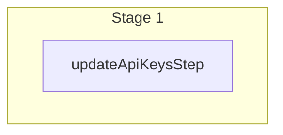

This documentation provides a reference to the `updateApiKeysWorkflow`. It belongs to the `@medusajs/medusa/core-flows` package.

This workflow updates one or more secret or publishable API keys. It's used by the
[Update API Key Admin API Route](/api/admin/api-keys/update-an-api-key).

You can use this workflow within your customizations or your own custom workflows, allowing you to
update API keys within your custom flows.

[View source code](https://github.com/medusajs/medusa/blob/0ed927bdb7a396a8fd5f6447ed69b7b354b150d3/packages/core/core-flows/src/api-key/workflows/update-api-keys.ts#L57)

## Examples

**API Route**

```ts title="src/api/workflow/route.ts"
import type {
  MedusaRequest,
  MedusaResponse,
} from "@medusajs/framework/http"
import { updateApiKeysWorkflow } from "@medusajs/medusa/core-flows"

export async function POST(
  req: MedusaRequest,
  res: MedusaResponse
) {
  const { result } = await updateApiKeysWorkflow(req.scope)
    .run({
      input: {
        selector: {
          id: "apk_123"
        },
        update: {
          title: "Storefront"
        }
      }
    })

  res.send(result)
}
```

**Subscriber**

```ts title="src/subscribers/order-placed.ts"
import {
  type SubscriberConfig,
  type SubscriberArgs,
} from "@medusajs/framework"
import { updateApiKeysWorkflow } from "@medusajs/medusa/core-flows"

export default async function handleOrderPlaced({
  event: { data },
  container,
}: SubscriberArgs < { id: string } > ) {
  const { result } = await updateApiKeysWorkflow(container)
    .run({
      input: {
        selector: {
          id: "apk_123"
        },
        update: {
          title: "Storefront"
        }
      }
    })

  console.log(result)
}

export const config: SubscriberConfig = {
  event: "order.placed",
}
```

**Scheduled Job**

```ts title="src/jobs/message-daily.ts"
import { MedusaContainer } from "@medusajs/framework/types"
import { updateApiKeysWorkflow } from "@medusajs/medusa/core-flows"

export default async function myCustomJob(
  container: MedusaContainer
) {
  const { result } = await updateApiKeysWorkflow(container)
    .run({
      input: {
        selector: {
          id: "apk_123"
        },
        update: {
          title: "Storefront"
        }
      }
    })

  console.log(result)
}

export const config = {
  name: "run-once-a-day",
  schedule: "0 0 * * *",
}
```

**Another Workflow**

```ts title="src/workflows/my-workflow.ts"
import { createWorkflow } from "@medusajs/framework/workflows-sdk"
import { updateApiKeysWorkflow } from "@medusajs/medusa/core-flows"

const myWorkflow = createWorkflow(
  "my-workflow",
  () => {
    const result = updateApiKeysWorkflow
      .runAsStep({
        input: {
          selector: {
            id: "apk_123"
          },
          update: {
            title: "Storefront"
          }
        }
      })
  }
)
```

<a id="updateapikeysworkflow-steps" />

## Steps



Stages follow the order in the workflow definition. Conditional steps run only when their condition is met. The step descriptions below include the conditions and reference links.

- [updateApiKeysStep](/resources/references/medusa-workflows/steps/updateApiKeysStep): This step updates one or more API keys.

<a id="updateapikeysworkflow-input" />

## Input

**updateApiKeysWorkflow**

- `UpdateApiKeysWorkflowInput`: [UpdateApiKeysWorkflowInput](/resources/references/core_flows/core_core_flows_src/types/core_flowscore_core_flows_srcUpdateApiKeysWorkflowInput)
  - `selector`: [FilterableApiKeyProps](/resources/references/api_key/interfaces/api_keyFilterableApiKeyProps) — The filters to select the API keys to update.
    - `q`: `string` (optional) — Search through the api key names and redacted keys using this search term.
    - `id`: `string` | `string`\[] (optional) — The IDs to filter the API keys by.
    - `token`: `string` | `string`\[] (optional) — The tokens to filter the API keys by.
    - `title`: `string` | `string`\[] (optional) — The titles to filter the API keys by.
    - `type`: [ApiKeyType](/resources/references/api_key/types/api_keyApiKeyType) (optional) — Filter the API keys by their type.
    - `revoked_at`: [OperatorMap](/resources/references/api_key/types/api_keyOperatorMap)\<null | Date> (optional)
      - `$and`: [Query](/resources/references/api_key/types/api_keyQuery)\<T>\[] (optional)
      - `$or`: [Query](/resources/references/api_key/types/api_keyQuery)\<T>\[] (optional)
      - `$eq`: [ExpandScalar](/resources/references/api_key/types/api_keyExpandScalar)\<T> | [ExpandScalar](/resources/references/api_key/types/api_keyExpandScalar)\<T>\[] (optional)
      - `$ne`: [ExpandScalar](/resources/references/api_key/types/api_keyExpandScalar)\<T> (optional)
      - `$in`: [ExpandScalar](/resources/references/api_key/types/api_keyExpandScalar)\<T>\[] (optional)
      - `$nin`: [ExpandScalar](/resources/references/api_key/types/api_keyExpandScalar)\<T>\[] (optional)
      - `$not`: [Query](/resources/references/api_key/types/api_keyQuery)\<T> (optional)
      - `$gt`: [ExpandScalar](/resources/references/api_key/types/api_keyExpandScalar)\<T> (optional)
      - `$gte`: [ExpandScalar](/resources/references/api_key/types/api_keyExpandScalar)\<T> (optional)
      - `$lt`: [ExpandScalar](/resources/references/api_key/types/api_keyExpandScalar)\<T> (optional)
      - `$lte`: [ExpandScalar](/resources/references/api_key/types/api_keyExpandScalar)\<T> (optional)
      - `$like`: `string` (optional)
      - `$re`: `string` (optional)
      - `$ilike`: `string` (optional)
      - `$fulltext`: `string` (optional)
      - `$overlap`: `string`\[] (optional)
      - `$contains`: `string`\[] (optional)
      - `$contained`: `string`\[] (optional)
      - `$exists`: `boolean` (optional)
    - `$and`: ([FilterableApiKeyProps](/resources/references/api_key/interfaces/api_keyFilterableApiKeyProps) | [BaseFilterable](/resources/references/api_key/interfaces/api_keyBaseFilterable)\<[FilterableApiKeyProps](/resources/references/api_key/interfaces/api_keyFilterableApiKeyProps)>)\[] (optional) — An array of filters to apply on the entity, where each item in the array is joined with an "and" condition.
      - `q`: `string` (optional) — Search through the api key names and redacted keys using this search term.
      - `id`: `string` | `string`\[] (optional) — The IDs to filter the API keys by.
      - `token`: `string` | `string`\[] (optional) — The tokens to filter the API keys by.
      - `title`: `string` | `string`\[] (optional) — The titles to filter the API keys by.
      - `type`: [ApiKeyType](/resources/references/api_key/types/api_keyApiKeyType) (optional) — Filter the API keys by their type.
      - `revoked_at`: [OperatorMap](/resources/references/api_key/types/api_keyOperatorMap)\<null | Date> (optional)
      - `$and`: ([FilterableApiKeyProps](/resources/references/api_key/interfaces/api_keyFilterableApiKeyProps) | [BaseFilterable](/resources/references/api_key/interfaces/api_keyBaseFilterable)\<[FilterableApiKeyProps](/resources/references/api_key/interfaces/api_keyFilterableApiKeyProps)>)\[] (optional) — An array of filters to apply on the entity, where each item in the array is joined with an "and" condition.
      - `$or`: ([FilterableApiKeyProps](/resources/references/api_key/interfaces/api_keyFilterableApiKeyProps) | [BaseFilterable](/resources/references/api_key/interfaces/api_keyBaseFilterable)\<[FilterableApiKeyProps](/resources/references/api_key/interfaces/api_keyFilterableApiKeyProps)>)\[] (optional) — An array of filters to apply on the entity, where each item in the array is joined with an "or" condition.
    - `$or`: ([FilterableApiKeyProps](/resources/references/api_key/interfaces/api_keyFilterableApiKeyProps) | [BaseFilterable](/resources/references/api_key/interfaces/api_keyBaseFilterable)\<[FilterableApiKeyProps](/resources/references/api_key/interfaces/api_keyFilterableApiKeyProps)>)\[] (optional) — An array of filters to apply on the entity, where each item in the array is joined with an "or" condition.
      - `q`: `string` (optional) — Search through the api key names and redacted keys using this search term.
      - `id`: `string` | `string`\[] (optional) — The IDs to filter the API keys by.
      - `token`: `string` | `string`\[] (optional) — The tokens to filter the API keys by.
      - `title`: `string` | `string`\[] (optional) — The titles to filter the API keys by.
      - `type`: [ApiKeyType](/resources/references/api_key/types/api_keyApiKeyType) (optional) — Filter the API keys by their type.
      - `revoked_at`: [OperatorMap](/resources/references/api_key/types/api_keyOperatorMap)\<null | Date> (optional)
      - `$and`: ([FilterableApiKeyProps](/resources/references/api_key/interfaces/api_keyFilterableApiKeyProps) | [BaseFilterable](/resources/references/api_key/interfaces/api_keyBaseFilterable)\<[FilterableApiKeyProps](/resources/references/api_key/interfaces/api_keyFilterableApiKeyProps)>)\[] (optional) — An array of filters to apply on the entity, where each item in the array is joined with an "and" condition.
      - `$or`: ([FilterableApiKeyProps](/resources/references/api_key/interfaces/api_keyFilterableApiKeyProps) | [BaseFilterable](/resources/references/api_key/interfaces/api_keyBaseFilterable)\<[FilterableApiKeyProps](/resources/references/api_key/interfaces/api_keyFilterableApiKeyProps)>)\[] (optional) — An array of filters to apply on the entity, where each item in the array is joined with an "or" condition.
  - `update`: [UpdateApiKeyDTO](/resources/references/api_key/interfaces/api_keyUpdateApiKeyDTO) — The data to update the API keys.
    - `title`: `string` (optional) — The title of the API key.

<a id="updateapikeysworkflow-output" />

## Output

**updateApiKeysWorkflow**

- `UpdateApiKeysWorkflowOutput`: [UpdateApiKeysWorkflowOutput](/resources/references/core_flows/core_core_flows_src/types/core_flowscore_core_flows_srcUpdateApiKeysWorkflowOutput)
  - `id`: `string` — The ID of the API key.
  - `token`: `string` — The token of the API key.
  - `redacted`: `string` — The redacted form of the API key's token. This is useful when showing portion of the token. For example `sk_...123`.
  - `title`: `string` — The title of the API key.
  - `type`: [ApiKeyType](/resources/references/api_key/types/api_keyApiKeyType) — The type of the API key.
  - `last_used_at`: `null` | `Date` — The date the API key was last used.
  - `created_by`: `string` — Who created the API key.
  - `created_at`: `Date` — The date the API key was created.
  - `updated_at`: `Date` — The date the API key was updated.
  - `deleted_at`: `null` | `Date` — The date the API key was deleted.
  - `revoked_by`: `null` | `string` — Who revoked the API key. For example, the ID of the user that revoked it.
  - `revoked_at`: `null` | `Date` — The date the API key was revoked.
