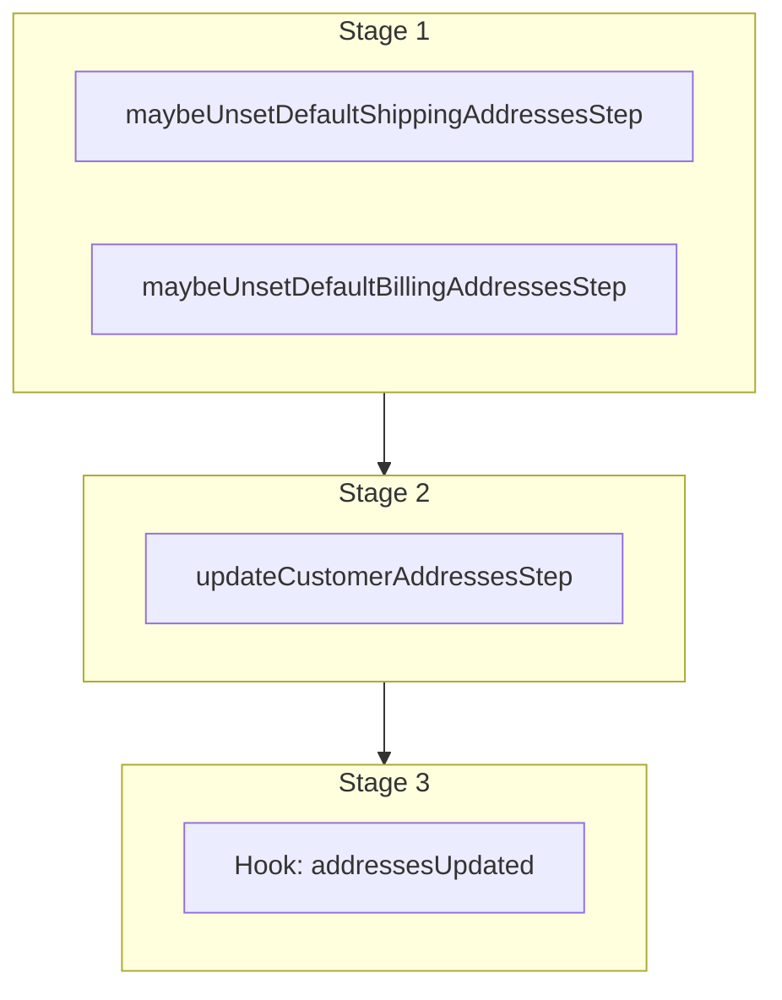

This documentation provides a reference to the `updateCustomerAddressesWorkflow`. It belongs to the `@medusajs/medusa/core-flows` package.

This workflow updates one or more addresses for customers. It's used by the [Update Customer Address Admin API Route](/api/admin/customers/update-address)
and the [Update Customer Address Store API Route](/api/store/customers/update-address).

This workflow has a hook that allows you to perform custom actions on the updated customer addresses. For example, you can pass under `additional_data` custom data that
allows you to update custom data models linked to the addresses.

You can also use this workflow within your customizations or your own custom workflows, allowing you to wrap custom logic around updating customer addresses.

[View source code](https://github.com/medusajs/medusa/blob/0ed927bdb7a396a8fd5f6447ed69b7b354b150d3/packages/core/core-flows/src/customer/workflows/update-addresses.ts#L66)

## Examples

**API Route**

```ts title="src/api/workflow/route.ts"
import type {
  MedusaRequest,
  MedusaResponse,
} from "@medusajs/framework/http"
import { updateCustomerAddressesWorkflow } from "@medusajs/medusa/core-flows"

export async function POST(
  req: MedusaRequest,
  res: MedusaResponse
) {
  const { result } = await updateCustomerAddressesWorkflow(req.scope)
    .run({
      input: {
        selector: {
          customer_id: "123"
        },
        update: {
          first_name: "John"
        },
        additional_data: {
          crm_id: "123"
        }
      }
    })

  res.send(result)
}
```

**Subscriber**

```ts title="src/subscribers/order-placed.ts"
import {
  type SubscriberConfig,
  type SubscriberArgs,
} from "@medusajs/framework"
import { updateCustomerAddressesWorkflow } from "@medusajs/medusa/core-flows"

export default async function handleOrderPlaced({
  event: { data },
  container,
}: SubscriberArgs < { id: string } > ) {
  const { result } = await updateCustomerAddressesWorkflow(container)
    .run({
      input: {
        selector: {
          customer_id: "123"
        },
        update: {
          first_name: "John"
        },
        additional_data: {
          crm_id: "123"
        }
      }
    })

  console.log(result)
}

export const config: SubscriberConfig = {
  event: "order.placed",
}
```

**Scheduled Job**

```ts title="src/jobs/message-daily.ts"
import { MedusaContainer } from "@medusajs/framework/types"
import { updateCustomerAddressesWorkflow } from "@medusajs/medusa/core-flows"

export default async function myCustomJob(
  container: MedusaContainer
) {
  const { result } = await updateCustomerAddressesWorkflow(container)
    .run({
      input: {
        selector: {
          customer_id: "123"
        },
        update: {
          first_name: "John"
        },
        additional_data: {
          crm_id: "123"
        }
      }
    })

  console.log(result)
}

export const config = {
  name: "run-once-a-day",
  schedule: "0 0 * * *",
}
```

**Another Workflow**

```ts title="src/workflows/my-workflow.ts"
import { createWorkflow } from "@medusajs/framework/workflows-sdk"
import { updateCustomerAddressesWorkflow } from "@medusajs/medusa/core-flows"

const myWorkflow = createWorkflow(
  "my-workflow",
  () => {
    const result = updateCustomerAddressesWorkflow
      .runAsStep({
        input: {
          selector: {
            customer_id: "123"
          },
          update: {
            first_name: "John"
          },
          additional_data: {
            crm_id: "123"
          }
        }
      })
  }
)
```

<a id="updatecustomeraddressesworkflow-steps" />

## Steps



Stages follow the order in the workflow definition. Conditional steps run only when their condition is met. The step descriptions below include the conditions and reference links.

- [maybeUnsetDefaultShippingAddressesStep](/resources/references/medusa-workflows/steps/maybeUnsetDefaultShippingAddressesStep): This step unsets the `is_default_billing` property of existing customer addresses if the `is_default_billing` property in the addresses in the input is set to `true`.
- [maybeUnsetDefaultBillingAddressesStep](/resources/references/medusa-workflows/steps/maybeUnsetDefaultBillingAddressesStep): This step unsets the `is_default_billing` property of existing customer addresses if the `is_default_billing` property in the addresses in the input is set to `true`.
  - [updateCustomerAddressesStep](/resources/references/medusa-workflows/steps/updateCustomerAddressesStep): This step updates one or more customer addresses.
    - [addressesUpdated](/resources/references/medusa-workflows/updateCustomerAddressesWorkflow#addressesupdated): This hook is executed after the addresses are updated. You can consume this hook to perform custom actions on the updated addresses.

<a id="updatecustomeraddressesworkflow-input" />

## Input

**updateCustomerAddressesWorkflow**

- `UpdateCustomerAddressesWorkflowInput`: [UpdateCustomerAddressesWorkflowInput](/resources/references/core_flows/core_core_flows_src/types/core_flowscore_core_flows_srcUpdateCustomerAddressesWorkflowInput)
  - `selector`: [FilterableCustomerAddressProps](/resources/references/customer/interfaces/customerFilterableCustomerAddressProps) — The filters to select the addresses to update.
    - `q`: `string` (optional) — Searches for addresses by properties such as name and street using this search term.
    - `id`: `string` | `string`\[] (optional) — The IDs to filter the customer address by.
    - `address_name`: `string` | [OperatorMap](/resources/references/customer/types/customerOperatorMap)\<string> (optional) — Filter addresses by name.
      - `$and`: [Query](/resources/references/customer/types/customerQuery)\<T>\[] (optional)
      - `$or`: [Query](/resources/references/customer/types/customerQuery)\<T>\[] (optional)
      - `$eq`: [ExpandScalar](/resources/references/customer/types/customerExpandScalar)\<T> | [ExpandScalar](/resources/references/customer/types/customerExpandScalar)\<T>\[] (optional)
      - `$ne`: [ExpandScalar](/resources/references/customer/types/customerExpandScalar)\<T> (optional)
      - `$in`: [ExpandScalar](/resources/references/customer/types/customerExpandScalar)\<T>\[] (optional)
      - `$nin`: [ExpandScalar](/resources/references/customer/types/customerExpandScalar)\<T>\[] (optional)
      - `$not`: [Query](/resources/references/customer/types/customerQuery)\<T> (optional)
      - `$gt`: [ExpandScalar](/resources/references/customer/types/customerExpandScalar)\<T> (optional)
      - `$gte`: [ExpandScalar](/resources/references/customer/types/customerExpandScalar)\<T> (optional)
      - `$lt`: [ExpandScalar](/resources/references/customer/types/customerExpandScalar)\<T> (optional)
      - `$lte`: [ExpandScalar](/resources/references/customer/types/customerExpandScalar)\<T> (optional)
      - `$like`: `string` (optional)
      - `$re`: `string` (optional)
      - `$ilike`: `string` (optional)
      - `$fulltext`: `string` (optional)
      - `$overlap`: `string`\[] (optional)
      - `$contains`: `string`\[] (optional)
      - `$contained`: `string`\[] (optional)
      - `$exists`: `boolean` (optional)
    - `is_default_shipping`: `boolean` | [OperatorMap](/resources/references/customer/types/customerOperatorMap)\<boolean> (optional) — Filter addresses by whether they're the default for shipping.
      - `$and`: [Query](/resources/references/customer/types/customerQuery)\<T>\[] (optional)
      - `$or`: [Query](/resources/references/customer/types/customerQuery)\<T>\[] (optional)
      - `$eq`: [ExpandScalar](/resources/references/customer/types/customerExpandScalar)\<T> | [ExpandScalar](/resources/references/customer/types/customerExpandScalar)\<T>\[] (optional)
      - `$ne`: [ExpandScalar](/resources/references/customer/types/customerExpandScalar)\<T> (optional)
      - `$in`: [ExpandScalar](/resources/references/customer/types/customerExpandScalar)\<T>\[] (optional)
      - `$nin`: [ExpandScalar](/resources/references/customer/types/customerExpandScalar)\<T>\[] (optional)
      - `$not`: [Query](/resources/references/customer/types/customerQuery)\<T> (optional)
      - `$gt`: [ExpandScalar](/resources/references/customer/types/customerExpandScalar)\<T> (optional)
      - `$gte`: [ExpandScalar](/resources/references/customer/types/customerExpandScalar)\<T> (optional)
      - `$lt`: [ExpandScalar](/resources/references/customer/types/customerExpandScalar)\<T> (optional)
      - `$lte`: [ExpandScalar](/resources/references/customer/types/customerExpandScalar)\<T> (optional)
      - `$like`: `string` (optional)
      - `$re`: `string` (optional)
      - `$ilike`: `string` (optional)
      - `$fulltext`: `string` (optional)
      - `$overlap`: `string`\[] (optional)
      - `$contains`: `string`\[] (optional)
      - `$contained`: `string`\[] (optional)
      - `$exists`: `boolean` (optional)
    - `is_default_billing`: `boolean` | [OperatorMap](/resources/references/customer/types/customerOperatorMap)\<boolean> (optional) — Filter addresses by whether they're the default for billing.
      - `$and`: [Query](/resources/references/customer/types/customerQuery)\<T>\[] (optional)
      - `$or`: [Query](/resources/references/customer/types/customerQuery)\<T>\[] (optional)
      - `$eq`: [ExpandScalar](/resources/references/customer/types/customerExpandScalar)\<T> | [ExpandScalar](/resources/references/customer/types/customerExpandScalar)\<T>\[] (optional)
      - `$ne`: [ExpandScalar](/resources/references/customer/types/customerExpandScalar)\<T> (optional)
      - `$in`: [ExpandScalar](/resources/references/customer/types/customerExpandScalar)\<T>\[] (optional)
      - `$nin`: [ExpandScalar](/resources/references/customer/types/customerExpandScalar)\<T>\[] (optional)
      - `$not`: [Query](/resources/references/customer/types/customerQuery)\<T> (optional)
      - `$gt`: [ExpandScalar](/resources/references/customer/types/customerExpandScalar)\<T> (optional)
      - `$gte`: [ExpandScalar](/resources/references/customer/types/customerExpandScalar)\<T> (optional)
      - `$lt`: [ExpandScalar](/resources/references/customer/types/customerExpandScalar)\<T> (optional)
      - `$lte`: [ExpandScalar](/resources/references/customer/types/customerExpandScalar)\<T> (optional)
      - `$like`: `string` (optional)
      - `$re`: `string` (optional)
      - `$ilike`: `string` (optional)
      - `$fulltext`: `string` (optional)
      - `$overlap`: `string`\[] (optional)
      - `$contains`: `string`\[] (optional)
      - `$contained`: `string`\[] (optional)
      - `$exists`: `boolean` (optional)
    - `customer_id`: `string` | `string`\[] (optional) — Filter addresses by the associated customer's ID.
    - `customer`: `string` | `string`\[] | [FilterableCustomerProps](/resources/references/customer/interfaces/customerFilterableCustomerProps) (optional) — Filter addresses by the associated customer.
      - `q`: `string` (optional) — Searches for customers by properties such as name and email using this search term.
      - `id`: `string` | `string`\[] (optional) — The IDs to filter the customer by.
      - `email`: `string` | `string`\[] | [OperatorMap](/resources/references/customer/types/customerOperatorMap)\<string> (optional) — Filter by email.
      - `groups`: `string` | `string`\[] | [FilterableCustomerGroupProps](/resources/references/customer/interfaces/customerFilterableCustomerGroupProps) (optional) — Filter by associated customer group.
      - `default_billing_address_id`: `null` | `string` | `string`\[] (optional) — Filter by the associated default billing address's ID.
      - `default_shipping_address_id`: `null` | `string` | `string`\[] (optional) — Filter by the associated default shipping address's ID.
      - `company_name`: `null` | `string` | `string`\[] | [OperatorMap](/resources/references/customer/types/customerOperatorMap)\<string> (optional) — Filter by company name.
      - `first_name`: `null` | `string` | `string`\[] | [OperatorMap](/resources/references/customer/types/customerOperatorMap)\<string> (optional) — Filter by first name.
      - `last_name`: `null` | `string` | `string`\[] | [OperatorMap](/resources/references/customer/types/customerOperatorMap)\<string> (optional) — Filter by last name.
      - `has_account`: `boolean` | [OperatorMap](/resources/references/customer/types/customerOperatorMap)\<boolean> (optional) — Filter by whether the customer has an account.
      - `created_by`: `null` | `string` | `string`\[] (optional) — Filter by the `created_by` attribute.
      - `created_at`: [OperatorMap](/resources/references/customer/types/customerOperatorMap)\<string> (optional) — Filter by created date.
      - `updated_at`: [OperatorMap](/resources/references/customer/types/customerOperatorMap)\<string> (optional) — Filter by updated date.
      - `$and`: ([FilterableCustomerProps](/resources/references/customer/interfaces/customerFilterableCustomerProps) | [BaseFilterable](/resources/references/customer/interfaces/customerBaseFilterable)\<[FilterableCustomerProps](/resources/references/customer/interfaces/customerFilterableCustomerProps)>)\[] (optional) — An array of filters to apply on the entity, where each item in the array is joined with an "and" condition.
      - `$or`: ([FilterableCustomerProps](/resources/references/customer/interfaces/customerFilterableCustomerProps) | [BaseFilterable](/resources/references/customer/interfaces/customerBaseFilterable)\<[FilterableCustomerProps](/resources/references/customer/interfaces/customerFilterableCustomerProps)>)\[] (optional) — An array of filters to apply on the entity, where each item in the array is joined with an "or" condition.
    - `company`: `string` | [OperatorMap](/resources/references/customer/types/customerOperatorMap)\<string> (optional) — Filter addresses by company.
      - `$and`: [Query](/resources/references/customer/types/customerQuery)\<T>\[] (optional)
      - `$or`: [Query](/resources/references/customer/types/customerQuery)\<T>\[] (optional)
      - `$eq`: [ExpandScalar](/resources/references/customer/types/customerExpandScalar)\<T> | [ExpandScalar](/resources/references/customer/types/customerExpandScalar)\<T>\[] (optional)
      - `$ne`: [ExpandScalar](/resources/references/customer/types/customerExpandScalar)\<T> (optional)
      - `$in`: [ExpandScalar](/resources/references/customer/types/customerExpandScalar)\<T>\[] (optional)
      - `$nin`: [ExpandScalar](/resources/references/customer/types/customerExpandScalar)\<T>\[] (optional)
      - `$not`: [Query](/resources/references/customer/types/customerQuery)\<T> (optional)
      - `$gt`: [ExpandScalar](/resources/references/customer/types/customerExpandScalar)\<T> (optional)
      - `$gte`: [ExpandScalar](/resources/references/customer/types/customerExpandScalar)\<T> (optional)
      - `$lt`: [ExpandScalar](/resources/references/customer/types/customerExpandScalar)\<T> (optional)
      - `$lte`: [ExpandScalar](/resources/references/customer/types/customerExpandScalar)\<T> (optional)
      - `$like`: `string` (optional)
      - `$re`: `string` (optional)
      - `$ilike`: `string` (optional)
      - `$fulltext`: `string` (optional)
      - `$overlap`: `string`\[] (optional)
      - `$contains`: `string`\[] (optional)
      - `$contained`: `string`\[] (optional)
      - `$exists`: `boolean` (optional)
    - `first_name`: `string` | [OperatorMap](/resources/references/customer/types/customerOperatorMap)\<string> (optional) — Filter addresses by first name.
      - `$and`: [Query](/resources/references/customer/types/customerQuery)\<T>\[] (optional)
      - `$or`: [Query](/resources/references/customer/types/customerQuery)\<T>\[] (optional)
      - `$eq`: [ExpandScalar](/resources/references/customer/types/customerExpandScalar)\<T> | [ExpandScalar](/resources/references/customer/types/customerExpandScalar)\<T>\[] (optional)
      - `$ne`: [ExpandScalar](/resources/references/customer/types/customerExpandScalar)\<T> (optional)
      - `$in`: [ExpandScalar](/resources/references/customer/types/customerExpandScalar)\<T>\[] (optional)
      - `$nin`: [ExpandScalar](/resources/references/customer/types/customerExpandScalar)\<T>\[] (optional)
      - `$not`: [Query](/resources/references/customer/types/customerQuery)\<T> (optional)
      - `$gt`: [ExpandScalar](/resources/references/customer/types/customerExpandScalar)\<T> (optional)
      - `$gte`: [ExpandScalar](/resources/references/customer/types/customerExpandScalar)\<T> (optional)
      - `$lt`: [ExpandScalar](/resources/references/customer/types/customerExpandScalar)\<T> (optional)
      - `$lte`: [ExpandScalar](/resources/references/customer/types/customerExpandScalar)\<T> (optional)
      - `$like`: `string` (optional)
      - `$re`: `string` (optional)
      - `$ilike`: `string` (optional)
      - `$fulltext`: `string` (optional)
      - `$overlap`: `string`\[] (optional)
      - `$contains`: `string`\[] (optional)
      - `$contained`: `string`\[] (optional)
      - `$exists`: `boolean` (optional)
    - `last_name`: `string` | [OperatorMap](/resources/references/customer/types/customerOperatorMap)\<string> (optional) — Filter addresses by last name.
      - `$and`: [Query](/resources/references/customer/types/customerQuery)\<T>\[] (optional)
      - `$or`: [Query](/resources/references/customer/types/customerQuery)\<T>\[] (optional)
      - `$eq`: [ExpandScalar](/resources/references/customer/types/customerExpandScalar)\<T> | [ExpandScalar](/resources/references/customer/types/customerExpandScalar)\<T>\[] (optional)
      - `$ne`: [ExpandScalar](/resources/references/customer/types/customerExpandScalar)\<T> (optional)
      - `$in`: [ExpandScalar](/resources/references/customer/types/customerExpandScalar)\<T>\[] (optional)
      - `$nin`: [ExpandScalar](/resources/references/customer/types/customerExpandScalar)\<T>\[] (optional)
      - `$not`: [Query](/resources/references/customer/types/customerQuery)\<T> (optional)
      - `$gt`: [ExpandScalar](/resources/references/customer/types/customerExpandScalar)\<T> (optional)
      - `$gte`: [ExpandScalar](/resources/references/customer/types/customerExpandScalar)\<T> (optional)
      - `$lt`: [ExpandScalar](/resources/references/customer/types/customerExpandScalar)\<T> (optional)
      - `$lte`: [ExpandScalar](/resources/references/customer/types/customerExpandScalar)\<T> (optional)
      - `$like`: `string` (optional)
      - `$re`: `string` (optional)
      - `$ilike`: `string` (optional)
      - `$fulltext`: `string` (optional)
      - `$overlap`: `string`\[] (optional)
      - `$contains`: `string`\[] (optional)
      - `$contained`: `string`\[] (optional)
      - `$exists`: `boolean` (optional)
    - `address_1`: `string` | [OperatorMap](/resources/references/customer/types/customerOperatorMap)\<string> (optional) — Filter addresses by first address line.
      - `$and`: [Query](/resources/references/customer/types/customerQuery)\<T>\[] (optional)
      - `$or`: [Query](/resources/references/customer/types/customerQuery)\<T>\[] (optional)
      - `$eq`: [ExpandScalar](/resources/references/customer/types/customerExpandScalar)\<T> | [ExpandScalar](/resources/references/customer/types/customerExpandScalar)\<T>\[] (optional)
      - `$ne`: [ExpandScalar](/resources/references/customer/types/customerExpandScalar)\<T> (optional)
      - `$in`: [ExpandScalar](/resources/references/customer/types/customerExpandScalar)\<T>\[] (optional)
      - `$nin`: [ExpandScalar](/resources/references/customer/types/customerExpandScalar)\<T>\[] (optional)
      - `$not`: [Query](/resources/references/customer/types/customerQuery)\<T> (optional)
      - `$gt`: [ExpandScalar](/resources/references/customer/types/customerExpandScalar)\<T> (optional)
      - `$gte`: [ExpandScalar](/resources/references/customer/types/customerExpandScalar)\<T> (optional)
      - `$lt`: [ExpandScalar](/resources/references/customer/types/customerExpandScalar)\<T> (optional)
      - `$lte`: [ExpandScalar](/resources/references/customer/types/customerExpandScalar)\<T> (optional)
      - `$like`: `string` (optional)
      - `$re`: `string` (optional)
      - `$ilike`: `string` (optional)
      - `$fulltext`: `string` (optional)
      - `$overlap`: `string`\[] (optional)
      - `$contains`: `string`\[] (optional)
      - `$contained`: `string`\[] (optional)
      - `$exists`: `boolean` (optional)
    - `address_2`: `string` | [OperatorMap](/resources/references/customer/types/customerOperatorMap)\<string> (optional) — Filter addresses by second address line.
      - `$and`: [Query](/resources/references/customer/types/customerQuery)\<T>\[] (optional)
      - `$or`: [Query](/resources/references/customer/types/customerQuery)\<T>\[] (optional)
      - `$eq`: [ExpandScalar](/resources/references/customer/types/customerExpandScalar)\<T> | [ExpandScalar](/resources/references/customer/types/customerExpandScalar)\<T>\[] (optional)
      - `$ne`: [ExpandScalar](/resources/references/customer/types/customerExpandScalar)\<T> (optional)
      - `$in`: [ExpandScalar](/resources/references/customer/types/customerExpandScalar)\<T>\[] (optional)
      - `$nin`: [ExpandScalar](/resources/references/customer/types/customerExpandScalar)\<T>\[] (optional)
      - `$not`: [Query](/resources/references/customer/types/customerQuery)\<T> (optional)
      - `$gt`: [ExpandScalar](/resources/references/customer/types/customerExpandScalar)\<T> (optional)
      - `$gte`: [ExpandScalar](/resources/references/customer/types/customerExpandScalar)\<T> (optional)
      - `$lt`: [ExpandScalar](/resources/references/customer/types/customerExpandScalar)\<T> (optional)
      - `$lte`: [ExpandScalar](/resources/references/customer/types/customerExpandScalar)\<T> (optional)
      - `$like`: `string` (optional)
      - `$re`: `string` (optional)
      - `$ilike`: `string` (optional)
      - `$fulltext`: `string` (optional)
      - `$overlap`: `string`\[] (optional)
      - `$contains`: `string`\[] (optional)
      - `$contained`: `string`\[] (optional)
      - `$exists`: `boolean` (optional)
    - `city`: `string` | [OperatorMap](/resources/references/customer/types/customerOperatorMap)\<string> (optional) — Filter addresses by city.
      - `$and`: [Query](/resources/references/customer/types/customerQuery)\<T>\[] (optional)
      - `$or`: [Query](/resources/references/customer/types/customerQuery)\<T>\[] (optional)
      - `$eq`: [ExpandScalar](/resources/references/customer/types/customerExpandScalar)\<T> | [ExpandScalar](/resources/references/customer/types/customerExpandScalar)\<T>\[] (optional)
      - `$ne`: [ExpandScalar](/resources/references/customer/types/customerExpandScalar)\<T> (optional)
      - `$in`: [ExpandScalar](/resources/references/customer/types/customerExpandScalar)\<T>\[] (optional)
      - `$nin`: [ExpandScalar](/resources/references/customer/types/customerExpandScalar)\<T>\[] (optional)
      - `$not`: [Query](/resources/references/customer/types/customerQuery)\<T> (optional)
      - `$gt`: [ExpandScalar](/resources/references/customer/types/customerExpandScalar)\<T> (optional)
      - `$gte`: [ExpandScalar](/resources/references/customer/types/customerExpandScalar)\<T> (optional)
      - `$lt`: [ExpandScalar](/resources/references/customer/types/customerExpandScalar)\<T> (optional)
      - `$lte`: [ExpandScalar](/resources/references/customer/types/customerExpandScalar)\<T> (optional)
      - `$like`: `string` (optional)
      - `$re`: `string` (optional)
      - `$ilike`: `string` (optional)
      - `$fulltext`: `string` (optional)
      - `$overlap`: `string`\[] (optional)
      - `$contains`: `string`\[] (optional)
      - `$contained`: `string`\[] (optional)
      - `$exists`: `boolean` (optional)
    - `country_code`: `string` | [OperatorMap](/resources/references/customer/types/customerOperatorMap)\<string> (optional) — Filter addresses by country code.
      - `$and`: [Query](/resources/references/customer/types/customerQuery)\<T>\[] (optional)
      - `$or`: [Query](/resources/references/customer/types/customerQuery)\<T>\[] (optional)
      - `$eq`: [ExpandScalar](/resources/references/customer/types/customerExpandScalar)\<T> | [ExpandScalar](/resources/references/customer/types/customerExpandScalar)\<T>\[] (optional)
      - `$ne`: [ExpandScalar](/resources/references/customer/types/customerExpandScalar)\<T> (optional)
      - `$in`: [ExpandScalar](/resources/references/customer/types/customerExpandScalar)\<T>\[] (optional)
      - `$nin`: [ExpandScalar](/resources/references/customer/types/customerExpandScalar)\<T>\[] (optional)
      - `$not`: [Query](/resources/references/customer/types/customerQuery)\<T> (optional)
      - `$gt`: [ExpandScalar](/resources/references/customer/types/customerExpandScalar)\<T> (optional)
      - `$gte`: [ExpandScalar](/resources/references/customer/types/customerExpandScalar)\<T> (optional)
      - `$lt`: [ExpandScalar](/resources/references/customer/types/customerExpandScalar)\<T> (optional)
      - `$lte`: [ExpandScalar](/resources/references/customer/types/customerExpandScalar)\<T> (optional)
      - `$like`: `string` (optional)
      - `$re`: `string` (optional)
      - `$ilike`: `string` (optional)
      - `$fulltext`: `string` (optional)
      - `$overlap`: `string`\[] (optional)
      - `$contains`: `string`\[] (optional)
      - `$contained`: `string`\[] (optional)
      - `$exists`: `boolean` (optional)
    - `province`: `string` | [OperatorMap](/resources/references/customer/types/customerOperatorMap)\<string> (optional) — Filter addresses by lower-case [ISO 3166-2](https://en.wikipedia.org/wiki/ISO_3166-2) province.
      - `$and`: [Query](/resources/references/customer/types/customerQuery)\<T>\[] (optional)
      - `$or`: [Query](/resources/references/customer/types/customerQuery)\<T>\[] (optional)
      - `$eq`: [ExpandScalar](/resources/references/customer/types/customerExpandScalar)\<T> | [ExpandScalar](/resources/references/customer/types/customerExpandScalar)\<T>\[] (optional)
      - `$ne`: [ExpandScalar](/resources/references/customer/types/customerExpandScalar)\<T> (optional)
      - `$in`: [ExpandScalar](/resources/references/customer/types/customerExpandScalar)\<T>\[] (optional)
      - `$nin`: [ExpandScalar](/resources/references/customer/types/customerExpandScalar)\<T>\[] (optional)
      - `$not`: [Query](/resources/references/customer/types/customerQuery)\<T> (optional)
      - `$gt`: [ExpandScalar](/resources/references/customer/types/customerExpandScalar)\<T> (optional)
      - `$gte`: [ExpandScalar](/resources/references/customer/types/customerExpandScalar)\<T> (optional)
      - `$lt`: [ExpandScalar](/resources/references/customer/types/customerExpandScalar)\<T> (optional)
      - `$lte`: [ExpandScalar](/resources/references/customer/types/customerExpandScalar)\<T> (optional)
      - `$like`: `string` (optional)
      - `$re`: `string` (optional)
      - `$ilike`: `string` (optional)
      - `$fulltext`: `string` (optional)
      - `$overlap`: `string`\[] (optional)
      - `$contains`: `string`\[] (optional)
      - `$contained`: `string`\[] (optional)
      - `$exists`: `boolean` (optional)
    - `postal_code`: `string` | [OperatorMap](/resources/references/customer/types/customerOperatorMap)\<string> (optional) — Filter addresses by postal code.
      - `$and`: [Query](/resources/references/customer/types/customerQuery)\<T>\[] (optional)
      - `$or`: [Query](/resources/references/customer/types/customerQuery)\<T>\[] (optional)
      - `$eq`: [ExpandScalar](/resources/references/customer/types/customerExpandScalar)\<T> | [ExpandScalar](/resources/references/customer/types/customerExpandScalar)\<T>\[] (optional)
      - `$ne`: [ExpandScalar](/resources/references/customer/types/customerExpandScalar)\<T> (optional)
      - `$in`: [ExpandScalar](/resources/references/customer/types/customerExpandScalar)\<T>\[] (optional)
      - `$nin`: [ExpandScalar](/resources/references/customer/types/customerExpandScalar)\<T>\[] (optional)
      - `$not`: [Query](/resources/references/customer/types/customerQuery)\<T> (optional)
      - `$gt`: [ExpandScalar](/resources/references/customer/types/customerExpandScalar)\<T> (optional)
      - `$gte`: [ExpandScalar](/resources/references/customer/types/customerExpandScalar)\<T> (optional)
      - `$lt`: [ExpandScalar](/resources/references/customer/types/customerExpandScalar)\<T> (optional)
      - `$lte`: [ExpandScalar](/resources/references/customer/types/customerExpandScalar)\<T> (optional)
      - `$like`: `string` (optional)
      - `$re`: `string` (optional)
      - `$ilike`: `string` (optional)
      - `$fulltext`: `string` (optional)
      - `$overlap`: `string`\[] (optional)
      - `$contains`: `string`\[] (optional)
      - `$contained`: `string`\[] (optional)
      - `$exists`: `boolean` (optional)
    - `phone`: `string` | [OperatorMap](/resources/references/customer/types/customerOperatorMap)\<string> (optional) — Filter addresses by phone number.
      - `$and`: [Query](/resources/references/customer/types/customerQuery)\<T>\[] (optional)
      - `$or`: [Query](/resources/references/customer/types/customerQuery)\<T>\[] (optional)
      - `$eq`: [ExpandScalar](/resources/references/customer/types/customerExpandScalar)\<T> | [ExpandScalar](/resources/references/customer/types/customerExpandScalar)\<T>\[] (optional)
      - `$ne`: [ExpandScalar](/resources/references/customer/types/customerExpandScalar)\<T> (optional)
      - `$in`: [ExpandScalar](/resources/references/customer/types/customerExpandScalar)\<T>\[] (optional)
      - `$nin`: [ExpandScalar](/resources/references/customer/types/customerExpandScalar)\<T>\[] (optional)
      - `$not`: [Query](/resources/references/customer/types/customerQuery)\<T> (optional)
      - `$gt`: [ExpandScalar](/resources/references/customer/types/customerExpandScalar)\<T> (optional)
      - `$gte`: [ExpandScalar](/resources/references/customer/types/customerExpandScalar)\<T> (optional)
      - `$lt`: [ExpandScalar](/resources/references/customer/types/customerExpandScalar)\<T> (optional)
      - `$lte`: [ExpandScalar](/resources/references/customer/types/customerExpandScalar)\<T> (optional)
      - `$like`: `string` (optional)
      - `$re`: `string` (optional)
      - `$ilike`: `string` (optional)
      - `$fulltext`: `string` (optional)
      - `$overlap`: `string`\[] (optional)
      - `$contains`: `string`\[] (optional)
      - `$contained`: `string`\[] (optional)
      - `$exists`: `boolean` (optional)
    - `metadata`: `Record<string, unknown>` | [OperatorMap](/resources/references/customer/types/customerOperatorMap)\<Record\<string, unknown>> (optional) — Holds custom data in key-value pairs.
      - `$and`: [Query](/resources/references/customer/types/customerQuery)\<T>\[] (optional)
      - `$or`: [Query](/resources/references/customer/types/customerQuery)\<T>\[] (optional)
      - `$eq`: [ExpandScalar](/resources/references/customer/types/customerExpandScalar)\<T> | [ExpandScalar](/resources/references/customer/types/customerExpandScalar)\<T>\[] (optional)
      - `$ne`: [ExpandScalar](/resources/references/customer/types/customerExpandScalar)\<T> (optional)
      - `$in`: [ExpandScalar](/resources/references/customer/types/customerExpandScalar)\<T>\[] (optional)
      - `$nin`: [ExpandScalar](/resources/references/customer/types/customerExpandScalar)\<T>\[] (optional)
      - `$not`: [Query](/resources/references/customer/types/customerQuery)\<T> (optional)
      - `$gt`: [ExpandScalar](/resources/references/customer/types/customerExpandScalar)\<T> (optional)
      - `$gte`: [ExpandScalar](/resources/references/customer/types/customerExpandScalar)\<T> (optional)
      - `$lt`: [ExpandScalar](/resources/references/customer/types/customerExpandScalar)\<T> (optional)
      - `$lte`: [ExpandScalar](/resources/references/customer/types/customerExpandScalar)\<T> (optional)
      - `$like`: `string` (optional)
      - `$re`: `string` (optional)
      - `$ilike`: `string` (optional)
      - `$fulltext`: `string` (optional)
      - `$overlap`: `string`\[] (optional)
      - `$contains`: `string`\[] (optional)
      - `$contained`: `string`\[] (optional)
      - `$exists`: `boolean` (optional)
    - `created_at`: [OperatorMap](/resources/references/customer/types/customerOperatorMap)\<string> (optional) — Filter addresses by created date.
      - `$and`: [Query](/resources/references/customer/types/customerQuery)\<T>\[] (optional)
      - `$or`: [Query](/resources/references/customer/types/customerQuery)\<T>\[] (optional)
      - `$eq`: [ExpandScalar](/resources/references/customer/types/customerExpandScalar)\<T> | [ExpandScalar](/resources/references/customer/types/customerExpandScalar)\<T>\[] (optional)
      - `$ne`: [ExpandScalar](/resources/references/customer/types/customerExpandScalar)\<T> (optional)
      - `$in`: [ExpandScalar](/resources/references/customer/types/customerExpandScalar)\<T>\[] (optional)
      - `$nin`: [ExpandScalar](/resources/references/customer/types/customerExpandScalar)\<T>\[] (optional)
      - `$not`: [Query](/resources/references/customer/types/customerQuery)\<T> (optional)
      - `$gt`: [ExpandScalar](/resources/references/customer/types/customerExpandScalar)\<T> (optional)
      - `$gte`: [ExpandScalar](/resources/references/customer/types/customerExpandScalar)\<T> (optional)
      - `$lt`: [ExpandScalar](/resources/references/customer/types/customerExpandScalar)\<T> (optional)
      - `$lte`: [ExpandScalar](/resources/references/customer/types/customerExpandScalar)\<T> (optional)
      - `$like`: `string` (optional)
      - `$re`: `string` (optional)
      - `$ilike`: `string` (optional)
      - `$fulltext`: `string` (optional)
      - `$overlap`: `string`\[] (optional)
      - `$contains`: `string`\[] (optional)
      - `$contained`: `string`\[] (optional)
      - `$exists`: `boolean` (optional)
    - `updated_at`: [OperatorMap](/resources/references/customer/types/customerOperatorMap)\<string> (optional) — Filter addresses by updated date.
      - `$and`: [Query](/resources/references/customer/types/customerQuery)\<T>\[] (optional)
      - `$or`: [Query](/resources/references/customer/types/customerQuery)\<T>\[] (optional)
      - `$eq`: [ExpandScalar](/resources/references/customer/types/customerExpandScalar)\<T> | [ExpandScalar](/resources/references/customer/types/customerExpandScalar)\<T>\[] (optional)
      - `$ne`: [ExpandScalar](/resources/references/customer/types/customerExpandScalar)\<T> (optional)
      - `$in`: [ExpandScalar](/resources/references/customer/types/customerExpandScalar)\<T>\[] (optional)
      - `$nin`: [ExpandScalar](/resources/references/customer/types/customerExpandScalar)\<T>\[] (optional)
      - `$not`: [Query](/resources/references/customer/types/customerQuery)\<T> (optional)
      - `$gt`: [ExpandScalar](/resources/references/customer/types/customerExpandScalar)\<T> (optional)
      - `$gte`: [ExpandScalar](/resources/references/customer/types/customerExpandScalar)\<T> (optional)
      - `$lt`: [ExpandScalar](/resources/references/customer/types/customerExpandScalar)\<T> (optional)
      - `$lte`: [ExpandScalar](/resources/references/customer/types/customerExpandScalar)\<T> (optional)
      - `$like`: `string` (optional)
      - `$re`: `string` (optional)
      - `$ilike`: `string` (optional)
      - `$fulltext`: `string` (optional)
      - `$overlap`: `string`\[] (optional)
      - `$contains`: `string`\[] (optional)
      - `$contained`: `string`\[] (optional)
      - `$exists`: `boolean` (optional)
    - `$and`: ([FilterableCustomerAddressProps](/resources/references/customer/interfaces/customerFilterableCustomerAddressProps) | [BaseFilterable](/resources/references/customer/interfaces/customerBaseFilterable)\<[FilterableCustomerAddressProps](/resources/references/customer/interfaces/customerFilterableCustomerAddressProps)>)\[] (optional) — An array of filters to apply on the entity, where each item in the array is joined with an "and" condition.
      - `q`: `string` (optional) — Searches for addresses by properties such as name and street using this search term.
      - `id`: `string` | `string`\[] (optional) — The IDs to filter the customer address by.
      - `address_name`: `string` | [OperatorMap](/resources/references/customer/types/customerOperatorMap)\<string> (optional) — Filter addresses by name.
      - `is_default_shipping`: `boolean` | [OperatorMap](/resources/references/customer/types/customerOperatorMap)\<boolean> (optional) — Filter addresses by whether they're the default for shipping.
      - `is_default_billing`: `boolean` | [OperatorMap](/resources/references/customer/types/customerOperatorMap)\<boolean> (optional) — Filter addresses by whether they're the default for billing.
      - `customer_id`: `string` | `string`\[] (optional) — Filter addresses by the associated customer's ID.
      - `customer`: `string` | `string`\[] | [FilterableCustomerProps](/resources/references/customer/interfaces/customerFilterableCustomerProps) (optional) — Filter addresses by the associated customer.
      - `company`: `string` | [OperatorMap](/resources/references/customer/types/customerOperatorMap)\<string> (optional) — Filter addresses by company.
      - `first_name`: `string` | [OperatorMap](/resources/references/customer/types/customerOperatorMap)\<string> (optional) — Filter addresses by first name.
      - `last_name`: `string` | [OperatorMap](/resources/references/customer/types/customerOperatorMap)\<string> (optional) — Filter addresses by last name.
      - `address_1`: `string` | [OperatorMap](/resources/references/customer/types/customerOperatorMap)\<string> (optional) — Filter addresses by first address line.
      - `address_2`: `string` | [OperatorMap](/resources/references/customer/types/customerOperatorMap)\<string> (optional) — Filter addresses by second address line.
      - `city`: `string` | [OperatorMap](/resources/references/customer/types/customerOperatorMap)\<string> (optional) — Filter addresses by city.
      - `country_code`: `string` | [OperatorMap](/resources/references/customer/types/customerOperatorMap)\<string> (optional) — Filter addresses by country code.
      - `province`: `string` | [OperatorMap](/resources/references/customer/types/customerOperatorMap)\<string> (optional) — Filter addresses by lower-case [ISO 3166-2](https://en.wikipedia.org/wiki/ISO_3166-2) province.
      - `postal_code`: `string` | [OperatorMap](/resources/references/customer/types/customerOperatorMap)\<string> (optional) — Filter addresses by postal code.
      - `phone`: `string` | [OperatorMap](/resources/references/customer/types/customerOperatorMap)\<string> (optional) — Filter addresses by phone number.
      - `metadata`: `Record<string, unknown>` | [OperatorMap](/resources/references/customer/types/customerOperatorMap)\<Record\<string, unknown>> (optional) — Holds custom data in key-value pairs.
      - `created_at`: [OperatorMap](/resources/references/customer/types/customerOperatorMap)\<string> (optional) — Filter addresses by created date.
      - `updated_at`: [OperatorMap](/resources/references/customer/types/customerOperatorMap)\<string> (optional) — Filter addresses by updated date.
      - `$and`: ([FilterableCustomerAddressProps](/resources/references/customer/interfaces/customerFilterableCustomerAddressProps) | [BaseFilterable](/resources/references/customer/interfaces/customerBaseFilterable)\<[FilterableCustomerAddressProps](/resources/references/customer/interfaces/customerFilterableCustomerAddressProps)>)\[] (optional) — An array of filters to apply on the entity, where each item in the array is joined with an "and" condition.
      - `$or`: ([FilterableCustomerAddressProps](/resources/references/customer/interfaces/customerFilterableCustomerAddressProps) | [BaseFilterable](/resources/references/customer/interfaces/customerBaseFilterable)\<[FilterableCustomerAddressProps](/resources/references/customer/interfaces/customerFilterableCustomerAddressProps)>)\[] (optional) — An array of filters to apply on the entity, where each item in the array is joined with an "or" condition.
    - `$or`: ([FilterableCustomerAddressProps](/resources/references/customer/interfaces/customerFilterableCustomerAddressProps) | [BaseFilterable](/resources/references/customer/interfaces/customerBaseFilterable)\<[FilterableCustomerAddressProps](/resources/references/customer/interfaces/customerFilterableCustomerAddressProps)>)\[] (optional) — An array of filters to apply on the entity, where each item in the array is joined with an "or" condition.
      - `q`: `string` (optional) — Searches for addresses by properties such as name and street using this search term.
      - `id`: `string` | `string`\[] (optional) — The IDs to filter the customer address by.
      - `address_name`: `string` | [OperatorMap](/resources/references/customer/types/customerOperatorMap)\<string> (optional) — Filter addresses by name.
      - `is_default_shipping`: `boolean` | [OperatorMap](/resources/references/customer/types/customerOperatorMap)\<boolean> (optional) — Filter addresses by whether they're the default for shipping.
      - `is_default_billing`: `boolean` | [OperatorMap](/resources/references/customer/types/customerOperatorMap)\<boolean> (optional) — Filter addresses by whether they're the default for billing.
      - `customer_id`: `string` | `string`\[] (optional) — Filter addresses by the associated customer's ID.
      - `customer`: `string` | `string`\[] | [FilterableCustomerProps](/resources/references/customer/interfaces/customerFilterableCustomerProps) (optional) — Filter addresses by the associated customer.
      - `company`: `string` | [OperatorMap](/resources/references/customer/types/customerOperatorMap)\<string> (optional) — Filter addresses by company.
      - `first_name`: `string` | [OperatorMap](/resources/references/customer/types/customerOperatorMap)\<string> (optional) — Filter addresses by first name.
      - `last_name`: `string` | [OperatorMap](/resources/references/customer/types/customerOperatorMap)\<string> (optional) — Filter addresses by last name.
      - `address_1`: `string` | [OperatorMap](/resources/references/customer/types/customerOperatorMap)\<string> (optional) — Filter addresses by first address line.
      - `address_2`: `string` | [OperatorMap](/resources/references/customer/types/customerOperatorMap)\<string> (optional) — Filter addresses by second address line.
      - `city`: `string` | [OperatorMap](/resources/references/customer/types/customerOperatorMap)\<string> (optional) — Filter addresses by city.
      - `country_code`: `string` | [OperatorMap](/resources/references/customer/types/customerOperatorMap)\<string> (optional) — Filter addresses by country code.
      - `province`: `string` | [OperatorMap](/resources/references/customer/types/customerOperatorMap)\<string> (optional) — Filter addresses by lower-case [ISO 3166-2](https://en.wikipedia.org/wiki/ISO_3166-2) province.
      - `postal_code`: `string` | [OperatorMap](/resources/references/customer/types/customerOperatorMap)\<string> (optional) — Filter addresses by postal code.
      - `phone`: `string` | [OperatorMap](/resources/references/customer/types/customerOperatorMap)\<string> (optional) — Filter addresses by phone number.
      - `metadata`: `Record<string, unknown>` | [OperatorMap](/resources/references/customer/types/customerOperatorMap)\<Record\<string, unknown>> (optional) — Holds custom data in key-value pairs.
      - `created_at`: [OperatorMap](/resources/references/customer/types/customerOperatorMap)\<string> (optional) — Filter addresses by created date.
      - `updated_at`: [OperatorMap](/resources/references/customer/types/customerOperatorMap)\<string> (optional) — Filter addresses by updated date.
      - `$and`: ([FilterableCustomerAddressProps](/resources/references/customer/interfaces/customerFilterableCustomerAddressProps) | [BaseFilterable](/resources/references/customer/interfaces/customerBaseFilterable)\<[FilterableCustomerAddressProps](/resources/references/customer/interfaces/customerFilterableCustomerAddressProps)>)\[] (optional) — An array of filters to apply on the entity, where each item in the array is joined with an "and" condition.
      - `$or`: ([FilterableCustomerAddressProps](/resources/references/customer/interfaces/customerFilterableCustomerAddressProps) | [BaseFilterable](/resources/references/customer/interfaces/customerBaseFilterable)\<[FilterableCustomerAddressProps](/resources/references/customer/interfaces/customerFilterableCustomerAddressProps)>)\[] (optional) — An array of filters to apply on the entity, where each item in the array is joined with an "or" condition.
  - `update`: [UpdateCustomerAddressDTO](/resources/references/customer/interfaces/customerUpdateCustomerAddressDTO) — The data to update in the addresses.
    - `id`: `string` (optional) — The ID of the address.
    - `address_name`: `null` | `string` (optional) — The address's name.
    - `is_default_shipping`: `boolean` (optional) — Whether the address is the default for shipping.
    - `is_default_billing`: `boolean` (optional) — Whether the address is the default for billing.
    - `customer_id`: `null` | `string` (optional) — The associated customer's ID.
    - `company`: `null` | `string` (optional) — The company.
    - `first_name`: `null` | `string` (optional) — The first name.
    - `last_name`: `null` | `string` (optional) — The last name.
    - `address_1`: `null` | `string` (optional) — The address 1.
    - `address_2`: `null` | `string` (optional) — The address 2.
    - `city`: `null` | `string` (optional) — The city.
    - `country_code`: `null` | `string` (optional) — The country code.
    - `province`: `null` | `string` (optional) — The lower-case [ISO 3166-2](https://en.wikipedia.org/wiki/ISO_3166-2) province of the address.
    - `postal_code`: `null` | `string` (optional) — The postal code.
    - `phone`: `null` | `string` (optional) — The phone.
    - `metadata`: [MetadataType](/resources/references/customer/types/customerMetadataType) (optional) — Holds custom data in key-value pairs.
  - `additional_data`: `Record<string, unknown>` (optional) — Additional data that can be passed through the `additional_data` property in HTTP requests. Learn more in [this documentation](/learn/fundamentals/api-routes/additional-data).

<a id="updatecustomeraddressesworkflow-output" />

## Output

**updateCustomerAddressesWorkflow**

- `CustomerAddressDTO[]`: [CustomerAddressDTO](/resources/references/customer/interfaces/customerCustomerAddressDTO)\[]
  - `id`: `string` — The ID of the customer address.
  - `address_name`: `string` (optional) — The address name of the customer address.
  - `is_default_shipping`: `boolean` — Whether the customer address is default shipping.
  - `is_default_billing`: `boolean` — Whether the customer address is default billing.
  - `customer_id`: `string` — The associated customer's ID.
  - `company`: `string` (optional) — The company of the customer address.
  - `first_name`: `string` (optional) — The first name of the customer address.
  - `last_name`: `string` (optional) — The last name of the customer address.
  - `address_1`: `string` (optional) — The address 1 of the customer address.
  - `address_2`: `string` (optional) — The address 2 of the customer address.
  - `city`: `string` (optional) — The city of the customer address.
  - `country_code`: `string` (optional) — The country code of the customer address.
  - `province`: `string` (optional) — The lower-case [ISO 3166-2](https://en.wikipedia.org/wiki/ISO_3166-2) province of the customer address.
  - `postal_code`: `string` (optional) — The postal code of the customer address.
  - `phone`: `string` (optional) — The phone of the customer address.
  - `metadata`: `Record<string, unknown>` (optional) — Holds custom data in key-value pairs.
  - `created_at`: `string` — The created at of the customer address.
  - `updated_at`: `string` — The updated at of the customer address.

## Hooks

Hooks allow you to inject custom functionalities into the workflow. You'll receive data from the workflow, as well as additional data sent through an HTTP request.

Learn more about [Hooks](/learn/fundamentals/workflows/workflow-hooks) and [Additional Data](/learn/fundamentals/api-routes/additional-data).

### addressesUpdated

This hook is executed after the addresses are updated. You can consume this hook to perform custom actions on the updated addresses.

#### Example

```ts
import { updateCustomerAddressesWorkflow } from "@medusajs/medusa/core-flows"

updateCustomerAddressesWorkflow.hooks.addressesUpdated(
  (async ({ addresses, additional_data }, { container }) => {
    //TODO
  })
)
```

<a id="input" />

#### Input

Handlers consuming this hook accept the following input.

**addressesUpdated**

- `input`: object — The input data for the hook.
  - `addresses`: [WorkflowDataProperties](/resources/references/workflows/types/workflowsWorkflowDataProperties)\<[CustomerAddressDTO](/resources/references/customer/interfaces/customerCustomerAddressDTO)\[]>
    - `__step__`: `string`
  - `additional_data`: `Record<string, unknown> | undefined` — Additional data that can be passed through the `additional_data` property in HTTP requests. Learn more in [this documentation](/learn/fundamentals/api-routes/additional-data).
