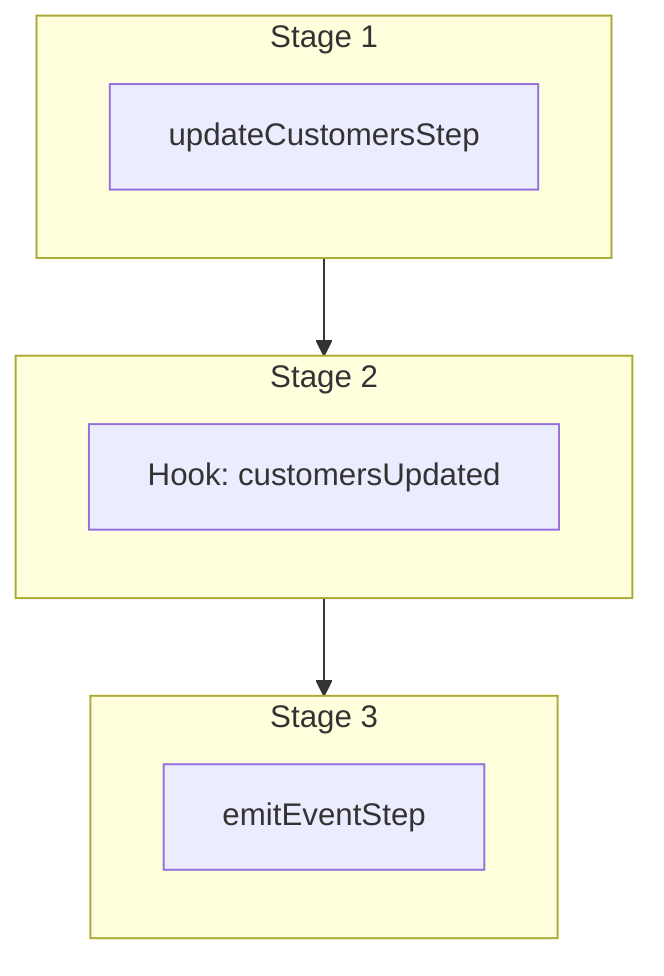

This documentation provides a reference to the `updateCustomersWorkflow`. It belongs to the `@medusajs/medusa/core-flows` package.

This workflow updates one or more customers. It's used by the [Update Customer Admin API Route](/api/admin/customers/update-a-customer) and
the [Update Customer Store API Route](/api/store/customers/update-customer).

This workflow has a hook that allows you to perform custom actions on the updated customer. For example, you can pass under `additional_data` custom data to update
custom data models linked to the customers.

You can also use this workflow within your customizations or your own custom workflows, allowing you to wrap custom logic around updating customers.

[View source code](https://github.com/medusajs/medusa/blob/0ed927bdb7a396a8fd5f6447ed69b7b354b150d3/packages/core/core-flows/src/customer/workflows/update-customers.ts#L60)

## Examples

**API Route**

```ts title="src/api/workflow/route.ts"
import type {
  MedusaRequest,
  MedusaResponse,
} from "@medusajs/framework/http"
import { updateCustomersWorkflow } from "@medusajs/medusa/core-flows"

export async function POST(
  req: MedusaRequest,
  res: MedusaResponse
) {
  const { result } = await updateCustomersWorkflow(req.scope)
    .run({
      input: {
        selector: {
          id: ["cus_123"]
        },
        update: {
          first_name: "John"
        }
      }
    })

  res.send(result)
}
```

**Subscriber**

```ts title="src/subscribers/order-placed.ts"
import {
  type SubscriberConfig,
  type SubscriberArgs,
} from "@medusajs/framework"
import { updateCustomersWorkflow } from "@medusajs/medusa/core-flows"

export default async function handleOrderPlaced({
  event: { data },
  container,
}: SubscriberArgs < { id: string } > ) {
  const { result } = await updateCustomersWorkflow(container)
    .run({
      input: {
        selector: {
          id: ["cus_123"]
        },
        update: {
          first_name: "John"
        }
      }
    })

  console.log(result)
}

export const config: SubscriberConfig = {
  event: "order.placed",
}
```

**Scheduled Job**

```ts title="src/jobs/message-daily.ts"
import { MedusaContainer } from "@medusajs/framework/types"
import { updateCustomersWorkflow } from "@medusajs/medusa/core-flows"

export default async function myCustomJob(
  container: MedusaContainer
) {
  const { result } = await updateCustomersWorkflow(container)
    .run({
      input: {
        selector: {
          id: ["cus_123"]
        },
        update: {
          first_name: "John"
        }
      }
    })

  console.log(result)
}

export const config = {
  name: "run-once-a-day",
  schedule: "0 0 * * *",
}
```

**Another Workflow**

```ts title="src/workflows/my-workflow.ts"
import { createWorkflow } from "@medusajs/framework/workflows-sdk"
import { updateCustomersWorkflow } from "@medusajs/medusa/core-flows"

const myWorkflow = createWorkflow(
  "my-workflow",
  () => {
    const result = updateCustomersWorkflow
      .runAsStep({
        input: {
          selector: {
            id: ["cus_123"]
          },
          update: {
            first_name: "John"
          }
        }
      })
  }
)
```

<a id="updatecustomersworkflow-steps" />

## Steps



Stages follow the order in the workflow definition. Conditional steps run only when their condition is met. The step descriptions below include the conditions and reference links.

- [updateCustomersStep](/resources/references/medusa-workflows/steps/updateCustomersStep): This step updates one or more customers.
  - [customersUpdated](/resources/references/medusa-workflows/updateCustomersWorkflow#customersupdated): This hook is executed after the customers are updated. You can consume this hook to perform custom actions on the updated customers.
    - [emitEventStep](/resources/references/medusa-workflows/steps/emitEventStep): This step emits an event, which you can listen to in a [subscriber](/learn/fundamentals/events-and-subscribers). You can pass data to the subscriber by including it in the `data` property. The event is only emitted after the workflow has finished successfully. So, even if it's executed in the middle of the workflow, it won't actually emit the event until the workflow has completed successfully. If the workflow fails, it won't emit the event at all.

<a id="updatecustomersworkflow-input" />

## Input

**updateCustomersWorkflow**

- `UpdateCustomersWorkflowInput`: [UpdateCustomersWorkflowInput](/resources/references/core_flows/core_core_flows_src/types/core_flowscore_core_flows_srcUpdateCustomersWorkflowInput)
  - `selector`: [FilterableCustomerProps](/resources/references/customer/interfaces/customerFilterableCustomerProps) — The filters to select the customers to update.
    - `q`: `string` (optional) — Searches for customers by properties such as name and email using this search term.
    - `id`: `string` | `string`\[] (optional) — The IDs to filter the customer by.
    - `email`: `string` | `string`\[] | [OperatorMap](/resources/references/customer/types/customerOperatorMap)\<string> (optional) — Filter by email.
      - `$and`: [Query](/resources/references/customer/types/customerQuery)\<T>\[] (optional)
      - `$or`: [Query](/resources/references/customer/types/customerQuery)\<T>\[] (optional)
      - `$eq`: [ExpandScalar](/resources/references/customer/types/customerExpandScalar)\<T> | [ExpandScalar](/resources/references/customer/types/customerExpandScalar)\<T>\[] (optional)
      - `$ne`: [ExpandScalar](/resources/references/customer/types/customerExpandScalar)\<T> (optional)
      - `$in`: [ExpandScalar](/resources/references/customer/types/customerExpandScalar)\<T>\[] (optional)
      - `$nin`: [ExpandScalar](/resources/references/customer/types/customerExpandScalar)\<T>\[] (optional)
      - `$not`: [Query](/resources/references/customer/types/customerQuery)\<T> (optional)
      - `$gt`: [ExpandScalar](/resources/references/customer/types/customerExpandScalar)\<T> (optional)
      - `$gte`: [ExpandScalar](/resources/references/customer/types/customerExpandScalar)\<T> (optional)
      - `$lt`: [ExpandScalar](/resources/references/customer/types/customerExpandScalar)\<T> (optional)
      - `$lte`: [ExpandScalar](/resources/references/customer/types/customerExpandScalar)\<T> (optional)
      - `$like`: `string` (optional)
      - `$re`: `string` (optional)
      - `$ilike`: `string` (optional)
      - `$fulltext`: `string` (optional)
      - `$overlap`: `string`\[] (optional)
      - `$contains`: `string`\[] (optional)
      - `$contained`: `string`\[] (optional)
      - `$exists`: `boolean` (optional)
    - `groups`: `string` | `string`\[] | [FilterableCustomerGroupProps](/resources/references/customer/interfaces/customerFilterableCustomerGroupProps) (optional) — Filter by associated customer group.
      - `q`: `string` (optional) — Searches for customer groups by name using this search term.
      - `id`: `string` | `string`\[] (optional) — The IDs to filter the customer group by.
      - `name`: `string` | [OperatorMap](/resources/references/customer/types/customerOperatorMap)\<string> (optional) — Filter customer groups by name.
      - `customers`: `string` | `string`\[] | [FilterableCustomerProps](/resources/references/customer/interfaces/customerFilterableCustomerProps) (optional) — Filter customer groups by associated customers.
      - `created_by`: `null` | `string` | `string`\[] (optional) — Filter customer groups by their `created_by` attribute.
      - `created_at`: [OperatorMap](/resources/references/customer/types/customerOperatorMap)\<string> (optional) — Filter customer groups by created date.
      - `updated_at`: [OperatorMap](/resources/references/customer/types/customerOperatorMap)\<string> (optional) — Filter customer groups by updated date.
      - `$and`: ([FilterableCustomerGroupProps](/resources/references/customer/interfaces/customerFilterableCustomerGroupProps) | [BaseFilterable](/resources/references/customer/interfaces/customerBaseFilterable)\<[FilterableCustomerGroupProps](/resources/references/customer/interfaces/customerFilterableCustomerGroupProps)>)\[] (optional) — An array of filters to apply on the entity, where each item in the array is joined with an "and" condition.
      - `$or`: ([FilterableCustomerGroupProps](/resources/references/customer/interfaces/customerFilterableCustomerGroupProps) | [BaseFilterable](/resources/references/customer/interfaces/customerBaseFilterable)\<[FilterableCustomerGroupProps](/resources/references/customer/interfaces/customerFilterableCustomerGroupProps)>)\[] (optional) — An array of filters to apply on the entity, where each item in the array is joined with an "or" condition.
    - `default_billing_address_id`: `null` | `string` | `string`\[] (optional) — Filter by the associated default billing address's ID.
    - `default_shipping_address_id`: `null` | `string` | `string`\[] (optional) — Filter by the associated default shipping address's ID.
    - `company_name`: `null` | `string` | `string`\[] | [OperatorMap](/resources/references/customer/types/customerOperatorMap)\<string> (optional) — Filter by company name.
      - `$and`: [Query](/resources/references/customer/types/customerQuery)\<T>\[] (optional)
      - `$or`: [Query](/resources/references/customer/types/customerQuery)\<T>\[] (optional)
      - `$eq`: [ExpandScalar](/resources/references/customer/types/customerExpandScalar)\<T> | [ExpandScalar](/resources/references/customer/types/customerExpandScalar)\<T>\[] (optional)
      - `$ne`: [ExpandScalar](/resources/references/customer/types/customerExpandScalar)\<T> (optional)
      - `$in`: [ExpandScalar](/resources/references/customer/types/customerExpandScalar)\<T>\[] (optional)
      - `$nin`: [ExpandScalar](/resources/references/customer/types/customerExpandScalar)\<T>\[] (optional)
      - `$not`: [Query](/resources/references/customer/types/customerQuery)\<T> (optional)
      - `$gt`: [ExpandScalar](/resources/references/customer/types/customerExpandScalar)\<T> (optional)
      - `$gte`: [ExpandScalar](/resources/references/customer/types/customerExpandScalar)\<T> (optional)
      - `$lt`: [ExpandScalar](/resources/references/customer/types/customerExpandScalar)\<T> (optional)
      - `$lte`: [ExpandScalar](/resources/references/customer/types/customerExpandScalar)\<T> (optional)
      - `$like`: `string` (optional)
      - `$re`: `string` (optional)
      - `$ilike`: `string` (optional)
      - `$fulltext`: `string` (optional)
      - `$overlap`: `string`\[] (optional)
      - `$contains`: `string`\[] (optional)
      - `$contained`: `string`\[] (optional)
      - `$exists`: `boolean` (optional)
    - `first_name`: `null` | `string` | `string`\[] | [OperatorMap](/resources/references/customer/types/customerOperatorMap)\<string> (optional) — Filter by first name.
      - `$and`: [Query](/resources/references/customer/types/customerQuery)\<T>\[] (optional)
      - `$or`: [Query](/resources/references/customer/types/customerQuery)\<T>\[] (optional)
      - `$eq`: [ExpandScalar](/resources/references/customer/types/customerExpandScalar)\<T> | [ExpandScalar](/resources/references/customer/types/customerExpandScalar)\<T>\[] (optional)
      - `$ne`: [ExpandScalar](/resources/references/customer/types/customerExpandScalar)\<T> (optional)
      - `$in`: [ExpandScalar](/resources/references/customer/types/customerExpandScalar)\<T>\[] (optional)
      - `$nin`: [ExpandScalar](/resources/references/customer/types/customerExpandScalar)\<T>\[] (optional)
      - `$not`: [Query](/resources/references/customer/types/customerQuery)\<T> (optional)
      - `$gt`: [ExpandScalar](/resources/references/customer/types/customerExpandScalar)\<T> (optional)
      - `$gte`: [ExpandScalar](/resources/references/customer/types/customerExpandScalar)\<T> (optional)
      - `$lt`: [ExpandScalar](/resources/references/customer/types/customerExpandScalar)\<T> (optional)
      - `$lte`: [ExpandScalar](/resources/references/customer/types/customerExpandScalar)\<T> (optional)
      - `$like`: `string` (optional)
      - `$re`: `string` (optional)
      - `$ilike`: `string` (optional)
      - `$fulltext`: `string` (optional)
      - `$overlap`: `string`\[] (optional)
      - `$contains`: `string`\[] (optional)
      - `$contained`: `string`\[] (optional)
      - `$exists`: `boolean` (optional)
    - `last_name`: `null` | `string` | `string`\[] | [OperatorMap](/resources/references/customer/types/customerOperatorMap)\<string> (optional) — Filter by last name.
      - `$and`: [Query](/resources/references/customer/types/customerQuery)\<T>\[] (optional)
      - `$or`: [Query](/resources/references/customer/types/customerQuery)\<T>\[] (optional)
      - `$eq`: [ExpandScalar](/resources/references/customer/types/customerExpandScalar)\<T> | [ExpandScalar](/resources/references/customer/types/customerExpandScalar)\<T>\[] (optional)
      - `$ne`: [ExpandScalar](/resources/references/customer/types/customerExpandScalar)\<T> (optional)
      - `$in`: [ExpandScalar](/resources/references/customer/types/customerExpandScalar)\<T>\[] (optional)
      - `$nin`: [ExpandScalar](/resources/references/customer/types/customerExpandScalar)\<T>\[] (optional)
      - `$not`: [Query](/resources/references/customer/types/customerQuery)\<T> (optional)
      - `$gt`: [ExpandScalar](/resources/references/customer/types/customerExpandScalar)\<T> (optional)
      - `$gte`: [ExpandScalar](/resources/references/customer/types/customerExpandScalar)\<T> (optional)
      - `$lt`: [ExpandScalar](/resources/references/customer/types/customerExpandScalar)\<T> (optional)
      - `$lte`: [ExpandScalar](/resources/references/customer/types/customerExpandScalar)\<T> (optional)
      - `$like`: `string` (optional)
      - `$re`: `string` (optional)
      - `$ilike`: `string` (optional)
      - `$fulltext`: `string` (optional)
      - `$overlap`: `string`\[] (optional)
      - `$contains`: `string`\[] (optional)
      - `$contained`: `string`\[] (optional)
      - `$exists`: `boolean` (optional)
    - `has_account`: `boolean` | [OperatorMap](/resources/references/customer/types/customerOperatorMap)\<boolean> (optional) — Filter by whether the customer has an account.
      - `$and`: [Query](/resources/references/customer/types/customerQuery)\<T>\[] (optional)
      - `$or`: [Query](/resources/references/customer/types/customerQuery)\<T>\[] (optional)
      - `$eq`: [ExpandScalar](/resources/references/customer/types/customerExpandScalar)\<T> | [ExpandScalar](/resources/references/customer/types/customerExpandScalar)\<T>\[] (optional)
      - `$ne`: [ExpandScalar](/resources/references/customer/types/customerExpandScalar)\<T> (optional)
      - `$in`: [ExpandScalar](/resources/references/customer/types/customerExpandScalar)\<T>\[] (optional)
      - `$nin`: [ExpandScalar](/resources/references/customer/types/customerExpandScalar)\<T>\[] (optional)
      - `$not`: [Query](/resources/references/customer/types/customerQuery)\<T> (optional)
      - `$gt`: [ExpandScalar](/resources/references/customer/types/customerExpandScalar)\<T> (optional)
      - `$gte`: [ExpandScalar](/resources/references/customer/types/customerExpandScalar)\<T> (optional)
      - `$lt`: [ExpandScalar](/resources/references/customer/types/customerExpandScalar)\<T> (optional)
      - `$lte`: [ExpandScalar](/resources/references/customer/types/customerExpandScalar)\<T> (optional)
      - `$like`: `string` (optional)
      - `$re`: `string` (optional)
      - `$ilike`: `string` (optional)
      - `$fulltext`: `string` (optional)
      - `$overlap`: `string`\[] (optional)
      - `$contains`: `string`\[] (optional)
      - `$contained`: `string`\[] (optional)
      - `$exists`: `boolean` (optional)
    - `created_by`: `null` | `string` | `string`\[] (optional) — Filter by the `created_by` attribute.
    - `created_at`: [OperatorMap](/resources/references/customer/types/customerOperatorMap)\<string> (optional) — Filter by created date.
      - `$and`: [Query](/resources/references/customer/types/customerQuery)\<T>\[] (optional)
      - `$or`: [Query](/resources/references/customer/types/customerQuery)\<T>\[] (optional)
      - `$eq`: [ExpandScalar](/resources/references/customer/types/customerExpandScalar)\<T> | [ExpandScalar](/resources/references/customer/types/customerExpandScalar)\<T>\[] (optional)
      - `$ne`: [ExpandScalar](/resources/references/customer/types/customerExpandScalar)\<T> (optional)
      - `$in`: [ExpandScalar](/resources/references/customer/types/customerExpandScalar)\<T>\[] (optional)
      - `$nin`: [ExpandScalar](/resources/references/customer/types/customerExpandScalar)\<T>\[] (optional)
      - `$not`: [Query](/resources/references/customer/types/customerQuery)\<T> (optional)
      - `$gt`: [ExpandScalar](/resources/references/customer/types/customerExpandScalar)\<T> (optional)
      - `$gte`: [ExpandScalar](/resources/references/customer/types/customerExpandScalar)\<T> (optional)
      - `$lt`: [ExpandScalar](/resources/references/customer/types/customerExpandScalar)\<T> (optional)
      - `$lte`: [ExpandScalar](/resources/references/customer/types/customerExpandScalar)\<T> (optional)
      - `$like`: `string` (optional)
      - `$re`: `string` (optional)
      - `$ilike`: `string` (optional)
      - `$fulltext`: `string` (optional)
      - `$overlap`: `string`\[] (optional)
      - `$contains`: `string`\[] (optional)
      - `$contained`: `string`\[] (optional)
      - `$exists`: `boolean` (optional)
    - `updated_at`: [OperatorMap](/resources/references/customer/types/customerOperatorMap)\<string> (optional) — Filter by updated date.
      - `$and`: [Query](/resources/references/customer/types/customerQuery)\<T>\[] (optional)
      - `$or`: [Query](/resources/references/customer/types/customerQuery)\<T>\[] (optional)
      - `$eq`: [ExpandScalar](/resources/references/customer/types/customerExpandScalar)\<T> | [ExpandScalar](/resources/references/customer/types/customerExpandScalar)\<T>\[] (optional)
      - `$ne`: [ExpandScalar](/resources/references/customer/types/customerExpandScalar)\<T> (optional)
      - `$in`: [ExpandScalar](/resources/references/customer/types/customerExpandScalar)\<T>\[] (optional)
      - `$nin`: [ExpandScalar](/resources/references/customer/types/customerExpandScalar)\<T>\[] (optional)
      - `$not`: [Query](/resources/references/customer/types/customerQuery)\<T> (optional)
      - `$gt`: [ExpandScalar](/resources/references/customer/types/customerExpandScalar)\<T> (optional)
      - `$gte`: [ExpandScalar](/resources/references/customer/types/customerExpandScalar)\<T> (optional)
      - `$lt`: [ExpandScalar](/resources/references/customer/types/customerExpandScalar)\<T> (optional)
      - `$lte`: [ExpandScalar](/resources/references/customer/types/customerExpandScalar)\<T> (optional)
      - `$like`: `string` (optional)
      - `$re`: `string` (optional)
      - `$ilike`: `string` (optional)
      - `$fulltext`: `string` (optional)
      - `$overlap`: `string`\[] (optional)
      - `$contains`: `string`\[] (optional)
      - `$contained`: `string`\[] (optional)
      - `$exists`: `boolean` (optional)
    - `$and`: ([FilterableCustomerProps](/resources/references/customer/interfaces/customerFilterableCustomerProps) | [BaseFilterable](/resources/references/customer/interfaces/customerBaseFilterable)\<[FilterableCustomerProps](/resources/references/customer/interfaces/customerFilterableCustomerProps)>)\[] (optional) — An array of filters to apply on the entity, where each item in the array is joined with an "and" condition.
      - `q`: `string` (optional) — Searches for customers by properties such as name and email using this search term.
      - `id`: `string` | `string`\[] (optional) — The IDs to filter the customer by.
      - `email`: `string` | `string`\[] | [OperatorMap](/resources/references/customer/types/customerOperatorMap)\<string> (optional) — Filter by email.
      - `groups`: `string` | `string`\[] | [FilterableCustomerGroupProps](/resources/references/customer/interfaces/customerFilterableCustomerGroupProps) (optional) — Filter by associated customer group.
      - `default_billing_address_id`: `null` | `string` | `string`\[] (optional) — Filter by the associated default billing address's ID.
      - `default_shipping_address_id`: `null` | `string` | `string`\[] (optional) — Filter by the associated default shipping address's ID.
      - `company_name`: `null` | `string` | `string`\[] | [OperatorMap](/resources/references/customer/types/customerOperatorMap)\<string> (optional) — Filter by company name.
      - `first_name`: `null` | `string` | `string`\[] | [OperatorMap](/resources/references/customer/types/customerOperatorMap)\<string> (optional) — Filter by first name.
      - `last_name`: `null` | `string` | `string`\[] | [OperatorMap](/resources/references/customer/types/customerOperatorMap)\<string> (optional) — Filter by last name.
      - `has_account`: `boolean` | [OperatorMap](/resources/references/customer/types/customerOperatorMap)\<boolean> (optional) — Filter by whether the customer has an account.
      - `created_by`: `null` | `string` | `string`\[] (optional) — Filter by the `created_by` attribute.
      - `created_at`: [OperatorMap](/resources/references/customer/types/customerOperatorMap)\<string> (optional) — Filter by created date.
      - `updated_at`: [OperatorMap](/resources/references/customer/types/customerOperatorMap)\<string> (optional) — Filter by updated date.
      - `$and`: ([FilterableCustomerProps](/resources/references/customer/interfaces/customerFilterableCustomerProps) | [BaseFilterable](/resources/references/customer/interfaces/customerBaseFilterable)\<[FilterableCustomerProps](/resources/references/customer/interfaces/customerFilterableCustomerProps)>)\[] (optional) — An array of filters to apply on the entity, where each item in the array is joined with an "and" condition.
      - `$or`: ([FilterableCustomerProps](/resources/references/customer/interfaces/customerFilterableCustomerProps) | [BaseFilterable](/resources/references/customer/interfaces/customerBaseFilterable)\<[FilterableCustomerProps](/resources/references/customer/interfaces/customerFilterableCustomerProps)>)\[] (optional) — An array of filters to apply on the entity, where each item in the array is joined with an "or" condition.
    - `$or`: ([FilterableCustomerProps](/resources/references/customer/interfaces/customerFilterableCustomerProps) | [BaseFilterable](/resources/references/customer/interfaces/customerBaseFilterable)\<[FilterableCustomerProps](/resources/references/customer/interfaces/customerFilterableCustomerProps)>)\[] (optional) — An array of filters to apply on the entity, where each item in the array is joined with an "or" condition.
      - `q`: `string` (optional) — Searches for customers by properties such as name and email using this search term.
      - `id`: `string` | `string`\[] (optional) — The IDs to filter the customer by.
      - `email`: `string` | `string`\[] | [OperatorMap](/resources/references/customer/types/customerOperatorMap)\<string> (optional) — Filter by email.
      - `groups`: `string` | `string`\[] | [FilterableCustomerGroupProps](/resources/references/customer/interfaces/customerFilterableCustomerGroupProps) (optional) — Filter by associated customer group.
      - `default_billing_address_id`: `null` | `string` | `string`\[] (optional) — Filter by the associated default billing address's ID.
      - `default_shipping_address_id`: `null` | `string` | `string`\[] (optional) — Filter by the associated default shipping address's ID.
      - `company_name`: `null` | `string` | `string`\[] | [OperatorMap](/resources/references/customer/types/customerOperatorMap)\<string> (optional) — Filter by company name.
      - `first_name`: `null` | `string` | `string`\[] | [OperatorMap](/resources/references/customer/types/customerOperatorMap)\<string> (optional) — Filter by first name.
      - `last_name`: `null` | `string` | `string`\[] | [OperatorMap](/resources/references/customer/types/customerOperatorMap)\<string> (optional) — Filter by last name.
      - `has_account`: `boolean` | [OperatorMap](/resources/references/customer/types/customerOperatorMap)\<boolean> (optional) — Filter by whether the customer has an account.
      - `created_by`: `null` | `string` | `string`\[] (optional) — Filter by the `created_by` attribute.
      - `created_at`: [OperatorMap](/resources/references/customer/types/customerOperatorMap)\<string> (optional) — Filter by created date.
      - `updated_at`: [OperatorMap](/resources/references/customer/types/customerOperatorMap)\<string> (optional) — Filter by updated date.
      - `$and`: ([FilterableCustomerProps](/resources/references/customer/interfaces/customerFilterableCustomerProps) | [BaseFilterable](/resources/references/customer/interfaces/customerBaseFilterable)\<[FilterableCustomerProps](/resources/references/customer/interfaces/customerFilterableCustomerProps)>)\[] (optional) — An array of filters to apply on the entity, where each item in the array is joined with an "and" condition.
      - `$or`: ([FilterableCustomerProps](/resources/references/customer/interfaces/customerFilterableCustomerProps) | [BaseFilterable](/resources/references/customer/interfaces/customerBaseFilterable)\<[FilterableCustomerProps](/resources/references/customer/interfaces/customerFilterableCustomerProps)>)\[] (optional) — An array of filters to apply on the entity, where each item in the array is joined with an "or" condition.
  - `update`: [CustomerUpdatableFields](/resources/references/customer/interfaces/customerCustomerUpdatableFields) — The data to update in the customers.
    - `company_name`: `null` | `string` (optional) — The company name of the customer.
    - `first_name`: `null` | `string` (optional) — The first name of the customer.
    - `last_name`: `null` | `string` (optional) — The last name of the customer.
    - `email`: `null` | `string` (optional) — The email of the customer.
    - `phone`: `null` | `string` (optional) — The phone of the customer.
    - `metadata`: [MetadataType](/resources/references/customer/types/customerMetadataType) (optional) — Holds custom data in key-value pairs.
  - `additional_data`: `Record<string, unknown>` (optional) — Additional data that can be passed through the `additional_data` property in HTTP requests. Learn more in [this documentation](/learn/fundamentals/api-routes/additional-data).

<a id="updatecustomersworkflow-output" />

## Output

**updateCustomersWorkflow**

- `CustomerDTO[]`: [CustomerDTO](/resources/references/customer/interfaces/customerCustomerDTO)\[]
  - `id`: `string` — The ID of the customer.
  - `email`: `string` — The email of the customer.
  - `has_account`: `boolean` — A flag indicating if customer has an account or not.
  - `default_billing_address_id`: `null` | `string` — The associated default billing address's ID.
  - `default_shipping_address_id`: `null` | `string` — The associated default shipping address's ID.
  - `company_name`: `null` | `string` — The company name of the customer.
  - `first_name`: `null` | `string` — The first name of the customer.
  - `last_name`: `null` | `string` — The last name of the customer.
  - `addresses`: [CustomerAddressDTO](/resources/references/customer/interfaces/customerCustomerAddressDTO)\[] — The addresses of the customer.
    - `id`: `string` — The ID of the customer address.
    - `address_name`: `string` (optional) — The address name of the customer address.
    - `is_default_shipping`: `boolean` — Whether the customer address is default shipping.
    - `is_default_billing`: `boolean` — Whether the customer address is default billing.
    - `customer_id`: `string` — The associated customer's ID.
    - `company`: `string` (optional) — The company of the customer address.
    - `first_name`: `string` (optional) — The first name of the customer address.
    - `last_name`: `string` (optional) — The last name of the customer address.
    - `address_1`: `string` (optional) — The address 1 of the customer address.
    - `address_2`: `string` (optional) — The address 2 of the customer address.
    - `city`: `string` (optional) — The city of the customer address.
    - `country_code`: `string` (optional) — The country code of the customer address.
    - `province`: `string` (optional) — The lower-case [ISO 3166-2](https://en.wikipedia.org/wiki/ISO_3166-2) province of the customer address.
    - `postal_code`: `string` (optional) — The postal code of the customer address.
    - `phone`: `string` (optional) — The phone of the customer address.
    - `metadata`: `Record<string, unknown>` (optional) — Holds custom data in key-value pairs.
    - `created_at`: `string` — The created at of the customer address.
    - `updated_at`: `string` — The updated at of the customer address.
  - `phone`: `null` | `string` — The phone of the customer.
  - `groups`: `object`\[] — The groups of the customer.
    - `id`: `string` — The ID of the group.
    - `name`: `string` — The name of the group.
  - `metadata`: `Record<string, unknown>` — Holds custom data in key-value pairs.
  - `created_by`: `null` | `string` — Who created the customer.
  - `deleted_at`: `null` | `string` | `Date` — The deletion date of the customer.
  - `created_at`: `string` | `Date` — The creation date of the customer.
  - `updated_at`: `string` | `Date` — The update date of the customer.

## Hooks

Hooks allow you to inject custom functionalities into the workflow. You'll receive data from the workflow, as well as additional data sent through an HTTP request.

Learn more about [Hooks](/learn/fundamentals/workflows/workflow-hooks) and [Additional Data](/learn/fundamentals/api-routes/additional-data).

### customersUpdated

This hook is executed after the customers are updated. You can consume this hook to perform custom actions on the updated customers.

#### Example

```ts
import { updateCustomersWorkflow } from "@medusajs/medusa/core-flows"

updateCustomersWorkflow.hooks.customersUpdated(
  (async ({ customers, additional_data }, { container }) => {
    //TODO
  })
)
```

<a id="input" />

#### Input

Handlers consuming this hook accept the following input.

**customersUpdated**

- `input`: object — The input data for the hook.
  - `customers`: [WorkflowDataProperties](/resources/references/workflows/types/workflowsWorkflowDataProperties)\<[CustomerDTO](/resources/references/customer/interfaces/customerCustomerDTO)\[]>
    - `__step__`: `string`
  - `additional_data`: `Record<string, unknown> | undefined` — Additional data that can be passed through the `additional_data` property in HTTP requests. Learn more in [this documentation](/learn/fundamentals/api-routes/additional-data).

<a id="updatecustomersworkflow-emitted-events" />

## Emitted Events

- `customer.updated`: Emitted when a customer is updated.

  ```ts
  {
    id, // The ID of the customer
  }
  ```
