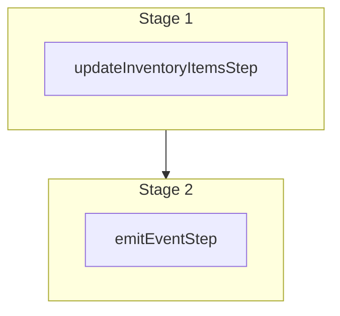

This documentation provides a reference to the `updateInventoryItemsWorkflow`. It belongs to the `@medusajs/medusa/core-flows` package.

This workflow updates one or more inventory items. It's used by the
[Update an Inventory Item Admin API Route](/api/admin/inventory-items/update-an-inventory-item).

You can use this workflow within your own customizations or custom workflows, allowing you
to update inventory items in your custom flows.

[View source code](https://github.com/medusajs/medusa/blob/0ed927bdb7a396a8fd5f6447ed69b7b354b150d3/packages/core/core-flows/src/inventory/workflows/update-inventory-items.ts#L54)

## Examples

**API Route**

```ts title="src/api/workflow/route.ts"
import type {
  MedusaRequest,
  MedusaResponse,
} from "@medusajs/framework/http"
import { updateInventoryItemsWorkflow } from "@medusajs/medusa/core-flows"

export async function POST(
  req: MedusaRequest,
  res: MedusaResponse
) {
  const { result } = await updateInventoryItemsWorkflow(req.scope)
    .run({
      input: {
        updates: [{
          id: "iitem_123",
          sku: "shirt",
        }]
      }
    })

  res.send(result)
}
```

**Subscriber**

```ts title="src/subscribers/order-placed.ts"
import {
  type SubscriberConfig,
  type SubscriberArgs,
} from "@medusajs/framework"
import { updateInventoryItemsWorkflow } from "@medusajs/medusa/core-flows"

export default async function handleOrderPlaced({
  event: { data },
  container,
}: SubscriberArgs < { id: string } > ) {
  const { result } = await updateInventoryItemsWorkflow(container)
    .run({
      input: {
        updates: [{
          id: "iitem_123",
          sku: "shirt",
        }]
      }
    })

  console.log(result)
}

export const config: SubscriberConfig = {
  event: "order.placed",
}
```

**Scheduled Job**

```ts title="src/jobs/message-daily.ts"
import { MedusaContainer } from "@medusajs/framework/types"
import { updateInventoryItemsWorkflow } from "@medusajs/medusa/core-flows"

export default async function myCustomJob(
  container: MedusaContainer
) {
  const { result } = await updateInventoryItemsWorkflow(container)
    .run({
      input: {
        updates: [{
          id: "iitem_123",
          sku: "shirt",
        }]
      }
    })

  console.log(result)
}

export const config = {
  name: "run-once-a-day",
  schedule: "0 0 * * *",
}
```

**Another Workflow**

```ts title="src/workflows/my-workflow.ts"
import { createWorkflow } from "@medusajs/framework/workflows-sdk"
import { updateInventoryItemsWorkflow } from "@medusajs/medusa/core-flows"

const myWorkflow = createWorkflow(
  "my-workflow",
  () => {
    const result = updateInventoryItemsWorkflow
      .runAsStep({
        input: {
          updates: [{
            id: "iitem_123",
            sku: "shirt",
          }]
        }
      })
  }
)
```

<a id="updateinventoryitemsworkflow-steps" />

## Steps



Stages follow the order in the workflow definition. Conditional steps run only when their condition is met. The step descriptions below include the conditions and reference links.

- [updateInventoryItemsStep](/resources/references/medusa-workflows/steps/updateInventoryItemsStep): This step updates one or more inventory items.
  - [emitEventStep](/resources/references/medusa-workflows/steps/emitEventStep): This step emits an event, which you can listen to in a [subscriber](/learn/fundamentals/events-and-subscribers). You can pass data to the subscriber by including it in the `data` property. The event is only emitted after the workflow has finished successfully. So, even if it's executed in the middle of the workflow, it won't actually emit the event until the workflow has completed successfully. If the workflow fails, it won't emit the event at all.

<a id="updateinventoryitemsworkflow-input" />

## Input

**updateInventoryItemsWorkflow**

- `UpdateInventoryItemsWorkflowInput`: [UpdateInventoryItemsWorkflowInput](/resources/references/core_flows/core_core_flows_src/interfaces/core_flowscore_core_flows_srcUpdateInventoryItemsWorkflowInput)
  - `updates`: [UpdateInventoryItemInput](/resources/references/types/InventoryTypes/interfaces/typesInventoryTypesUpdateInventoryItemInput)\[] — The items to update.
    - `id`: `string` — The ID of the inventory item to update.
    - `sku`: `null` | `string` (optional) — The SKU of the inventory item.
    - `origin_country`: `null` | `string` (optional) — The origin country of the inventory item.
    - `mid_code`: `null` | `string` (optional) — The MID code of the inventory item.
    - `material`: `null` | `string` (optional) — The material of the inventory item.
    - `unit_of_measure`: `null` | `string` (optional) — The unit of measure of the inventory item's quantities, such as `lb` or `kg`.
    - `weight`: `null` | `number` (optional) — The weight of the inventory item.
    - `length`: `null` | `number` (optional) — The length of the inventory item.
    - `height`: `null` | `number` (optional) — The height of the inventory item.
    - `width`: `null` | `number` (optional) — The width of the inventory item.
    - `title`: `null` | `string` (optional) — The title of the inventory item.
    - `description`: `null` | `string` (optional) — The description of the inventory item.
    - `thumbnail`: `null` | `string` (optional) — The thumbnail of the inventory item.
    - `metadata`: `null` | `Record<string, unknown>` (optional) — Holds custom data in key-value pairs.
    - `hs_code`: `null` | `string` (optional) — The HS code of the inventory item.
    - `requires_shipping`: `boolean` (optional) — Whether the inventory item requires shipping.

<a id="updateinventoryitemsworkflow-output" />

## Output

**updateInventoryItemsWorkflow**

- `UpdateInventoryItemsWorkflowOutput`: [UpdateInventoryItemsWorkflowOutput](/resources/references/core_flows/core_core_flows_src/types/core_flowscore_core_flows_srcUpdateInventoryItemsWorkflowOutput)
  - `id`: `string` — The ID of the inventory item.
  - `sku`: `null` | `string` (optional) — The SKU of the inventory item.
  - `origin_country`: `null` | `string` (optional) — The origin country of the inventory item.
  - `hs_code`: `null` | `string` (optional) — The HS code of the inventory item.
  - `requires_shipping`: `boolean` — Whether the inventory item requires shipping.
  - `mid_code`: `null` | `string` (optional) — The mid code of the inventory item.
  - `material`: `null` | `string` (optional) — The material of the inventory item.
  - `unit_of_measure`: `null` | `string` (optional) — The unit of measure of the inventory item's quantities, such as `lb` or `kg`.
  - `weight`: `null` | `number` (optional) — The weight of the inventory item.
  - `length`: `null` | `number` (optional) — The length of the inventory item.
  - `height`: `null` | `number` (optional) — The height of the inventory item.
  - `width`: `null` | `number` (optional) — The width of the inventory item.
  - `title`: `null` | `string` (optional) — The title of the inventory item.
  - `description`: `null` | `string` (optional) — The description of the inventory item.
  - `thumbnail`: `null` | `string` (optional) — The thumbnail of the inventory item.
  - `metadata`: `null` | `Record<string, unknown>` (optional) — Holds custom data in key-value pairs.
  - `created_at`: `string` | `Date` — The creation date of the inventory item.
  - `updated_at`: `string` | `Date` — The update date of the inventory item.
  - `deleted_at`: `null` | `string` | `Date` — The deletion date of the inventory item.

<a id="updateinventoryitemsworkflow-emitted-events" />

## Emitted Events

- `inventory-item.updated` (since v2.18.0): Emitted when inventory items are updated.

  ```ts
  {
    id, // The ID of the inventory item
  }
  ```
