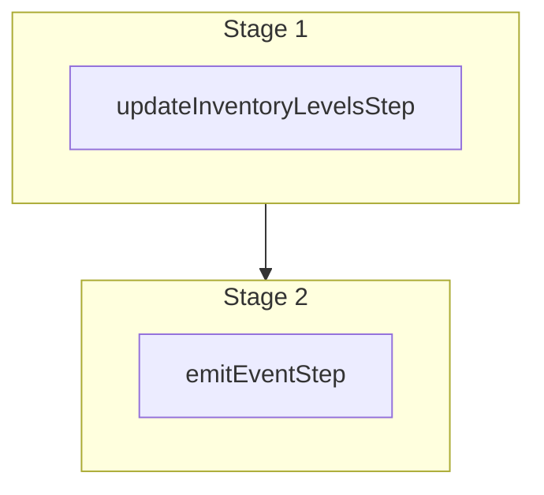

This documentation provides a reference to the `updateInventoryLevelsWorkflow`. It belongs to the `@medusajs/medusa/core-flows` package.

This workflow updates one or more inventory levels. It's used by the
[Update Inventory Level Admin API Route](/api/admin/inventory-items/update-inventory-level).

You can use this workflow within your own customizations or custom workflows, allowing you
to update inventory levels in your custom flows.

[View source code](https://github.com/medusajs/medusa/blob/0ed927bdb7a396a8fd5f6447ed69b7b354b150d3/packages/core/core-flows/src/inventory/workflows/update-inventory-levels.ts#L59)

## Examples

**API Route**

```ts title="src/api/workflow/route.ts"
import type {
  MedusaRequest,
  MedusaResponse,
} from "@medusajs/framework/http"
import { updateInventoryLevelsWorkflow } from "@medusajs/medusa/core-flows"

export async function POST(
  req: MedusaRequest,
  res: MedusaResponse
) {
  const { result } = await updateInventoryLevelsWorkflow(req.scope)
    .run({
      input: {
        updates: [{
          id: "iilev_123",
          inventory_item_id: "iitem_123",
          location_id: "sloc_123",
          stocked_quantity: 10,
        }]
      }
    })

  res.send(result)
}
```

**Subscriber**

```ts title="src/subscribers/order-placed.ts"
import {
  type SubscriberConfig,
  type SubscriberArgs,
} from "@medusajs/framework"
import { updateInventoryLevelsWorkflow } from "@medusajs/medusa/core-flows"

export default async function handleOrderPlaced({
  event: { data },
  container,
}: SubscriberArgs < { id: string } > ) {
  const { result } = await updateInventoryLevelsWorkflow(container)
    .run({
      input: {
        updates: [{
          id: "iilev_123",
          inventory_item_id: "iitem_123",
          location_id: "sloc_123",
          stocked_quantity: 10,
        }]
      }
    })

  console.log(result)
}

export const config: SubscriberConfig = {
  event: "order.placed",
}
```

**Scheduled Job**

```ts title="src/jobs/message-daily.ts"
import { MedusaContainer } from "@medusajs/framework/types"
import { updateInventoryLevelsWorkflow } from "@medusajs/medusa/core-flows"

export default async function myCustomJob(
  container: MedusaContainer
) {
  const { result } = await updateInventoryLevelsWorkflow(container)
    .run({
      input: {
        updates: [{
          id: "iilev_123",
          inventory_item_id: "iitem_123",
          location_id: "sloc_123",
          stocked_quantity: 10,
        }]
      }
    })

  console.log(result)
}

export const config = {
  name: "run-once-a-day",
  schedule: "0 0 * * *",
}
```

**Another Workflow**

```ts title="src/workflows/my-workflow.ts"
import { createWorkflow } from "@medusajs/framework/workflows-sdk"
import { updateInventoryLevelsWorkflow } from "@medusajs/medusa/core-flows"

const myWorkflow = createWorkflow(
  "my-workflow",
  () => {
    const result = updateInventoryLevelsWorkflow
      .runAsStep({
        input: {
          updates: [{
            id: "iilev_123",
            inventory_item_id: "iitem_123",
            location_id: "sloc_123",
            stocked_quantity: 10,
          }]
        }
      })
  }
)
```

<a id="updateinventorylevelsworkflow-steps" />

## Steps



Stages follow the order in the workflow definition. Conditional steps run only when their condition is met. The step descriptions below include the conditions and reference links.

- [updateInventoryLevelsStep](/resources/references/medusa-workflows/steps/updateInventoryLevelsStep): This step updates one or more inventory levels.
  - [emitEventStep](/resources/references/medusa-workflows/steps/emitEventStep): This step emits an event, which you can listen to in a [subscriber](/learn/fundamentals/events-and-subscribers). You can pass data to the subscriber by including it in the `data` property. The event is only emitted after the workflow has finished successfully. So, even if it's executed in the middle of the workflow, it won't actually emit the event until the workflow has completed successfully. If the workflow fails, it won't emit the event at all.

<a id="updateinventorylevelsworkflow-input" />

## Input

**updateInventoryLevelsWorkflow**

- `UpdateInventoryLevelsWorkflowInput`: [UpdateInventoryLevelsWorkflowInput](/resources/references/core_flows/core_core_flows_src/interfaces/core_flowscore_core_flows_srcUpdateInventoryLevelsWorkflowInput)
  - `updates`: [UpdateInventoryLevelInput](/resources/references/types/InventoryTypes/interfaces/typesInventoryTypesUpdateInventoryLevelInput)\[] — The inventory levels to update.
    - `id`: `string` (optional) — ID of the inventory level to update
    - `inventory_item_id`: `string` — The ID of the associated inventory item.
    - `location_id`: `string` — The ID of the associated location.
    - `stocked_quantity`: `number` (optional) — The stocked quantity of the associated inventory item in the associated location.
    - `incoming_quantity`: `number` (optional) — The incoming quantity of the associated inventory item in the associated location.

<a id="updateinventorylevelsworkflow-output" />

## Output

**updateInventoryLevelsWorkflow**

- `UpdateInventoryLevelsWorkflowOutput`: [UpdateInventoryLevelsWorkflowOutput](/resources/references/core_flows/core_core_flows_src/types/core_flowscore_core_flows_srcUpdateInventoryLevelsWorkflowOutput)
  - `id`: `string` — The ID of the inventory level.
  - `inventory_item_id`: `string` — The associated inventory item's ID.
  - `location_id`: `string` — The associated location's ID.
  - `stocked_quantity`: `number` — The stocked quantity of the inventory level.
  - `reserved_quantity`: `number` — The reserved quantity of the inventory level.
  - `incoming_quantity`: `number` — The incoming quantity of the inventory level.
  - `available_quantity`: `number` — The available quantity of the inventory level.
  - `metadata`: `null` | `Record<string, unknown>` — Holds custom data in key-value pairs.
  - `created_at`: `string` | `Date` — The creation date of the inventory level.
  - `updated_at`: `string` | `Date` — The update date of the inventory level.
  - `deleted_at`: `null` | `string` | `Date` — The deletion date of the inventory level.

<a id="updateinventorylevelsworkflow-emitted-events" />

## Emitted Events

- `inventory-level.updated` (since v2.18.0): Emitted when inventory levels are updated. This includes adjustments to the stocked or reserved quantity, such as during order fulfillment.

  ```ts
  {
    id, // The ID of the inventory level
    order_id, // (optional) The ID of the order, if the update was triggered by an order flow
  }
  ```
