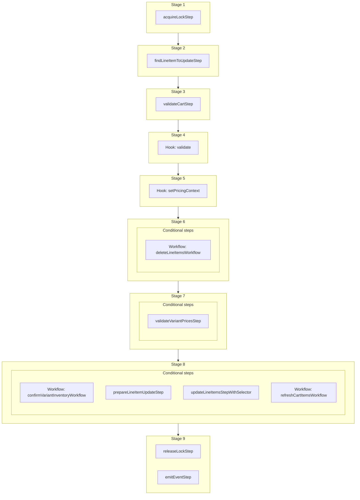

This documentation provides a reference to the `updateLineItemInCartWorkflow`. It belongs to the `@medusajs/medusa/core-flows` package.

This workflow updates a line item's details in a cart. You can update the line item's quantity, unit price, and more.
If the quantity is set to 0, the item will be removed from the cart.
This workflow is executed by the [Update Line Item Store API Route](/api/store/carts/update-line-item).

You can use this workflow within your own customizations or custom workflows, allowing you to update a line item's details in your custom flows.

> **Note**
>
> If you use this workflow in another, you must acquire a lock before running it and release the lock after. Learn more in the [Locking Operations in Workflows](/learn/fundamentals/workflows/locks#locks-in-nested-workflows) guide.

[View source code](https://github.com/medusajs/medusa/blob/0ed927bdb7a396a8fd5f6447ed69b7b354b150d3/packages/core/core-flows/src/cart/workflows/update-line-item-in-cart.ts#L212)

## Examples

**API Route**

```ts title="src/api/workflow/route.ts"
import type {
  MedusaRequest,
  MedusaResponse,
} from "@medusajs/framework/http"
import { updateLineItemInCartWorkflow } from "@medusajs/medusa/core-flows"

export async function POST(
  req: MedusaRequest,
  res: MedusaResponse
) {
  const { result } = await updateLineItemInCartWorkflow(req.scope)
    .run({
      input: {
        cart_id: "cart_123",
        item_id: "item_123",
        update: {
          quantity: 2
        }
      }
    })

  res.send(result)
}
```

**Subscriber**

```ts title="src/subscribers/order-placed.ts"
import {
  type SubscriberConfig,
  type SubscriberArgs,
} from "@medusajs/framework"
import { updateLineItemInCartWorkflow } from "@medusajs/medusa/core-flows"

export default async function handleOrderPlaced({
  event: { data },
  container,
}: SubscriberArgs < { id: string } > ) {
  const { result } = await updateLineItemInCartWorkflow(container)
    .run({
      input: {
        cart_id: "cart_123",
        item_id: "item_123",
        update: {
          quantity: 2
        }
      }
    })

  console.log(result)
}

export const config: SubscriberConfig = {
  event: "order.placed",
}
```

**Scheduled Job**

```ts title="src/jobs/message-daily.ts"
import { MedusaContainer } from "@medusajs/framework/types"
import { updateLineItemInCartWorkflow } from "@medusajs/medusa/core-flows"

export default async function myCustomJob(
  container: MedusaContainer
) {
  const { result } = await updateLineItemInCartWorkflow(container)
    .run({
      input: {
        cart_id: "cart_123",
        item_id: "item_123",
        update: {
          quantity: 2
        }
      }
    })

  console.log(result)
}

export const config = {
  name: "run-once-a-day",
  schedule: "0 0 * * *",
}
```

**Another Workflow**

```ts title="src/workflows/my-workflow.ts"
import { createWorkflow } from "@medusajs/framework/workflows-sdk"
import { updateLineItemInCartWorkflow } from "@medusajs/medusa/core-flows"

const myWorkflow = createWorkflow(
  "my-workflow",
  () => {
    // Acquire lock from nested workflow here
    // acquireLockStep({  key: input.cart_id,  timeout: 2,  ttl: 10,  })
    const result = updateLineItemInCartWorkflow
      .runAsStep({
        input: {
          cart_id: "cart_123",
          item_id: "item_123",
          update: {
            quantity: 2
          }
        }
      })
    // Release lock here
    // releaseLockStep({ key: input.cart_id })
  }
)
```

<a id="updatelineitemincartworkflow-steps" />

## Steps



Stages follow the order in the workflow definition. Conditional steps run only when their condition is met. The step descriptions below include the conditions and reference links.

- [acquireLockStep](/resources/references/medusa-workflows/steps/acquireLockStep): This step acquires a lock for a given key. Learn more about locks in the [Locking Module](/resources/infrastructure-modules/locking) guide.
  - [findLineItemToUpdateStep](/resources/references/medusa-workflows/findLineItemToUpdateStep): This step finds the line item to update in the cart and collects its variant id. It throws an error if the line item isn't found in the cart.
    - [validateCartStep](/resources/references/medusa-workflows/steps/validateCartStep): This step validates a cart to ensure it exists and is not completed. If not valid, the step throws an error. :::tip You can use the [retrieveCartStep](/resources/references/medusa-workflows/steps/retrieveCartStep) to retrieve a cart's details. :::
      - [validate](/resources/references/medusa-workflows/updateLineItemInCartWorkflow#validate): This hook is executed before all operations. You can consume this hook to perform any custom validation. If validation fails, you can throw an error to stop the workflow execution.
        - [setPricingContext](/resources/references/medusa-workflows/updateLineItemInCartWorkflow#setpricingcontext): This hook is executed after the order is retrieved and before the line items are created. You can consume this hook to return any custom context useful for the prices retrieval of the variants to be added to the order. For example, assuming you have the following custom pricing rule: `json { "attribute": "location_id", "operator": "eq", "value": "sloc_123", } ` You can consume the `setPricingContext` hook to add the `location_id` context to the prices calculation: `ts import { addOrderLineItemsWorkflow } from "@medusajs/medusa/core-flows"; import { StepResponse } from "@medusajs/workflows-sdk"; addOrderLineItemsWorkflow.hooks.setPricingContext(( { order, variantIds, region, customerData, additional_data }, { container } ) => { return new StepResponse({ location_id: "sloc_123", // Special price for in-store purchases }); }); ` The variants' prices will now be retrieved using the context you return. :::note Learn more about prices calculation context in the [Prices Calculation](/resources/commerce-modules/pricing/price-calculation) documentation. :::
          - **when** (when: shouldRemoveItem)
          - [deleteLineItemsWorkflow](/resources/references/medusa-workflows/deleteLineItemsWorkflow): Delete line items from a cart.
            - **when** (when: \{
              return !!variantIds.length && !shouldRemoveItem
              })
            - [validateVariantPricesStep](/resources/references/medusa-workflows/steps/validateVariantPricesStep): This step validates the specified variant objects to ensure they have prices. If not valid, the step throws an error.
              - **when** (when: !shouldRemoveItem)
              - [confirmVariantInventoryWorkflow](/resources/references/medusa-workflows/confirmVariantInventoryWorkflow): Validate that a variant is in-stock before adding to the cart.
              - [prepareLineItemUpdateStep](/resources/references/medusa-workflows/prepareLineItemUpdateStep): This step builds the update payload for a cart line item, resolving its unit price (from the input, the variant's calculated price, or the existing item), its compare-at unit price, and tax inclusivity. It throws an error if the resulting unit price is unset.
              - [updateLineItemsStepWithSelector](/resources/references/medusa-workflows/steps/updateLineItemsStepWithSelector): This step updates line items.
              - [refreshCartItemsWorkflow](/resources/references/medusa-workflows/refreshCartItemsWorkflow): Refresh a cart's details after an update.
                - [releaseLockStep](/resources/references/medusa-workflows/steps/releaseLockStep): This step releases a lock for a given key. Learn more about locks in the [Locking Module](/resources/infrastructure-modules/locking) guide.
                - [emitEventStep](/resources/references/medusa-workflows/steps/emitEventStep): This step emits an event, which you can listen to in a [subscriber](/learn/fundamentals/events-and-subscribers). You can pass data to the subscriber by including it in the `data` property. The event is only emitted after the workflow has finished successfully. So, even if it's executed in the middle of the workflow, it won't actually emit the event until the workflow has completed successfully. If the workflow fails, it won't emit the event at all.

<a id="updatelineitemincartworkflow-input" />

## Input

**updateLineItemInCartWorkflow**

- `UpdateLineItemInCartWorkflowInputDTO & AdditionalData`: [UpdateLineItemInCartWorkflowInputDTO](/resources/references/types/interfaces/typesUpdateLineItemInCartWorkflowInputDTO) & [AdditionalData](/resources/references/types/HttpTypes/types/typesHttpTypesAdditionalData)
  - `UpdateLineItemInCartWorkflowInputDTO`: [UpdateLineItemInCartWorkflowInputDTO](/resources/references/types/interfaces/typesUpdateLineItemInCartWorkflowInputDTO) — The details of the line item to update.
    - `cart_id`: `string` — The ID of the cart that the line item belongs to.
    - `item_id`: `string` — The ID of the line item to update.
    - `update`: Partial\<[UpdateLineItemDTO](/resources/references/cart/interfaces/cartUpdateLineItemDTO)> — The details to update in the line item.
      - `subtitle`: `string` (optional) — The subtitle of the line item.
      - `thumbnail`: `string` (optional) — The thumbnail of the line item.
      - `cart_id`: `string` (optional) — The associated cart's ID.
      - `product_id`: `string` (optional) — The associated product's ID.
      - `product_title`: `string` (optional) — The title of the associated product.
      - `product_description`: `string` (optional) — The description of the associated product.
      - `product_subtitle`: `string` (optional) — The subtitle of the associated product.
      - `product_type`: `string` (optional) — The type of the associated product.
      - `product_type_id`: `string` (optional) — The ID of type of the associated product.
      - `product_collection`: `string` (optional) — The collection of the associated product.
      - `product_handle`: `string` (optional) — The handle of the associated product.
      - `variant_id`: `string` (optional) — The associated variant's ID.
      - `variant_sku`: `string` (optional) — The SKU of the associated variant.
      - `variant_barcode`: `string` (optional) — The barcode of the associated variant.
      - `variant_title`: `string` (optional) — The title of the associated variant.
      - `variant_option_values`: `Record<string, unknown>` (optional) — The option values of the associated variant.
      - `requires_shipping`: `boolean` (optional) — Whether the line item requires shipping.
      - `is_discountable`: `boolean` (optional) — Whether the line item is discountable.
      - `is_tax_inclusive`: `boolean` (optional) — Whether the line item's amount is tax inclusive.
      - `is_custom_price`: `boolean` (optional) — Whether the line item's amount is a custom price.
      - `compare_at_unit_price`: [BigNumberInput](/resources/references/cart/types/cartBigNumberInput) (optional) — The calculated price of the line item after applying promotions.
      - `id`: `string` — The ID of the line item.
      - `title`: `string` (optional) — The title of the line item.
      - `quantity`: [BigNumberInput](/resources/references/cart/types/cartBigNumberInput) (optional) — The quantity of the line item in the cart.
      - `unit_price`: [BigNumberInput](/resources/references/cart/types/cartBigNumberInput) (optional) — The unit price of the line item.
      - `metadata`: `null` | `Record<string, unknown>` (optional) — Holds custom data in key-value pairs.
      - `tax_lines`: [CreateTaxLineDTO](/resources/references/cart/interfaces/cartCreateTaxLineDTO)\[] | [UpdateTaxLineDTO](/resources/references/cart/interfaces/cartUpdateTaxLineDTO)\[] (optional) — The tax lines of the line item.
      - `adjustments`: [CreateAdjustmentDTO](/resources/references/cart/interfaces/cartCreateAdjustmentDTO)\[] | [UpdateAdjustmentDTO](/resources/references/cart/interfaces/cartUpdateAdjustmentDTO)\[] (optional) — The adjustments of the line item.
  - `AdditionalData`: [AdditionalData](/resources/references/types/HttpTypes/types/typesHttpTypesAdditionalData)
    - `additional_data`: `Record<string, unknown>` (optional) — Additional data that can be passed through the `additional_data` property in HTTP requests. Learn more in [this documentation](/learn/fundamentals/api-routes/additional-data).

## Hooks

Hooks allow you to inject custom functionalities into the workflow. You'll receive data from the workflow, as well as additional data sent through an HTTP request.

Learn more about [Hooks](/learn/fundamentals/workflows/workflow-hooks) and [Additional Data](/learn/fundamentals/api-routes/additional-data).

### validate

This hook is executed before all operations. You can consume this hook to perform any custom validation. If validation fails, you can throw an error to stop the workflow execution.

#### Example

```ts
import { updateLineItemInCartWorkflow } from "@medusajs/medusa/core-flows"

updateLineItemInCartWorkflow.hooks.validate(
  (async ({ input, cart }, { container }) => {
    //TODO
  })
)
```

<a id="input" />

#### Input

Handlers consuming this hook accept the following input.

**validate**

- `input`: object — The input data for the hook.
  - `input`: [UpdateLineItemInCartWorkflowInputDTO](/resources/references/types/interfaces/typesUpdateLineItemInCartWorkflowInputDTO) & [AdditionalData](/resources/references/types/HttpTypes/types/typesHttpTypesAdditionalData)
    - `cart_id`: `string` — The ID of the cart that the line item belongs to.
    - `item_id`: `string` — The ID of the line item to update.
    - `update`: Partial\<[UpdateLineItemDTO](/resources/references/cart/interfaces/cartUpdateLineItemDTO)> — The details to update in the line item.
    - `additional_data`: `Record<string, unknown>` (optional) — Additional data that can be passed through the `additional_data` property in HTTP requests. Learn more in [this documentation](/learn/fundamentals/api-routes/additional-data).
  - `cart`: `any`

### setPricingContext

This hook is executed before the cart is updated. You can consume this hook to return any custom context useful for the prices retrieval of the line item's variant.

For example, assuming you have the following custom pricing rule:

```json
{
  "attribute": "location_id",
  "operator": "eq",
  "value": "sloc_123",
}
```

You can consume the `setPricingContext` hook to add the `location_id` context to the prices calculation:

```ts
import { addToCartWorkflow } from "@medusajs/medusa/core-flows";
import { StepResponse } from "@medusajs/workflows-sdk";

addToCartWorkflow.hooks.setPricingContext((
  { cart, variantIds, items, additional_data }, { container }
) => {
  return new StepResponse({
    location_id: "sloc_123", // Special price for in-store purchases
  });
});
```

The variant's prices will now be retrieved using the context you return.

> **Note**
>
> Learn more about prices calculation context in the [Prices Calculation](/resources/commerce-modules/pricing/price-calculation) documentation.

#### Example

```ts
import { updateLineItemInCartWorkflow } from "@medusajs/medusa/core-flows"

updateLineItemInCartWorkflow.hooks.setPricingContext(
  (async ({ cart, item, variantIds, additional_data }, { container }) => {
    //TODO
  })
)
```

<a id="input-1" />

#### Input

Handlers consuming this hook accept the following input.

**setPricingContext**

- `input`: object — The input data for the hook.
  - `cart`: `any`
  - `item`: [CartLineItemDTO](/resources/references/cart/interfaces/cartCartLineItemDTO) — The cart line item details.
    - `original_total`: [BigNumberValue](/resources/references/cart/types/cartBigNumberValue) — The original total of the cart line item.
    - `original_subtotal`: [BigNumberValue](/resources/references/cart/types/cartBigNumberValue) — The original subtotal of the cart line item.
    - `original_tax_total`: [BigNumberValue](/resources/references/cart/types/cartBigNumberValue) — The original tax total of the cart line item.
    - `item_total`: [BigNumberValue](/resources/references/cart/types/cartBigNumberValue) — The item total of the cart line item.
    - `item_subtotal`: [BigNumberValue](/resources/references/cart/types/cartBigNumberValue) — The item subtotal of the cart line item.
    - `item_tax_total`: [BigNumberValue](/resources/references/cart/types/cartBigNumberValue) — The item tax total of the cart line item.
    - `total`: [BigNumberValue](/resources/references/cart/types/cartBigNumberValue) — The total of the cart line item.
    - `subtotal`: [BigNumberValue](/resources/references/cart/types/cartBigNumberValue) — The subtotal of the cart line item.
    - `tax_total`: [BigNumberValue](/resources/references/cart/types/cartBigNumberValue) — The tax total of the cart line item.
    - `discount_total`: [BigNumberValue](/resources/references/cart/types/cartBigNumberValue) — The discount total of the cart line item.
    - `discount_tax_total`: [BigNumberValue](/resources/references/cart/types/cartBigNumberValue) — The discount tax total of the cart line item.
    - `raw_original_total`: [BigNumberRawValue](/resources/references/cart/types/cartBigNumberRawValue) — The raw original total of the cart line item.
    - `raw_original_subtotal`: [BigNumberRawValue](/resources/references/cart/types/cartBigNumberRawValue) — The raw original subtotal of the cart line item.
    - `raw_original_tax_total`: [BigNumberRawValue](/resources/references/cart/types/cartBigNumberRawValue) — The raw original tax total of the cart line item.
    - `raw_item_total`: [BigNumberRawValue](/resources/references/cart/types/cartBigNumberRawValue) — The raw item total of the cart line item.
    - `raw_item_subtotal`: [BigNumberRawValue](/resources/references/cart/types/cartBigNumberRawValue) — The raw item subtotal of the cart line item.
    - `raw_item_tax_total`: [BigNumberRawValue](/resources/references/cart/types/cartBigNumberRawValue) — The raw item tax total of the cart line item.
    - `raw_total`: [BigNumberRawValue](/resources/references/cart/types/cartBigNumberRawValue) — The raw total of the cart line item.
    - `raw_subtotal`: [BigNumberRawValue](/resources/references/cart/types/cartBigNumberRawValue) — The raw subtotal of the cart line item.
    - `raw_tax_total`: [BigNumberRawValue](/resources/references/cart/types/cartBigNumberRawValue) — The raw tax total of the cart line item.
    - `raw_discount_total`: [BigNumberRawValue](/resources/references/cart/types/cartBigNumberRawValue) — The raw discount total of the cart line item.
    - `raw_discount_tax_total`: [BigNumberRawValue](/resources/references/cart/types/cartBigNumberRawValue) — The raw discount tax total of the cart line item.
    - `id`: `string` — The ID of the line item.
    - `title`: `string` — The title of the line item.
    - `quantity`: [BigNumberValue](/resources/references/cart/types/cartBigNumberValue) — The line item's quantity in the cart.
    - `requires_shipping`: `boolean` — Whether the line item requires shipping.
    - `is_discountable`: `boolean` — Whether the line item is discountable.
    - `is_giftcard`: `boolean` — Whether the line item is a gift card.
    - `is_tax_inclusive`: `boolean` — Whether the line item price is tax inclusive.
    - `is_custom_price`: `boolean` — Whether the line item price is a custom price.
    - `unit_price`: [BigNumberValue](/resources/references/cart/types/cartBigNumberValue) — The unit price of the item.
    - `cart`: [CartDTO](/resources/references/cart/interfaces/cartCartDTO) — The associated cart.
    - `cart_id`: `string` — The ID of the associated cart.
    - `subtitle`: `string` (optional) — The subtitle of the line item.
    - `thumbnail`: `string` (optional) — The line item's thumbnail.
    - `product_id`: `string` (optional) — The ID of the associated product.
    - `product_title`: `string` (optional) — The title of the associated product.
    - `product_description`: `string` (optional) — The description of the associated product.
    - `product_subtitle`: `string` (optional) — The subtitle of the associated product.
    - `product_type`: `string` (optional) — The type of the associated product.
    - `product_type_id`: `string` (optional) — The type of the associated product.
    - `product_collection`: `string` (optional) — The collection of the associated product.
    - `product_handle`: `string` (optional) — The handle of the associated product.
    - `variant_id`: `string` (optional) — The associated variant's ID of the line item.
    - `variant_sku`: `string` (optional) — The sku of the associated variant.
    - `variant_barcode`: `string` (optional) — The barcode of the associated variant.
    - `variant_title`: `string` (optional) — The title of the associated variant.
    - `variant_option_values`: `Record<string, unknown>` (optional) — The option values of the associated variant.
    - `compare_at_unit_price`: [BigNumberValue](/resources/references/cart/types/cartBigNumberValue) (optional) — The calculated price of the line item.
    - `tax_lines`: [LineItemTaxLineDTO](/resources/references/cart/interfaces/cartLineItemTaxLineDTO)\[] (optional) — The associated tax lines.
    - `adjustments`: [LineItemAdjustmentDTO](/resources/references/cart/interfaces/cartLineItemAdjustmentDTO)\[] (optional) — The associated adjustments.
    - `metadata`: `null` | `Record<string, unknown>` (optional) — Holds custom data in key-value pairs.
    - `created_at`: `Date` (optional) — When the line item was created.
    - `updated_at`: `Date` (optional) — When the line item was updated.
    - `deleted_at`: `Date` (optional) — When the line item was deleted.
  - `variantIds`: (`undefined` | `string`)\[]
  - `additional_data`: `Record<string, unknown> | undefined` — Additional data that can be passed through the `additional_data` property in HTTP requests. Learn more in [this documentation](/learn/fundamentals/api-routes/additional-data).

<a id="updatelineitemincartworkflow-emitted-events" />

## Emitted Events

- `cart.updated`: Emitted when a cart's details are updated.

  ```ts
  {
    id, // The ID of the cart
  }
  ```
