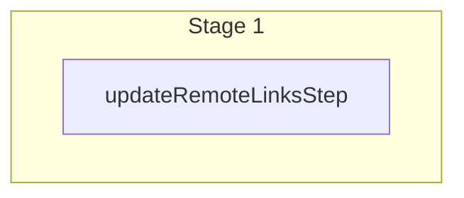

This documentation provides a reference to the `updateLinksWorkflow`. It belongs to the `@medusajs/medusa/core-flows` package.

This workflow updates one or more links between records.

You can use this workflow within your customizations or your own custom workflows, allowing you to
update links within your custom flows.

Learn more about links in [this documentation](/learn/fundamentals/module-links/link).

[View source code](https://github.com/medusajs/medusa/blob/0ed927bdb7a396a8fd5f6447ed69b7b354b150d3/packages/core/core-flows/src/common/workflows/update-links.ts#L43)

## Examples

**API Route**

```ts title="src/api/workflow/route.ts"
import type {
  MedusaRequest,
  MedusaResponse,
} from "@medusajs/framework/http"
import { updateLinksWorkflow } from "@medusajs/medusa/core-flows"

export async function POST(
  req: MedusaRequest,
  res: MedusaResponse
) {
  const { result } = await updateLinksWorkflow(req.scope)
    .run({
      input: [{
        // import { Modules } from "@medusajs/framework/utils"
        [Modules.PRODUCT]: {
          product_id: "prod_123",
        },
        "helloModuleService": {
          my_custom_id: "mc_123",
        },
        data: {
          metadata: {
            test: false,
          },
        }
      }]
    })

  res.send(result)
}
```

**Subscriber**

```ts title="src/subscribers/order-placed.ts"
import {
  type SubscriberConfig,
  type SubscriberArgs,
} from "@medusajs/framework"
import { updateLinksWorkflow } from "@medusajs/medusa/core-flows"

export default async function handleOrderPlaced({
  event: { data },
  container,
}: SubscriberArgs < { id: string } > ) {
  const { result } = await updateLinksWorkflow(container)
    .run({
      input: [{
        // import { Modules } from "@medusajs/framework/utils"
        [Modules.PRODUCT]: {
          product_id: "prod_123",
        },
        "helloModuleService": {
          my_custom_id: "mc_123",
        },
        data: {
          metadata: {
            test: false,
          },
        }
      }]
    })

  console.log(result)
}

export const config: SubscriberConfig = {
  event: "order.placed",
}
```

**Scheduled Job**

```ts title="src/jobs/message-daily.ts"
import { MedusaContainer } from "@medusajs/framework/types"
import { updateLinksWorkflow } from "@medusajs/medusa/core-flows"

export default async function myCustomJob(
  container: MedusaContainer
) {
  const { result } = await updateLinksWorkflow(container)
    .run({
      input: [{
        // import { Modules } from "@medusajs/framework/utils"
        [Modules.PRODUCT]: {
          product_id: "prod_123",
        },
        "helloModuleService": {
          my_custom_id: "mc_123",
        },
        data: {
          metadata: {
            test: false,
          },
        }
      }]
    })

  console.log(result)
}

export const config = {
  name: "run-once-a-day",
  schedule: "0 0 * * *",
}
```

**Another Workflow**

```ts title="src/workflows/my-workflow.ts"
import { createWorkflow } from "@medusajs/framework/workflows-sdk"
import { updateLinksWorkflow } from "@medusajs/medusa/core-flows"

const myWorkflow = createWorkflow(
  "my-workflow",
  () => {
    const result = updateLinksWorkflow
      .runAsStep({
        input: [{
          // import { Modules } from "@medusajs/framework/utils"
          [Modules.PRODUCT]: {
            product_id: "prod_123",
          },
          "helloModuleService": {
            my_custom_id: "mc_123",
          },
          data: {
            metadata: {
              test: false,
            },
          }
        }]
      })
  }
)
```

<a id="updatelinksworkflow-steps" />

## Steps



Stages follow the order in the workflow definition. Conditional steps run only when their condition is met. The step descriptions below include the conditions and reference links.

- [updateRemoteLinksStep](/resources/references/medusa-workflows/steps/updateRemoteLinksStep): This step updates links between two records of linked data models. This is useful to update links with additional data such as metadata. Learn more in the [Link documentation.](/learn/fundamentals/module-links/link#update-links).

<a id="updatelinksworkflow-input" />

## Input

**updateLinksWorkflow**

- `LinkDefinition[]`: [LinkDefinition](/resources/references/types/ModulesSdkTypes/types/typesModulesSdkTypesLinkDefinition)\[]

<a id="updatelinksworkflow-output" />

## Output

**updateLinksWorkflow**

- `LinkDefinition[]`: [LinkDefinition](/resources/references/types/ModulesSdkTypes/types/typesModulesSdkTypesLinkDefinition)\[]
