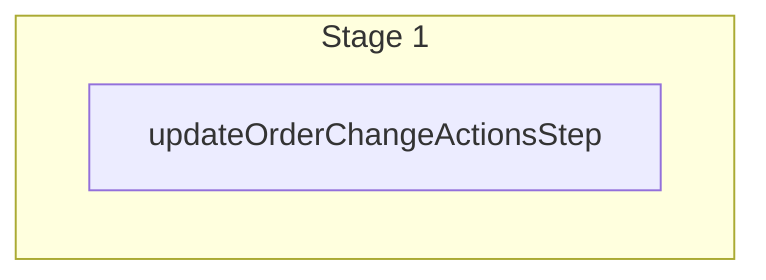

This documentation provides a reference to the `updateOrderChangeActionsWorkflow`. It belongs to the `@medusajs/medusa/core-flows` package.

This workflow updates one or more order change actions.

You can use this workflow within your customizations or your own custom workflows, allowing you to wrap custom logic around
updating order change actions.

[View source code](https://github.com/medusajs/medusa/blob/0ed927bdb7a396a8fd5f6447ed69b7b354b150d3/packages/core/core-flows/src/order/workflows/update-order-change-actions.ts#L23)

## Examples

**API Route**

```ts title="src/api/workflow/route.ts"
import type {
  MedusaRequest,
  MedusaResponse,
} from "@medusajs/framework/http"
import { updateOrderChangeActionsWorkflow } from "@medusajs/medusa/core-flows"

export async function POST(
  req: MedusaRequest,
  res: MedusaResponse
) {
  const { result } = await updateOrderChangeActionsWorkflow(req.scope)
    .run({
      input: [{
        "id": "id_SbnpKEcre4mw0C3liU"
      }]
    })

  res.send(result)
}
```

**Subscriber**

```ts title="src/subscribers/order-placed.ts"
import {
  type SubscriberConfig,
  type SubscriberArgs,
} from "@medusajs/framework"
import { updateOrderChangeActionsWorkflow } from "@medusajs/medusa/core-flows"

export default async function handleOrderPlaced({
  event: { data },
  container,
}: SubscriberArgs < { id: string } > ) {
  const { result } = await updateOrderChangeActionsWorkflow(container)
    .run({
      input: [{
        "id": "id_SbnpKEcre4mw0C3liU"
      }]
    })

  console.log(result)
}

export const config: SubscriberConfig = {
  event: "order.placed",
}
```

**Scheduled Job**

```ts title="src/jobs/message-daily.ts"
import { MedusaContainer } from "@medusajs/framework/types"
import { updateOrderChangeActionsWorkflow } from "@medusajs/medusa/core-flows"

export default async function myCustomJob(
  container: MedusaContainer
) {
  const { result } = await updateOrderChangeActionsWorkflow(container)
    .run({
      input: [{
        "id": "id_SbnpKEcre4mw0C3liU"
      }]
    })

  console.log(result)
}

export const config = {
  name: "run-once-a-day",
  schedule: "0 0 * * *",
}
```

**Another Workflow**

```ts title="src/workflows/my-workflow.ts"
import { createWorkflow } from "@medusajs/framework/workflows-sdk"
import { updateOrderChangeActionsWorkflow } from "@medusajs/medusa/core-flows"

const myWorkflow = createWorkflow(
  "my-workflow",
  () => {
    const result = updateOrderChangeActionsWorkflow
      .runAsStep({
        input: [{
          "id": "id_SbnpKEcre4mw0C3liU"
        }]
      })
  }
)
```

<a id="updateorderchangeactionsworkflow-steps" />

## Steps



Stages follow the order in the workflow definition. Conditional steps run only when their condition is met. The step descriptions below include the conditions and reference links.

- [updateOrderChangeActionsStep](/resources/references/medusa-workflows/steps/updateOrderChangeActionsStep): This step updates order change actions.

<a id="updateorderchangeactionsworkflow-input" />

## Input

**updateOrderChangeActionsWorkflow**

- `UpdateOrderChangeActionDTO[]`: [UpdateOrderChangeActionDTO](/resources/references/order/interfaces/orderUpdateOrderChangeActionDTO)\[]
  - `id`: `string` — The ID of the order change action.
  - `internal_note`: `null` | `string` (optional) — The internal note of the order change action.

<a id="updateorderchangeactionsworkflow-output" />

## Output

**updateOrderChangeActionsWorkflow**

- `OrderChangeActionDTO[]`: [OrderChangeActionDTO](/resources/references/fulfillment/interfaces/fulfillmentOrderChangeActionDTO)\[]
  - `id`: `string` — The ID of the order change action
  - `order_change_id`: `null` | `string` — The ID of the associated order change
  - `order_change`: `null` | [OrderChangeDTO](/resources/references/fulfillment/interfaces/fulfillmentOrderChangeDTO) — The associated order change
    - `id`: `string` — The ID of the order change
    - `version`: `number` — The version of the order change
    - `change_type`: `"return"` | `"exchange"` | `"claim"` | `"edit"` | `"transfer"` (optional) — The type of the order change
    - `carry_over_promotions`: `null` | `boolean` (optional) — Whether to carry over promotions (apply promotions to outbound exchange items).
    - `no_notification`: `null` | `boolean` (optional) — Whether the customer shouldn't be notified of the order change.
    - `order_id`: `string` — The ID of the associated order
    - `return_id`: `string` — The ID of the associated return order
    - `exchange_id`: `string` — The ID of the associated exchange order
    - `claim_id`: `string` — The ID of the associated claim order
    - `order`: [OrderDTO](/resources/references/fulfillment/interfaces/fulfillmentOrderDTO) — The associated order
    - `return_order`: [ReturnDTO](/resources/references/fulfillment/interfaces/fulfillmentReturnDTO) — The associated return order
    - `exchange`: [OrderExchangeDTO](/resources/references/fulfillment/interfaces/fulfillmentOrderExchangeDTO) — The associated exchange order
    - `claim`: [OrderClaimDTO](/resources/references/fulfillment/interfaces/fulfillmentOrderClaimDTO) — The associated claim order
    - `actions`: [OrderChangeActionDTO](/resources/references/fulfillment/interfaces/fulfillmentOrderChangeActionDTO)\[] — The actions of the order change
    - `status`: [OrderChangeStatus](/resources/references/fulfillment/types/fulfillmentOrderChangeStatus) — The status of the order change
    - `requested_by`: `null` | `string` — The requested by of the order change
    - `requested_at`: `null` | `string` | `Date` — When the order change was requested
    - `confirmed_by`: `null` | `string` — The confirmed by of the order change
    - `confirmed_at`: `null` | `string` | `Date` — When the order change was confirmed
    - `declined_by`: `null` | `string` — The declined by of the order change
    - `declined_reason`: `null` | `string` — The declined reason of the order change
    - `metadata`: `null` | `Record<string, unknown>` — The metadata of the order change
    - `declined_at`: `null` | `string` | `Date` — When the order change was declined
    - `canceled_by`: `null` | `string` — The canceled by of the order change
    - `canceled_at`: `null` | `string` | `Date` — When the order change was canceled
    - `created_at`: `string` | `Date` — When the order change was created
    - `updated_at`: `string` | `Date` — When the order change was updated
  - `order_id`: `null` | `string` — The ID of the associated order
  - `return_id`: `null` | `string` — The ID of the associated return.
  - `claim_id`: `null` | `string` — The ID of the associated claim.
  - `exchange_id`: `null` | `string` — The ID of the associated exchange.
  - `order`: `null` | [OrderDTO](/resources/references/fulfillment/interfaces/fulfillmentOrderDTO) — The associated order
    - `id`: `string` — The ID of the order.
    - `version`: `number` — The version of the order.
    - `display_id`: `number` — The order's display ID.
    - `custom_display_id`: `string` (optional) — The order's custom display ID.
    - `order_change`: [OrderChangeDTO](/resources/references/fulfillment/interfaces/fulfillmentOrderChangeDTO) (optional) — The active order change, if any.
    - `status`: [OrderStatus](/resources/references/fulfillment/types/fulfillmentOrderStatus) — The status of the order.
    - `region_id`: `string` (optional) — The ID of the region the order belongs to.
    - `customer_id`: `string` (optional) — The ID of the customer on the order.
    - `sales_channel_id`: `string` (optional) — The ID of the sales channel the order belongs to.
    - `email`: `string` (optional) — The email of the order.
    - `currency_code`: `string` — The currency of the order
    - `shipping_address`: [OrderAddressDTO](/resources/references/fulfillment/interfaces/fulfillmentOrderAddressDTO) (optional) — The associated shipping address.
    - `billing_address`: [OrderAddressDTO](/resources/references/fulfillment/interfaces/fulfillmentOrderAddressDTO) (optional) — The associated billing address.
    - `items`: [OrderLineItemDTO](/resources/references/fulfillment/interfaces/fulfillmentOrderLineItemDTO)\[] (optional) — The associated order details / line items.
    - `shipping_methods`: [OrderShippingMethodDTO](/resources/references/fulfillment/interfaces/fulfillmentOrderShippingMethodDTO)\[] (optional) — The associated shipping methods
    - `transactions`: [OrderTransactionDTO](/resources/references/fulfillment/interfaces/fulfillmentOrderTransactionDTO)\[] (optional) — The tramsactions associated with the order
    - `credit_lines`: [OrderCreditLineDTO](/resources/references/fulfillment/interfaces/fulfillmentOrderCreditLineDTO)\[] (optional) — The credit lines for an order
    - `summary`: [OrderSummaryDTO](/resources/references/fulfillment/interfaces/fulfillmentOrderSummaryDTO) (optional) — The summary of the order totals.
    - `is_draft_order`: `boolean` (optional) — Whether the order is a draft order.
    - `locale`: `string` (optional) — The locale of the order.
    - `metadata`: `null` | `Record<string, unknown>` (optional) — Holds custom data in key-value pairs.
    - `canceled_at`: `string` | `Date` (optional) — When the order was canceled.
    - `created_at`: `string` | `Date` — When the order was created.
    - `updated_at`: `string` | `Date` — When the order was updated.
    - `deleted_at`: `string` | `Date` (optional) — When the order was deleted.
    - `original_item_total`: [BigNumberValue](/resources/references/fulfillment/types/fulfillmentBigNumberValue) — The original item total of the order.
    - `original_item_subtotal`: [BigNumberValue](/resources/references/fulfillment/types/fulfillmentBigNumberValue) — The original item subtotal of the order.
    - `original_item_tax_total`: [BigNumberValue](/resources/references/fulfillment/types/fulfillmentBigNumberValue) — The original item tax total of the order.
    - `item_total`: [BigNumberValue](/resources/references/fulfillment/types/fulfillmentBigNumberValue) — The item total of the order.
    - `item_subtotal`: [BigNumberValue](/resources/references/fulfillment/types/fulfillmentBigNumberValue) — The item subtotal of the order.
    - `item_tax_total`: [BigNumberValue](/resources/references/fulfillment/types/fulfillmentBigNumberValue) — The item tax total of the order.
    - `item_discount_total`: [BigNumberValue](/resources/references/fulfillment/types/fulfillmentBigNumberValue) — The item discount total of the order.
    - `original_total`: [BigNumberValue](/resources/references/fulfillment/types/fulfillmentBigNumberValue) — The original total of the order.
    - `original_subtotal`: [BigNumberValue](/resources/references/fulfillment/types/fulfillmentBigNumberValue) — The original subtotal of the order.
    - `original_tax_total`: [BigNumberValue](/resources/references/fulfillment/types/fulfillmentBigNumberValue) — The original tax total of the order.
    - `total`: [BigNumberValue](/resources/references/fulfillment/types/fulfillmentBigNumberValue) — The total of the order.
    - `subtotal`: [BigNumberValue](/resources/references/fulfillment/types/fulfillmentBigNumberValue) — The subtotal of the order. (Excluding taxes)
    - `tax_total`: [BigNumberValue](/resources/references/fulfillment/types/fulfillmentBigNumberValue) — The tax total of the order.
    - `discount_subtotal`: [BigNumberValue](/resources/references/fulfillment/types/fulfillmentBigNumberValue) — The discount subtotal of the order.
    - `discount_total`: [BigNumberValue](/resources/references/fulfillment/types/fulfillmentBigNumberValue) — The discount total of the order.
    - `discount_tax_total`: [BigNumberValue](/resources/references/fulfillment/types/fulfillmentBigNumberValue) — The discount tax total of the order.
    - `credit_line_total`: [BigNumberValue](/resources/references/fulfillment/types/fulfillmentBigNumberValue) — The credit line total of the order.
    - `gift_card_total`: [BigNumberValue](/resources/references/fulfillment/types/fulfillmentBigNumberValue) — The gift card total of the order.
    - `gift_card_tax_total`: [BigNumberValue](/resources/references/fulfillment/types/fulfillmentBigNumberValue) — The gift card tax total of the order.
    - `shipping_total`: [BigNumberValue](/resources/references/fulfillment/types/fulfillmentBigNumberValue) — The shipping total of the order.
    - `shipping_subtotal`: [BigNumberValue](/resources/references/fulfillment/types/fulfillmentBigNumberValue) — The shipping subtotal of the order.
    - `shipping_tax_total`: [BigNumberValue](/resources/references/fulfillment/types/fulfillmentBigNumberValue) — The shipping tax total of the order.
    - `shipping_discount_total`: [BigNumberValue](/resources/references/fulfillment/types/fulfillmentBigNumberValue) — The shipping discount total of the order.
    - `original_shipping_total`: [BigNumberValue](/resources/references/fulfillment/types/fulfillmentBigNumberValue) — The original shipping total of the order.
    - `original_shipping_subtotal`: [BigNumberValue](/resources/references/fulfillment/types/fulfillmentBigNumberValue) — The original shipping subtotal of the order.
    - `original_shipping_tax_total`: [BigNumberValue](/resources/references/fulfillment/types/fulfillmentBigNumberValue) — The original shipping tax total of the order.
  - `reference`: `string` — The reference of the order change action
  - `reference_id`: `string` — The ID of the reference
  - `action`: [ChangeActionType](/resources/references/fulfillment/types/fulfillmentChangeActionType) — The action of the order change action
  - `details`: `null` | `Record<string, unknown>` — The details of the order change action
  - `internal_note`: `null` | `string` — The internal note of the order change action
  - `ordering`: `number` — The ordering of the order change action
  - `created_at`: `string` | `Date` — When the order change action was created
  - `updated_at`: `string` | `Date` — When the order change action was updated
