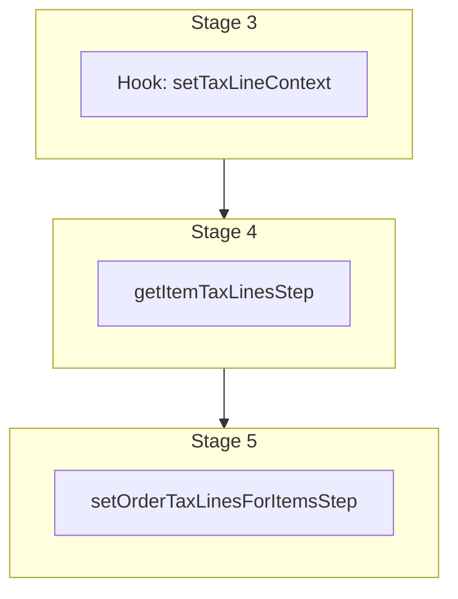

This documentation provides a reference to the `updateOrderTaxLinesWorkflow`. It belongs to the `@medusajs/medusa/core-flows` package.

This workflow updates the tax lines of items and shipping methods in an order. It's used by
other order-related workflows, such as the [createOrderWorkflow](/resources/references/medusa-workflows/createOrderWorkflow) to set the order's
tax lines.

You can use this workflow within your customizations or your own custom workflows, allowing you to update an
order's tax lines in your custom flows.

[View source code](https://github.com/medusajs/medusa/blob/0ed927bdb7a396a8fd5f6447ed69b7b354b150d3/packages/core/core-flows/src/order/workflows/update-tax-lines.ts#L196)

## Examples

**API Route**

```ts title="src/api/workflow/route.ts"
import type {
  MedusaRequest,
  MedusaResponse,
} from "@medusajs/framework/http"
import { updateOrderTaxLinesWorkflow } from "@medusajs/medusa/core-flows"

export async function POST(
  req: MedusaRequest,
  res: MedusaResponse
) {
  const { result } = await updateOrderTaxLinesWorkflow(req.scope)
    .run({
      input: {
        order_id: "order_123",
        item_ids: ["orli_123", "orli_456"],
      }
    })

  res.send(result)
}
```

**Subscriber**

```ts title="src/subscribers/order-placed.ts"
import {
  type SubscriberConfig,
  type SubscriberArgs,
} from "@medusajs/framework"
import { updateOrderTaxLinesWorkflow } from "@medusajs/medusa/core-flows"

export default async function handleOrderPlaced({
  event: { data },
  container,
}: SubscriberArgs < { id: string } > ) {
  const { result } = await updateOrderTaxLinesWorkflow(container)
    .run({
      input: {
        order_id: "order_123",
        item_ids: ["orli_123", "orli_456"],
      }
    })

  console.log(result)
}

export const config: SubscriberConfig = {
  event: "order.placed",
}
```

**Scheduled Job**

```ts title="src/jobs/message-daily.ts"
import { MedusaContainer } from "@medusajs/framework/types"
import { updateOrderTaxLinesWorkflow } from "@medusajs/medusa/core-flows"

export default async function myCustomJob(
  container: MedusaContainer
) {
  const { result } = await updateOrderTaxLinesWorkflow(container)
    .run({
      input: {
        order_id: "order_123",
        item_ids: ["orli_123", "orli_456"],
      }
    })

  console.log(result)
}

export const config = {
  name: "run-once-a-day",
  schedule: "0 0 * * *",
}
```

**Another Workflow**

```ts title="src/workflows/my-workflow.ts"
import { createWorkflow } from "@medusajs/framework/workflows-sdk"
import { updateOrderTaxLinesWorkflow } from "@medusajs/medusa/core-flows"

const myWorkflow = createWorkflow(
  "my-workflow",
  () => {
    const result = updateOrderTaxLinesWorkflow
      .runAsStep({
        input: {
          order_id: "order_123",
          item_ids: ["orli_123", "orli_456"],
        }
      })
  }
)
```

<a id="updateordertaxlinesworkflow-steps" />

## Steps



Stages follow the order in the workflow definition. Conditional steps run only when their condition is met. The step descriptions below include the conditions and reference links.

- [setTaxLineContext](/resources/references/medusa-workflows/updateOrderTaxLinesWorkflow#settaxlinecontext): This hook is executed after the cart is fetched and before tax lines are calculated. You can consume this hook to add custom context to the tax calculation. The returned object is set as the additional\_context property in the getItemTaxLinesStep input.
  \- [getItemTaxLinesStep](/resources/references/medusa-workflows/steps/getItemTaxLinesStep): This step retrieves the tax lines for an order or cart's line items and shipping methods. :::note You can retrieve an order, cart, item, shipping method, and address details using [Query](/learn/fundamentals/module-links/query), or [useQueryGraphStep](/resources/references/medusa-workflows/steps/useQueryGraphStep). :::
  \- [setOrderTaxLinesForItemsStep](/resources/references/medusa-workflows/steps/setOrderTaxLinesForItemsStep): This step sets the tax lines of an order's items and shipping methods. :::note You can retrieve an order's details using [Query](/learn/fundamentals/module-links/query), or [useQueryGraphStep](/resources/references/medusa-workflows/steps/useQueryGraphStep). :::

<a id="updateordertaxlinesworkflow-input" />

## Input

**updateOrderTaxLinesWorkflow**

- `UpdateOrderTaxLinesWorkflowInput`: [UpdateOrderTaxLinesWorkflowInput](/resources/references/core_flows/core_core_flows_src/types/core_flowscore_core_flows_srcUpdateOrderTaxLinesWorkflowInput)
  - `order_id`: `string` — The ID of the order to update.
  - `item_ids`: `string`\[] (optional) — The IDs of the items to update the tax lines for.
  - `shipping_method_ids`: `string`\[] (optional) — The IDs of the shipping methods to update the tax lines for.
  - `force_tax_calculation`: `boolean` (optional) — Whether to force the tax calculation. If enabled, the tax provider may send request to a third-party service to retrieve the calculated tax rates. This depends on the chosen tax provider in the order's tax region.
  - `is_return`: `boolean` (optional) — Whether to calculate the tax lines for a return.
  - `shipping_address`: [OrderWorkflowDTO](/resources/references/types/interfaces/typesOrderWorkflowDTO)\[`"shipping_address"`] (optional) — The shipping address to use for the tax calculation.

<a id="updateordertaxlinesworkflow-output" />

## Output

**updateOrderTaxLinesWorkflow**

- `itemTaxLines`: [ItemTaxLineDTO](/resources/references/tax/interfaces/taxItemTaxLineDTO)\[] (default: taxLineItems.lineItemTaxLines)
  - `rate_id`: `string` (optional) — The associated rate's ID. When integrating with a third-party, you don't need to provide it. This is mainly used for the built-in rates.
  - `rate`: `number` — The rate of the tax line.
  - `code`: `null` | `string` — The code of the tax line.
  - `name`: `string` — The name of the tax line.
  - `provider_id`: `string` — The ID of the tax provider used to calculate and retrieve the tax line.
  - `data`: `null` | `Record<string, unknown>` (optional) — Additional data returned by the tax provider. Use this to store jurisdiction-level breakdown data (e.g. state, county, city rates) that is not captured in the aggregated rate.
  - `line_item_id`: `string` — The associated line item's ID.
- `shippingTaxLines`: [ShippingTaxLineDTO](/resources/references/tax/interfaces/taxShippingTaxLineDTO)\[] (default: taxLineItems.shippingMethodsTaxLines)
  - `rate_id`: `string` (optional) — The associated rate's ID. When integrating with a third-party, you don't need to provide it. This is mainly used for the built-in rates.
  - `rate`: `number` — The rate of the tax line.
  - `code`: `null` | `string` — The code of the tax line.
  - `name`: `string` — The name of the tax line.
  - `provider_id`: `string` — The ID of the tax provider used to calculate and retrieve the tax line.
  - `data`: `null` | `Record<string, unknown>` (optional) — Additional data returned by the tax provider. Use this to store jurisdiction-level breakdown data (e.g. state, county, city rates) that is not captured in the aggregated rate.
  - `shipping_line_id`: `string` — The associated shipping line's ID.

## Hooks

Hooks allow you to inject custom functionalities into the workflow. You'll receive data from the workflow, as well as additional data sent through an HTTP request.

Learn more about [Hooks](/learn/fundamentals/workflows/workflow-hooks) and [Additional Data](/learn/fundamentals/api-routes/additional-data).

### setTaxLineContext

This hook is executed after the order is fetched and before tax lines are calculated. You can consume this hook to add custom context to the tax calculation. The returned object is set as the additional\_context property in the getItemTaxLinesStep input.

#### Example

```ts
import { updateOrderTaxLinesWorkflow } from "@medusajs/medusa/core-flows"

updateOrderTaxLinesWorkflow.hooks.setTaxLineContext(
  (async ({ order, items, shipping_methods }, { container }) => {
    //TODO
  })
)
```

<a id="input" />

#### Input

Handlers consuming this hook accept the following input.

**setTaxLineContext**

- `input`: object — The input data for the hook.
  - `order`: `any`
  - `items`: `any`\[]
  - `shipping_methods`: `any`\[]
