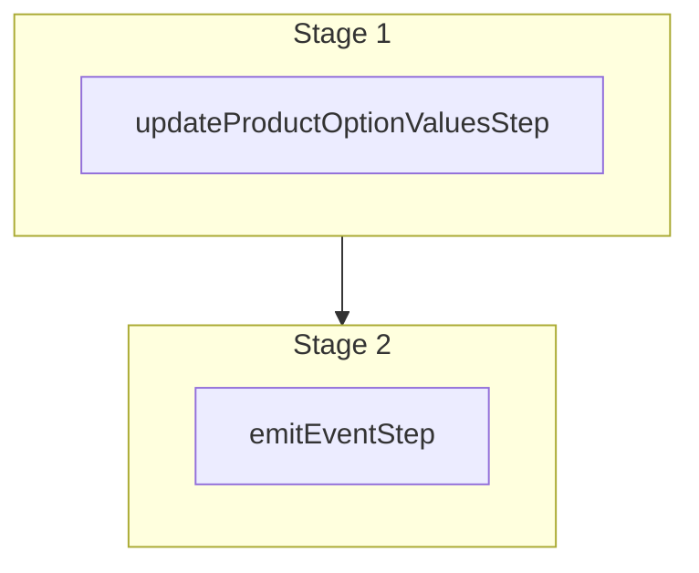

This documentation provides a reference to the `updateProductOptionValuesWorkflow`. It belongs to the `@medusajs/medusa/core-flows` package.

This workflow updates a product option value. It's used by the
Update Product Option Value Admin API Route.

You can use this workflow within your customizations or your own custom workflows,
allowing you to wrap custom logic around product-option-value update.

[View source code](https://github.com/medusajs/medusa/blob/0ed927bdb7a396a8fd5f6447ed69b7b354b150d3/packages/core/core-flows/src/product/workflows/update-product-option-values.ts#L50)

## Examples

**API Route**

```ts title="src/api/workflow/route.ts"
import type {
  MedusaRequest,
  MedusaResponse,
} from "@medusajs/framework/http"
import { updateProductOptionValuesWorkflow } from "@medusajs/medusa/core-flows"

export async function POST(
  req: MedusaRequest,
  res: MedusaResponse
) {
  const { result } = await updateProductOptionValuesWorkflow(req.scope)
    .run({
      input: {
        id: "optval_123",
        update: {
          metadata: { is_default: true }
        }
      }
    })

  res.send(result)
}
```

**Subscriber**

```ts title="src/subscribers/order-placed.ts"
import {
  type SubscriberConfig,
  type SubscriberArgs,
} from "@medusajs/framework"
import { updateProductOptionValuesWorkflow } from "@medusajs/medusa/core-flows"

export default async function handleOrderPlaced({
  event: { data },
  container,
}: SubscriberArgs < { id: string } > ) {
  const { result } = await updateProductOptionValuesWorkflow(container)
    .run({
      input: {
        id: "optval_123",
        update: {
          metadata: { is_default: true }
        }
      }
    })

  console.log(result)
}

export const config: SubscriberConfig = {
  event: "order.placed",
}
```

**Scheduled Job**

```ts title="src/jobs/message-daily.ts"
import { MedusaContainer } from "@medusajs/framework/types"
import { updateProductOptionValuesWorkflow } from "@medusajs/medusa/core-flows"

export default async function myCustomJob(
  container: MedusaContainer
) {
  const { result } = await updateProductOptionValuesWorkflow(container)
    .run({
      input: {
        id: "optval_123",
        update: {
          metadata: { is_default: true }
        }
      }
    })

  console.log(result)
}

export const config = {
  name: "run-once-a-day",
  schedule: "0 0 * * *",
}
```

**Another Workflow**

```ts title="src/workflows/my-workflow.ts"
import { createWorkflow } from "@medusajs/framework/workflows-sdk"
import { updateProductOptionValuesWorkflow } from "@medusajs/medusa/core-flows"

const myWorkflow = createWorkflow(
  "my-workflow",
  () => {
    const result = updateProductOptionValuesWorkflow
      .runAsStep({
        input: {
          id: "optval_123",
          update: {
            metadata: { is_default: true }
          }
        }
      })
  }
)
```

<a id="updateproductoptionvaluesworkflow-steps" />

## Steps



Stages follow the order in the workflow definition. Conditional steps run only when their condition is met. The step descriptions below include the conditions and reference links.

- [updateProductOptionValuesStep](/resources/references/medusa-workflows/steps/updateProductOptionValuesStep): This step updates a product option value.
  - [emitEventStep](/resources/references/medusa-workflows/steps/emitEventStep): This step emits an event, which you can listen to in a [subscriber](/learn/fundamentals/events-and-subscribers). You can pass data to the subscriber by including it in the `data` property. The event is only emitted after the workflow has finished successfully. So, even if it's executed in the middle of the workflow, it won't actually emit the event until the workflow has completed successfully. If the workflow fails, it won't emit the event at all.

<a id="updateproductoptionvaluesworkflow-input" />

## Input

**updateProductOptionValuesWorkflow**

- `UpdateProductOptionValuesWorkflowInput`: [UpdateProductOptionValuesWorkflowInput](/resources/references/core_flows/core_core_flows_src/types/core_flowscore_core_flows_srcUpdateProductOptionValuesWorkflowInput)
  - `id`: `string` — The ID of the product option value to update.
  - `update`: [UpdateProductOptionValueDTO](/resources/references/product/interfaces/productUpdateProductOptionValueDTO) — The data to update in the product option value.
    - `value`: `string` (optional) — The value of the product option value.
    - `metadata`: [MetadataType](/resources/references/product/types/productMetadataType) (optional) — The metadata of the product option value.

<a id="updateproductoptionvaluesworkflow-output" />

## Output

**updateProductOptionValuesWorkflow**

- `ProductOptionValueDTO`: [ProductOptionValueDTO](/resources/references/product/interfaces/productProductOptionValueDTO) — The product option value's data.
  - `id`: `string` — The ID of the product option value.
  - `value`: `string` — The value of the product option value.
  - `option`: `null` | [ProductOptionDTO](/resources/references/product/interfaces/productProductOptionDTO) (optional) — The associated product option. It may only be available if the `option` relation is expanded.
    - `id`: `string` — The ID of the product option.
    - `title`: `string` — The title of the product option.
    - `is_exclusive`: `boolean` — Whether the product option is exclusive to a product or shared across products.
    - `products`: `null` | [ProductDTO](/resources/references/product/interfaces/productProductDTO)\[] (optional) — The associated products.
      - `id`: `string` — The ID of the product.
      - `title`: `string` — The title of the product.
      - `handle`: `string` — The handle of the product. The handle can be used to create slug URL paths.
      - `subtitle`: `null` | `string` — The subttle of the product.
      - `description`: `null` | `string` — The description of the product.
      - `is_giftcard`: `boolean` — Whether the product is a gift card.
      - `status`: [ProductStatus](/resources/references/product/types/productProductStatus) — The status of the product.
      - `thumbnail`: `null` | `string` — The URL of the product's thumbnail.
      - `width`: `null` | `number` — The width of the product.
      - `weight`: `null` | `number` — The weight of the product.
      - `length`: `null` | `number` — The length of the product.
      - `height`: `null` | `number` — The height of the product.
      - `origin_country`: `null` | `string` — The origin country of the product.
      - `hs_code`: `null` | `string` — The HS Code of the product.
      - `mid_code`: `null` | `string` — The MID Code of the product.
      - `material`: `null` | `string` — The material of the product.
      - `collection`: `null` | [ProductCollectionDTO](/resources/references/product/interfaces/productProductCollectionDTO) — The associated product collection.
      - `collection_id`: `null` | `string` — The associated product collection id.
      - `categories`: `null` | [ProductCategoryDTO](/resources/references/product/interfaces/productProductCategoryDTO)\[] (optional) — The associated product categories.
      - `type`: `null` | [ProductTypeDTO](/resources/references/product/interfaces/productProductTypeDTO) — The associated product type.
      - `type_id`: `null` | `string` — The associated product type id.
      - `tags`: [ProductTagDTO](/resources/references/product/interfaces/productProductTagDTO)\[] — The associated product tags.
      - `variants`: [ProductVariantDTO](/resources/references/product/interfaces/productProductVariantDTO)\[] — The associated product variants.
      - `options`: [ProductOptionDTO](/resources/references/product/interfaces/productProductOptionDTO)\[] — The associated product options.
      - `images`: [ProductImageDTO](/resources/references/product/interfaces/productProductImageDTO)\[] — The associated product images.
      - `discountable`: `boolean` (optional) — Whether the product can be discounted.
      - `external_id`: `null` | `string` — The ID of the product in an external system. This is useful if you're integrating the product with a third-party service and want to maintain a reference to the ID in the integrated service.
      - `created_at`: `string` | `Date` — When the product was created.
      - `updated_at`: `string` | `Date` — When the product was updated.
      - `deleted_at`: `string` | `Date` — When the product was deleted.
      - `metadata`: [MetadataType](/resources/references/product/types/productMetadataType) (optional) — Holds custom data in key-value pairs.
    - `values`: [ProductOptionValueDTO](/resources/references/product/interfaces/productProductOptionValueDTO)\[] — The associated product option values.
      - `id`: `string` — The ID of the product option value.
      - `value`: `string` — The value of the product option value.
      - `option`: `null` | [ProductOptionDTO](/resources/references/product/interfaces/productProductOptionDTO) (optional) — The associated product option. It may only be available if the `option` relation is expanded.
      - `option_id`: `null` | `string` (optional) — The associated product option id.
      - `metadata`: [MetadataType](/resources/references/product/types/productMetadataType) (optional) — Holds custom data in key-value pairs.
      - `created_at`: `string` | `Date` — When the product option value was created.
      - `updated_at`: `string` | `Date` — When the product option value was updated.
      - `deleted_at`: `string` | `Date` (optional) — When the product option value was deleted.
    - `metadata`: [MetadataType](/resources/references/product/types/productMetadataType) (optional) — Holds custom data in key-value pairs.
    - `created_at`: `string` | `Date` — When the product option was created.
    - `updated_at`: `string` | `Date` — When the product option was updated.
    - `deleted_at`: `string` | `Date` (optional) — When the product option was deleted.
  - `option_id`: `null` | `string` (optional) — The associated product option id.
  - `metadata`: [MetadataType](/resources/references/product/types/productMetadataType) (optional) — Holds custom data in key-value pairs.
  - `created_at`: `string` | `Date` — When the product option value was created.
  - `updated_at`: `string` | `Date` — When the product option value was updated.
  - `deleted_at`: `string` | `Date` (optional) — When the product option value was deleted.

<a id="updateproductoptionvaluesworkflow-emitted-events" />

## Emitted Events

- `product-option-value.updated` (since v2.20.0): Emitted when product option values are updated.

  ```ts
  {
    id, // The ID of the product option value
  }
  ```
