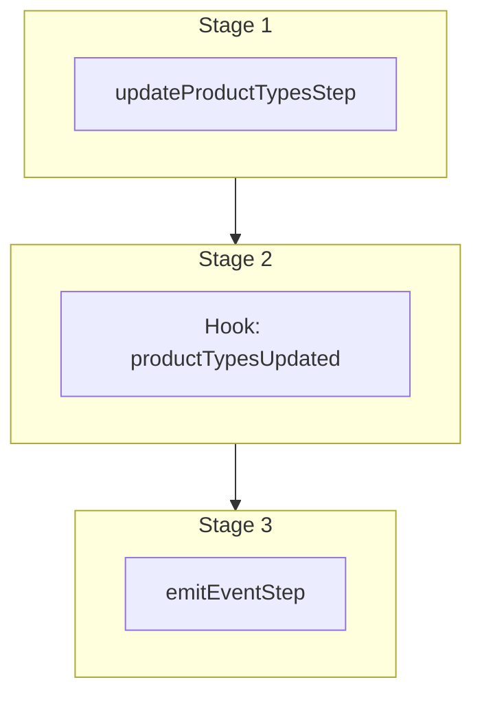

This documentation provides a reference to the `updateProductTypesWorkflow`. It belongs to the `@medusajs/medusa/core-flows` package.

This workflow updates one or more product types. It's used by the
[Update Product Type Admin API Route](/api/admin/product-types/update-a-product-type).

This workflow has a hook that allows you to perform custom actions on the updated product types. For example, you can pass under `additional_data` custom data that
allows you to update custom data models linked to the product types.

You can also use this workflow within your own custom workflows, allowing you to wrap custom logic around product-type updates.

[View source code](https://github.com/medusajs/medusa/blob/0ed927bdb7a396a8fd5f6447ed69b7b354b150d3/packages/core/core-flows/src/product/workflows/update-product-types.ts#L59)

## Examples

**API Route**

```ts title="src/api/workflow/route.ts"
import type {
  MedusaRequest,
  MedusaResponse,
} from "@medusajs/framework/http"
import { updateProductTypesWorkflow } from "@medusajs/medusa/core-flows"

export async function POST(
  req: MedusaRequest,
  res: MedusaResponse
) {
  const { result } = await updateProductTypesWorkflow(req.scope)
    .run({
      input: {
        selector: {
          id: "ptyp_123"
        },
        update: {
          value: "clothing"
        },
        additional_data: {
          erp_id: "123"
        }
      }
    })

  res.send(result)
}
```

**Subscriber**

```ts title="src/subscribers/order-placed.ts"
import {
  type SubscriberConfig,
  type SubscriberArgs,
} from "@medusajs/framework"
import { updateProductTypesWorkflow } from "@medusajs/medusa/core-flows"

export default async function handleOrderPlaced({
  event: { data },
  container,
}: SubscriberArgs < { id: string } > ) {
  const { result } = await updateProductTypesWorkflow(container)
    .run({
      input: {
        selector: {
          id: "ptyp_123"
        },
        update: {
          value: "clothing"
        },
        additional_data: {
          erp_id: "123"
        }
      }
    })

  console.log(result)
}

export const config: SubscriberConfig = {
  event: "order.placed",
}
```

**Scheduled Job**

```ts title="src/jobs/message-daily.ts"
import { MedusaContainer } from "@medusajs/framework/types"
import { updateProductTypesWorkflow } from "@medusajs/medusa/core-flows"

export default async function myCustomJob(
  container: MedusaContainer
) {
  const { result } = await updateProductTypesWorkflow(container)
    .run({
      input: {
        selector: {
          id: "ptyp_123"
        },
        update: {
          value: "clothing"
        },
        additional_data: {
          erp_id: "123"
        }
      }
    })

  console.log(result)
}

export const config = {
  name: "run-once-a-day",
  schedule: "0 0 * * *",
}
```

**Another Workflow**

```ts title="src/workflows/my-workflow.ts"
import { createWorkflow } from "@medusajs/framework/workflows-sdk"
import { updateProductTypesWorkflow } from "@medusajs/medusa/core-flows"

const myWorkflow = createWorkflow(
  "my-workflow",
  () => {
    const result = updateProductTypesWorkflow
      .runAsStep({
        input: {
          selector: {
            id: "ptyp_123"
          },
          update: {
            value: "clothing"
          },
          additional_data: {
            erp_id: "123"
          }
        }
      })
  }
)
```

<a id="updateproducttypesworkflow-steps" />

## Steps



Stages follow the order in the workflow definition. Conditional steps run only when their condition is met. The step descriptions below include the conditions and reference links.

- [updateProductTypesStep](/resources/references/medusa-workflows/steps/updateProductTypesStep): This step updates product types matching the specified filters.
  - [productTypesUpdated](/resources/references/medusa-workflows/updateProductTypesWorkflow#producttypesupdated): This hook is executed after the product types are updated. You can consume this hook to perform custom actions on the updated product types.
    - [emitEventStep](/resources/references/medusa-workflows/steps/emitEventStep): This step emits an event, which you can listen to in a [subscriber](/learn/fundamentals/events-and-subscribers). You can pass data to the subscriber by including it in the `data` property. The event is only emitted after the workflow has finished successfully. So, even if it's executed in the middle of the workflow, it won't actually emit the event until the workflow has completed successfully. If the workflow fails, it won't emit the event at all.

<a id="updateproducttypesworkflow-input" />

## Input

**updateProductTypesWorkflow**

- `UpdateProductTypesWorkflowInput`: `UpdateProductTypesWorkflowInput`

<a id="updateproducttypesworkflow-output" />

## Output

**updateProductTypesWorkflow**

- `ProductTypeDTO[]`: [ProductTypeDTO](/resources/references/product/interfaces/productProductTypeDTO)\[]
  - `id`: `string` — The ID of the product type.
  - `value`: `string` — The value of the product type.
  - `metadata`: [MetadataType](/resources/references/product/types/productMetadataType) (optional) — Holds custom data in key-value pairs.
  - `created_at`: `string` | `Date` — When the product type was created.
  - `updated_at`: `string` | `Date` — When the product type was updated.
  - `deleted_at`: `string` | `Date` (optional) — When the product type was deleted.

## Hooks

Hooks allow you to inject custom functionalities into the workflow. You'll receive data from the workflow, as well as additional data sent through an HTTP request.

Learn more about [Hooks](/learn/fundamentals/workflows/workflow-hooks) and [Additional Data](/learn/fundamentals/api-routes/additional-data).

### productTypesUpdated

This hook is executed after the product types are updated. You can consume this hook to perform custom actions on the updated product types.

#### Example

```ts
import { updateProductTypesWorkflow } from "@medusajs/medusa/core-flows"

updateProductTypesWorkflow.hooks.productTypesUpdated(
  (async ({ product_types, additional_data }, { container }) => {
    //TODO
  })
)
```

<a id="input" />

#### Input

Handlers consuming this hook accept the following input.

**productTypesUpdated**

- `input`: object — The input data for the hook.
  - `product_types`: [WorkflowDataProperties](/resources/references/workflows/types/workflowsWorkflowDataProperties)\<[ProductTypeDTO](/resources/references/product/interfaces/productProductTypeDTO)\[]>
    - `__step__`: `string`
  - `additional_data`: `Record<string, unknown> | undefined` — Additional data that can be passed through the `additional_data` property in HTTP requests. Learn more in [this documentation](/learn/fundamentals/api-routes/additional-data).

<a id="updateproducttypesworkflow-emitted-events" />

## Emitted Events

- `product-type.updated`: Emitted when product types are updated.

  ```ts
  {
    id, // The ID of the product type
  }
  ```
