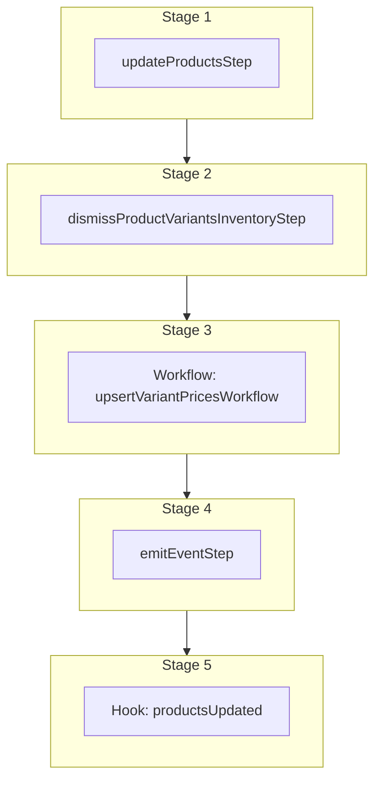

This documentation provides a reference to the `updateProductsWorkflow`. It belongs to the `@medusajs/medusa/core-flows` package.

This workflow updates one or more products. It's used by the [Update Product Admin API Route](/api/admin/products/update-a-product).

This workflow has a hook that allows you to perform custom actions on the updated products. For example, you can pass under `additional_data` custom data that
allows you to update custom data models linked to the products.

You can also use this workflow within your customizations or your own custom workflows, allowing you to wrap custom logic around product update.

> **Note**
>
> Learn more about adding rules to the product variant's prices in the Pricing Module's
> [Price Rules](/resources/commerce-modules/pricing/price-rules) documentation.

[View source code](https://github.com/medusajs/medusa/blob/0ed927bdb7a396a8fd5f6447ed69b7b354b150d3/packages/core/core-flows/src/product/workflows/update-products.ts#L411)

## Examples

To update products by their IDs:

**API Route**

```ts title="src/api/workflow/route.ts"
import type {
  MedusaRequest,
  MedusaResponse,
} from "@medusajs/framework/http"
import { updateProductsWorkflow } from "@medusajs/medusa/core-flows"

export async function POST(
  req: MedusaRequest,
  res: MedusaResponse
) {
  const { result } = await updateProductsWorkflow(req.scope)
    .run({
      input: {
        products: [{
            id: "prod_123",
            title: "Shirts"
          },
          {
            id: "prod_321",
            variants: [{
              id: "variant_123",
              options: {
                Size: "S"
              }
            }]
          }
        ],
        additional_data: {
          erp_id: "erp_123"
        }
      }
    })

  res.send(result)
}
```

**Subscriber**

```ts title="src/subscribers/order-placed.ts"
import {
  type SubscriberConfig,
  type SubscriberArgs,
} from "@medusajs/framework"
import { updateProductsWorkflow } from "@medusajs/medusa/core-flows"

export default async function handleOrderPlaced({
  event: { data },
  container,
}: SubscriberArgs < { id: string } > ) {
  const { result } = await updateProductsWorkflow(container)
    .run({
      input: {
        products: [{
            id: "prod_123",
            title: "Shirts"
          },
          {
            id: "prod_321",
            variants: [{
              id: "variant_123",
              options: {
                Size: "S"
              }
            }]
          }
        ],
        additional_data: {
          erp_id: "erp_123"
        }
      }
    })

  console.log(result)
}

export const config: SubscriberConfig = {
  event: "order.placed",
}
```

**Scheduled Job**

```ts title="src/jobs/message-daily.ts"
import { MedusaContainer } from "@medusajs/framework/types"
import { updateProductsWorkflow } from "@medusajs/medusa/core-flows"

export default async function myCustomJob(
  container: MedusaContainer
) {
  const { result } = await updateProductsWorkflow(container)
    .run({
      input: {
        products: [{
            id: "prod_123",
            title: "Shirts"
          },
          {
            id: "prod_321",
            variants: [{
              id: "variant_123",
              options: {
                Size: "S"
              }
            }]
          }
        ],
        additional_data: {
          erp_id: "erp_123"
        }
      }
    })

  console.log(result)
}

export const config = {
  name: "run-once-a-day",
  schedule: "0 0 * * *",
}
```

**Another Workflow**

```ts title="src/workflows/my-workflow.ts"
import { createWorkflow } from "@medusajs/framework/workflows-sdk"
import { updateProductsWorkflow } from "@medusajs/medusa/core-flows"

const myWorkflow = createWorkflow(
  "my-workflow",
  () => {
    const result = updateProductsWorkflow
      .runAsStep({
        input: {
          products: [{
              id: "prod_123",
              title: "Shirts"
            },
            {
              id: "prod_321",
              variants: [{
                id: "variant_123",
                options: {
                  Size: "S"
                }
              }]
            }
          ],
          additional_data: {
            erp_id: "erp_123"
          }
        }
      })
  }
)
```

You can also update products by a selector:

**API Route**

```ts title="src/api/workflow/route.ts"
import type {
  MedusaRequest,
  MedusaResponse,
} from "@medusajs/framework/http"
import { updateProductsWorkflow } from "@medusajs/medusa/core-flows"

export async function POST(
  req: MedusaRequest,
  res: MedusaResponse
) {
  const { result } = await updateProductsWorkflow(req.scope)
    .run({
      input: {
        selector: {
          type_id: ["ptyp_123"]
        },
        update: {
          description: "This is a shirt product"
        },
        additional_data: {
          erp_id: "erp_123"
        }
      }
    })

  res.send(result)
}
```

**Subscriber**

```ts title="src/subscribers/order-placed.ts"
import {
  type SubscriberConfig,
  type SubscriberArgs,
} from "@medusajs/framework"
import { updateProductsWorkflow } from "@medusajs/medusa/core-flows"

export default async function handleOrderPlaced({
  event: { data },
  container,
}: SubscriberArgs < { id: string } > ) {
  const { result } = await updateProductsWorkflow(container)
    .run({
      input: {
        selector: {
          type_id: ["ptyp_123"]
        },
        update: {
          description: "This is a shirt product"
        },
        additional_data: {
          erp_id: "erp_123"
        }
      }
    })

  console.log(result)
}

export const config: SubscriberConfig = {
  event: "order.placed",
}
```

**Scheduled Job**

```ts title="src/jobs/message-daily.ts"
import { MedusaContainer } from "@medusajs/framework/types"
import { updateProductsWorkflow } from "@medusajs/medusa/core-flows"

export default async function myCustomJob(
  container: MedusaContainer
) {
  const { result } = await updateProductsWorkflow(container)
    .run({
      input: {
        selector: {
          type_id: ["ptyp_123"]
        },
        update: {
          description: "This is a shirt product"
        },
        additional_data: {
          erp_id: "erp_123"
        }
      }
    })

  console.log(result)
}

export const config = {
  name: "run-once-a-day",
  schedule: "0 0 * * *",
}
```

**Another Workflow**

```ts title="src/workflows/my-workflow.ts"
import { createWorkflow } from "@medusajs/framework/workflows-sdk"
import { updateProductsWorkflow } from "@medusajs/medusa/core-flows"

const myWorkflow = createWorkflow(
  "my-workflow",
  () => {
    const result = updateProductsWorkflow
      .runAsStep({
        input: {
          selector: {
            type_id: ["ptyp_123"]
          },
          update: {
            description: "This is a shirt product"
          },
          additional_data: {
            erp_id: "erp_123"
          }
        }
      })
  }
)
```

<a id="updateproductsworkflow-steps" />

## Steps



Stages follow the order in the workflow definition. Conditional steps run only when their condition is met. The step descriptions below include the conditions and reference links.

- [updateProductsStep](/resources/references/medusa-workflows/steps/updateProductsStep): This step updates one or more products.
  - [dismissProductVariantsInventoryStep](/resources/references/medusa-workflows/steps/dismissProductVariantsInventoryStep)
    - [upsertVariantPricesWorkflow](/resources/references/medusa-workflows/upsertVariantPricesWorkflow): Create, update, or remove variants' prices.
      - [emitEventStep](/resources/references/medusa-workflows/steps/emitEventStep): This step emits an event, which you can listen to in a [subscriber](/learn/fundamentals/events-and-subscribers). You can pass data to the subscriber by including it in the `data` property. The event is only emitted after the workflow has finished successfully. So, even if it's executed in the middle of the workflow, it won't actually emit the event until the workflow has completed successfully. If the workflow fails, it won't emit the event at all.
        - [productsUpdated](/resources/references/medusa-workflows/updateProductsWorkflow#productsupdated): This hook is executed after the products are updated. You can consume this hook to perform custom actions on the updated products.

<a id="updateproductsworkflow-input" />

## Input

**updateProductsWorkflow**

- `UpdateProductWorkflowInput`: [UpdateProductWorkflowInput](/resources/references/core_flows/core_core_flows_src/types/core_flowscore_core_flows_srcUpdateProductWorkflowInput)
  - `selector`: [FilterableProductProps](/resources/references/product/interfaces/productFilterableProductProps) — The filters to find products to update.
    - `$and`: ([FilterableProductProps](/resources/references/product/interfaces/productFilterableProductProps) | [BaseFilterable](/resources/references/product/interfaces/productBaseFilterable)\<[FilterableProductProps](/resources/references/product/interfaces/productFilterableProductProps)>)\[] (optional) — An array of filters to apply on the entity, where each item in the array is joined with an "and" condition.
      - `$and`: ([FilterableProductProps](/resources/references/product/interfaces/productFilterableProductProps) | [BaseFilterable](/resources/references/product/interfaces/productBaseFilterable)\<[FilterableProductProps](/resources/references/product/interfaces/productFilterableProductProps)>)\[] (optional) — An array of filters to apply on the entity, where each item in the array is joined with an "and" condition.
      - `$or`: ([FilterableProductProps](/resources/references/product/interfaces/productFilterableProductProps) | [BaseFilterable](/resources/references/product/interfaces/productBaseFilterable)\<[FilterableProductProps](/resources/references/product/interfaces/productFilterableProductProps)>)\[] (optional) — An array of filters to apply on the entity, where each item in the array is joined with an "or" condition.
      - `q`: `string` (optional) — Search through the products' attributes, such as titles and descriptions, using this search term.
      - `status`: [ProductStatus](/resources/references/product/types/productProductStatus) | [ProductStatus](/resources/references/product/types/productProductStatus)\[] | [OperatorMap](/resources/references/product/types/productOperatorMap)\<ProductStatus | ProductStatus\[]> (optional) — The status to filter products by
      - `title`: `string` | `string`\[] | [OperatorMap](/resources/references/product/types/productOperatorMap)\<string | string\[]> (optional) — The titles to filter products by.
      - `handle`: `string` | `string`\[] | [OperatorMap](/resources/references/product/types/productOperatorMap)\<string | string\[]> (optional) — The handles to filter products by.
      - `sku`: `string` | `string`\[] | [OperatorMap](/resources/references/product/types/productOperatorMap)\<string | string\[]> (optional) — The skus to filter products by.
      - `id`: `string` | `string`\[] | [OperatorMap](/resources/references/product/types/productOperatorMap)\<string | string\[]> (optional) — The IDs to filter products by.
      - `external_id`: `string` | `string`\[] | [OperatorMap](/resources/references/product/types/productOperatorMap)\<string | string\[]> (optional) — The external IDs to filter products by.
      - `is_giftcard`: `boolean` (optional) — Filters only or excluding gift card products
      - `tags`: `object` (optional) — Filters on a product's tags.
      - `options`: `object` (optional) — Filters on a product's options.
      - `variants`: `object` (optional) — Filters on a product's variant properties.
      - `type_id`: `string` | `string`\[] | [OperatorMap](/resources/references/product/types/productOperatorMap)\<string | string\[]> (optional) — Filter a product by the ID of the associated type
      - `option_id`: `string` | `string`\[] | [OperatorMap](/resources/references/product/types/productOperatorMap)\<string | string\[]> (optional) — Filter a product by the ID of the associated option
      - `option_value_id`: `string` | `string`\[] (optional) — Filter a product by the IDs of the associated option values.
      - `categories`: `object` (optional) — Filter a product by the IDs of their associated categories.
      - `collection_id`: `string` | `string`\[] | [OperatorMap](/resources/references/product/types/productOperatorMap)\<string | string\[]> (optional) — Filters a product by its associated collections.
      - `created_at`: `string` | [OperatorMap](/resources/references/product/types/productOperatorMap)\<string> (optional) — Filters a product based on when it was created
      - `updated_at`: `string` | [OperatorMap](/resources/references/product/types/productOperatorMap)\<string> (optional) — Filters a product based on when it was updated
      - `deleted_at`: `string` | [OperatorMap](/resources/references/product/types/productOperatorMap)\<string> (optional) — Filters soft-deleted products based on the date they were deleted at.
    - `$or`: ([FilterableProductProps](/resources/references/product/interfaces/productFilterableProductProps) | [BaseFilterable](/resources/references/product/interfaces/productBaseFilterable)\<[FilterableProductProps](/resources/references/product/interfaces/productFilterableProductProps)>)\[] (optional) — An array of filters to apply on the entity, where each item in the array is joined with an "or" condition.
      - `$and`: ([FilterableProductProps](/resources/references/product/interfaces/productFilterableProductProps) | [BaseFilterable](/resources/references/product/interfaces/productBaseFilterable)\<[FilterableProductProps](/resources/references/product/interfaces/productFilterableProductProps)>)\[] (optional) — An array of filters to apply on the entity, where each item in the array is joined with an "and" condition.
      - `$or`: ([FilterableProductProps](/resources/references/product/interfaces/productFilterableProductProps) | [BaseFilterable](/resources/references/product/interfaces/productBaseFilterable)\<[FilterableProductProps](/resources/references/product/interfaces/productFilterableProductProps)>)\[] (optional) — An array of filters to apply on the entity, where each item in the array is joined with an "or" condition.
      - `q`: `string` (optional) — Search through the products' attributes, such as titles and descriptions, using this search term.
      - `status`: [ProductStatus](/resources/references/product/types/productProductStatus) | [ProductStatus](/resources/references/product/types/productProductStatus)\[] | [OperatorMap](/resources/references/product/types/productOperatorMap)\<ProductStatus | ProductStatus\[]> (optional) — The status to filter products by
      - `title`: `string` | `string`\[] | [OperatorMap](/resources/references/product/types/productOperatorMap)\<string | string\[]> (optional) — The titles to filter products by.
      - `handle`: `string` | `string`\[] | [OperatorMap](/resources/references/product/types/productOperatorMap)\<string | string\[]> (optional) — The handles to filter products by.
      - `sku`: `string` | `string`\[] | [OperatorMap](/resources/references/product/types/productOperatorMap)\<string | string\[]> (optional) — The skus to filter products by.
      - `id`: `string` | `string`\[] | [OperatorMap](/resources/references/product/types/productOperatorMap)\<string | string\[]> (optional) — The IDs to filter products by.
      - `external_id`: `string` | `string`\[] | [OperatorMap](/resources/references/product/types/productOperatorMap)\<string | string\[]> (optional) — The external IDs to filter products by.
      - `is_giftcard`: `boolean` (optional) — Filters only or excluding gift card products
      - `tags`: `object` (optional) — Filters on a product's tags.
      - `options`: `object` (optional) — Filters on a product's options.
      - `variants`: `object` (optional) — Filters on a product's variant properties.
      - `type_id`: `string` | `string`\[] | [OperatorMap](/resources/references/product/types/productOperatorMap)\<string | string\[]> (optional) — Filter a product by the ID of the associated type
      - `option_id`: `string` | `string`\[] | [OperatorMap](/resources/references/product/types/productOperatorMap)\<string | string\[]> (optional) — Filter a product by the ID of the associated option
      - `option_value_id`: `string` | `string`\[] (optional) — Filter a product by the IDs of the associated option values.
      - `categories`: `object` (optional) — Filter a product by the IDs of their associated categories.
      - `collection_id`: `string` | `string`\[] | [OperatorMap](/resources/references/product/types/productOperatorMap)\<string | string\[]> (optional) — Filters a product by its associated collections.
      - `created_at`: `string` | [OperatorMap](/resources/references/product/types/productOperatorMap)\<string> (optional) — Filters a product based on when it was created
      - `updated_at`: `string` | [OperatorMap](/resources/references/product/types/productOperatorMap)\<string> (optional) — Filters a product based on when it was updated
      - `deleted_at`: `string` | [OperatorMap](/resources/references/product/types/productOperatorMap)\<string> (optional) — Filters soft-deleted products based on the date they were deleted at.
    - `q`: `string` (optional) — Search through the products' attributes, such as titles and descriptions, using this search term.
    - `status`: [ProductStatus](/resources/references/product/types/productProductStatus) | [ProductStatus](/resources/references/product/types/productProductStatus)\[] | [OperatorMap](/resources/references/product/types/productOperatorMap)\<ProductStatus | ProductStatus\[]> (optional) — The status to filter products by
      - `$and`: [Query](/resources/references/product/types/productQuery)\<T>\[] (optional)
      - `$or`: [Query](/resources/references/product/types/productQuery)\<T>\[] (optional)
      - `$eq`: [ExpandScalar](/resources/references/product/types/productExpandScalar)\<T> | [ExpandScalar](/resources/references/product/types/productExpandScalar)\<T>\[] (optional)
      - `$ne`: [ExpandScalar](/resources/references/product/types/productExpandScalar)\<T> (optional)
      - `$in`: [ExpandScalar](/resources/references/product/types/productExpandScalar)\<T>\[] (optional)
      - `$nin`: [ExpandScalar](/resources/references/product/types/productExpandScalar)\<T>\[] (optional)
      - `$not`: [Query](/resources/references/product/types/productQuery)\<T> (optional)
      - `$gt`: [ExpandScalar](/resources/references/product/types/productExpandScalar)\<T> (optional)
      - `$gte`: [ExpandScalar](/resources/references/product/types/productExpandScalar)\<T> (optional)
      - `$lt`: [ExpandScalar](/resources/references/product/types/productExpandScalar)\<T> (optional)
      - `$lte`: [ExpandScalar](/resources/references/product/types/productExpandScalar)\<T> (optional)
      - `$like`: `string` (optional)
      - `$re`: `string` (optional)
      - `$ilike`: `string` (optional)
      - `$fulltext`: `string` (optional)
      - `$overlap`: `string`\[] (optional)
      - `$contains`: `string`\[] (optional)
      - `$contained`: `string`\[] (optional)
      - `$exists`: `boolean` (optional)
    - `title`: `string` | `string`\[] | [OperatorMap](/resources/references/product/types/productOperatorMap)\<string | string\[]> (optional) — The titles to filter products by.
      - `$and`: [Query](/resources/references/product/types/productQuery)\<T>\[] (optional)
      - `$or`: [Query](/resources/references/product/types/productQuery)\<T>\[] (optional)
      - `$eq`: [ExpandScalar](/resources/references/product/types/productExpandScalar)\<T> | [ExpandScalar](/resources/references/product/types/productExpandScalar)\<T>\[] (optional)
      - `$ne`: [ExpandScalar](/resources/references/product/types/productExpandScalar)\<T> (optional)
      - `$in`: [ExpandScalar](/resources/references/product/types/productExpandScalar)\<T>\[] (optional)
      - `$nin`: [ExpandScalar](/resources/references/product/types/productExpandScalar)\<T>\[] (optional)
      - `$not`: [Query](/resources/references/product/types/productQuery)\<T> (optional)
      - `$gt`: [ExpandScalar](/resources/references/product/types/productExpandScalar)\<T> (optional)
      - `$gte`: [ExpandScalar](/resources/references/product/types/productExpandScalar)\<T> (optional)
      - `$lt`: [ExpandScalar](/resources/references/product/types/productExpandScalar)\<T> (optional)
      - `$lte`: [ExpandScalar](/resources/references/product/types/productExpandScalar)\<T> (optional)
      - `$like`: `string` (optional)
      - `$re`: `string` (optional)
      - `$ilike`: `string` (optional)
      - `$fulltext`: `string` (optional)
      - `$overlap`: `string`\[] (optional)
      - `$contains`: `string`\[] (optional)
      - `$contained`: `string`\[] (optional)
      - `$exists`: `boolean` (optional)
    - `handle`: `string` | `string`\[] | [OperatorMap](/resources/references/product/types/productOperatorMap)\<string | string\[]> (optional) — The handles to filter products by.
      - `$and`: [Query](/resources/references/product/types/productQuery)\<T>\[] (optional)
      - `$or`: [Query](/resources/references/product/types/productQuery)\<T>\[] (optional)
      - `$eq`: [ExpandScalar](/resources/references/product/types/productExpandScalar)\<T> | [ExpandScalar](/resources/references/product/types/productExpandScalar)\<T>\[] (optional)
      - `$ne`: [ExpandScalar](/resources/references/product/types/productExpandScalar)\<T> (optional)
      - `$in`: [ExpandScalar](/resources/references/product/types/productExpandScalar)\<T>\[] (optional)
      - `$nin`: [ExpandScalar](/resources/references/product/types/productExpandScalar)\<T>\[] (optional)
      - `$not`: [Query](/resources/references/product/types/productQuery)\<T> (optional)
      - `$gt`: [ExpandScalar](/resources/references/product/types/productExpandScalar)\<T> (optional)
      - `$gte`: [ExpandScalar](/resources/references/product/types/productExpandScalar)\<T> (optional)
      - `$lt`: [ExpandScalar](/resources/references/product/types/productExpandScalar)\<T> (optional)
      - `$lte`: [ExpandScalar](/resources/references/product/types/productExpandScalar)\<T> (optional)
      - `$like`: `string` (optional)
      - `$re`: `string` (optional)
      - `$ilike`: `string` (optional)
      - `$fulltext`: `string` (optional)
      - `$overlap`: `string`\[] (optional)
      - `$contains`: `string`\[] (optional)
      - `$contained`: `string`\[] (optional)
      - `$exists`: `boolean` (optional)
    - `sku`: `string` | `string`\[] | [OperatorMap](/resources/references/product/types/productOperatorMap)\<string | string\[]> (optional) — The skus to filter products by.
      - `$and`: [Query](/resources/references/product/types/productQuery)\<T>\[] (optional)
      - `$or`: [Query](/resources/references/product/types/productQuery)\<T>\[] (optional)
      - `$eq`: [ExpandScalar](/resources/references/product/types/productExpandScalar)\<T> | [ExpandScalar](/resources/references/product/types/productExpandScalar)\<T>\[] (optional)
      - `$ne`: [ExpandScalar](/resources/references/product/types/productExpandScalar)\<T> (optional)
      - `$in`: [ExpandScalar](/resources/references/product/types/productExpandScalar)\<T>\[] (optional)
      - `$nin`: [ExpandScalar](/resources/references/product/types/productExpandScalar)\<T>\[] (optional)
      - `$not`: [Query](/resources/references/product/types/productQuery)\<T> (optional)
      - `$gt`: [ExpandScalar](/resources/references/product/types/productExpandScalar)\<T> (optional)
      - `$gte`: [ExpandScalar](/resources/references/product/types/productExpandScalar)\<T> (optional)
      - `$lt`: [ExpandScalar](/resources/references/product/types/productExpandScalar)\<T> (optional)
      - `$lte`: [ExpandScalar](/resources/references/product/types/productExpandScalar)\<T> (optional)
      - `$like`: `string` (optional)
      - `$re`: `string` (optional)
      - `$ilike`: `string` (optional)
      - `$fulltext`: `string` (optional)
      - `$overlap`: `string`\[] (optional)
      - `$contains`: `string`\[] (optional)
      - `$contained`: `string`\[] (optional)
      - `$exists`: `boolean` (optional)
    - `id`: `string` | `string`\[] | [OperatorMap](/resources/references/product/types/productOperatorMap)\<string | string\[]> (optional) — The IDs to filter products by.
      - `$and`: [Query](/resources/references/product/types/productQuery)\<T>\[] (optional)
      - `$or`: [Query](/resources/references/product/types/productQuery)\<T>\[] (optional)
      - `$eq`: [ExpandScalar](/resources/references/product/types/productExpandScalar)\<T> | [ExpandScalar](/resources/references/product/types/productExpandScalar)\<T>\[] (optional)
      - `$ne`: [ExpandScalar](/resources/references/product/types/productExpandScalar)\<T> (optional)
      - `$in`: [ExpandScalar](/resources/references/product/types/productExpandScalar)\<T>\[] (optional)
      - `$nin`: [ExpandScalar](/resources/references/product/types/productExpandScalar)\<T>\[] (optional)
      - `$not`: [Query](/resources/references/product/types/productQuery)\<T> (optional)
      - `$gt`: [ExpandScalar](/resources/references/product/types/productExpandScalar)\<T> (optional)
      - `$gte`: [ExpandScalar](/resources/references/product/types/productExpandScalar)\<T> (optional)
      - `$lt`: [ExpandScalar](/resources/references/product/types/productExpandScalar)\<T> (optional)
      - `$lte`: [ExpandScalar](/resources/references/product/types/productExpandScalar)\<T> (optional)
      - `$like`: `string` (optional)
      - `$re`: `string` (optional)
      - `$ilike`: `string` (optional)
      - `$fulltext`: `string` (optional)
      - `$overlap`: `string`\[] (optional)
      - `$contains`: `string`\[] (optional)
      - `$contained`: `string`\[] (optional)
      - `$exists`: `boolean` (optional)
    - `external_id`: `string` | `string`\[] | [OperatorMap](/resources/references/product/types/productOperatorMap)\<string | string\[]> (optional) — The external IDs to filter products by.
      - `$and`: [Query](/resources/references/product/types/productQuery)\<T>\[] (optional)
      - `$or`: [Query](/resources/references/product/types/productQuery)\<T>\[] (optional)
      - `$eq`: [ExpandScalar](/resources/references/product/types/productExpandScalar)\<T> | [ExpandScalar](/resources/references/product/types/productExpandScalar)\<T>\[] (optional)
      - `$ne`: [ExpandScalar](/resources/references/product/types/productExpandScalar)\<T> (optional)
      - `$in`: [ExpandScalar](/resources/references/product/types/productExpandScalar)\<T>\[] (optional)
      - `$nin`: [ExpandScalar](/resources/references/product/types/productExpandScalar)\<T>\[] (optional)
      - `$not`: [Query](/resources/references/product/types/productQuery)\<T> (optional)
      - `$gt`: [ExpandScalar](/resources/references/product/types/productExpandScalar)\<T> (optional)
      - `$gte`: [ExpandScalar](/resources/references/product/types/productExpandScalar)\<T> (optional)
      - `$lt`: [ExpandScalar](/resources/references/product/types/productExpandScalar)\<T> (optional)
      - `$lte`: [ExpandScalar](/resources/references/product/types/productExpandScalar)\<T> (optional)
      - `$like`: `string` (optional)
      - `$re`: `string` (optional)
      - `$ilike`: `string` (optional)
      - `$fulltext`: `string` (optional)
      - `$overlap`: `string`\[] (optional)
      - `$contains`: `string`\[] (optional)
      - `$contained`: `string`\[] (optional)
      - `$exists`: `boolean` (optional)
    - `is_giftcard`: `boolean` (optional) — Filters only or excluding gift card products
    - `tags`: `object` (optional) — Filters on a product's tags.
      - `id`: `string`\[] (optional) — Filter a product by the IDs of their associated tags.
    - `options`: `object` (optional) — Filters on a product's options.
      - `id`: `string`\[] (optional) — Filter a product by the IDs of their associated options.
    - `variants`: `object` (optional) — Filters on a product's variant properties.
      - `sku`: `string` | `string`\[] | [OperatorMap](/resources/references/product/types/productOperatorMap)\<string | string\[]> (optional)
      - `ean`: `string` | `string`\[] | [OperatorMap](/resources/references/product/types/productOperatorMap)\<string | string\[]> (optional)
      - `upc`: `string` | `string`\[] | [OperatorMap](/resources/references/product/types/productOperatorMap)\<string | string\[]> (optional)
      - `barcode`: `string` | `string`\[] | [OperatorMap](/resources/references/product/types/productOperatorMap)\<string | string\[]> (optional)
      - `options`: `object` (optional)
    - `type_id`: `string` | `string`\[] | [OperatorMap](/resources/references/product/types/productOperatorMap)\<string | string\[]> (optional) — Filter a product by the ID of the associated type
      - `$and`: [Query](/resources/references/product/types/productQuery)\<T>\[] (optional)
      - `$or`: [Query](/resources/references/product/types/productQuery)\<T>\[] (optional)
      - `$eq`: [ExpandScalar](/resources/references/product/types/productExpandScalar)\<T> | [ExpandScalar](/resources/references/product/types/productExpandScalar)\<T>\[] (optional)
      - `$ne`: [ExpandScalar](/resources/references/product/types/productExpandScalar)\<T> (optional)
      - `$in`: [ExpandScalar](/resources/references/product/types/productExpandScalar)\<T>\[] (optional)
      - `$nin`: [ExpandScalar](/resources/references/product/types/productExpandScalar)\<T>\[] (optional)
      - `$not`: [Query](/resources/references/product/types/productQuery)\<T> (optional)
      - `$gt`: [ExpandScalar](/resources/references/product/types/productExpandScalar)\<T> (optional)
      - `$gte`: [ExpandScalar](/resources/references/product/types/productExpandScalar)\<T> (optional)
      - `$lt`: [ExpandScalar](/resources/references/product/types/productExpandScalar)\<T> (optional)
      - `$lte`: [ExpandScalar](/resources/references/product/types/productExpandScalar)\<T> (optional)
      - `$like`: `string` (optional)
      - `$re`: `string` (optional)
      - `$ilike`: `string` (optional)
      - `$fulltext`: `string` (optional)
      - `$overlap`: `string`\[] (optional)
      - `$contains`: `string`\[] (optional)
      - `$contained`: `string`\[] (optional)
      - `$exists`: `boolean` (optional)
    - `option_id`: `string` | `string`\[] | [OperatorMap](/resources/references/product/types/productOperatorMap)\<string | string\[]> (optional) — Filter a product by the ID of the associated option
      - `$and`: [Query](/resources/references/product/types/productQuery)\<T>\[] (optional)
      - `$or`: [Query](/resources/references/product/types/productQuery)\<T>\[] (optional)
      - `$eq`: [ExpandScalar](/resources/references/product/types/productExpandScalar)\<T> | [ExpandScalar](/resources/references/product/types/productExpandScalar)\<T>\[] (optional)
      - `$ne`: [ExpandScalar](/resources/references/product/types/productExpandScalar)\<T> (optional)
      - `$in`: [ExpandScalar](/resources/references/product/types/productExpandScalar)\<T>\[] (optional)
      - `$nin`: [ExpandScalar](/resources/references/product/types/productExpandScalar)\<T>\[] (optional)
      - `$not`: [Query](/resources/references/product/types/productQuery)\<T> (optional)
      - `$gt`: [ExpandScalar](/resources/references/product/types/productExpandScalar)\<T> (optional)
      - `$gte`: [ExpandScalar](/resources/references/product/types/productExpandScalar)\<T> (optional)
      - `$lt`: [ExpandScalar](/resources/references/product/types/productExpandScalar)\<T> (optional)
      - `$lte`: [ExpandScalar](/resources/references/product/types/productExpandScalar)\<T> (optional)
      - `$like`: `string` (optional)
      - `$re`: `string` (optional)
      - `$ilike`: `string` (optional)
      - `$fulltext`: `string` (optional)
      - `$overlap`: `string`\[] (optional)
      - `$contains`: `string`\[] (optional)
      - `$contained`: `string`\[] (optional)
      - `$exists`: `boolean` (optional)
    - `option_value_id`: `string` | `string`\[] (optional) — Filter a product by the IDs of the associated option values.
    - `categories`: `object` (optional) — Filter a product by the IDs of their associated categories.
      - `id`: `string` | `string`\[] | [OperatorMap](/resources/references/product/types/productOperatorMap)\<string | string\[]>
    - `collection_id`: `string` | `string`\[] | [OperatorMap](/resources/references/product/types/productOperatorMap)\<string | string\[]> (optional) — Filters a product by its associated collections.
      - `$and`: [Query](/resources/references/product/types/productQuery)\<T>\[] (optional)
      - `$or`: [Query](/resources/references/product/types/productQuery)\<T>\[] (optional)
      - `$eq`: [ExpandScalar](/resources/references/product/types/productExpandScalar)\<T> | [ExpandScalar](/resources/references/product/types/productExpandScalar)\<T>\[] (optional)
      - `$ne`: [ExpandScalar](/resources/references/product/types/productExpandScalar)\<T> (optional)
      - `$in`: [ExpandScalar](/resources/references/product/types/productExpandScalar)\<T>\[] (optional)
      - `$nin`: [ExpandScalar](/resources/references/product/types/productExpandScalar)\<T>\[] (optional)
      - `$not`: [Query](/resources/references/product/types/productQuery)\<T> (optional)
      - `$gt`: [ExpandScalar](/resources/references/product/types/productExpandScalar)\<T> (optional)
      - `$gte`: [ExpandScalar](/resources/references/product/types/productExpandScalar)\<T> (optional)
      - `$lt`: [ExpandScalar](/resources/references/product/types/productExpandScalar)\<T> (optional)
      - `$lte`: [ExpandScalar](/resources/references/product/types/productExpandScalar)\<T> (optional)
      - `$like`: `string` (optional)
      - `$re`: `string` (optional)
      - `$ilike`: `string` (optional)
      - `$fulltext`: `string` (optional)
      - `$overlap`: `string`\[] (optional)
      - `$contains`: `string`\[] (optional)
      - `$contained`: `string`\[] (optional)
      - `$exists`: `boolean` (optional)
    - `created_at`: `string` | [OperatorMap](/resources/references/product/types/productOperatorMap)\<string> (optional) — Filters a product based on when it was created
      - `$and`: [Query](/resources/references/product/types/productQuery)\<T>\[] (optional)
      - `$or`: [Query](/resources/references/product/types/productQuery)\<T>\[] (optional)
      - `$eq`: [ExpandScalar](/resources/references/product/types/productExpandScalar)\<T> | [ExpandScalar](/resources/references/product/types/productExpandScalar)\<T>\[] (optional)
      - `$ne`: [ExpandScalar](/resources/references/product/types/productExpandScalar)\<T> (optional)
      - `$in`: [ExpandScalar](/resources/references/product/types/productExpandScalar)\<T>\[] (optional)
      - `$nin`: [ExpandScalar](/resources/references/product/types/productExpandScalar)\<T>\[] (optional)
      - `$not`: [Query](/resources/references/product/types/productQuery)\<T> (optional)
      - `$gt`: [ExpandScalar](/resources/references/product/types/productExpandScalar)\<T> (optional)
      - `$gte`: [ExpandScalar](/resources/references/product/types/productExpandScalar)\<T> (optional)
      - `$lt`: [ExpandScalar](/resources/references/product/types/productExpandScalar)\<T> (optional)
      - `$lte`: [ExpandScalar](/resources/references/product/types/productExpandScalar)\<T> (optional)
      - `$like`: `string` (optional)
      - `$re`: `string` (optional)
      - `$ilike`: `string` (optional)
      - `$fulltext`: `string` (optional)
      - `$overlap`: `string`\[] (optional)
      - `$contains`: `string`\[] (optional)
      - `$contained`: `string`\[] (optional)
      - `$exists`: `boolean` (optional)
    - `updated_at`: `string` | [OperatorMap](/resources/references/product/types/productOperatorMap)\<string> (optional) — Filters a product based on when it was updated
      - `$and`: [Query](/resources/references/product/types/productQuery)\<T>\[] (optional)
      - `$or`: [Query](/resources/references/product/types/productQuery)\<T>\[] (optional)
      - `$eq`: [ExpandScalar](/resources/references/product/types/productExpandScalar)\<T> | [ExpandScalar](/resources/references/product/types/productExpandScalar)\<T>\[] (optional)
      - `$ne`: [ExpandScalar](/resources/references/product/types/productExpandScalar)\<T> (optional)
      - `$in`: [ExpandScalar](/resources/references/product/types/productExpandScalar)\<T>\[] (optional)
      - `$nin`: [ExpandScalar](/resources/references/product/types/productExpandScalar)\<T>\[] (optional)
      - `$not`: [Query](/resources/references/product/types/productQuery)\<T> (optional)
      - `$gt`: [ExpandScalar](/resources/references/product/types/productExpandScalar)\<T> (optional)
      - `$gte`: [ExpandScalar](/resources/references/product/types/productExpandScalar)\<T> (optional)
      - `$lt`: [ExpandScalar](/resources/references/product/types/productExpandScalar)\<T> (optional)
      - `$lte`: [ExpandScalar](/resources/references/product/types/productExpandScalar)\<T> (optional)
      - `$like`: `string` (optional)
      - `$re`: `string` (optional)
      - `$ilike`: `string` (optional)
      - `$fulltext`: `string` (optional)
      - `$overlap`: `string`\[] (optional)
      - `$contains`: `string`\[] (optional)
      - `$contained`: `string`\[] (optional)
      - `$exists`: `boolean` (optional)
    - `deleted_at`: `string` | [OperatorMap](/resources/references/product/types/productOperatorMap)\<string> (optional) — Filters soft-deleted products based on the date they were deleted at.
      - `$and`: [Query](/resources/references/product/types/productQuery)\<T>\[] (optional)
      - `$or`: [Query](/resources/references/product/types/productQuery)\<T>\[] (optional)
      - `$eq`: [ExpandScalar](/resources/references/product/types/productExpandScalar)\<T> | [ExpandScalar](/resources/references/product/types/productExpandScalar)\<T>\[] (optional)
      - `$ne`: [ExpandScalar](/resources/references/product/types/productExpandScalar)\<T> (optional)
      - `$in`: [ExpandScalar](/resources/references/product/types/productExpandScalar)\<T>\[] (optional)
      - `$nin`: [ExpandScalar](/resources/references/product/types/productExpandScalar)\<T>\[] (optional)
      - `$not`: [Query](/resources/references/product/types/productQuery)\<T> (optional)
      - `$gt`: [ExpandScalar](/resources/references/product/types/productExpandScalar)\<T> (optional)
      - `$gte`: [ExpandScalar](/resources/references/product/types/productExpandScalar)\<T> (optional)
      - `$lt`: [ExpandScalar](/resources/references/product/types/productExpandScalar)\<T> (optional)
      - `$lte`: [ExpandScalar](/resources/references/product/types/productExpandScalar)\<T> (optional)
      - `$like`: `string` (optional)
      - `$re`: `string` (optional)
      - `$ilike`: `string` (optional)
      - `$fulltext`: `string` (optional)
      - `$overlap`: `string`\[] (optional)
      - `$contains`: `string`\[] (optional)
      - `$contained`: `string`\[] (optional)
      - `$exists`: `boolean` (optional)
  - `update`: Omit\<[UpdateProductDTO](/resources/references/product/interfaces/productUpdateProductDTO), "variants"> & `object` — The data to update the products with.
    - `title`: `string` (optional) — The title of the product.
    - `subtitle`: `null` | `string` (optional) — The subttle of the product.
    - `description`: `null` | `string` (optional) — The description of the product.
    - `is_giftcard`: `boolean` (optional) — Whether the product is a gift card.
    - `discountable`: `boolean` (optional) — Whether the product can be discounted.
    - `thumbnail`: `null` | `string` (optional) — The URL of the product's thumbnail.
    - `handle`: `string` (optional) — The handle of the product. The handle can be used to create slug URL paths. If not supplied, the value of the `handle` attribute of the product is set to the slug version of the `title` attribute.
    - `status`: [ProductStatus](/resources/references/product/types/productProductStatus) (optional) — The status of the product.
    - `images`: [UpsertProductImageDTO](/resources/references/product/interfaces/productUpsertProductImageDTO)\[] (optional) — The associated images to create or update.
      - `id`: `string` (optional) — The product image's ID. If not provided, the image is created. In that case, the `url` property is required.
      - `url`: `string` (optional) — The new URL of the product image.
      - `metadata`: [MetadataType](/resources/references/product/types/productMetadataType) (optional) — Holds custom data in key-value pairs.
    - `external_id`: `null` | `string` (optional) — The id of the product in an external system
    - `type_id`: `null` | `string` (optional) — The product type to associate with the product.
    - `collection_id`: `null` | `string` (optional) — The product collection to associate with the product.
    - `tag_ids`: `string`\[] (optional) — The tags to associate with the product
    - `category_ids`: `string`\[] (optional) — The product categories to associate with the product.
    - `option_ids`: `string`\[] (optional) — The product options to associate with the product.
    - `width`: `null` | `number` (optional) — The width of the product.
    - `height`: `null` | `number` (optional) — The height of the product.
    - `length`: `null` | `number` (optional) — The length of the product.
    - `weight`: `null` | `number` (optional) — The weight of the product.
    - `origin_country`: `null` | `string` (optional) — The origin country of the product.
    - `hs_code`: `null` | `string` (optional) — The HS Code of the product.
    - `material`: `null` | `string` (optional) — The material of the product.
    - `mid_code`: `null` | `string` (optional) — The MID Code of the product.
    - `metadata`: [MetadataType](/resources/references/product/types/productMetadataType) (optional) — Holds custom data in key-value pairs.
    - `sales_channels`: `object`\[] (optional) — The sales channels that the products are available in.
      - `id`: `string`
    - `variants`: [UpdateProductVariantWorkflowInputDTO](/resources/references/types/types/typesUpdateProductVariantWorkflowInputDTO)\[] (optional) — The variants to update.
      - `id`: `string` (optional) — The ID of the product variant to update.
      - `title`: `string` (optional) — The tile of the product variant.
      - `sku`: `null` | `string` (optional) — The SKU of the product variant.
      - `barcode`: `null` | `string` (optional) — The barcode of the product variant.
      - `ean`: `null` | `string` (optional) — The EAN of the product variant.
      - `upc`: `null` | `string` (optional) — The UPC of the product variant.
      - `thumbnail`: `null` | `string` (optional) — The thumbnail of the product variant.
      - `allow_backorder`: `boolean` (optional) — Whether the product variant can be ordered when it's out of stock.
      - `manage_inventory`: `boolean` (optional) — Whether the product variant's inventory should be managed by the core system.
      - `hs_code`: `null` | `string` (optional) — The HS Code of the product variant.
      - `origin_country`: `null` | `string` (optional) — The origin country of the product variant.
      - `mid_code`: `null` | `string` (optional) — The MID Code of the product variant.
      - `material`: `null` | `string` (optional) — The material of the product variant.
      - `weight`: `null` | `number` (optional) — The weight of the product variant.
      - `length`: `null` | `number` (optional) — The length of the product variant.
      - `height`: `null` | `number` (optional) — The height of the product variant.
      - `width`: `null` | `number` (optional) — The width of the product variant.
      - `options`: `Record<string, string>` (optional) — The product variant options to associate with the product variant.
      - `metadata`: [MetadataType](/resources/references/product/types/productMetadataType) (optional) — Holds custom data in key-value pairs.
      - `prices`: `PricingTypes.UpsertMoneyAmountDTO`\[] (optional) — The variant's prices.
    - `shipping_profile_id`: `string` | `null` (optional) — The shipping profile to set.
  - `additional_data`: `Record<string, unknown>` (optional) — Additional data that can be passed through the `additional_data` property in HTTP requests. Learn more in [this documentation](/learn/fundamentals/api-routes/additional-data).
  - `products`: Omit\<[UpsertProductDTO](/resources/references/product/interfaces/productUpsertProductDTO), "variants"> & `object`\[] — The products to update.
    - `sales_channels`: `object`\[] (optional) — The sales channels that the products are available in.
      - `id`: `string`
    - `variants`: [UpdateProductVariantWorkflowInputDTO](/resources/references/types/types/typesUpdateProductVariantWorkflowInputDTO)\[] (optional) — The variants to update.
      - `id`: `string` (optional) — The ID of the product variant to update.
      - `title`: `string` (optional) — The tile of the product variant.
      - `sku`: `null` | `string` (optional) — The SKU of the product variant.
      - `barcode`: `null` | `string` (optional) — The barcode of the product variant.
      - `ean`: `null` | `string` (optional) — The EAN of the product variant.
      - `upc`: `null` | `string` (optional) — The UPC of the product variant.
      - `thumbnail`: `null` | `string` (optional) — The thumbnail of the product variant.
      - `allow_backorder`: `boolean` (optional) — Whether the product variant can be ordered when it's out of stock.
      - `manage_inventory`: `boolean` (optional) — Whether the product variant's inventory should be managed by the core system.
      - `hs_code`: `null` | `string` (optional) — The HS Code of the product variant.
      - `origin_country`: `null` | `string` (optional) — The origin country of the product variant.
      - `mid_code`: `null` | `string` (optional) — The MID Code of the product variant.
      - `material`: `null` | `string` (optional) — The material of the product variant.
      - `weight`: `null` | `number` (optional) — The weight of the product variant.
      - `length`: `null` | `number` (optional) — The length of the product variant.
      - `height`: `null` | `number` (optional) — The height of the product variant.
      - `width`: `null` | `number` (optional) — The width of the product variant.
      - `options`: `Record<string, string>` (optional) — The product variant options to associate with the product variant.
      - `metadata`: [MetadataType](/resources/references/product/types/productMetadataType) (optional) — Holds custom data in key-value pairs.
      - `prices`: `PricingTypes.UpsertMoneyAmountDTO`\[] (optional) — The variant's prices.
    - `shipping_profile_id`: `string` | `null` (optional) — The shipping profile to set.

<a id="updateproductsworkflow-output" />

## Output

**updateProductsWorkflow**

- `ProductDTO[]`: [ProductDTO](/resources/references/product/interfaces/productProductDTO)\[]
  - `id`: `string` — The ID of the product.
  - `title`: `string` — The title of the product.
  - `handle`: `string` — The handle of the product. The handle can be used to create slug URL paths.
  - `subtitle`: `null` | `string` — The subttle of the product.
  - `description`: `null` | `string` — The description of the product.
  - `is_giftcard`: `boolean` — Whether the product is a gift card.
  - `status`: [ProductStatus](/resources/references/product/types/productProductStatus) — The status of the product.
  - `thumbnail`: `null` | `string` — The URL of the product's thumbnail.
  - `width`: `null` | `number` — The width of the product.
  - `weight`: `null` | `number` — The weight of the product.
  - `length`: `null` | `number` — The length of the product.
  - `height`: `null` | `number` — The height of the product.
  - `origin_country`: `null` | `string` — The origin country of the product.
  - `hs_code`: `null` | `string` — The HS Code of the product.
  - `mid_code`: `null` | `string` — The MID Code of the product.
  - `material`: `null` | `string` — The material of the product.
  - `collection`: `null` | [ProductCollectionDTO](/resources/references/product/interfaces/productProductCollectionDTO) — The associated product collection.
    - `id`: `string` — The ID of the product collection.
    - `title`: `string` — The title of the product collection.
    - `handle`: `string` — The handle of the product collection. The handle can be used to create slug URL paths.
    - `metadata`: [MetadataType](/resources/references/product/types/productMetadataType) (optional) — Holds custom data in key-value pairs.
    - `created_at`: `string` | `Date` — When the product collection was created.
    - `updated_at`: `string` | `Date` — When the product collection was updated.
    - `deleted_at`: `string` | `Date` (optional) — When the product collection was deleted.
    - `products`: [ProductDTO](/resources/references/product/interfaces/productProductDTO)\[] (optional) — The associated products.
      - `id`: `string` — The ID of the product.
      - `title`: `string` — The title of the product.
      - `handle`: `string` — The handle of the product. The handle can be used to create slug URL paths.
      - `subtitle`: `null` | `string` — The subttle of the product.
      - `description`: `null` | `string` — The description of the product.
      - `is_giftcard`: `boolean` — Whether the product is a gift card.
      - `status`: [ProductStatus](/resources/references/product/types/productProductStatus) — The status of the product.
      - `thumbnail`: `null` | `string` — The URL of the product's thumbnail.
      - `width`: `null` | `number` — The width of the product.
      - `weight`: `null` | `number` — The weight of the product.
      - `length`: `null` | `number` — The length of the product.
      - `height`: `null` | `number` — The height of the product.
      - `origin_country`: `null` | `string` — The origin country of the product.
      - `hs_code`: `null` | `string` — The HS Code of the product.
      - `mid_code`: `null` | `string` — The MID Code of the product.
      - `material`: `null` | `string` — The material of the product.
      - `collection`: `null` | [ProductCollectionDTO](/resources/references/product/interfaces/productProductCollectionDTO) — The associated product collection.
      - `collection_id`: `null` | `string` — The associated product collection id.
      - `categories`: `null` | [ProductCategoryDTO](/resources/references/product/interfaces/productProductCategoryDTO)\[] (optional) — The associated product categories.
      - `type`: `null` | [ProductTypeDTO](/resources/references/product/interfaces/productProductTypeDTO) — The associated product type.
      - `type_id`: `null` | `string` — The associated product type id.
      - `tags`: [ProductTagDTO](/resources/references/product/interfaces/productProductTagDTO)\[] — The associated product tags.
      - `variants`: [ProductVariantDTO](/resources/references/product/interfaces/productProductVariantDTO)\[] — The associated product variants.
      - `options`: [ProductOptionDTO](/resources/references/product/interfaces/productProductOptionDTO)\[] — The associated product options.
      - `images`: [ProductImageDTO](/resources/references/product/interfaces/productProductImageDTO)\[] — The associated product images.
      - `discountable`: `boolean` (optional) — Whether the product can be discounted.
      - `external_id`: `null` | `string` — The ID of the product in an external system. This is useful if you're integrating the product with a third-party service and want to maintain a reference to the ID in the integrated service.
      - `created_at`: `string` | `Date` — When the product was created.
      - `updated_at`: `string` | `Date` — When the product was updated.
      - `deleted_at`: `string` | `Date` — When the product was deleted.
      - `metadata`: [MetadataType](/resources/references/product/types/productMetadataType) (optional) — Holds custom data in key-value pairs.
  - `collection_id`: `null` | `string` — The associated product collection id.
  - `categories`: `null` | [ProductCategoryDTO](/resources/references/product/interfaces/productProductCategoryDTO)\[] (optional) — The associated product categories.
    - `id`: `string` — The ID of the product category.
    - `name`: `string` — The name of the product category.
    - `description`: `string` — The description of the product category.
    - `handle`: `string` — The handle of the product category. The handle can be used to create slug URL paths.
    - `is_active`: `boolean` — Whether the product category is active.
    - `is_internal`: `boolean` — Whether the product category is internal. This can be used to only show the product category to admins and hide it from customers.
    - `rank`: `number` — The ranking of the product category among sibling categories.
    - `external_id`: `null` | `string` — An external identifier for the product category, such as an ID from a third-party system.
    - `metadata`: [MetadataType](/resources/references/product/types/productMetadataType) (optional) — The ranking of the product category among sibling categories.
    - `parent_category`: `null` | [ProductCategoryDTO](/resources/references/product/interfaces/productProductCategoryDTO) — The associated parent category.
      - `id`: `string` — The ID of the product category.
      - `name`: `string` — The name of the product category.
      - `description`: `string` — The description of the product category.
      - `handle`: `string` — The handle of the product category. The handle can be used to create slug URL paths.
      - `is_active`: `boolean` — Whether the product category is active.
      - `is_internal`: `boolean` — Whether the product category is internal. This can be used to only show the product category to admins and hide it from customers.
      - `rank`: `number` — The ranking of the product category among sibling categories.
      - `external_id`: `null` | `string` — An external identifier for the product category, such as an ID from a third-party system.
      - `metadata`: [MetadataType](/resources/references/product/types/productMetadataType) (optional) — The ranking of the product category among sibling categories.
      - `parent_category`: `null` | [ProductCategoryDTO](/resources/references/product/interfaces/productProductCategoryDTO) — The associated parent category.
      - `parent_category_id`: `null` | `string` — The associated parent category id.
      - `category_children`: [ProductCategoryDTO](/resources/references/product/interfaces/productProductCategoryDTO)\[] — The associated child categories.
      - `products`: [ProductDTO](/resources/references/product/interfaces/productProductDTO)\[] — The associated products.
      - `created_at`: `string` | `Date` — When the product category was created.
      - `updated_at`: `string` | `Date` — When the product category was updated.
      - `deleted_at`: `string` | `Date` (optional) — When the product category was deleted.
    - `parent_category_id`: `null` | `string` — The associated parent category id.
    - `category_children`: [ProductCategoryDTO](/resources/references/product/interfaces/productProductCategoryDTO)\[] — The associated child categories.
      - `id`: `string` — The ID of the product category.
      - `name`: `string` — The name of the product category.
      - `description`: `string` — The description of the product category.
      - `handle`: `string` — The handle of the product category. The handle can be used to create slug URL paths.
      - `is_active`: `boolean` — Whether the product category is active.
      - `is_internal`: `boolean` — Whether the product category is internal. This can be used to only show the product category to admins and hide it from customers.
      - `rank`: `number` — The ranking of the product category among sibling categories.
      - `external_id`: `null` | `string` — An external identifier for the product category, such as an ID from a third-party system.
      - `metadata`: [MetadataType](/resources/references/product/types/productMetadataType) (optional) — The ranking of the product category among sibling categories.
      - `parent_category`: `null` | [ProductCategoryDTO](/resources/references/product/interfaces/productProductCategoryDTO) — The associated parent category.
      - `parent_category_id`: `null` | `string` — The associated parent category id.
      - `category_children`: [ProductCategoryDTO](/resources/references/product/interfaces/productProductCategoryDTO)\[] — The associated child categories.
      - `products`: [ProductDTO](/resources/references/product/interfaces/productProductDTO)\[] — The associated products.
      - `created_at`: `string` | `Date` — When the product category was created.
      - `updated_at`: `string` | `Date` — When the product category was updated.
      - `deleted_at`: `string` | `Date` (optional) — When the product category was deleted.
    - `products`: [ProductDTO](/resources/references/product/interfaces/productProductDTO)\[] — The associated products.
      - `id`: `string` — The ID of the product.
      - `title`: `string` — The title of the product.
      - `handle`: `string` — The handle of the product. The handle can be used to create slug URL paths.
      - `subtitle`: `null` | `string` — The subttle of the product.
      - `description`: `null` | `string` — The description of the product.
      - `is_giftcard`: `boolean` — Whether the product is a gift card.
      - `status`: [ProductStatus](/resources/references/product/types/productProductStatus) — The status of the product.
      - `thumbnail`: `null` | `string` — The URL of the product's thumbnail.
      - `width`: `null` | `number` — The width of the product.
      - `weight`: `null` | `number` — The weight of the product.
      - `length`: `null` | `number` — The length of the product.
      - `height`: `null` | `number` — The height of the product.
      - `origin_country`: `null` | `string` — The origin country of the product.
      - `hs_code`: `null` | `string` — The HS Code of the product.
      - `mid_code`: `null` | `string` — The MID Code of the product.
      - `material`: `null` | `string` — The material of the product.
      - `collection`: `null` | [ProductCollectionDTO](/resources/references/product/interfaces/productProductCollectionDTO) — The associated product collection.
      - `collection_id`: `null` | `string` — The associated product collection id.
      - `categories`: `null` | [ProductCategoryDTO](/resources/references/product/interfaces/productProductCategoryDTO)\[] (optional) — The associated product categories.
      - `type`: `null` | [ProductTypeDTO](/resources/references/product/interfaces/productProductTypeDTO) — The associated product type.
      - `type_id`: `null` | `string` — The associated product type id.
      - `tags`: [ProductTagDTO](/resources/references/product/interfaces/productProductTagDTO)\[] — The associated product tags.
      - `variants`: [ProductVariantDTO](/resources/references/product/interfaces/productProductVariantDTO)\[] — The associated product variants.
      - `options`: [ProductOptionDTO](/resources/references/product/interfaces/productProductOptionDTO)\[] — The associated product options.
      - `images`: [ProductImageDTO](/resources/references/product/interfaces/productProductImageDTO)\[] — The associated product images.
      - `discountable`: `boolean` (optional) — Whether the product can be discounted.
      - `external_id`: `null` | `string` — The ID of the product in an external system. This is useful if you're integrating the product with a third-party service and want to maintain a reference to the ID in the integrated service.
      - `created_at`: `string` | `Date` — When the product was created.
      - `updated_at`: `string` | `Date` — When the product was updated.
      - `deleted_at`: `string` | `Date` — When the product was deleted.
      - `metadata`: [MetadataType](/resources/references/product/types/productMetadataType) (optional) — Holds custom data in key-value pairs.
    - `created_at`: `string` | `Date` — When the product category was created.
    - `updated_at`: `string` | `Date` — When the product category was updated.
    - `deleted_at`: `string` | `Date` (optional) — When the product category was deleted.
  - `type`: `null` | [ProductTypeDTO](/resources/references/product/interfaces/productProductTypeDTO) — The associated product type.
    - `id`: `string` — The ID of the product type.
    - `value`: `string` — The value of the product type.
    - `metadata`: [MetadataType](/resources/references/product/types/productMetadataType) (optional) — Holds custom data in key-value pairs.
    - `created_at`: `string` | `Date` — When the product type was created.
    - `updated_at`: `string` | `Date` — When the product type was updated.
    - `deleted_at`: `string` | `Date` (optional) — When the product type was deleted.
  - `type_id`: `null` | `string` — The associated product type id.
  - `tags`: [ProductTagDTO](/resources/references/product/interfaces/productProductTagDTO)\[] — The associated product tags.
    - `id`: `string` — The ID of the product tag.
    - `value`: `string` — The value of the product tag.
    - `metadata`: [MetadataType](/resources/references/product/types/productMetadataType) (optional) — Holds custom data in key-value pairs.
    - `products`: [ProductDTO](/resources/references/product/interfaces/productProductDTO)\[] (optional) — The associated products.
      - `id`: `string` — The ID of the product.
      - `title`: `string` — The title of the product.
      - `handle`: `string` — The handle of the product. The handle can be used to create slug URL paths.
      - `subtitle`: `null` | `string` — The subttle of the product.
      - `description`: `null` | `string` — The description of the product.
      - `is_giftcard`: `boolean` — Whether the product is a gift card.
      - `status`: [ProductStatus](/resources/references/product/types/productProductStatus) — The status of the product.
      - `thumbnail`: `null` | `string` — The URL of the product's thumbnail.
      - `width`: `null` | `number` — The width of the product.
      - `weight`: `null` | `number` — The weight of the product.
      - `length`: `null` | `number` — The length of the product.
      - `height`: `null` | `number` — The height of the product.
      - `origin_country`: `null` | `string` — The origin country of the product.
      - `hs_code`: `null` | `string` — The HS Code of the product.
      - `mid_code`: `null` | `string` — The MID Code of the product.
      - `material`: `null` | `string` — The material of the product.
      - `collection`: `null` | [ProductCollectionDTO](/resources/references/product/interfaces/productProductCollectionDTO) — The associated product collection.
      - `collection_id`: `null` | `string` — The associated product collection id.
      - `categories`: `null` | [ProductCategoryDTO](/resources/references/product/interfaces/productProductCategoryDTO)\[] (optional) — The associated product categories.
      - `type`: `null` | [ProductTypeDTO](/resources/references/product/interfaces/productProductTypeDTO) — The associated product type.
      - `type_id`: `null` | `string` — The associated product type id.
      - `tags`: [ProductTagDTO](/resources/references/product/interfaces/productProductTagDTO)\[] — The associated product tags.
      - `variants`: [ProductVariantDTO](/resources/references/product/interfaces/productProductVariantDTO)\[] — The associated product variants.
      - `options`: [ProductOptionDTO](/resources/references/product/interfaces/productProductOptionDTO)\[] — The associated product options.
      - `images`: [ProductImageDTO](/resources/references/product/interfaces/productProductImageDTO)\[] — The associated product images.
      - `discountable`: `boolean` (optional) — Whether the product can be discounted.
      - `external_id`: `null` | `string` — The ID of the product in an external system. This is useful if you're integrating the product with a third-party service and want to maintain a reference to the ID in the integrated service.
      - `created_at`: `string` | `Date` — When the product was created.
      - `updated_at`: `string` | `Date` — When the product was updated.
      - `deleted_at`: `string` | `Date` — When the product was deleted.
      - `metadata`: [MetadataType](/resources/references/product/types/productMetadataType) (optional) — Holds custom data in key-value pairs.
  - `variants`: [ProductVariantDTO](/resources/references/product/interfaces/productProductVariantDTO)\[] — The associated product variants.
    - `id`: `string` — The ID of the product variant.
    - `title`: `string` — The tile of the product variant.
    - `sku`: `null` | `string` — The SKU of the product variant.
    - `barcode`: `null` | `string` — The barcode of the product variant.
    - `ean`: `null` | `string` — The EAN of the product variant.
    - `upc`: `null` | `string` — The UPC of the product variant.
    - `allow_backorder`: `boolean` — Whether the product variant can be ordered when it's out of stock.
    - `manage_inventory`: `boolean` — Whether the product variant's inventory should be managed by the core system.
    - `thumbnail`: `null` | `string` — The thumbnail of the product variant form the product images.
    - `requires_shipping`: `boolean` — Whether the product variant's requires shipping.
    - `hs_code`: `null` | `string` — The HS Code of the product variant.
    - `origin_country`: `null` | `string` — The origin country of the product variant.
    - `mid_code`: `null` | `string` — The MID Code of the product variant.
    - `material`: `null` | `string` — The material of the product variant.
    - `weight`: `null` | `number` — The weight of the product variant.
    - `length`: `null` | `number` — The length of the product variant.
    - `height`: `null` | `number` — The height of the product variant.
    - `width`: `null` | `number` — The width of the product variant.
    - `options`: [ProductOptionValueDTO](/resources/references/product/interfaces/productProductOptionValueDTO)\[] — The associated product options.
      - `id`: `string` — The ID of the product option value.
      - `value`: `string` — The value of the product option value.
      - `option`: `null` | [ProductOptionDTO](/resources/references/product/interfaces/productProductOptionDTO) (optional) — The associated product option. It may only be available if the `option` relation is expanded.
      - `option_id`: `null` | `string` (optional) — The associated product option id.
      - `metadata`: [MetadataType](/resources/references/product/types/productMetadataType) (optional) — Holds custom data in key-value pairs.
      - `created_at`: `string` | `Date` — When the product option value was created.
      - `updated_at`: `string` | `Date` — When the product option value was updated.
      - `deleted_at`: `string` | `Date` (optional) — When the product option value was deleted.
    - `images`: [ProductImageDTO](/resources/references/product/interfaces/productProductImageDTO)\[] — The associated product images.
      - `id`: `string` — The ID of the product image.
      - `url`: `string` — The URL of the product image.
      - `rank`: `number` — The rank of the product image.
      - `metadata`: [MetadataType](/resources/references/product/types/productMetadataType) (optional) — Holds custom data in key-value pairs.
      - `created_at`: `string` | `Date` — When the product image was created.
      - `updated_at`: `string` | `Date` — When the product image was updated.
      - `deleted_at`: `string` | `Date` (optional) — When the product image was deleted.
    - `metadata`: `null` | `Record<string, unknown>` — Holds custom data in key-value pairs.
    - `product`: `null` | [ProductDTO](/resources/references/product/interfaces/productProductDTO) (optional) — The associated product.
      - `id`: `string` — The ID of the product.
      - `title`: `string` — The title of the product.
      - `handle`: `string` — The handle of the product. The handle can be used to create slug URL paths.
      - `subtitle`: `null` | `string` — The subttle of the product.
      - `description`: `null` | `string` — The description of the product.
      - `is_giftcard`: `boolean` — Whether the product is a gift card.
      - `status`: [ProductStatus](/resources/references/product/types/productProductStatus) — The status of the product.
      - `thumbnail`: `null` | `string` — The URL of the product's thumbnail.
      - `width`: `null` | `number` — The width of the product.
      - `weight`: `null` | `number` — The weight of the product.
      - `length`: `null` | `number` — The length of the product.
      - `height`: `null` | `number` — The height of the product.
      - `origin_country`: `null` | `string` — The origin country of the product.
      - `hs_code`: `null` | `string` — The HS Code of the product.
      - `mid_code`: `null` | `string` — The MID Code of the product.
      - `material`: `null` | `string` — The material of the product.
      - `collection`: `null` | [ProductCollectionDTO](/resources/references/product/interfaces/productProductCollectionDTO) — The associated product collection.
      - `collection_id`: `null` | `string` — The associated product collection id.
      - `categories`: `null` | [ProductCategoryDTO](/resources/references/product/interfaces/productProductCategoryDTO)\[] (optional) — The associated product categories.
      - `type`: `null` | [ProductTypeDTO](/resources/references/product/interfaces/productProductTypeDTO) — The associated product type.
      - `type_id`: `null` | `string` — The associated product type id.
      - `tags`: [ProductTagDTO](/resources/references/product/interfaces/productProductTagDTO)\[] — The associated product tags.
      - `variants`: [ProductVariantDTO](/resources/references/product/interfaces/productProductVariantDTO)\[] — The associated product variants.
      - `options`: [ProductOptionDTO](/resources/references/product/interfaces/productProductOptionDTO)\[] — The associated product options.
      - `images`: [ProductImageDTO](/resources/references/product/interfaces/productProductImageDTO)\[] — The associated product images.
      - `discountable`: `boolean` (optional) — Whether the product can be discounted.
      - `external_id`: `null` | `string` — The ID of the product in an external system. This is useful if you're integrating the product with a third-party service and want to maintain a reference to the ID in the integrated service.
      - `created_at`: `string` | `Date` — When the product was created.
      - `updated_at`: `string` | `Date` — When the product was updated.
      - `deleted_at`: `string` | `Date` — When the product was deleted.
      - `metadata`: [MetadataType](/resources/references/product/types/productMetadataType) (optional) — Holds custom data in key-value pairs.
    - `product_id`: `null` | `string` — The associated product id.
    - `variant_rank`: `null` | `number` (optional) — he ranking of the variant among other variants associated with the product.
    - `created_at`: `string` | `Date` — When the product variant was created.
    - `updated_at`: `string` | `Date` — When the product variant was updated.
    - `deleted_at`: `string` | `Date` — When the product variant was deleted.
  - `options`: [ProductOptionDTO](/resources/references/product/interfaces/productProductOptionDTO)\[] — The associated product options.
    - `id`: `string` — The ID of the product option.
    - `title`: `string` — The title of the product option.
    - `is_exclusive`: `boolean` — Whether the product option is exclusive to a product or shared across products.
    - `products`: `null` | [ProductDTO](/resources/references/product/interfaces/productProductDTO)\[] (optional) — The associated products.
      - `id`: `string` — The ID of the product.
      - `title`: `string` — The title of the product.
      - `handle`: `string` — The handle of the product. The handle can be used to create slug URL paths.
      - `subtitle`: `null` | `string` — The subttle of the product.
      - `description`: `null` | `string` — The description of the product.
      - `is_giftcard`: `boolean` — Whether the product is a gift card.
      - `status`: [ProductStatus](/resources/references/product/types/productProductStatus) — The status of the product.
      - `thumbnail`: `null` | `string` — The URL of the product's thumbnail.
      - `width`: `null` | `number` — The width of the product.
      - `weight`: `null` | `number` — The weight of the product.
      - `length`: `null` | `number` — The length of the product.
      - `height`: `null` | `number` — The height of the product.
      - `origin_country`: `null` | `string` — The origin country of the product.
      - `hs_code`: `null` | `string` — The HS Code of the product.
      - `mid_code`: `null` | `string` — The MID Code of the product.
      - `material`: `null` | `string` — The material of the product.
      - `collection`: `null` | [ProductCollectionDTO](/resources/references/product/interfaces/productProductCollectionDTO) — The associated product collection.
      - `collection_id`: `null` | `string` — The associated product collection id.
      - `categories`: `null` | [ProductCategoryDTO](/resources/references/product/interfaces/productProductCategoryDTO)\[] (optional) — The associated product categories.
      - `type`: `null` | [ProductTypeDTO](/resources/references/product/interfaces/productProductTypeDTO) — The associated product type.
      - `type_id`: `null` | `string` — The associated product type id.
      - `tags`: [ProductTagDTO](/resources/references/product/interfaces/productProductTagDTO)\[] — The associated product tags.
      - `variants`: [ProductVariantDTO](/resources/references/product/interfaces/productProductVariantDTO)\[] — The associated product variants.
      - `options`: [ProductOptionDTO](/resources/references/product/interfaces/productProductOptionDTO)\[] — The associated product options.
      - `images`: [ProductImageDTO](/resources/references/product/interfaces/productProductImageDTO)\[] — The associated product images.
      - `discountable`: `boolean` (optional) — Whether the product can be discounted.
      - `external_id`: `null` | `string` — The ID of the product in an external system. This is useful if you're integrating the product with a third-party service and want to maintain a reference to the ID in the integrated service.
      - `created_at`: `string` | `Date` — When the product was created.
      - `updated_at`: `string` | `Date` — When the product was updated.
      - `deleted_at`: `string` | `Date` — When the product was deleted.
      - `metadata`: [MetadataType](/resources/references/product/types/productMetadataType) (optional) — Holds custom data in key-value pairs.
    - `values`: [ProductOptionValueDTO](/resources/references/product/interfaces/productProductOptionValueDTO)\[] — The associated product option values.
      - `id`: `string` — The ID of the product option value.
      - `value`: `string` — The value of the product option value.
      - `option`: `null` | [ProductOptionDTO](/resources/references/product/interfaces/productProductOptionDTO) (optional) — The associated product option. It may only be available if the `option` relation is expanded.
      - `option_id`: `null` | `string` (optional) — The associated product option id.
      - `metadata`: [MetadataType](/resources/references/product/types/productMetadataType) (optional) — Holds custom data in key-value pairs.
      - `created_at`: `string` | `Date` — When the product option value was created.
      - `updated_at`: `string` | `Date` — When the product option value was updated.
      - `deleted_at`: `string` | `Date` (optional) — When the product option value was deleted.
    - `metadata`: [MetadataType](/resources/references/product/types/productMetadataType) (optional) — Holds custom data in key-value pairs.
    - `created_at`: `string` | `Date` — When the product option was created.
    - `updated_at`: `string` | `Date` — When the product option was updated.
    - `deleted_at`: `string` | `Date` (optional) — When the product option was deleted.
  - `images`: [ProductImageDTO](/resources/references/product/interfaces/productProductImageDTO)\[] — The associated product images.
    - `id`: `string` — The ID of the product image.
    - `url`: `string` — The URL of the product image.
    - `rank`: `number` — The rank of the product image.
    - `metadata`: [MetadataType](/resources/references/product/types/productMetadataType) (optional) — Holds custom data in key-value pairs.
    - `created_at`: `string` | `Date` — When the product image was created.
    - `updated_at`: `string` | `Date` — When the product image was updated.
    - `deleted_at`: `string` | `Date` (optional) — When the product image was deleted.
  - `discountable`: `boolean` (optional) — Whether the product can be discounted.
  - `external_id`: `null` | `string` — The ID of the product in an external system. This is useful if you're integrating the product with a third-party service and want to maintain a reference to the ID in the integrated service.
  - `created_at`: `string` | `Date` — When the product was created.
  - `updated_at`: `string` | `Date` — When the product was updated.
  - `deleted_at`: `string` | `Date` — When the product was deleted.
  - `metadata`: [MetadataType](/resources/references/product/types/productMetadataType) (optional) — Holds custom data in key-value pairs.

## Hooks

Hooks allow you to inject custom functionalities into the workflow. You'll receive data from the workflow, as well as additional data sent through an HTTP request.

Learn more about [Hooks](/learn/fundamentals/workflows/workflow-hooks) and [Additional Data](/learn/fundamentals/api-routes/additional-data).

### productsUpdated

This hook is executed after the products are updated. You can consume this hook to perform custom actions on the updated products.

#### Example

```ts
import { updateProductsWorkflow } from "@medusajs/medusa/core-flows"

updateProductsWorkflow.hooks.productsUpdated(
  (async ({ products, additional_data }, { container }) => {
    //TODO
  })
)
```

<a id="input" />

#### Input

Handlers consuming this hook accept the following input.

**productsUpdated**

- `input`: object — The input data for the hook.
  - `products`: [WorkflowDataProperties](/resources/references/workflows/types/workflowsWorkflowDataProperties)\<[ProductDTO](/resources/references/product/interfaces/productProductDTO)\[]>
    - `__step__`: `string`
  - `additional_data`: `Record<string, unknown> | undefined` — Additional data that can be passed through the `additional_data` property in HTTP requests. Learn more in [this documentation](/learn/fundamentals/api-routes/additional-data).

<a id="updateproductsworkflow-emitted-events" />

## Emitted Events

- `product.updated`: Emitted when products are updated.

  ```ts
  {
    id, // The ID of the product
  }
  ```
