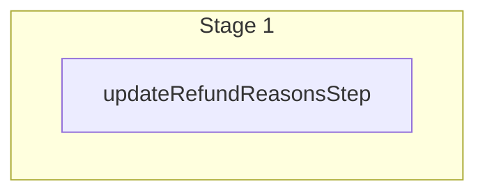

This documentation provides a reference to the `updateRefundReasonsWorkflow`. It belongs to the `@medusajs/medusa/core-flows` package.

This workflow updates one or more refund reasons. It's used by the
[Update Refund Reason Admin API Route](/api/admin/refund-reasons/update-a-refund-reason).

You can use this workflow within your own customizations or custom workflows, allowing you
to update refund reasons in your custom flows.

[View source code](https://github.com/medusajs/medusa/blob/0ed927bdb7a396a8fd5f6447ed69b7b354b150d3/packages/core/core-flows/src/payment-collection/workflows/update-refund-reasons.ts#L45)

## Examples

**API Route**

```ts title="src/api/workflow/route.ts"
import type {
  MedusaRequest,
  MedusaResponse,
} from "@medusajs/framework/http"
import { updateRefundReasonsWorkflow } from "@medusajs/medusa/core-flows"

export async function POST(
  req: MedusaRequest,
  res: MedusaResponse
) {
  const { result } = await updateRefundReasonsWorkflow(req.scope)
    .run({
      input: [{
        id: "refres_123",
        label: "Damaged",
      }]
    })

  res.send(result)
}
```

**Subscriber**

```ts title="src/subscribers/order-placed.ts"
import {
  type SubscriberConfig,
  type SubscriberArgs,
} from "@medusajs/framework"
import { updateRefundReasonsWorkflow } from "@medusajs/medusa/core-flows"

export default async function handleOrderPlaced({
  event: { data },
  container,
}: SubscriberArgs < { id: string } > ) {
  const { result } = await updateRefundReasonsWorkflow(container)
    .run({
      input: [{
        id: "refres_123",
        label: "Damaged",
      }]
    })

  console.log(result)
}

export const config: SubscriberConfig = {
  event: "order.placed",
}
```

**Scheduled Job**

```ts title="src/jobs/message-daily.ts"
import { MedusaContainer } from "@medusajs/framework/types"
import { updateRefundReasonsWorkflow } from "@medusajs/medusa/core-flows"

export default async function myCustomJob(
  container: MedusaContainer
) {
  const { result } = await updateRefundReasonsWorkflow(container)
    .run({
      input: [{
        id: "refres_123",
        label: "Damaged",
      }]
    })

  console.log(result)
}

export const config = {
  name: "run-once-a-day",
  schedule: "0 0 * * *",
}
```

**Another Workflow**

```ts title="src/workflows/my-workflow.ts"
import { createWorkflow } from "@medusajs/framework/workflows-sdk"
import { updateRefundReasonsWorkflow } from "@medusajs/medusa/core-flows"

const myWorkflow = createWorkflow(
  "my-workflow",
  () => {
    const result = updateRefundReasonsWorkflow
      .runAsStep({
        input: [{
          id: "refres_123",
          label: "Damaged",
        }]
      })
  }
)
```

<a id="updaterefundreasonsworkflow-steps" />

## Steps



Stages follow the order in the workflow definition. Conditional steps run only when their condition is met. The step descriptions below include the conditions and reference links.

- [updateRefundReasonsStep](/resources/references/medusa-workflows/steps/updateRefundReasonsStep): This step updates one or more refund reasons.

<a id="updaterefundreasonsworkflow-input" />

## Input

**updateRefundReasonsWorkflow**

- `UpdateRefundReasonsWorkflowInput`: [UpdateRefundReasonsWorkflowInput](/resources/references/core_flows/core_core_flows_src/types/core_flowscore_core_flows_srcUpdateRefundReasonsWorkflowInput)
  - `id`: `string` — The id of the refund reason
  - `label`: `string` (optional) — The label of the refund reason
  - `description`: `null` | `string` (optional) — The description of the refund reason
  - `metadata`: `null` | `Record<string, unknown>` (optional) — The metadata of the refund reason

<a id="updaterefundreasonsworkflow-output" />

## Output

**updateRefundReasonsWorkflow**

- `UpdateRefundReasonsWorkflowOutput`: [UpdateRefundReasonsWorkflowOutput](/resources/references/core_flows/core_core_flows_src/types/core_flowscore_core_flows_srcUpdateRefundReasonsWorkflowOutput)
  - `id`: `string` — The ID of the refund reason
  - `label`: `string` — The label of the refund reason
  - `description`: `null` | `string` (optional) — The description of the refund reason
  - `metadata`: `null` | `Record<string, unknown>` — The metadata of the refund reason
  - `created_at`: `string` | `Date` — When the refund reason was created
  - `updated_at`: `string` | `Date` — When the refund reason was updated
