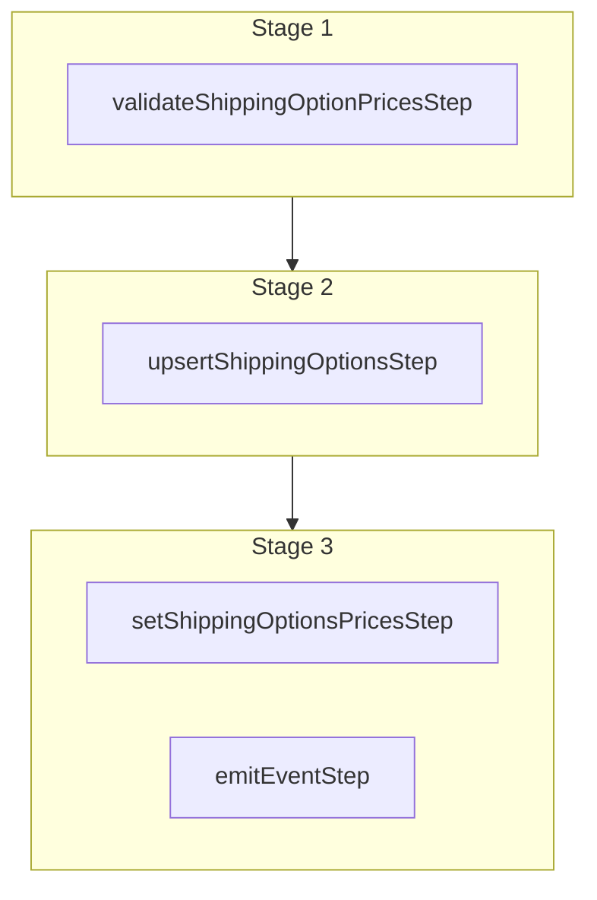

This documentation provides a reference to the `updateShippingOptionsWorkflow`. It belongs to the `@medusajs/medusa/core-flows` package.

This workflow updates one or more shipping options. It's used by the
[Update Shipping Options Admin API Route](/api/admin/shipping-options/update-a-shipping-option).

You can use this workflow within your own customizations or custom workflows, allowing you to
update shipping options within your custom flows.

### Updating Shipping Option Prices

When you provide the `prices` array, it replaces the shipping option's existing flat-rate prices:

- A price with a matching `id` is updated.
- A price without an `id` is created.
- Any existing price whose `id` isn't included in the array is deleted.

The `rules` you provide for a price similarly replace that price's existing rules, so omit a rule to remove it.

Omitting the `prices` property entirely leaves the existing prices unchanged, whereas setting `price_type` to `calculated` removes all flat-rate prices.

> **Note**
>
> Learn more about adding rules to the shipping option's prices in the Pricing Module's
> [Price Rules](/resources/commerce-modules/pricing/price-rules) documentation.

[View source code](https://github.com/medusajs/medusa/blob/0ed927bdb7a396a8fd5f6447ed69b7b354b150d3/packages/core/core-flows/src/fulfillment/workflows/update-shipping-options.ts#L70)

## Examples

**API Route**

```ts title="src/api/workflow/route.ts"
import type {
  MedusaRequest,
  MedusaResponse,
} from "@medusajs/framework/http"
import { updateShippingOptionsWorkflow } from "@medusajs/medusa/core-flows"

export async function POST(
  req: MedusaRequest,
  res: MedusaResponse
) {
  const { result } = await updateShippingOptionsWorkflow(req.scope)
    .run({
      input: [{
        id: "so_123",
        name: "Standard Shipping",
      }]
    })

  res.send(result)
}
```

**Subscriber**

```ts title="src/subscribers/order-placed.ts"
import {
  type SubscriberConfig,
  type SubscriberArgs,
} from "@medusajs/framework"
import { updateShippingOptionsWorkflow } from "@medusajs/medusa/core-flows"

export default async function handleOrderPlaced({
  event: { data },
  container,
}: SubscriberArgs < { id: string } > ) {
  const { result } = await updateShippingOptionsWorkflow(container)
    .run({
      input: [{
        id: "so_123",
        name: "Standard Shipping",
      }]
    })

  console.log(result)
}

export const config: SubscriberConfig = {
  event: "order.placed",
}
```

**Scheduled Job**

```ts title="src/jobs/message-daily.ts"
import { MedusaContainer } from "@medusajs/framework/types"
import { updateShippingOptionsWorkflow } from "@medusajs/medusa/core-flows"

export default async function myCustomJob(
  container: MedusaContainer
) {
  const { result } = await updateShippingOptionsWorkflow(container)
    .run({
      input: [{
        id: "so_123",
        name: "Standard Shipping",
      }]
    })

  console.log(result)
}

export const config = {
  name: "run-once-a-day",
  schedule: "0 0 * * *",
}
```

**Another Workflow**

```ts title="src/workflows/my-workflow.ts"
import { createWorkflow } from "@medusajs/framework/workflows-sdk"
import { updateShippingOptionsWorkflow } from "@medusajs/medusa/core-flows"

const myWorkflow = createWorkflow(
  "my-workflow",
  () => {
    const result = updateShippingOptionsWorkflow
      .runAsStep({
        input: [{
          id: "so_123",
          name: "Standard Shipping",
        }]
      })
  }
)
```

<a id="updateshippingoptionsworkflow-steps" />

## Steps



Stages follow the order in the workflow definition. Conditional steps run only when their condition is met. The step descriptions below include the conditions and reference links.

- [validateShippingOptionPricesStep](/resources/references/medusa-workflows/steps/validateShippingOptionPricesStep): This step validates that shipping options can be created based on provided price configuration. For flat rate prices, it validates that regions exist for the shipping option prices. For calculated prices, it validates with the fulfillment provider if the price can be calculated. If not valid, the step throws an error.
  - [upsertShippingOptionsStep](/resources/references/medusa-workflows/steps/upsertShippingOptionsStep): This step creates or updates shipping options.
    - [setShippingOptionsPricesStep](/resources/references/medusa-workflows/steps/setShippingOptionsPricesStep): This step sets the prices of one or more shipping options.
    - [emitEventStep](/resources/references/medusa-workflows/steps/emitEventStep): This step emits an event, which you can listen to in a [subscriber](/learn/fundamentals/events-and-subscribers). You can pass data to the subscriber by including it in the `data` property. The event is only emitted after the workflow has finished successfully. So, even if it's executed in the middle of the workflow, it won't actually emit the event until the workflow has completed successfully. If the workflow fails, it won't emit the event at all.

<a id="updateshippingoptionsworkflow-input" />

## Input

**updateShippingOptionsWorkflow**

- `UpdateShippingOptionsWorkflowInput`: [UpdateShippingOptionsWorkflowInput](/resources/references/core_flows/core_core_flows_src/types/core_flowscore_core_flows_srcUpdateShippingOptionsWorkflowInput)
  - `UpdateShippingOptionsWorkflowInput`: [UpdateShippingOptionsWorkflowInput](/resources/references/types/WorkflowTypes/FulfillmentWorkflow/types/typesWorkflowTypesFulfillmentWorkflowUpdateShippingOptionsWorkflowInput)\[] — The data to update the shipping options.

<a id="updateshippingoptionsworkflow-output" />

## Output

**updateShippingOptionsWorkflow**

- `UpdateShippingOptionsWorkflowOutput`: [UpdateShippingOptionsWorkflowOutput](/resources/references/types/WorkflowTypes/FulfillmentWorkflow/types/typesWorkflowTypesFulfillmentWorkflowUpdateShippingOptionsWorkflowOutput)
  - `id`: `string` — The updated shipping option's ID.

<a id="updateshippingoptionsworkflow-emitted-events" />

## Emitted Events

- `shipping-option.updated` (since v2.12.4): Emitted when shipping options are updated.

  ```ts
  {
    id, // The ID of the shipping option
  }
  ```
