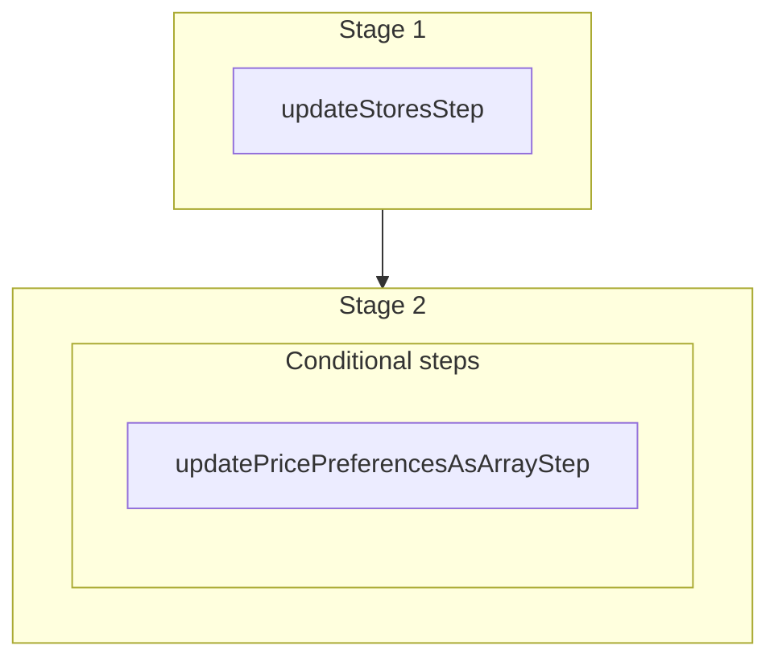

This documentation provides a reference to the `updateStoresWorkflow`. It belongs to the `@medusajs/medusa/core-flows` package.

This workflow updates stores matching the specified filters. It's used by the
[Update Store Admin API Route](/api/admin/stores/update-a-store).

You can use this workflow within your customizations or your own custom workflows, allowing you to
update stores within your custom flows.

[View source code](https://github.com/medusajs/medusa/blob/0ed927bdb7a396a8fd5f6447ed69b7b354b150d3/packages/core/core-flows/src/store/workflows/update-stores.ts#L42)

## Examples

**API Route**

```ts title="src/api/workflow/route.ts"
import type {
  MedusaRequest,
  MedusaResponse,
} from "@medusajs/framework/http"
import { updateStoresWorkflow } from "@medusajs/medusa/core-flows"

export async function POST(
  req: MedusaRequest,
  res: MedusaResponse
) {
  const { result } = await updateStoresWorkflow(req.scope)
    .run({
      input: {
        selector: {
          id: "store_123"
        },
        update: {
          name: "Acme"
        }
      }
    })

  res.send(result)
}
```

**Subscriber**

```ts title="src/subscribers/order-placed.ts"
import {
  type SubscriberConfig,
  type SubscriberArgs,
} from "@medusajs/framework"
import { updateStoresWorkflow } from "@medusajs/medusa/core-flows"

export default async function handleOrderPlaced({
  event: { data },
  container,
}: SubscriberArgs < { id: string } > ) {
  const { result } = await updateStoresWorkflow(container)
    .run({
      input: {
        selector: {
          id: "store_123"
        },
        update: {
          name: "Acme"
        }
      }
    })

  console.log(result)
}

export const config: SubscriberConfig = {
  event: "order.placed",
}
```

**Scheduled Job**

```ts title="src/jobs/message-daily.ts"
import { MedusaContainer } from "@medusajs/framework/types"
import { updateStoresWorkflow } from "@medusajs/medusa/core-flows"

export default async function myCustomJob(
  container: MedusaContainer
) {
  const { result } = await updateStoresWorkflow(container)
    .run({
      input: {
        selector: {
          id: "store_123"
        },
        update: {
          name: "Acme"
        }
      }
    })

  console.log(result)
}

export const config = {
  name: "run-once-a-day",
  schedule: "0 0 * * *",
}
```

**Another Workflow**

```ts title="src/workflows/my-workflow.ts"
import { createWorkflow } from "@medusajs/framework/workflows-sdk"
import { updateStoresWorkflow } from "@medusajs/medusa/core-flows"

const myWorkflow = createWorkflow(
  "my-workflow",
  () => {
    const result = updateStoresWorkflow
      .runAsStep({
        input: {
          selector: {
            id: "store_123"
          },
          update: {
            name: "Acme"
          }
        }
      })
  }
)
```

<a id="updatestoresworkflow-steps" />

## Steps



Stages follow the order in the workflow definition. Conditional steps run only when their condition is met. The step descriptions below include the conditions and reference links.

- [updateStoresStep](/resources/references/medusa-workflows/steps/updateStoresStep): This step updates stores matching the specified filters.
  - **when** (when: \{
    return !!data.input.update.supported\_currencies?.length
    })
  - [updatePricePreferencesAsArrayStep](/resources/references/medusa-workflows/steps/updatePricePreferencesAsArrayStep): This step creates or updates price preferences.

<a id="updatestoresworkflow-input" />

## Input

**updateStoresWorkflow**

- `UpdateStoreWorkflowInput`: [UpdateStoreWorkflowInput](/resources/references/types/WorkflowTypes/StoreWorkflow/interfaces/typesWorkflowTypesStoreWorkflowUpdateStoreWorkflowInput)
  - `selector`: [FilterableStoreProps](/resources/references/store/interfaces/storeFilterableStoreProps) — The filters to select the stores to update.
    - `$and`: ([FilterableStoreProps](/resources/references/store/interfaces/storeFilterableStoreProps) | [BaseFilterable](/resources/references/store/interfaces/storeBaseFilterable)\<[FilterableStoreProps](/resources/references/store/interfaces/storeFilterableStoreProps)>)\[] (optional) — An array of filters to apply on the entity, where each item in the array is joined with an "and" condition.
      - `$and`: ([FilterableStoreProps](/resources/references/store/interfaces/storeFilterableStoreProps) | [BaseFilterable](/resources/references/store/interfaces/storeBaseFilterable)\<[FilterableStoreProps](/resources/references/store/interfaces/storeFilterableStoreProps)>)\[] (optional) — An array of filters to apply on the entity, where each item in the array is joined with an "and" condition.
      - `$or`: ([FilterableStoreProps](/resources/references/store/interfaces/storeFilterableStoreProps) | [BaseFilterable](/resources/references/store/interfaces/storeBaseFilterable)\<[FilterableStoreProps](/resources/references/store/interfaces/storeFilterableStoreProps)>)\[] (optional) — An array of filters to apply on the entity, where each item in the array is joined with an "or" condition.
      - `q`: `string` (optional) — Find stores by name through this search term.
      - `id`: `string` | `string`\[] (optional) — The IDs to filter the stores by.
      - `name`: `string` | `string`\[] (optional) — Filter stores by their names.
      - `default_sales_channel_id`: `string` | `string`\[] | [OperatorMap](/resources/references/store/types/storeOperatorMap)\<string | string\[]> (optional) — Filter stores by their associated default sales channel's ID.
    - `$or`: ([FilterableStoreProps](/resources/references/store/interfaces/storeFilterableStoreProps) | [BaseFilterable](/resources/references/store/interfaces/storeBaseFilterable)\<[FilterableStoreProps](/resources/references/store/interfaces/storeFilterableStoreProps)>)\[] (optional) — An array of filters to apply on the entity, where each item in the array is joined with an "or" condition.
      - `$and`: ([FilterableStoreProps](/resources/references/store/interfaces/storeFilterableStoreProps) | [BaseFilterable](/resources/references/store/interfaces/storeBaseFilterable)\<[FilterableStoreProps](/resources/references/store/interfaces/storeFilterableStoreProps)>)\[] (optional) — An array of filters to apply on the entity, where each item in the array is joined with an "and" condition.
      - `$or`: ([FilterableStoreProps](/resources/references/store/interfaces/storeFilterableStoreProps) | [BaseFilterable](/resources/references/store/interfaces/storeBaseFilterable)\<[FilterableStoreProps](/resources/references/store/interfaces/storeFilterableStoreProps)>)\[] (optional) — An array of filters to apply on the entity, where each item in the array is joined with an "or" condition.
      - `q`: `string` (optional) — Find stores by name through this search term.
      - `id`: `string` | `string`\[] (optional) — The IDs to filter the stores by.
      - `name`: `string` | `string`\[] (optional) — Filter stores by their names.
      - `default_sales_channel_id`: `string` | `string`\[] | [OperatorMap](/resources/references/store/types/storeOperatorMap)\<string | string\[]> (optional) — Filter stores by their associated default sales channel's ID.
    - `q`: `string` (optional) — Find stores by name through this search term.
    - `id`: `string` | `string`\[] (optional) — The IDs to filter the stores by.
    - `name`: `string` | `string`\[] (optional) — Filter stores by their names.
    - `default_sales_channel_id`: `string` | `string`\[] | [OperatorMap](/resources/references/store/types/storeOperatorMap)\<string | string\[]> (optional) — Filter stores by their associated default sales channel's ID.
      - `$and`: [Query](/resources/references/store/types/storeQuery)\<T>\[] (optional)
      - `$or`: [Query](/resources/references/store/types/storeQuery)\<T>\[] (optional)
      - `$eq`: [ExpandScalar](/resources/references/store/types/storeExpandScalar)\<T> | [ExpandScalar](/resources/references/store/types/storeExpandScalar)\<T>\[] (optional)
      - `$ne`: [ExpandScalar](/resources/references/store/types/storeExpandScalar)\<T> (optional)
      - `$in`: [ExpandScalar](/resources/references/store/types/storeExpandScalar)\<T>\[] (optional)
      - `$nin`: [ExpandScalar](/resources/references/store/types/storeExpandScalar)\<T>\[] (optional)
      - `$not`: [Query](/resources/references/store/types/storeQuery)\<T> (optional)
      - `$gt`: [ExpandScalar](/resources/references/store/types/storeExpandScalar)\<T> (optional)
      - `$gte`: [ExpandScalar](/resources/references/store/types/storeExpandScalar)\<T> (optional)
      - `$lt`: [ExpandScalar](/resources/references/store/types/storeExpandScalar)\<T> (optional)
      - `$lte`: [ExpandScalar](/resources/references/store/types/storeExpandScalar)\<T> (optional)
      - `$like`: `string` (optional)
      - `$re`: `string` (optional)
      - `$ilike`: `string` (optional)
      - `$fulltext`: `string` (optional)
      - `$overlap`: `string`\[] (optional)
      - `$contains`: `string`\[] (optional)
      - `$contained`: `string`\[] (optional)
      - `$exists`: `boolean` (optional)
  - `update`: [AdminUpdateStore](/resources/references/types/HttpTypes/interfaces/typesHttpTypesAdminUpdateStore) — The data to update in the stores.
    - `name`: `string` (optional) — The name of the store.
    - `supported_currencies`: [AdminUpdateStoreSupportedCurrency](/resources/references/types/HttpTypes/interfaces/typesHttpTypesAdminUpdateStoreSupportedCurrency)\[] (optional) — The supported currencies of the store.
      - `currency_code`: `string` — The currency's ISO 3 code.

        Example:

        ```
        usd
        ```
      - `is_default`: `boolean` (optional) — Whether this currency is the default currency in the store.
      - `is_tax_inclusive`: `boolean` (optional) — Whether prices in this currency are tax inclusive. Learn more in [this documentation](/resources/commerce-modules/pricing/tax-inclusive-pricing).
    - `supported_locales`: [AdminUpdateStoreSupportedLocale](/resources/references/types/HttpTypes/interfaces/typesHttpTypesAdminUpdateStoreSupportedLocale)\[] (optional) — The supported locales of the store.
      - `locale_code`: `string` — The locale's BCP 47 language tag.

        Example:

        ```
        "en-US"
        ```
    - `default_sales_channel_id`: `null` | `string` (optional) — The ID of the default sales channel of the store.
    - `default_region_id`: `null` | `string` (optional) — The ID of the default region of the store.
    - `default_location_id`: `null` | `string` (optional) — The ID of the default stock location of the store.
    - `metadata`: `null` | `Record<string, any>` (optional) — Custom key-value pairs to store custom data in the store.

<a id="updatestoresworkflow-output" />

## Output

**updateStoresWorkflow**

- `UpdateStoresWorkflowOutput`: [UpdateStoresWorkflowOutput](/resources/references/core_flows/core_core_flows_src/types/core_flowscore_core_flows_srcUpdateStoresWorkflowOutput)
  - `id`: `string` — The ID of the store.
  - `name`: `string` — The name of the store.
  - `supported_currencies`: [StoreCurrencyDTO](/resources/references/store/interfaces/storeStoreCurrencyDTO)\[] (optional) — The supported currency codes of the store.
    - `id`: `string` — The ID of the store currency.
    - `currency_code`: `string` — The currency code of the store currency.
    - `is_default`: `boolean` — Whether the currency is the default one for the store.
    - `store_id`: `string` — The store ID associated with the currency.
    - `created_at`: `string` — The created date of the currency
    - `updated_at`: `string` — The updated date of the currency
    - `deleted_at`: `null` | `string` — The deleted date of the currency
  - `supported_locales`: [StoreLocaleDTO](/resources/references/store/interfaces/storeStoreLocaleDTO)\[] (optional) — The supported locale codes of the store.
    - `id`: `string` — The ID of the store locale.
    - `locale_code`: `string` — The locale code of the store locale.
    - `store_id`: `string` — The store ID associated with the locale.
    - `created_at`: `string` — The created date of the locale.
    - `updated_at`: `string` — The updated date of the locale.
    - `deleted_at`: `null` | `string` — The deleted date of the locale.
  - `default_sales_channel_id`: `string` (optional) — The associated default sales channel's ID.
  - `default_region_id`: `string` (optional) — The associated default region's ID.
  - `default_location_id`: `string` (optional) — The associated default location's ID.
  - `metadata`: `null` | `Record<string, any>` — Holds custom data in key-value pairs.
  - `created_at`: `string` — The created at of the store.
  - `updated_at`: `string` — The updated at of the store.
