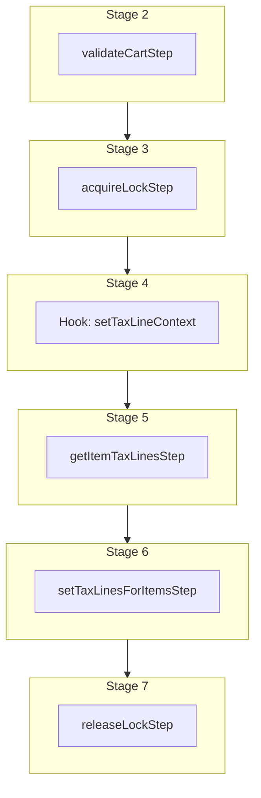

This documentation provides a reference to the `updateTaxLinesWorkflow`. It belongs to the `@medusajs/medusa/core-flows` package.

This workflow updates a cart's tax lines that are applied on line items and shipping methods. You can update the line item's quantity, unit price, and more. This workflow is executed
by the [Calculate Taxes Store API Route](/api/store/carts/calculate-taxes).

You can use this workflow within your own customizations or custom workflows, allowing you to update a cart's tax lines in your custom flows.

> **Note**
>
> If you use this workflow in another, you must acquire a lock before running it and release the lock after. Learn more in the [Locking Operations in Workflows](/learn/fundamentals/workflows/locks#locks-in-nested-workflows) guide.

[View source code](https://github.com/medusajs/medusa/blob/0ed927bdb7a396a8fd5f6447ed69b7b354b150d3/packages/core/core-flows/src/cart/workflows/update-tax-lines.ts#L136)

## Examples

**API Route**

```ts title="src/api/workflow/route.ts"
import type {
  MedusaRequest,
  MedusaResponse,
} from "@medusajs/framework/http"
import { updateTaxLinesWorkflow } from "@medusajs/medusa/core-flows"

export async function POST(
  req: MedusaRequest,
  res: MedusaResponse
) {
  const { result } = await updateTaxLinesWorkflow(req.scope)
    .run({
      input: {
        cart_id: "cart_123",
      }
    })

  res.send(result)
}
```

**Subscriber**

```ts title="src/subscribers/order-placed.ts"
import {
  type SubscriberConfig,
  type SubscriberArgs,
} from "@medusajs/framework"
import { updateTaxLinesWorkflow } from "@medusajs/medusa/core-flows"

export default async function handleOrderPlaced({
  event: { data },
  container,
}: SubscriberArgs < { id: string } > ) {
  const { result } = await updateTaxLinesWorkflow(container)
    .run({
      input: {
        cart_id: "cart_123",
      }
    })

  console.log(result)
}

export const config: SubscriberConfig = {
  event: "order.placed",
}
```

**Scheduled Job**

```ts title="src/jobs/message-daily.ts"
import { MedusaContainer } from "@medusajs/framework/types"
import { updateTaxLinesWorkflow } from "@medusajs/medusa/core-flows"

export default async function myCustomJob(
  container: MedusaContainer
) {
  const { result } = await updateTaxLinesWorkflow(container)
    .run({
      input: {
        cart_id: "cart_123",
      }
    })

  console.log(result)
}

export const config = {
  name: "run-once-a-day",
  schedule: "0 0 * * *",
}
```

**Another Workflow**

```ts title="src/workflows/my-workflow.ts"
import { createWorkflow } from "@medusajs/framework/workflows-sdk"
import { updateTaxLinesWorkflow } from "@medusajs/medusa/core-flows"

const myWorkflow = createWorkflow(
  "my-workflow",
  () => {
    // Acquire lock from nested workflow here
    // acquireLockStep({  key: cart.id,  timeout: 2,  ttl: 10,  })
    const result = updateTaxLinesWorkflow
      .runAsStep({
        input: {
          cart_id: "cart_123",
        }
      })
    // Release lock here
    // releaseLockStep({ key: cart.id })
  }
)
```

<a id="updatetaxlinesworkflow-steps" />

## Steps



Stages follow the order in the workflow definition. Conditional steps run only when their condition is met. The step descriptions below include the conditions and reference links.

- [validateCartStep](/resources/references/medusa-workflows/steps/validateCartStep): This step validates a cart to ensure it exists and is not completed. If not valid, the step throws an error. :::tip You can use the [retrieveCartStep](/resources/references/medusa-workflows/steps/retrieveCartStep) to retrieve a cart's details. :::
  - [acquireLockStep](/resources/references/medusa-workflows/steps/acquireLockStep): This step acquires a lock for a given key. Learn more about locks in the [Locking Module](/resources/infrastructure-modules/locking) guide.
    - [setTaxLineContext](/resources/references/medusa-workflows/updateTaxLinesWorkflow#settaxlinecontext): This hook is executed after the cart is fetched and before tax lines are calculated. You can consume this hook to add custom context to the tax calculation. The returned object is set as the additional\_context property in the getItemTaxLinesStep input.
      - [getItemTaxLinesStep](/resources/references/medusa-workflows/steps/getItemTaxLinesStep): This step retrieves the tax lines for an order or cart's line items and shipping methods. :::note You can retrieve an order, cart, item, shipping method, and address details using [Query](/learn/fundamentals/module-links/query), or [useQueryGraphStep](/resources/references/medusa-workflows/steps/useQueryGraphStep). :::
        - [setTaxLinesForItemsStep](/resources/references/medusa-workflows/steps/setTaxLinesForItemsStep): This step sets the tax lines of shipping methods and line items in a cart. :::tip You can use the [retrieveCartStep](/resources/references/medusa-workflows/steps/retrieveCartStep) to retrieve a cart's details. :::
          - [releaseLockStep](/resources/references/medusa-workflows/steps/releaseLockStep): This step releases a lock for a given key. Learn more about locks in the [Locking Module](/resources/infrastructure-modules/locking) guide.

<a id="updatetaxlinesworkflow-input" />

## Input

**updateTaxLinesWorkflow**

- `UpdateTaxLinesWorkflowInput`: [UpdateTaxLinesWorkflowInput](/resources/references/core_flows/core_core_flows_src/types/core_flowscore_core_flows_srcUpdateTaxLinesWorkflowInput)
  - `cart_id`: `string` (optional) — The cart's ID.
  - `cart`: `any` (optional) — The Cart reference.
  - `items`: [CartLineItemDTO](/resources/references/cart/interfaces/cartCartLineItemDTO)\[] (optional) — The items to update their tax lines. If not specified, taxes are updated for all of the cart's line items.
    - `original_total`: [BigNumberValue](/resources/references/cart/types/cartBigNumberValue) — The original total of the cart line item.
      - `numeric`: `number`
      - `raw`: [BigNumberRawValue](/resources/references/cart/types/cartBigNumberRawValue) (optional)
      - `bigNumber`: `BigNumber` (optional)
    - `original_subtotal`: [BigNumberValue](/resources/references/cart/types/cartBigNumberValue) — The original subtotal of the cart line item.
      - `numeric`: `number`
      - `raw`: [BigNumberRawValue](/resources/references/cart/types/cartBigNumberRawValue) (optional)
      - `bigNumber`: `BigNumber` (optional)
    - `original_tax_total`: [BigNumberValue](/resources/references/cart/types/cartBigNumberValue) — The original tax total of the cart line item.
      - `numeric`: `number`
      - `raw`: [BigNumberRawValue](/resources/references/cart/types/cartBigNumberRawValue) (optional)
      - `bigNumber`: `BigNumber` (optional)
    - `item_total`: [BigNumberValue](/resources/references/cart/types/cartBigNumberValue) — The item total of the cart line item.
      - `numeric`: `number`
      - `raw`: [BigNumberRawValue](/resources/references/cart/types/cartBigNumberRawValue) (optional)
      - `bigNumber`: `BigNumber` (optional)
    - `item_subtotal`: [BigNumberValue](/resources/references/cart/types/cartBigNumberValue) — The item subtotal of the cart line item.
      - `numeric`: `number`
      - `raw`: [BigNumberRawValue](/resources/references/cart/types/cartBigNumberRawValue) (optional)
      - `bigNumber`: `BigNumber` (optional)
    - `item_tax_total`: [BigNumberValue](/resources/references/cart/types/cartBigNumberValue) — The item tax total of the cart line item.
      - `numeric`: `number`
      - `raw`: [BigNumberRawValue](/resources/references/cart/types/cartBigNumberRawValue) (optional)
      - `bigNumber`: `BigNumber` (optional)
    - `total`: [BigNumberValue](/resources/references/cart/types/cartBigNumberValue) — The total of the cart line item.
      - `numeric`: `number`
      - `raw`: [BigNumberRawValue](/resources/references/cart/types/cartBigNumberRawValue) (optional)
      - `bigNumber`: `BigNumber` (optional)
    - `subtotal`: [BigNumberValue](/resources/references/cart/types/cartBigNumberValue) — The subtotal of the cart line item.
      - `numeric`: `number`
      - `raw`: [BigNumberRawValue](/resources/references/cart/types/cartBigNumberRawValue) (optional)
      - `bigNumber`: `BigNumber` (optional)
    - `tax_total`: [BigNumberValue](/resources/references/cart/types/cartBigNumberValue) — The tax total of the cart line item.
      - `numeric`: `number`
      - `raw`: [BigNumberRawValue](/resources/references/cart/types/cartBigNumberRawValue) (optional)
      - `bigNumber`: `BigNumber` (optional)
    - `discount_total`: [BigNumberValue](/resources/references/cart/types/cartBigNumberValue) — The discount total of the cart line item.
      - `numeric`: `number`
      - `raw`: [BigNumberRawValue](/resources/references/cart/types/cartBigNumberRawValue) (optional)
      - `bigNumber`: `BigNumber` (optional)
    - `discount_tax_total`: [BigNumberValue](/resources/references/cart/types/cartBigNumberValue) — The discount tax total of the cart line item.
      - `numeric`: `number`
      - `raw`: [BigNumberRawValue](/resources/references/cart/types/cartBigNumberRawValue) (optional)
      - `bigNumber`: `BigNumber` (optional)
    - `raw_original_total`: [BigNumberRawValue](/resources/references/cart/types/cartBigNumberRawValue) — The raw original total of the cart line item.
      - `value`: `string` | `number`
    - `raw_original_subtotal`: [BigNumberRawValue](/resources/references/cart/types/cartBigNumberRawValue) — The raw original subtotal of the cart line item.
      - `value`: `string` | `number`
    - `raw_original_tax_total`: [BigNumberRawValue](/resources/references/cart/types/cartBigNumberRawValue) — The raw original tax total of the cart line item.
      - `value`: `string` | `number`
    - `raw_item_total`: [BigNumberRawValue](/resources/references/cart/types/cartBigNumberRawValue) — The raw item total of the cart line item.
      - `value`: `string` | `number`
    - `raw_item_subtotal`: [BigNumberRawValue](/resources/references/cart/types/cartBigNumberRawValue) — The raw item subtotal of the cart line item.
      - `value`: `string` | `number`
    - `raw_item_tax_total`: [BigNumberRawValue](/resources/references/cart/types/cartBigNumberRawValue) — The raw item tax total of the cart line item.
      - `value`: `string` | `number`
    - `raw_total`: [BigNumberRawValue](/resources/references/cart/types/cartBigNumberRawValue) — The raw total of the cart line item.
      - `value`: `string` | `number`
    - `raw_subtotal`: [BigNumberRawValue](/resources/references/cart/types/cartBigNumberRawValue) — The raw subtotal of the cart line item.
      - `value`: `string` | `number`
    - `raw_tax_total`: [BigNumberRawValue](/resources/references/cart/types/cartBigNumberRawValue) — The raw tax total of the cart line item.
      - `value`: `string` | `number`
    - `raw_discount_total`: [BigNumberRawValue](/resources/references/cart/types/cartBigNumberRawValue) — The raw discount total of the cart line item.
      - `value`: `string` | `number`
    - `raw_discount_tax_total`: [BigNumberRawValue](/resources/references/cart/types/cartBigNumberRawValue) — The raw discount tax total of the cart line item.
      - `value`: `string` | `number`
    - `id`: `string` — The ID of the line item.
    - `title`: `string` — The title of the line item.
    - `subtitle`: `string` (optional) — The subtitle of the line item.
    - `thumbnail`: `string` (optional) — The line item's thumbnail.
    - `quantity`: [BigNumberValue](/resources/references/cart/types/cartBigNumberValue) — The line item's quantity in the cart.
      - `numeric`: `number`
      - `raw`: [BigNumberRawValue](/resources/references/cart/types/cartBigNumberRawValue) (optional)
      - `bigNumber`: `BigNumber` (optional)
    - `product_id`: `string` (optional) — The ID of the associated product.
    - `product_title`: `string` (optional) — The title of the associated product.
    - `product_description`: `string` (optional) — The description of the associated product.
    - `product_subtitle`: `string` (optional) — The subtitle of the associated product.
    - `product_type`: `string` (optional) — The type of the associated product.
    - `product_type_id`: `string` (optional) — The type of the associated product.
    - `product_collection`: `string` (optional) — The collection of the associated product.
    - `product_handle`: `string` (optional) — The handle of the associated product.
    - `variant_id`: `string` (optional) — The associated variant's ID of the line item.
    - `variant_sku`: `string` (optional) — The sku of the associated variant.
    - `variant_barcode`: `string` (optional) — The barcode of the associated variant.
    - `variant_title`: `string` (optional) — The title of the associated variant.
    - `variant_option_values`: `Record<string, unknown>` (optional) — The option values of the associated variant.
    - `requires_shipping`: `boolean` — Whether the line item requires shipping.
    - `is_discountable`: `boolean` — Whether the line item is discountable.
    - `is_giftcard`: `boolean` — Whether the line item is a gift card.
    - `is_tax_inclusive`: `boolean` — Whether the line item price is tax inclusive.
    - `is_custom_price`: `boolean` — Whether the line item price is a custom price.
    - `compare_at_unit_price`: [BigNumberValue](/resources/references/cart/types/cartBigNumberValue) (optional) — The calculated price of the line item.
      - `numeric`: `number`
      - `raw`: [BigNumberRawValue](/resources/references/cart/types/cartBigNumberRawValue) (optional)
      - `bigNumber`: `BigNumber` (optional)
    - `unit_price`: [BigNumberValue](/resources/references/cart/types/cartBigNumberValue) — The unit price of the item.
      - `numeric`: `number`
      - `raw`: [BigNumberRawValue](/resources/references/cart/types/cartBigNumberRawValue) (optional)
      - `bigNumber`: `BigNumber` (optional)
    - `tax_lines`: [LineItemTaxLineDTO](/resources/references/cart/interfaces/cartLineItemTaxLineDTO)\[] (optional) — The associated tax lines.
      - `id`: `string` — The ID of the tax line
      - `description`: `string` (optional) — The description of the tax line
      - `tax_rate_id`: `string` (optional) — The ID of the associated tax rate.
      - `code`: `string` — The code of the tax line.
      - `rate`: `number` — The rate of the tax line.
      - `provider_id`: `string` (optional) — The ID of the associated provider.
      - `data`: `null` | `Record<string, unknown>` (optional) — Holds data returned by the tax provider in key-value pairs.
      - `metadata`: `null` | `Record<string, unknown>` (optional) — Holds custom data in key-value pairs.
      - `created_at`: `string` | `Date` — When the tax line was created.
      - `updated_at`: `string` | `Date` — When the tax line was updated.
      - `item`: [CartLineItemDTO](/resources/references/cart/interfaces/cartCartLineItemDTO) — The associated line item.
      - `item_id`: `string` — The ID of the associated line item.
      - `total`: [BigNumberValue](/resources/references/cart/types/cartBigNumberValue) — The total tax relative to the item.
      - `subtotal`: [BigNumberValue](/resources/references/cart/types/cartBigNumberValue) — The subtotal tax relative to the item.
      - `raw_total`: [BigNumberRawValue](/resources/references/cart/types/cartBigNumberRawValue) — The raw total tax relative to the item.
      - `raw_subtotal`: [BigNumberRawValue](/resources/references/cart/types/cartBigNumberRawValue) — The raw subtotal tax relative to the item.
    - `adjustments`: [LineItemAdjustmentDTO](/resources/references/cart/interfaces/cartLineItemAdjustmentDTO)\[] (optional) — The associated adjustments.
      - `id`: `string` — The ID of the adjustment line
      - `code`: `string` (optional) — The code of the promotion that lead to this adjustment.
      - `amount`: [BigNumberValue](/resources/references/cart/types/cartBigNumberValue) — The amount to adjust the original amount with.
      - `is_tax_inclusive`: `boolean` (optional) — Whether the adjustment is tax inclusive.
      - `raw_amount`: [BigNumberRawValue](/resources/references/cart/types/cartBigNumberRawValue) — The raw amount to adjust the original amount with.
      - `cart_id`: `string` — The ID of the associated cart.
      - `description`: `string` (optional) — The description of the adjustment line.
      - `promotion_id`: `string` (optional) — The ID of the associated promotion.
      - `provider_id`: `string` (optional) — The ID of the associated provider.
      - `created_at`: `string` | `Date` — When the adjustment line was created.
      - `updated_at`: `string` | `Date` — When the adjustment line was updated.
      - `item`: [CartLineItemDTO](/resources/references/cart/interfaces/cartCartLineItemDTO) — The associated line item.
      - `item_id`: `string` — The ID of the associated line item.
    - `cart`: [CartDTO](/resources/references/cart/interfaces/cartCartDTO) — The associated cart.
      - `id`: `string` — The ID of the cart.
      - `region_id`: `string` (optional) — The ID of the region the cart belongs to.
      - `customer_id`: `string` (optional) — The ID of the associated customer
      - `sales_channel_id`: `string` (optional) — The ID of the sales channel the cart belongs to.
      - `email`: `string` (optional) — The email of the customer that owns the cart.
      - `currency_code`: `string` — The currency of the cart
      - `locale`: `string` (optional) — The locale code of the cart.
      - `shipping_address`: [CartAddressDTO](/resources/references/cart/interfaces/cartCartAddressDTO) (optional) — The associated shipping address.
      - `billing_address`: [CartAddressDTO](/resources/references/cart/interfaces/cartCartAddressDTO) (optional) — The associated billing address.
      - `items`: [CartLineItemDTO](/resources/references/cart/interfaces/cartCartLineItemDTO)\[] (optional) — The associated line items.
      - `credit_lines`: [CartCreditLineDTO](/resources/references/cart/interfaces/cartCartCreditLineDTO)\[] (optional) — The credit lines for a cart
      - `shipping_methods`: [CartShippingMethodDTO](/resources/references/cart/interfaces/cartCartShippingMethodDTO)\[] (optional) — The associated shipping methods
      - `metadata`: `null` | `Record<string, unknown>` (optional) — Holds custom data in key-value pairs.
      - `completed_at`: `string` | `Date` (optional) — When the cart was completed.
      - `created_at`: `string` | `Date` (optional) — When the cart was created.
      - `updated_at`: `string` | `Date` (optional) — When the cart was updated.
      - `original_item_total`: [BigNumberValue](/resources/references/cart/types/cartBigNumberValue) — The original item total of the cart.
      - `original_item_subtotal`: [BigNumberValue](/resources/references/cart/types/cartBigNumberValue) — The original item subtotal of the cart.
      - `original_item_tax_total`: [BigNumberValue](/resources/references/cart/types/cartBigNumberValue) — The original item tax total of the cart.
      - `item_total`: [BigNumberValue](/resources/references/cart/types/cartBigNumberValue) — The item total of the cart.
      - `item_subtotal`: [BigNumberValue](/resources/references/cart/types/cartBigNumberValue) — The item subtotal of the cart.
      - `item_tax_total`: [BigNumberValue](/resources/references/cart/types/cartBigNumberValue) — The item tax total of the cart.
      - `original_total`: [BigNumberValue](/resources/references/cart/types/cartBigNumberValue) — The original total of the cart.
      - `original_subtotal`: [BigNumberValue](/resources/references/cart/types/cartBigNumberValue) — The original subtotal of the cart.
      - `original_tax_total`: [BigNumberValue](/resources/references/cart/types/cartBigNumberValue) — The original tax total of the cart.
      - `total`: [BigNumberValue](/resources/references/cart/types/cartBigNumberValue) — The total of the cart.
      - `subtotal`: [BigNumberValue](/resources/references/cart/types/cartBigNumberValue) — The subtotal of the cart. (Excluding taxes)
      - `tax_total`: [BigNumberValue](/resources/references/cart/types/cartBigNumberValue) — The tax total of the cart.
      - `discount_total`: [BigNumberValue](/resources/references/cart/types/cartBigNumberValue) — The discount total of the cart.
      - `discount_tax_total`: [BigNumberValue](/resources/references/cart/types/cartBigNumberValue) — The discount tax total of the cart.
      - `gift_card_total`: [BigNumberValue](/resources/references/cart/types/cartBigNumberValue) — The gift card total of the cart.
      - `gift_card_tax_total`: [BigNumberValue](/resources/references/cart/types/cartBigNumberValue) — The gift card tax total of the cart.
      - `shipping_total`: [BigNumberValue](/resources/references/cart/types/cartBigNumberValue) — The shipping total of the cart.
      - `shipping_subtotal`: [BigNumberValue](/resources/references/cart/types/cartBigNumberValue) — The shipping subtotal of the cart.
      - `shipping_tax_total`: [BigNumberValue](/resources/references/cart/types/cartBigNumberValue) — The shipping tax total of the cart.
      - `original_shipping_total`: [BigNumberValue](/resources/references/cart/types/cartBigNumberValue) — The original shipping total of the cart.
      - `original_shipping_subtotal`: [BigNumberValue](/resources/references/cart/types/cartBigNumberValue) — The original shipping subtotal of the cart.
      - `original_shipping_tax_total`: [BigNumberValue](/resources/references/cart/types/cartBigNumberValue) — The original shipping tax total of the cart.
      - `raw_original_item_total`: [BigNumberRawValue](/resources/references/cart/types/cartBigNumberRawValue) — The raw original item total of the cart.
      - `raw_original_item_subtotal`: [BigNumberRawValue](/resources/references/cart/types/cartBigNumberRawValue) — The raw original item subtotal of the cart.
      - `raw_original_item_tax_total`: [BigNumberRawValue](/resources/references/cart/types/cartBigNumberRawValue) — The raw original item tax total of the cart.
      - `raw_item_total`: [BigNumberRawValue](/resources/references/cart/types/cartBigNumberRawValue) — The raw item total of the cart.
      - `raw_item_subtotal`: [BigNumberRawValue](/resources/references/cart/types/cartBigNumberRawValue) — The raw item subtotal of the cart.
      - `raw_item_tax_total`: [BigNumberRawValue](/resources/references/cart/types/cartBigNumberRawValue) — The raw item tax total of the cart.
      - `raw_original_total`: [BigNumberRawValue](/resources/references/cart/types/cartBigNumberRawValue) — The raw original total of the cart.
      - `raw_original_subtotal`: [BigNumberRawValue](/resources/references/cart/types/cartBigNumberRawValue) — The raw original subtotal of the cart.
      - `raw_original_tax_total`: [BigNumberRawValue](/resources/references/cart/types/cartBigNumberRawValue) — The raw original tax total of the cart.
      - `raw_total`: [BigNumberRawValue](/resources/references/cart/types/cartBigNumberRawValue) — The raw total of the cart.
      - `raw_subtotal`: [BigNumberRawValue](/resources/references/cart/types/cartBigNumberRawValue) — The raw subtotal of the cart. (Excluding taxes)
      - `raw_tax_total`: [BigNumberRawValue](/resources/references/cart/types/cartBigNumberRawValue) — The raw tax total of the cart.
      - `raw_discount_total`: [BigNumberRawValue](/resources/references/cart/types/cartBigNumberRawValue) — The raw discount total of the cart.
      - `raw_discount_tax_total`: [BigNumberRawValue](/resources/references/cart/types/cartBigNumberRawValue) — The raw discount tax total of the cart.
      - `raw_gift_card_total`: [BigNumberRawValue](/resources/references/cart/types/cartBigNumberRawValue) — The raw gift card total of the cart.
      - `raw_gift_card_tax_total`: [BigNumberRawValue](/resources/references/cart/types/cartBigNumberRawValue) — The raw gift card tax total of the cart.
      - `raw_shipping_total`: [BigNumberRawValue](/resources/references/cart/types/cartBigNumberRawValue) — The raw shipping total of the cart.
      - `raw_shipping_subtotal`: [BigNumberRawValue](/resources/references/cart/types/cartBigNumberRawValue) — The raw shipping subtotal of the cart.
      - `raw_shipping_tax_total`: [BigNumberRawValue](/resources/references/cart/types/cartBigNumberRawValue) — The raw shipping tax total of the cart.
      - `raw_original_shipping_total`: [BigNumberRawValue](/resources/references/cart/types/cartBigNumberRawValue) — The raw original shipping total of the cart.
      - `raw_original_shipping_subtotal`: [BigNumberRawValue](/resources/references/cart/types/cartBigNumberRawValue) — The raw original shipping subtotal of the cart.
      - `raw_original_shipping_tax_total`: [BigNumberRawValue](/resources/references/cart/types/cartBigNumberRawValue) — The raw original shipping tax total of the cart.
      - `raw_credit_line_total`: [BigNumberRawValue](/resources/references/cart/types/cartBigNumberRawValue) — The raw credit lines total of the cart.
      - `credit_line_total`: [BigNumberValue](/resources/references/cart/types/cartBigNumberValue) — The credit lines total of the cart.
    - `cart_id`: `string` — The ID of the associated cart.
    - `metadata`: `null` | `Record<string, unknown>` (optional) — Holds custom data in key-value pairs.
    - `created_at`: `Date` (optional) — When the line item was created.
    - `updated_at`: `Date` (optional) — When the line item was updated.
    - `deleted_at`: `Date` (optional) — When the line item was deleted.
  - `shipping_methods`: [CartShippingMethodDTO](/resources/references/cart/interfaces/cartCartShippingMethodDTO)\[] (optional) — The shipping methods to update their tax lines. If not specified, taxes are updated for all of the cart's shipping methods.
    - `id`: `string` — The ID of the shipping method.
    - `cart_id`: `string` — The ID of the associated cart.
    - `name`: `string` — The name of the shipping method.
    - `description`: `string` (optional) — The description of the shipping method.
    - `amount`: [BigNumberValue](/resources/references/cart/types/cartBigNumberValue) — The price of the shipping method.
      - `numeric`: `number`
      - `raw`: [BigNumberRawValue](/resources/references/cart/types/cartBigNumberRawValue) (optional)
      - `bigNumber`: `BigNumber` (optional)
    - `is_tax_inclusive`: `boolean` — Whether the shipping method price is tax inclusive.
    - `shipping_option_id`: `string` (optional) — The ID of the shipping option the method was created from.
    - `data`: `Record<string, unknown>` (optional) — Additional data needed for fulfillment.
    - `metadata`: `null` | `Record<string, unknown>` (optional) — Holds custom data in key-value pairs.
    - `tax_lines`: [ShippingMethodTaxLineDTO](/resources/references/cart/interfaces/cartShippingMethodTaxLineDTO)\[] (optional) — The associated tax lines.
      - `id`: `string` — The ID of the tax line
      - `description`: `string` (optional) — The description of the tax line
      - `tax_rate_id`: `string` (optional) — The ID of the associated tax rate.
      - `code`: `string` — The code of the tax line.
      - `rate`: `number` — The rate of the tax line.
      - `provider_id`: `string` (optional) — The ID of the associated provider.
      - `data`: `null` | `Record<string, unknown>` (optional) — Holds data returned by the tax provider in key-value pairs.
      - `metadata`: `null` | `Record<string, unknown>` (optional) — Holds custom data in key-value pairs.
      - `created_at`: `string` | `Date` — When the tax line was created.
      - `updated_at`: `string` | `Date` — When the tax line was updated.
      - `shipping_method`: [CartShippingMethodDTO](/resources/references/cart/interfaces/cartCartShippingMethodDTO) — The associated shipping method.
      - `shipping_method_id`: `string` — The ID of the associated shipping method.
      - `total`: [BigNumberValue](/resources/references/cart/types/cartBigNumberValue) — The total tax relative to the shipping method.
      - `subtotal`: [BigNumberValue](/resources/references/cart/types/cartBigNumberValue) — The subtotal tax relative to the shipping method.
      - `raw_total`: [BigNumberRawValue](/resources/references/cart/types/cartBigNumberRawValue) — The raw total tax relative to the shipping method.
      - `raw_subtotal`: [BigNumberRawValue](/resources/references/cart/types/cartBigNumberRawValue) — The raw subtotal tax relative to the shipping method.
    - `adjustments`: [ShippingMethodAdjustmentDTO](/resources/references/cart/interfaces/cartShippingMethodAdjustmentDTO)\[] (optional) — The associated adjustments.
      - `id`: `string` — The ID of the adjustment line
      - `code`: `string` (optional) — The code of the promotion that lead to this adjustment.
      - `amount`: [BigNumberValue](/resources/references/cart/types/cartBigNumberValue) — The amount to adjust the original amount with.
      - `is_tax_inclusive`: `boolean` (optional) — Whether the adjustment is tax inclusive.
      - `raw_amount`: [BigNumberRawValue](/resources/references/cart/types/cartBigNumberRawValue) — The raw amount to adjust the original amount with.
      - `cart_id`: `string` — The ID of the associated cart.
      - `description`: `string` (optional) — The description of the adjustment line.
      - `promotion_id`: `string` (optional) — The ID of the associated promotion.
      - `provider_id`: `string` (optional) — The ID of the associated provider.
      - `created_at`: `string` | `Date` — When the adjustment line was created.
      - `updated_at`: `string` | `Date` — When the adjustment line was updated.
      - `shipping_method`: [CartShippingMethodDTO](/resources/references/cart/interfaces/cartCartShippingMethodDTO) — The associated shipping method.
      - `shipping_method_id`: `string` — The ID of the associated shipping method.
    - `created_at`: `string` | `Date` — When the shipping method was created.
    - `updated_at`: `string` | `Date` — When the shipping method was updated.
    - `original_total`: [BigNumberValue](/resources/references/cart/types/cartBigNumberValue) — The original total of the cart shipping method.
      - `numeric`: `number`
      - `raw`: [BigNumberRawValue](/resources/references/cart/types/cartBigNumberRawValue) (optional)
      - `bigNumber`: `BigNumber` (optional)
    - `original_subtotal`: [BigNumberValue](/resources/references/cart/types/cartBigNumberValue) — The original subtotal of the cart shipping method.
      - `numeric`: `number`
      - `raw`: [BigNumberRawValue](/resources/references/cart/types/cartBigNumberRawValue) (optional)
      - `bigNumber`: `BigNumber` (optional)
    - `original_tax_total`: [BigNumberValue](/resources/references/cart/types/cartBigNumberValue) — The original tax total of the cart shipping method.
      - `numeric`: `number`
      - `raw`: [BigNumberRawValue](/resources/references/cart/types/cartBigNumberRawValue) (optional)
      - `bigNumber`: `BigNumber` (optional)
    - `total`: [BigNumberValue](/resources/references/cart/types/cartBigNumberValue) — The total of the cart shipping method.
      - `numeric`: `number`
      - `raw`: [BigNumberRawValue](/resources/references/cart/types/cartBigNumberRawValue) (optional)
      - `bigNumber`: `BigNumber` (optional)
    - `subtotal`: [BigNumberValue](/resources/references/cart/types/cartBigNumberValue) — The subtotal of the cart shipping method.
      - `numeric`: `number`
      - `raw`: [BigNumberRawValue](/resources/references/cart/types/cartBigNumberRawValue) (optional)
      - `bigNumber`: `BigNumber` (optional)
    - `tax_total`: [BigNumberValue](/resources/references/cart/types/cartBigNumberValue) — The tax total of the cart shipping method.
      - `numeric`: `number`
      - `raw`: [BigNumberRawValue](/resources/references/cart/types/cartBigNumberRawValue) (optional)
      - `bigNumber`: `BigNumber` (optional)
    - `discount_total`: [BigNumberValue](/resources/references/cart/types/cartBigNumberValue) — The discount total of the cart shipping method.
      - `numeric`: `number`
      - `raw`: [BigNumberRawValue](/resources/references/cart/types/cartBigNumberRawValue) (optional)
      - `bigNumber`: `BigNumber` (optional)
    - `discount_tax_total`: [BigNumberValue](/resources/references/cart/types/cartBigNumberValue) — The discount tax total of the cart shipping method.
      - `numeric`: `number`
      - `raw`: [BigNumberRawValue](/resources/references/cart/types/cartBigNumberRawValue) (optional)
      - `bigNumber`: `BigNumber` (optional)
    - `raw_original_total`: [BigNumberRawValue](/resources/references/cart/types/cartBigNumberRawValue) — The raw original total of the cart shipping method.
      - `value`: `string` | `number`
    - `raw_original_subtotal`: [BigNumberRawValue](/resources/references/cart/types/cartBigNumberRawValue) — The raw original subtotal of the cart shipping method.
      - `value`: `string` | `number`
    - `raw_original_tax_total`: [BigNumberRawValue](/resources/references/cart/types/cartBigNumberRawValue) — The raw original tax total of the cart shipping method.
      - `value`: `string` | `number`
    - `raw_total`: [BigNumberRawValue](/resources/references/cart/types/cartBigNumberRawValue) — The raw total of the cart shipping method.
      - `value`: `string` | `number`
    - `raw_subtotal`: [BigNumberRawValue](/resources/references/cart/types/cartBigNumberRawValue) — The raw subtotal of the cart shipping method.
      - `value`: `string` | `number`
    - `raw_tax_total`: [BigNumberRawValue](/resources/references/cart/types/cartBigNumberRawValue) — The raw tax total of the cart shipping method.
      - `value`: `string` | `number`
    - `raw_discount_total`: [BigNumberRawValue](/resources/references/cart/types/cartBigNumberRawValue) — The raw discount total of the cart shipping method.
      - `value`: `string` | `number`
    - `raw_discount_tax_total`: [BigNumberRawValue](/resources/references/cart/types/cartBigNumberRawValue) — The raw discount tax total of the cart shipping method.
      - `value`: `string` | `number`
  - `force_tax_calculation`: `boolean` (optional, default: false) — Whether to force re-calculating tax amounts, which may include sending requests to a third-part tax provider, depending on the configurations of the cart's tax region.

## Hooks

Hooks allow you to inject custom functionalities into the workflow. You'll receive data from the workflow, as well as additional data sent through an HTTP request.

Learn more about [Hooks](/learn/fundamentals/workflows/workflow-hooks) and [Additional Data](/learn/fundamentals/api-routes/additional-data).

### setTaxLineContext

This hook is executed after the cart is fetched and before tax lines are calculated. You can consume this hook to add custom context to the tax calculation. The returned object is set as the additional\_context property in the getItemTaxLinesStep input.

#### Example

```ts
import { updateTaxLinesWorkflow } from "@medusajs/medusa/core-flows"

updateTaxLinesWorkflow.hooks.setTaxLineContext(
  (async ({ cart, items, shipping_methods }, { container }) => {
    //TODO
  })
)
```

<a id="input" />

#### Input

Handlers consuming this hook accept the following input.

**setTaxLineContext**

- `input`: object — The input data for the hook.
  - `cart`: `any`
  - `items`: `any`
  - `shipping_methods`: `any`
