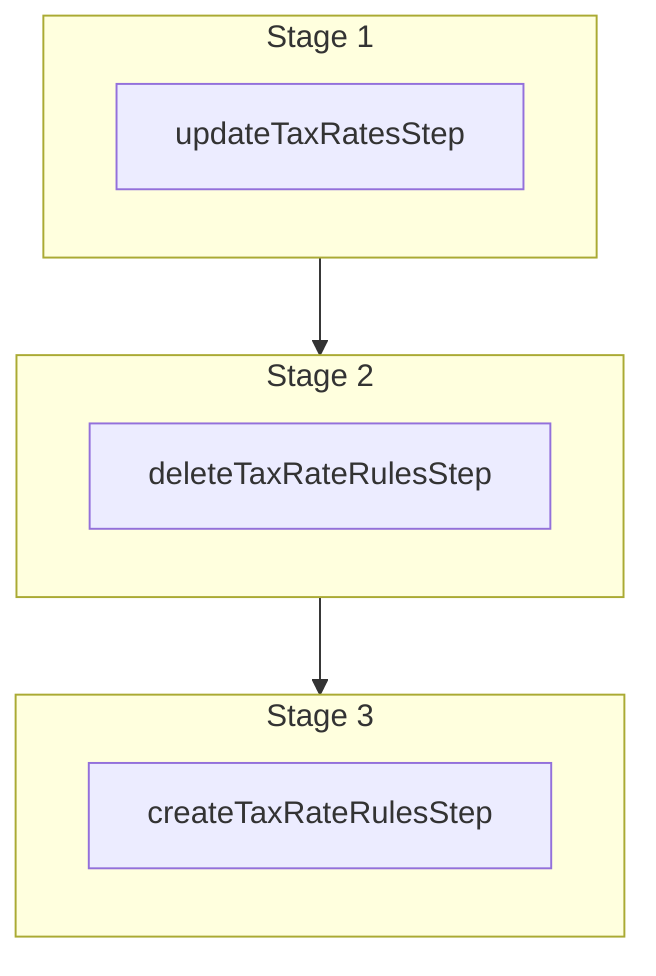

This documentation provides a reference to the `updateTaxRatesWorkflow`. It belongs to the `@medusajs/medusa/core-flows` package.

This workflow updates tax rates matching specified filters. It's used by the
[Update Tax Rates Admin API Route](/api/admin/tax-rates/update-a-tax-rate).

You can use this workflow within your own customizations or custom workflows, allowing you
to update tax rates in your custom flows.

[View source code](https://github.com/medusajs/medusa/blob/0ed927bdb7a396a8fd5f6447ed69b7b354b150d3/packages/core/core-flows/src/tax/workflows/update-tax-rates.ts#L145)

## Examples

**API Route**

```ts title="src/api/workflow/route.ts"
import type {
  MedusaRequest,
  MedusaResponse,
} from "@medusajs/framework/http"
import { updateTaxRatesWorkflow } from "@medusajs/medusa/core-flows"

export async function POST(
  req: MedusaRequest,
  res: MedusaResponse
) {
  const { result } = await updateTaxRatesWorkflow(req.scope)
    .run({
      input: {
        selector: {
          id: ["txr_123"]
        },
        update: {
          code: "VAT"
        }
      }
    })

  res.send(result)
}
```

**Subscriber**

```ts title="src/subscribers/order-placed.ts"
import {
  type SubscriberConfig,
  type SubscriberArgs,
} from "@medusajs/framework"
import { updateTaxRatesWorkflow } from "@medusajs/medusa/core-flows"

export default async function handleOrderPlaced({
  event: { data },
  container,
}: SubscriberArgs < { id: string } > ) {
  const { result } = await updateTaxRatesWorkflow(container)
    .run({
      input: {
        selector: {
          id: ["txr_123"]
        },
        update: {
          code: "VAT"
        }
      }
    })

  console.log(result)
}

export const config: SubscriberConfig = {
  event: "order.placed",
}
```

**Scheduled Job**

```ts title="src/jobs/message-daily.ts"
import { MedusaContainer } from "@medusajs/framework/types"
import { updateTaxRatesWorkflow } from "@medusajs/medusa/core-flows"

export default async function myCustomJob(
  container: MedusaContainer
) {
  const { result } = await updateTaxRatesWorkflow(container)
    .run({
      input: {
        selector: {
          id: ["txr_123"]
        },
        update: {
          code: "VAT"
        }
      }
    })

  console.log(result)
}

export const config = {
  name: "run-once-a-day",
  schedule: "0 0 * * *",
}
```

**Another Workflow**

```ts title="src/workflows/my-workflow.ts"
import { createWorkflow } from "@medusajs/framework/workflows-sdk"
import { updateTaxRatesWorkflow } from "@medusajs/medusa/core-flows"

const myWorkflow = createWorkflow(
  "my-workflow",
  () => {
    const result = updateTaxRatesWorkflow
      .runAsStep({
        input: {
          selector: {
            id: ["txr_123"]
          },
          update: {
            code: "VAT"
          }
        }
      })
  }
)
```

<a id="updatetaxratesworkflow-steps" />

## Steps



Stages follow the order in the workflow definition. Conditional steps run only when their condition is met. The step descriptions below include the conditions and reference links.

- [updateTaxRatesStep](/resources/references/medusa-workflows/steps/updateTaxRatesStep): This step updates tax rates matching the specified filters.
  - [deleteTaxRateRulesStep](/resources/references/medusa-workflows/steps/deleteTaxRateRulesStep): This step deletes one or more tax rate rules.
    - [createTaxRateRulesStep](/resources/references/medusa-workflows/steps/createTaxRateRulesStep): This step creates one or more tax rate rules.

<a id="updatetaxratesworkflow-input" />

## Input

**updateTaxRatesWorkflow**

- `UpdateTaxRatesWorkflowInput`: [UpdateTaxRatesWorkflowInput](/resources/references/core_flows/core_core_flows_src/types/core_flowscore_core_flows_srcUpdateTaxRatesWorkflowInput)
  - `selector`: [FilterableTaxRateProps](/resources/references/tax/interfaces/taxFilterableTaxRateProps) — The filters to select the tax rates to update.
    - `$and`: ([FilterableTaxRateProps](/resources/references/tax/interfaces/taxFilterableTaxRateProps) | [BaseFilterable](/resources/references/tax/interfaces/taxBaseFilterable)\<[FilterableTaxRateProps](/resources/references/tax/interfaces/taxFilterableTaxRateProps)>)\[] (optional) — An array of filters to apply on the entity, where each item in the array is joined with an "and" condition.
      - `$and`: ([FilterableTaxRateProps](/resources/references/tax/interfaces/taxFilterableTaxRateProps) | [BaseFilterable](/resources/references/tax/interfaces/taxBaseFilterable)\<[FilterableTaxRateProps](/resources/references/tax/interfaces/taxFilterableTaxRateProps)>)\[] (optional) — An array of filters to apply on the entity, where each item in the array is joined with an "and" condition.
      - `$or`: ([FilterableTaxRateProps](/resources/references/tax/interfaces/taxFilterableTaxRateProps) | [BaseFilterable](/resources/references/tax/interfaces/taxBaseFilterable)\<[FilterableTaxRateProps](/resources/references/tax/interfaces/taxFilterableTaxRateProps)>)\[] (optional) — An array of filters to apply on the entity, where each item in the array is joined with an "or" condition.
      - `q`: `string` (optional) — Find tax rates based on name and code properties through this search term.
      - `id`: `string` | `string`\[] (optional) — The IDs to filter the tax rates by.
      - `tax_region_id`: `string` | `string`\[] (optional) — Filter the tax rates by their associated tax regions.
      - `rate`: `number` | `number`\[] | [OperatorMap](/resources/references/tax/types/taxOperatorMap)\<number> (optional) — Filter the tax rates by their rate.
      - `code`: `string` | `string`\[] | [OperatorMap](/resources/references/tax/types/taxOperatorMap)\<string> (optional) — Filter the tax rates by their code.
      - `name`: `string` | `string`\[] | [OperatorMap](/resources/references/tax/types/taxOperatorMap)\<string> (optional) — Filter the tax rates by their name.
      - `created_at`: [OperatorMap](/resources/references/tax/types/taxOperatorMap)\<string> (optional) — Filter the tax rates by their creation date.
      - `updated_at`: [OperatorMap](/resources/references/tax/types/taxOperatorMap)\<string> (optional) — Filter the tax rates by their update date.
      - `created_by`: `string` | `string`\[] | [OperatorMap](/resources/references/tax/types/taxOperatorMap)\<string> (optional) — Filter the tax rates by who created it.
    - `$or`: ([FilterableTaxRateProps](/resources/references/tax/interfaces/taxFilterableTaxRateProps) | [BaseFilterable](/resources/references/tax/interfaces/taxBaseFilterable)\<[FilterableTaxRateProps](/resources/references/tax/interfaces/taxFilterableTaxRateProps)>)\[] (optional) — An array of filters to apply on the entity, where each item in the array is joined with an "or" condition.
      - `$and`: ([FilterableTaxRateProps](/resources/references/tax/interfaces/taxFilterableTaxRateProps) | [BaseFilterable](/resources/references/tax/interfaces/taxBaseFilterable)\<[FilterableTaxRateProps](/resources/references/tax/interfaces/taxFilterableTaxRateProps)>)\[] (optional) — An array of filters to apply on the entity, where each item in the array is joined with an "and" condition.
      - `$or`: ([FilterableTaxRateProps](/resources/references/tax/interfaces/taxFilterableTaxRateProps) | [BaseFilterable](/resources/references/tax/interfaces/taxBaseFilterable)\<[FilterableTaxRateProps](/resources/references/tax/interfaces/taxFilterableTaxRateProps)>)\[] (optional) — An array of filters to apply on the entity, where each item in the array is joined with an "or" condition.
      - `q`: `string` (optional) — Find tax rates based on name and code properties through this search term.
      - `id`: `string` | `string`\[] (optional) — The IDs to filter the tax rates by.
      - `tax_region_id`: `string` | `string`\[] (optional) — Filter the tax rates by their associated tax regions.
      - `rate`: `number` | `number`\[] | [OperatorMap](/resources/references/tax/types/taxOperatorMap)\<number> (optional) — Filter the tax rates by their rate.
      - `code`: `string` | `string`\[] | [OperatorMap](/resources/references/tax/types/taxOperatorMap)\<string> (optional) — Filter the tax rates by their code.
      - `name`: `string` | `string`\[] | [OperatorMap](/resources/references/tax/types/taxOperatorMap)\<string> (optional) — Filter the tax rates by their name.
      - `created_at`: [OperatorMap](/resources/references/tax/types/taxOperatorMap)\<string> (optional) — Filter the tax rates by their creation date.
      - `updated_at`: [OperatorMap](/resources/references/tax/types/taxOperatorMap)\<string> (optional) — Filter the tax rates by their update date.
      - `created_by`: `string` | `string`\[] | [OperatorMap](/resources/references/tax/types/taxOperatorMap)\<string> (optional) — Filter the tax rates by who created it.
    - `q`: `string` (optional) — Find tax rates based on name and code properties through this search term.
    - `id`: `string` | `string`\[] (optional) — The IDs to filter the tax rates by.
    - `tax_region_id`: `string` | `string`\[] (optional) — Filter the tax rates by their associated tax regions.
    - `rate`: `number` | `number`\[] | [OperatorMap](/resources/references/tax/types/taxOperatorMap)\<number> (optional) — Filter the tax rates by their rate.
      - `$and`: [Query](/resources/references/tax/types/taxQuery)\<T>\[] (optional)
      - `$or`: [Query](/resources/references/tax/types/taxQuery)\<T>\[] (optional)
      - `$eq`: [ExpandScalar](/resources/references/tax/types/taxExpandScalar)\<T> | [ExpandScalar](/resources/references/tax/types/taxExpandScalar)\<T>\[] (optional)
      - `$ne`: [ExpandScalar](/resources/references/tax/types/taxExpandScalar)\<T> (optional)
      - `$in`: [ExpandScalar](/resources/references/tax/types/taxExpandScalar)\<T>\[] (optional)
      - `$nin`: [ExpandScalar](/resources/references/tax/types/taxExpandScalar)\<T>\[] (optional)
      - `$not`: [Query](/resources/references/tax/types/taxQuery)\<T> (optional)
      - `$gt`: [ExpandScalar](/resources/references/tax/types/taxExpandScalar)\<T> (optional)
      - `$gte`: [ExpandScalar](/resources/references/tax/types/taxExpandScalar)\<T> (optional)
      - `$lt`: [ExpandScalar](/resources/references/tax/types/taxExpandScalar)\<T> (optional)
      - `$lte`: [ExpandScalar](/resources/references/tax/types/taxExpandScalar)\<T> (optional)
      - `$like`: `string` (optional)
      - `$re`: `string` (optional)
      - `$ilike`: `string` (optional)
      - `$fulltext`: `string` (optional)
      - `$overlap`: `string`\[] (optional)
      - `$contains`: `string`\[] (optional)
      - `$contained`: `string`\[] (optional)
      - `$exists`: `boolean` (optional)
    - `code`: `string` | `string`\[] | [OperatorMap](/resources/references/tax/types/taxOperatorMap)\<string> (optional) — Filter the tax rates by their code.
      - `$and`: [Query](/resources/references/tax/types/taxQuery)\<T>\[] (optional)
      - `$or`: [Query](/resources/references/tax/types/taxQuery)\<T>\[] (optional)
      - `$eq`: [ExpandScalar](/resources/references/tax/types/taxExpandScalar)\<T> | [ExpandScalar](/resources/references/tax/types/taxExpandScalar)\<T>\[] (optional)
      - `$ne`: [ExpandScalar](/resources/references/tax/types/taxExpandScalar)\<T> (optional)
      - `$in`: [ExpandScalar](/resources/references/tax/types/taxExpandScalar)\<T>\[] (optional)
      - `$nin`: [ExpandScalar](/resources/references/tax/types/taxExpandScalar)\<T>\[] (optional)
      - `$not`: [Query](/resources/references/tax/types/taxQuery)\<T> (optional)
      - `$gt`: [ExpandScalar](/resources/references/tax/types/taxExpandScalar)\<T> (optional)
      - `$gte`: [ExpandScalar](/resources/references/tax/types/taxExpandScalar)\<T> (optional)
      - `$lt`: [ExpandScalar](/resources/references/tax/types/taxExpandScalar)\<T> (optional)
      - `$lte`: [ExpandScalar](/resources/references/tax/types/taxExpandScalar)\<T> (optional)
      - `$like`: `string` (optional)
      - `$re`: `string` (optional)
      - `$ilike`: `string` (optional)
      - `$fulltext`: `string` (optional)
      - `$overlap`: `string`\[] (optional)
      - `$contains`: `string`\[] (optional)
      - `$contained`: `string`\[] (optional)
      - `$exists`: `boolean` (optional)
    - `name`: `string` | `string`\[] | [OperatorMap](/resources/references/tax/types/taxOperatorMap)\<string> (optional) — Filter the tax rates by their name.
      - `$and`: [Query](/resources/references/tax/types/taxQuery)\<T>\[] (optional)
      - `$or`: [Query](/resources/references/tax/types/taxQuery)\<T>\[] (optional)
      - `$eq`: [ExpandScalar](/resources/references/tax/types/taxExpandScalar)\<T> | [ExpandScalar](/resources/references/tax/types/taxExpandScalar)\<T>\[] (optional)
      - `$ne`: [ExpandScalar](/resources/references/tax/types/taxExpandScalar)\<T> (optional)
      - `$in`: [ExpandScalar](/resources/references/tax/types/taxExpandScalar)\<T>\[] (optional)
      - `$nin`: [ExpandScalar](/resources/references/tax/types/taxExpandScalar)\<T>\[] (optional)
      - `$not`: [Query](/resources/references/tax/types/taxQuery)\<T> (optional)
      - `$gt`: [ExpandScalar](/resources/references/tax/types/taxExpandScalar)\<T> (optional)
      - `$gte`: [ExpandScalar](/resources/references/tax/types/taxExpandScalar)\<T> (optional)
      - `$lt`: [ExpandScalar](/resources/references/tax/types/taxExpandScalar)\<T> (optional)
      - `$lte`: [ExpandScalar](/resources/references/tax/types/taxExpandScalar)\<T> (optional)
      - `$like`: `string` (optional)
      - `$re`: `string` (optional)
      - `$ilike`: `string` (optional)
      - `$fulltext`: `string` (optional)
      - `$overlap`: `string`\[] (optional)
      - `$contains`: `string`\[] (optional)
      - `$contained`: `string`\[] (optional)
      - `$exists`: `boolean` (optional)
    - `created_at`: [OperatorMap](/resources/references/tax/types/taxOperatorMap)\<string> (optional) — Filter the tax rates by their creation date.
      - `$and`: [Query](/resources/references/tax/types/taxQuery)\<T>\[] (optional)
      - `$or`: [Query](/resources/references/tax/types/taxQuery)\<T>\[] (optional)
      - `$eq`: [ExpandScalar](/resources/references/tax/types/taxExpandScalar)\<T> | [ExpandScalar](/resources/references/tax/types/taxExpandScalar)\<T>\[] (optional)
      - `$ne`: [ExpandScalar](/resources/references/tax/types/taxExpandScalar)\<T> (optional)
      - `$in`: [ExpandScalar](/resources/references/tax/types/taxExpandScalar)\<T>\[] (optional)
      - `$nin`: [ExpandScalar](/resources/references/tax/types/taxExpandScalar)\<T>\[] (optional)
      - `$not`: [Query](/resources/references/tax/types/taxQuery)\<T> (optional)
      - `$gt`: [ExpandScalar](/resources/references/tax/types/taxExpandScalar)\<T> (optional)
      - `$gte`: [ExpandScalar](/resources/references/tax/types/taxExpandScalar)\<T> (optional)
      - `$lt`: [ExpandScalar](/resources/references/tax/types/taxExpandScalar)\<T> (optional)
      - `$lte`: [ExpandScalar](/resources/references/tax/types/taxExpandScalar)\<T> (optional)
      - `$like`: `string` (optional)
      - `$re`: `string` (optional)
      - `$ilike`: `string` (optional)
      - `$fulltext`: `string` (optional)
      - `$overlap`: `string`\[] (optional)
      - `$contains`: `string`\[] (optional)
      - `$contained`: `string`\[] (optional)
      - `$exists`: `boolean` (optional)
    - `updated_at`: [OperatorMap](/resources/references/tax/types/taxOperatorMap)\<string> (optional) — Filter the tax rates by their update date.
      - `$and`: [Query](/resources/references/tax/types/taxQuery)\<T>\[] (optional)
      - `$or`: [Query](/resources/references/tax/types/taxQuery)\<T>\[] (optional)
      - `$eq`: [ExpandScalar](/resources/references/tax/types/taxExpandScalar)\<T> | [ExpandScalar](/resources/references/tax/types/taxExpandScalar)\<T>\[] (optional)
      - `$ne`: [ExpandScalar](/resources/references/tax/types/taxExpandScalar)\<T> (optional)
      - `$in`: [ExpandScalar](/resources/references/tax/types/taxExpandScalar)\<T>\[] (optional)
      - `$nin`: [ExpandScalar](/resources/references/tax/types/taxExpandScalar)\<T>\[] (optional)
      - `$not`: [Query](/resources/references/tax/types/taxQuery)\<T> (optional)
      - `$gt`: [ExpandScalar](/resources/references/tax/types/taxExpandScalar)\<T> (optional)
      - `$gte`: [ExpandScalar](/resources/references/tax/types/taxExpandScalar)\<T> (optional)
      - `$lt`: [ExpandScalar](/resources/references/tax/types/taxExpandScalar)\<T> (optional)
      - `$lte`: [ExpandScalar](/resources/references/tax/types/taxExpandScalar)\<T> (optional)
      - `$like`: `string` (optional)
      - `$re`: `string` (optional)
      - `$ilike`: `string` (optional)
      - `$fulltext`: `string` (optional)
      - `$overlap`: `string`\[] (optional)
      - `$contains`: `string`\[] (optional)
      - `$contained`: `string`\[] (optional)
      - `$exists`: `boolean` (optional)
    - `created_by`: `string` | `string`\[] | [OperatorMap](/resources/references/tax/types/taxOperatorMap)\<string> (optional) — Filter the tax rates by who created it.
      - `$and`: [Query](/resources/references/tax/types/taxQuery)\<T>\[] (optional)
      - `$or`: [Query](/resources/references/tax/types/taxQuery)\<T>\[] (optional)
      - `$eq`: [ExpandScalar](/resources/references/tax/types/taxExpandScalar)\<T> | [ExpandScalar](/resources/references/tax/types/taxExpandScalar)\<T>\[] (optional)
      - `$ne`: [ExpandScalar](/resources/references/tax/types/taxExpandScalar)\<T> (optional)
      - `$in`: [ExpandScalar](/resources/references/tax/types/taxExpandScalar)\<T>\[] (optional)
      - `$nin`: [ExpandScalar](/resources/references/tax/types/taxExpandScalar)\<T>\[] (optional)
      - `$not`: [Query](/resources/references/tax/types/taxQuery)\<T> (optional)
      - `$gt`: [ExpandScalar](/resources/references/tax/types/taxExpandScalar)\<T> (optional)
      - `$gte`: [ExpandScalar](/resources/references/tax/types/taxExpandScalar)\<T> (optional)
      - `$lt`: [ExpandScalar](/resources/references/tax/types/taxExpandScalar)\<T> (optional)
      - `$lte`: [ExpandScalar](/resources/references/tax/types/taxExpandScalar)\<T> (optional)
      - `$like`: `string` (optional)
      - `$re`: `string` (optional)
      - `$ilike`: `string` (optional)
      - `$fulltext`: `string` (optional)
      - `$overlap`: `string`\[] (optional)
      - `$contains`: `string`\[] (optional)
      - `$contained`: `string`\[] (optional)
      - `$exists`: `boolean` (optional)
  - `update`: [UpdateTaxRateDTO](/resources/references/tax/interfaces/taxUpdateTaxRateDTO) — The data to update in the tax rates.
    - `rate`: `null` | `number` (optional) — The rate to charge.

      Example:

      ```
      10
      ```
    - `code`: `null` | `string` (optional) — The code of the tax rate.
    - `name`: `string` (optional) — The name of the tax rate.
    - `rules`: Omit\<[CreateTaxRateRuleDTO](/resources/references/tax/interfaces/taxCreateTaxRateRuleDTO), "tax\_rate\_id">\[] (optional) — The rules of the tax rate.
      - `reference`: `string` — The snake-case name of the data model that the tax rule references. For example, `product`. Learn more in [this guide](/resources/commerce-modules/tax/tax-rates-and-rules#override-tax-rates-with-rules).
      - `reference_id`: `string` — The ID of the record of the data model that the tax rule references. For example, `prod_123`. Learn more in [this guide](/resources/commerce-modules/tax/tax-rates-and-rules#override-tax-rates-with-rules).
      - `metadata`: [MetadataType](/resources/references/tax/types/taxMetadataType) (optional) — Holds custom data in key-value pairs.
      - `created_by`: `null` | `string` (optional) — Who created the tax rate rule. For example, the ID of the user that created it.
    - `is_default`: `boolean` (optional) — Whether the tax rate is default.
    - `is_combinable`: `boolean` (optional) — Whether the tax rate is combinable. Learn more [here](/resources/commerce-modules/tax/tax-rates-and-rules#combinable-tax-rates).
    - `metadata`: [MetadataType](/resources/references/tax/types/taxMetadataType) (optional) — Holds custom data in key-value pairs.

<a id="updatetaxratesworkflow-output" />

## Output

**updateTaxRatesWorkflow**

- `UpdateTaxRatesWorkflowOutput`: [UpdateTaxRatesWorkflowOutput](/resources/references/core_flows/core_core_flows_src/types/core_flowscore_core_flows_srcUpdateTaxRatesWorkflowOutput)
  - `id`: `string` — The ID of the tax rate.
  - `rate`: `null` | `number` — The rate to charge.

    Example:

    ```
    10
    ```
  - `code`: `null` | `string` — The code the tax rate is identified by.
  - `name`: `string` — The name of the Tax Rate.

    Example:

    ```
    VAT
    ```
  - `metadata`: `null` | `Record<string, unknown>` — Holds custom data in key-value pairs.
  - `tax_region_id`: `string` — The ID of the associated tax region.
  - `is_combinable`: `boolean` — Whether the tax rate should be combined with parent rates. Learn more [here](/resources/commerce-modules/tax/tax-rates-and-rules#combinable-tax-rates).
  - `is_default`: `boolean` — Whether the tax rate is the default rate for the region.
  - `created_at`: `string` | `Date` — The creation date of the tax rate.
  - `updated_at`: `string` | `Date` — The update date of the tax rate.
  - `deleted_at`: `null` | `Date` — The deletion date of the tax rate.
  - `created_by`: `null` | `string` — Who created the tax rate. For example, the ID of the user that created the tax rate.
