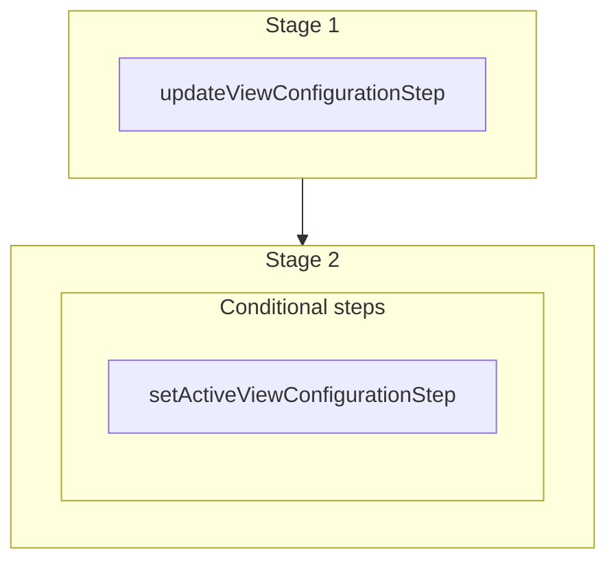

This documentation provides a reference to the `updateViewConfigurationWorkflow`. It belongs to the `@medusajs/medusa/core-flows` package.

This workflow updates a view configuration's details, such as its name or column
configuration. If `set_active` is enabled and the configuration belongs to a
user, the configuration is also set as that user's active view for the entity.

This workflow is used by the [Update View Configuration](/api/admin/views/update-view-configuration)
API route.

You can use this workflow within your own customizations or custom workflows,
allowing you to update a view configuration within your custom flows.

> **Note**
>
> This is available starting from [Medusa v2.10.3](https://github.com/medusajs/medusa/releases/tag/v2.10.3).

[View source code](https://github.com/medusajs/medusa/blob/0ed927bdb7a396a8fd5f6447ed69b7b354b150d3/packages/core/core-flows/src/settings/workflows/update-view-configuration.ts#L65)

## Examples

**API Route**

```ts title="src/api/workflow/route.ts"
import type {
  MedusaRequest,
  MedusaResponse,
} from "@medusajs/framework/http"
import { updateViewConfigurationWorkflow } from "@medusajs/medusa/core-flows"

export async function POST(
  req: MedusaRequest,
  res: MedusaResponse
) {
  const { result } = await updateViewConfigurationWorkflow(req.scope)
    .run({
      input: {
        id: "viewconfig_123",
        set_active: true,
        configuration: {
          visible_columns: ["display_id", "status"],
        },
      },
    })

  res.send(result)
}
```

**Subscriber**

```ts title="src/subscribers/order-placed.ts"
import {
  type SubscriberConfig,
  type SubscriberArgs,
} from "@medusajs/framework"
import { updateViewConfigurationWorkflow } from "@medusajs/medusa/core-flows"

export default async function handleOrderPlaced({
  event: { data },
  container,
}: SubscriberArgs < { id: string } > ) {
  const { result } = await updateViewConfigurationWorkflow(container)
    .run({
      input: {
        id: "viewconfig_123",
        set_active: true,
        configuration: {
          visible_columns: ["display_id", "status"],
        },
      },
    })

  console.log(result)
}

export const config: SubscriberConfig = {
  event: "order.placed",
}
```

**Scheduled Job**

```ts title="src/jobs/message-daily.ts"
import { MedusaContainer } from "@medusajs/framework/types"
import { updateViewConfigurationWorkflow } from "@medusajs/medusa/core-flows"

export default async function myCustomJob(
  container: MedusaContainer
) {
  const { result } = await updateViewConfigurationWorkflow(container)
    .run({
      input: {
        id: "viewconfig_123",
        set_active: true,
        configuration: {
          visible_columns: ["display_id", "status"],
        },
      },
    })

  console.log(result)
}

export const config = {
  name: "run-once-a-day",
  schedule: "0 0 * * *",
}
```

**Another Workflow**

```ts title="src/workflows/my-workflow.ts"
import { createWorkflow } from "@medusajs/framework/workflows-sdk"
import { updateViewConfigurationWorkflow } from "@medusajs/medusa/core-flows"

const myWorkflow = createWorkflow(
  "my-workflow",
  () => {
    const result = updateViewConfigurationWorkflow
      .runAsStep({
        input: {
          id: "viewconfig_123",
          set_active: true,
          configuration: {
            visible_columns: ["display_id", "status"],
          },
        },
      })
  }
)
```

<a id="updateviewconfigurationworkflow-steps" />

## Steps



Stages follow the order in the workflow definition. Conditional steps run only when their condition is met. The step descriptions below include the conditions and reference links.

- [updateViewConfigurationStep](/resources/references/medusa-workflows/steps/updateViewConfigurationStep): This step updates a view configuration. Before updating, it retrieves the configuration's current state so that it can be restored if the workflow fails.
  - **when** (when: \{
    return !!input.set\_active && !!viewConfig.user\_id
    })
  - [setActiveViewConfigurationStep](/resources/references/medusa-workflows/steps/setActiveViewConfigurationStep): This step sets a view configuration as the active view for a user and entity. It compensates by restoring the user's previously active view, or clearing it if there wasn't one.

<a id="updateviewconfigurationworkflow-input" />

## Input

**updateViewConfigurationWorkflow**

- `UpdateViewConfigurationWorkflowInput`: [UpdateViewConfigurationWorkflowInput](/resources/references/core_flows/core_core_flows_src/types/core_flowscore_core_flows_srcUpdateViewConfigurationWorkflowInput)
  - `id`: `string` — The ID of the view configuration to update.
  - `set_active`: `boolean` (optional) — Whether to set the configuration as the user's active view for the entity. Only applies when the configuration belongs to a user.
  - `name`: `string` (optional) — The name of the configuration.
  - `configuration`: `object` (optional) — The configuration data.
    - `visible_columns`: `string`\[] (optional) — The visible columns.
    - `column_order`: `string`\[] (optional) — The column order.
    - `column_widths`: `Record<string, number>` (optional) — The column widths.
    - `filters`: `Record<string, any>` (optional) — The filters to apply.
    - `sorting`: `null` | `object` (optional) — The sorting configuration.
      - `id`: `string`
      - `desc`: `boolean`
    - `search`: `string` (optional) — The search string.

<a id="updateviewconfigurationworkflow-output" />

## Output

**updateViewConfigurationWorkflow**

- `ViewConfigurationDTO`: [ViewConfigurationDTO](/resources/references/settings/interfaces/settingsViewConfigurationDTO) — The view configuration data model.
  - `id`: `string` — The ID of the configuration.
  - `entity`: `string` — The entity this configuration is for.
  - `name`: `string` — The name of the configuration.
  - `user_id`: `null` | `string` — The user ID this configuration belongs to.
  - `is_system_default`: `boolean` — Whether this is a system default configuration.
  - `configuration`: `object` — The configuration data.
    - `visible_columns`: `string`\[] — The visible columns.
    - `column_order`: `string`\[] — The column order.
    - `column_widths`: `Record<string, number>` (optional) — The column widths.
    - `filters`: `Record<string, any>` (optional) — The filters to apply.
    - `sorting`: `null` | `object` (optional) — The sorting configuration.
      - `id`: `string`
      - `desc`: `boolean`
    - `search`: `string` (optional) — The search string.
  - `created_at`: `Date` — The date the configuration was created.
  - `updated_at`: `Date` — The date the configuration was last updated.
