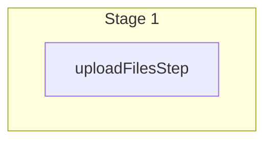

This documentation provides a reference to the `uploadFilesWorkflow`. It belongs to the `@medusajs/medusa/core-flows` package.

This workflow uploads one or more files using the installed
[File Module Provider](/resources/infrastructure-modules/file). The workflow is used by the
[Upload Files Admin API Route](/api/admin/uploads/upload-files).

You can use this workflow within your customizations or your own custom workflows, allowing you to
upload files within your custom flows.

[View source code](https://github.com/medusajs/medusa/blob/0ed927bdb7a396a8fd5f6447ed69b7b354b150d3/packages/core/core-flows/src/file/workflows/upload-files.ts#L72)

## Examples

**API Route**

```ts title="src/api/workflow/route.ts"
import type {
  MedusaRequest,
  MedusaResponse,
} from "@medusajs/framework/http"
import { uploadFilesWorkflow } from "@medusajs/medusa/core-flows"

export async function POST(
  req: MedusaRequest,
  res: MedusaResponse
) {
  const { result } = await uploadFilesWorkflow(req.scope)
    .run({
      input: {
        files: [{
          filename: "test.jpg",
          mimeType: "img/jpg",
          content: "base64-string",
          access: "public"
        }]
      }
    })

  res.send(result)
}
```

**Subscriber**

```ts title="src/subscribers/order-placed.ts"
import {
  type SubscriberConfig,
  type SubscriberArgs,
} from "@medusajs/framework"
import { uploadFilesWorkflow } from "@medusajs/medusa/core-flows"

export default async function handleOrderPlaced({
  event: { data },
  container,
}: SubscriberArgs < { id: string } > ) {
  const { result } = await uploadFilesWorkflow(container)
    .run({
      input: {
        files: [{
          filename: "test.jpg",
          mimeType: "img/jpg",
          content: "base64-string",
          access: "public"
        }]
      }
    })

  console.log(result)
}

export const config: SubscriberConfig = {
  event: "order.placed",
}
```

**Scheduled Job**

```ts title="src/jobs/message-daily.ts"
import { MedusaContainer } from "@medusajs/framework/types"
import { uploadFilesWorkflow } from "@medusajs/medusa/core-flows"

export default async function myCustomJob(
  container: MedusaContainer
) {
  const { result } = await uploadFilesWorkflow(container)
    .run({
      input: {
        files: [{
          filename: "test.jpg",
          mimeType: "img/jpg",
          content: "base64-string",
          access: "public"
        }]
      }
    })

  console.log(result)
}

export const config = {
  name: "run-once-a-day",
  schedule: "0 0 * * *",
}
```

**Another Workflow**

```ts title="src/workflows/my-workflow.ts"
import { createWorkflow } from "@medusajs/framework/workflows-sdk"
import { uploadFilesWorkflow } from "@medusajs/medusa/core-flows"

const myWorkflow = createWorkflow(
  "my-workflow",
  () => {
    const result = uploadFilesWorkflow
      .runAsStep({
        input: {
          files: [{
            filename: "test.jpg",
            mimeType: "img/jpg",
            content: "base64-string",
            access: "public"
          }]
        }
      })
  }
)
```

<a id="uploadfilesworkflow-steps" />

## Steps



Stages follow the order in the workflow definition. Conditional steps run only when their condition is met. The step descriptions below include the conditions and reference links.

- [uploadFilesStep](/resources/references/medusa-workflows/steps/uploadFilesStep): This step uploads one or more files using the installed [File Module Provider](/resources/infrastructure-modules/file).

<a id="uploadfilesworkflow-input" />

## Input

**uploadFilesWorkflow**

- `UploadFilesWorkflowInput`: [UploadFilesWorkflowInput](/resources/references/core_flows/core_core_flows_src/types/core_flowscore_core_flows_srcUploadFilesWorkflowInput)
  - `files`: `object`\[] — The files to upload.
    - `filename`: `string` — The name of the file.
    - `mimeType`: `string` — The MIME type of the file.

      Example:

      ```
      img/jpg
      ```
    - `content`: `string` — The content of the file. For images, for example, use base64 string. For CSV files, use the CSV content.
    - `access`: `"public"` | `"private"` — The access level of the file. Use `public` for the file that can be accessed by anyone. For example, for images that are displayed on the storefront. Use `private` for files that are only accessible by authenticated users. For example, for CSV files used to import data.

<a id="uploadfilesworkflow-output" />

## Output

**uploadFilesWorkflow**

- `FileDTO[]`: [FileDTO](/resources/references/types/FileTypes/interfaces/typesFileTypesFileDTO)\[]
  - `id`: `string` — The ID of the file. You can use this ID later to retrieve or delete the file.
  - `url`: `string` — The URL of the file.
