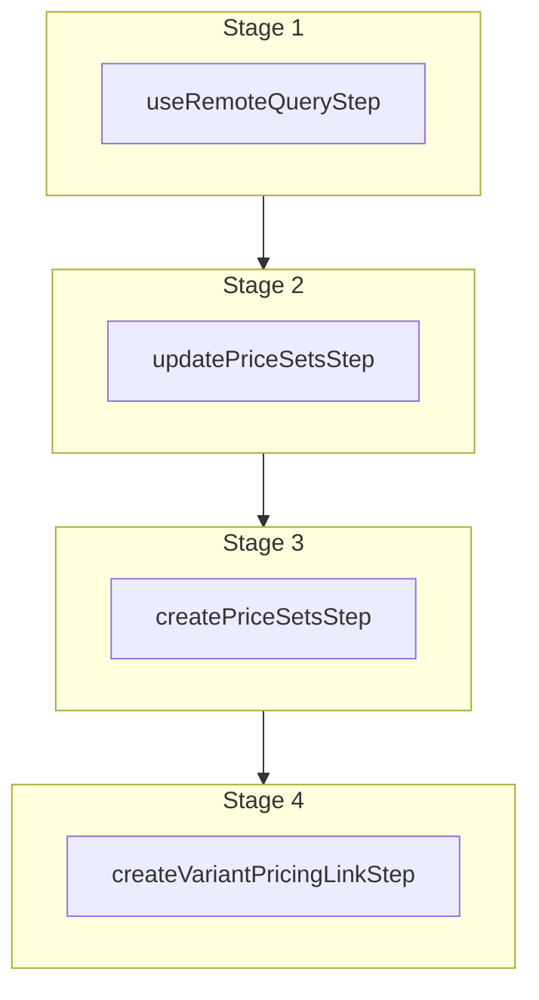

This documentation provides a reference to the `upsertVariantPricesWorkflow`. It belongs to the `@medusajs/medusa/core-flows` package.

This workflow creates, updates, or removes variants' prices. It's used by the [updateProductsWorkflow](/resources/references/medusa-workflows/updateProductsWorkflow)
when updating a variant's prices.

You can use this workflow within your own customizations or custom workflows to manage the prices of a variant.

[View source code](https://github.com/medusajs/medusa/blob/0ed927bdb7a396a8fd5f6447ed69b7b354b150d3/packages/core/core-flows/src/product/workflows/upsert-variant-prices.ts#L80)

## Examples

**API Route**

```ts title="src/api/workflow/route.ts"
import type {
  MedusaRequest,
  MedusaResponse,
} from "@medusajs/framework/http"
import { upsertVariantPricesWorkflow } from "@medusajs/medusa/core-flows"

export async function POST(
  req: MedusaRequest,
  res: MedusaResponse
) {
  const { result } = await upsertVariantPricesWorkflow(req.scope)
    .run({
      input: {
        variantPrices: [{
          variant_id: "variant_123",
          product_id: "prod_123",
          prices: [{
              amount: 10,
              currency_code: "usd",
            },
            {
              id: "price_123",
              amount: 20,
            }
          ]
        }],
        // these are variants to remove all their prices
        // typically used when a variant is deleted.
        previousVariantIds: ["variant_321"]
      }
    })

  res.send(result)
}
```

**Subscriber**

```ts title="src/subscribers/order-placed.ts"
import {
  type SubscriberConfig,
  type SubscriberArgs,
} from "@medusajs/framework"
import { upsertVariantPricesWorkflow } from "@medusajs/medusa/core-flows"

export default async function handleOrderPlaced({
  event: { data },
  container,
}: SubscriberArgs < { id: string } > ) {
  const { result } = await upsertVariantPricesWorkflow(container)
    .run({
      input: {
        variantPrices: [{
          variant_id: "variant_123",
          product_id: "prod_123",
          prices: [{
              amount: 10,
              currency_code: "usd",
            },
            {
              id: "price_123",
              amount: 20,
            }
          ]
        }],
        // these are variants to remove all their prices
        // typically used when a variant is deleted.
        previousVariantIds: ["variant_321"]
      }
    })

  console.log(result)
}

export const config: SubscriberConfig = {
  event: "order.placed",
}
```

**Scheduled Job**

```ts title="src/jobs/message-daily.ts"
import { MedusaContainer } from "@medusajs/framework/types"
import { upsertVariantPricesWorkflow } from "@medusajs/medusa/core-flows"

export default async function myCustomJob(
  container: MedusaContainer
) {
  const { result } = await upsertVariantPricesWorkflow(container)
    .run({
      input: {
        variantPrices: [{
          variant_id: "variant_123",
          product_id: "prod_123",
          prices: [{
              amount: 10,
              currency_code: "usd",
            },
            {
              id: "price_123",
              amount: 20,
            }
          ]
        }],
        // these are variants to remove all their prices
        // typically used when a variant is deleted.
        previousVariantIds: ["variant_321"]
      }
    })

  console.log(result)
}

export const config = {
  name: "run-once-a-day",
  schedule: "0 0 * * *",
}
```

**Another Workflow**

```ts title="src/workflows/my-workflow.ts"
import { createWorkflow } from "@medusajs/framework/workflows-sdk"
import { upsertVariantPricesWorkflow } from "@medusajs/medusa/core-flows"

const myWorkflow = createWorkflow(
  "my-workflow",
  () => {
    const result = upsertVariantPricesWorkflow
      .runAsStep({
        input: {
          variantPrices: [{
            variant_id: "variant_123",
            product_id: "prod_123",
            prices: [{
                amount: 10,
                currency_code: "usd",
              },
              {
                id: "price_123",
                amount: 20,
              }
            ]
          }],
          // these are variants to remove all their prices
          // typically used when a variant is deleted.
          previousVariantIds: ["variant_321"]
        }
      })
  }
)
```

<a id="upsertvariantpricesworkflow-steps" />

## Steps



Stages follow the order in the workflow definition. Conditional steps run only when their condition is met. The step descriptions below include the conditions and reference links.

- [useRemoteQueryStep](/resources/references/medusa-workflows/steps/useRemoteQueryStep): This step fetches data across modules using the remote query. Learn more in the [Remote Query documentation](/learn/fundamentals/module-links/query). :::note This step is deprecated. Use [useQueryGraphStep](/resources/references/medusa-workflows/steps/useQueryGraphStep) instead. :::
  - [updatePriceSetsStep](/resources/references/medusa-workflows/steps/updatePriceSetsStep): This step updates price sets.
    - [createPriceSetsStep](/resources/references/medusa-workflows/steps/createPriceSetsStep): This step creates one or more price sets.
      - [createVariantPricingLinkStep](/resources/references/medusa-workflows/steps/createVariantPricingLinkStep): This step creates links between variant and price set records.

<a id="upsertvariantpricesworkflow-input" />

## Input

**upsertVariantPricesWorkflow**

- `UpsertVariantPricesWorkflowInput`: [UpsertVariantPricesWorkflowInput](/resources/references/core_flows/core_core_flows_src/types/core_flowscore_core_flows_srcUpsertVariantPricesWorkflowInput)
  - `variantPrices`: `object`\[] — The variants to create or update prices for.
    - `variant_id`: `string` — The ID of the variant to create or update prices for.
    - `product_id`: `string` — The ID of the product the variant belongs to.
    - `prices`: ([CreatePricesDTO](/resources/references/pricing/interfaces/pricingCreatePricesDTO) | `UpdatePricesDTO`)\[] (optional) — The prices to create or update for the variant.
      - `id`: `string` (optional) — The ID of the money amount.
      - `currency_code`: `string` — The currency code of this money amount.
      - `amount`: [BigNumberInput](/resources/references/pricing/types/pricingBigNumberInput) — The amount of this money amount.
      - `min_quantity`: `null` | [BigNumberInput](/resources/references/pricing/types/pricingBigNumberInput) (optional) — The minimum quantity required to be purchased for this money amount to be applied.
      - `max_quantity`: `null` | [BigNumberInput](/resources/references/pricing/types/pricingBigNumberInput) (optional) — The maximum quantity required to be purchased for this money amount to be applied.
      - `rules`: [CreatePriceSetPriceRules](/resources/references/pricing/interfaces/pricingCreatePriceSetPriceRules) (optional) — The rules to add to the price. The object's keys are the attribute, and values are the value of that rule associated with this price.
  - `previousVariantIds`: `string`\[] — The IDs of the variants to remove all their prices.
