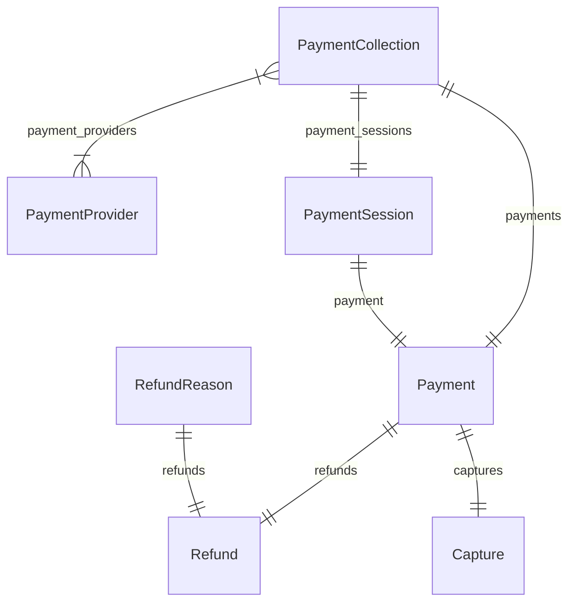

This documentation provides a reference to the data models in the Payment Module

## Relations Overview

## Data Models

- [AccountHolder](/resources/references/payment/models/AccountHolder)
- [Capture](/resources/references/payment/models/Capture)
- [Payment](/resources/references/payment/models/Payment)
- [PaymentCollection](/resources/references/payment/models/PaymentCollection)
- [PaymentProvider](/resources/references/payment/models/PaymentProvider)
- [PaymentSession](/resources/references/payment/models/PaymentSession)
- [Refund](/resources/references/payment/models/Refund)
- [RefundReason](/resources/references/payment/models/RefundReason)
