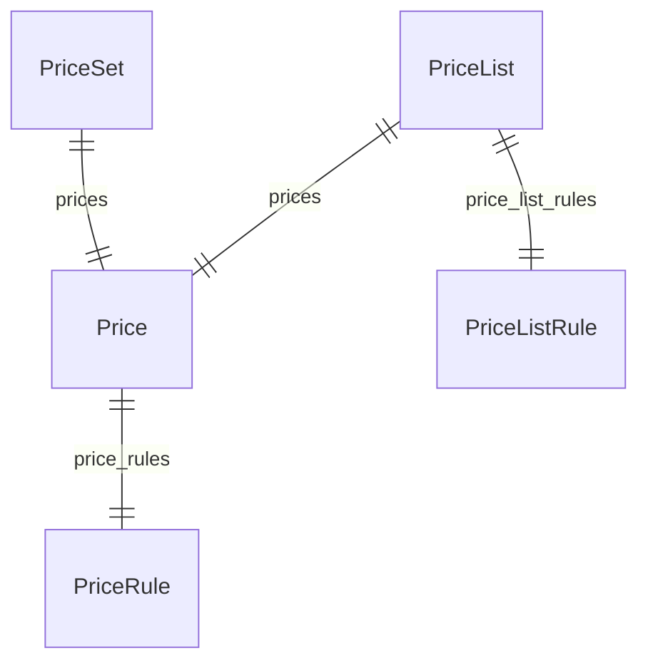

This documentation provides a reference to the data models in the Pricing Module

## Relations Overview

## Data Models

- [Price](/resources/references/pricing/models/Price)
- [PriceList](/resources/references/pricing/models/PriceList)
- [PriceListRule](/resources/references/pricing/models/PriceListRule)
- [PricePreference](/resources/references/pricing/models/PricePreference)
- [PriceRule](/resources/references/pricing/models/PriceRule)
- [PriceSet](/resources/references/pricing/models/PriceSet)
