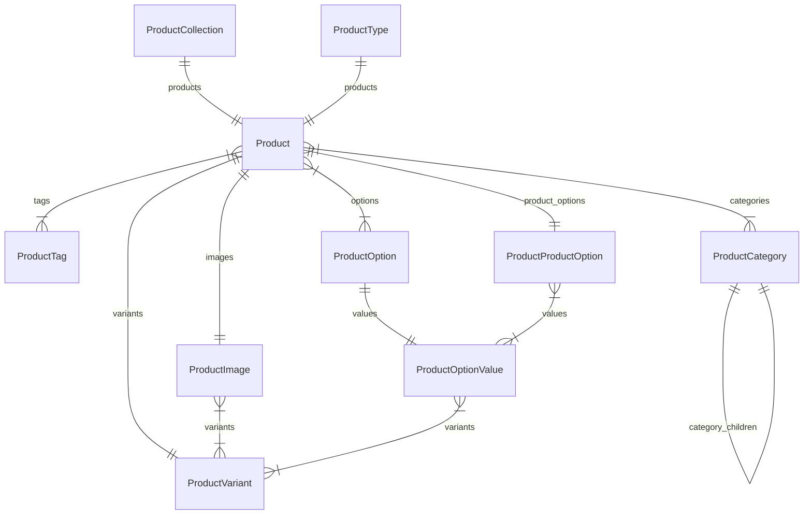

This documentation provides a reference to the data models in the Product Module

## Relations Overview

## Data Models

- [Product](/resources/references/product/models/Product)
- [ProductCategory](/resources/references/product/models/ProductCategory)
- [ProductCollection](/resources/references/product/models/ProductCollection)
- [ProductImage](/resources/references/product/models/ProductImage)
- [ProductOption](/resources/references/product/models/ProductOption)
- [ProductOptionValue](/resources/references/product/models/ProductOptionValue)
- [ProductProductOption](/resources/references/product/models/ProductProductOption)
- [ProductProductOptionValue](/resources/references/product/models/ProductProductOptionValue)
- [ProductTag](/resources/references/product/models/ProductTag)
- [ProductType](/resources/references/product/models/ProductType)
- [ProductVariant](/resources/references/product/models/ProductVariant)
- [ProductVariantProductImage](/resources/references/product/models/ProductVariantProductImage)
