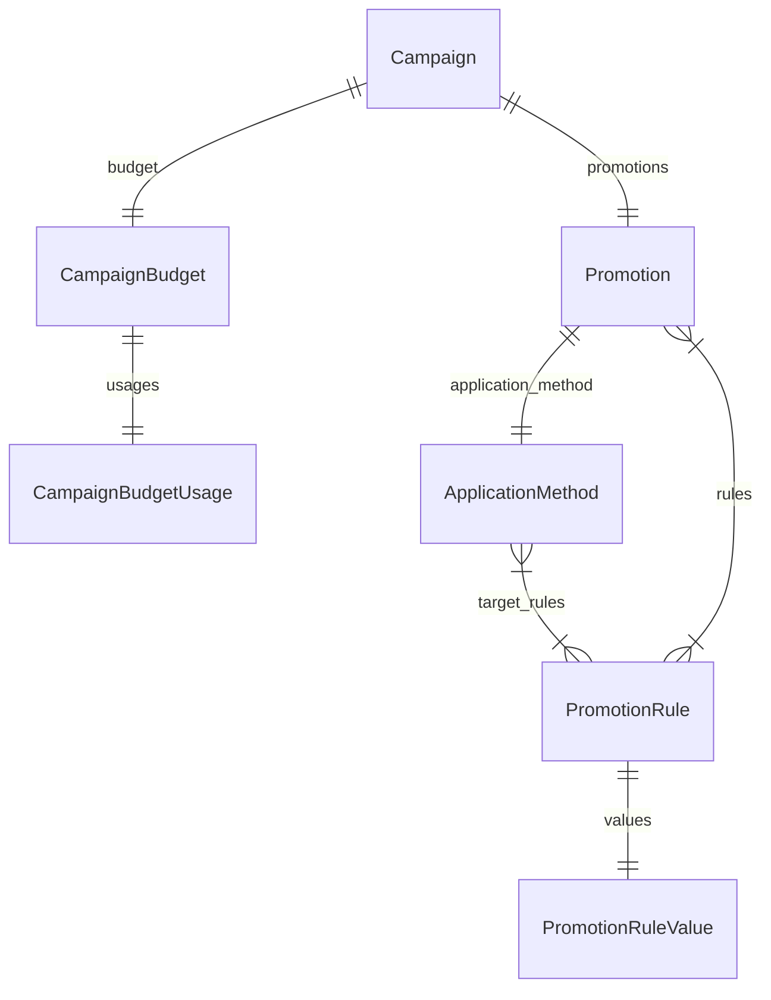

This documentation provides a reference to the data models in the Promotion Module

## Relations Overview

## Data Models

- [ApplicationMethod](/resources/references/promotion/models/ApplicationMethod)
- [Campaign](/resources/references/promotion/models/Campaign)
- [CampaignBudget](/resources/references/promotion/models/CampaignBudget)
- [CampaignBudgetUsage](/resources/references/promotion/models/CampaignBudgetUsage)
- [Promotion](/resources/references/promotion/models/Promotion)
- [PromotionRule](/resources/references/promotion/models/PromotionRule)
- [PromotionRuleValue](/resources/references/promotion/models/PromotionRuleValue)
